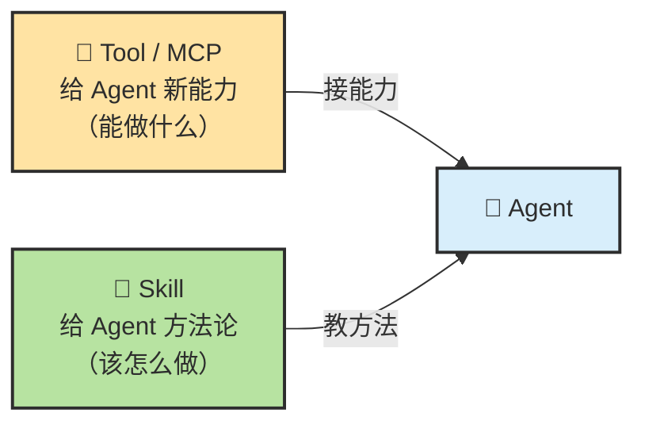
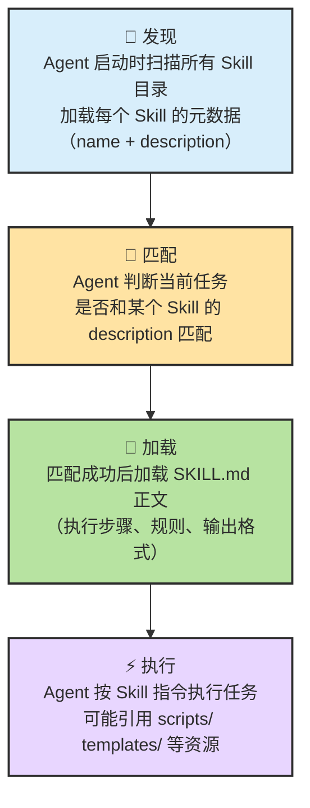
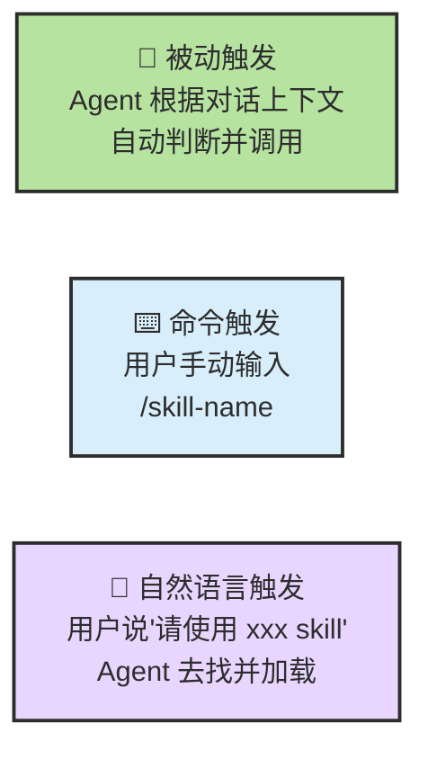
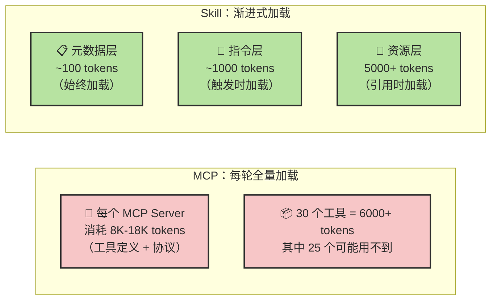
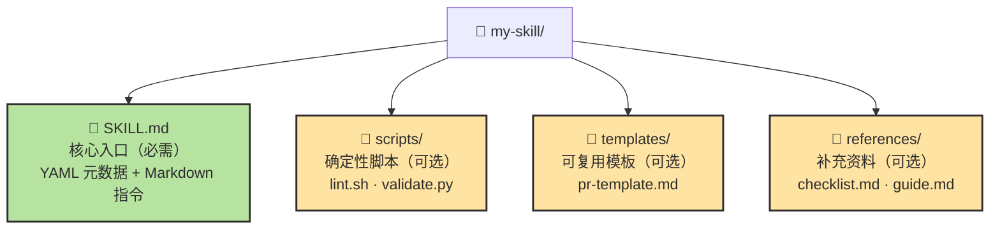
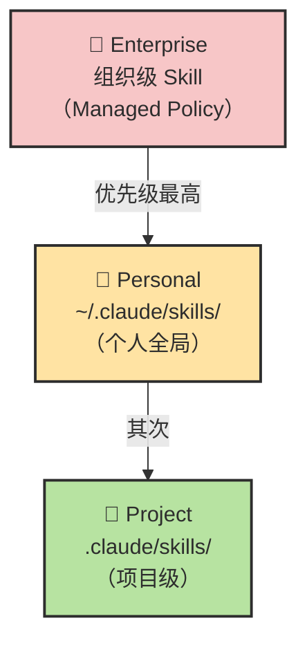
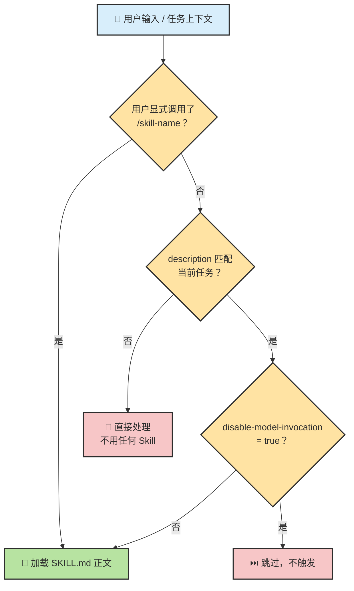
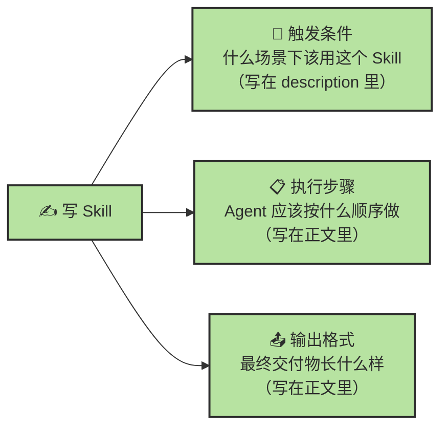

# Chapter 13 · 📝 Skill

> 🎯 **目标**：从原理层面理解 Skill 是什么、怎么工作、怎么写。读完这一章，你应该知道 Skill 的触发机制、渐进加载原理、文件结构、路由规则，以及它为什么比 MCP 更省 Context。
>
> 📌 **本章偏理论基础**。后续章节会以具体 Skill 为案例做深度分析。

## 📑 目录

- [1. Skill 的原理：Agent 是如何使用 Skill 的](#1-skill-的原理agent-是如何使用-skill-的)
- [2. Skill vs MCP：为什么 Skill + CLI 更省 Context](#2-skill-vs-mcp为什么-skill--cli-更省-context)
- [3. Skill 的文件结构](#3-skill-的文件结构)
- [4. Skill 的路由与发现机制](#4-skill-的路由与发现机制)
- [5. 写一个 Skill 要写哪些内容](#5-写一个-skill-要写哪些内容)

---

## 1. Skill 的原理：Agent 是如何使用 Skill 的

### Skill 的本质

Skill 不给 Agent 新工具，而是给 Agent **方法**——教它碰到某类任务时该按什么步骤、什么约束、什么标准来做。



### Skill 的完整生命周期

从 Skill 被发现到执行完毕，经历以下阶段：



### 三种触发方式



| 触发方式 | 谁发起 | 适合什么场景 |
|---------|--------|-----------|
| **被动触发** | Agent 自动 | 日常任务——Agent 识别场景后自动带上方法 |
| **命令触发** | 用户手动 | 明确要用某个 Skill 时——`/review`、`/brainstorm` |
| **自然语言触发** | 用户口头 | "用 brainstorming skill 帮我分析一下" |

### 触发控制开关

Claude Code 的 Skill 有两个关键开关，可以精确控制触发行为：

| 开关 | 效果 |
|------|------|
| `user-invocable: true` | 用户可以用 `/skill-name` 手动调用 |
| `disable-model-invocation: true` | 禁止 Agent 自动触发，只允许手动 |

两个开关组合：

| user-invocable | disable-model-invocation | 效果 |
|:-:|:-:|------|
| true | false | **默认**——用户可手动，Agent 也可自动 |
| true | true | 只允许用户手动触发 |
| false | false | 菜单隐藏，但 Agent 仍可自动调用 |
| false | true | 完全禁用 |

---

## 2. Skill vs MCP：为什么 Skill + CLI 更省 Context

很多人会问："既然 MCP 也能连工具，为什么还需要 Skill？"核心区别在于**上下文成本**。

### 三层渐进加载 vs 全量加载



| 维度 | MCP | Skill + CLI |
|------|-----|------------|
| **上下文成本** | 每个 Server 8K-18K tokens，始终占用 | 元数据 ~100 tokens 常驻，正文按需加载 |
| **Token 节省** | — | 比全量 System Prompt 降低 50-80% |
| **适合什么** | 需要标准化接入外部服务 | 需要方法论指导 + 已有 CLI/脚本的场景 |
| **典型组合** | MCP 接 GitHub API | Skill 教"怎么 review PR" + CLI 跑 `gh pr view` |

> 🧭 **Skill + CLI 组合的核心优势**：Skill 只在需要时加载方法论（省 Context），具体操作直接走 CLI（不需要额外的 MCP Server 开销）。这就是为什么很多团队优先走 Skill + CLI 路线，只在需要统一鉴权和跨团队共享时才引入 MCP。

---

## 3. Skill 的文件结构

一个 Skill 就是一个包含 `SKILL.md` 文件的目录（以 Claude Code 为例）：



### SKILL.md 的结构

```markdown
---
# ===== YAML 元数据（始终加载）=====
name: code-review
description: 使用标准清单进行代码审查。当用户要求 review 代码时触发。
user-invocable: true
disable-model-invocation: false
---

# ===== Markdown 正文（触发时加载）=====

## 当用户要求代码审查时

1. 先阅读变更的所有文件
2. 按以下清单逐项检查：
   - [ ] 是否有未处理的错误
   - [ ] 是否有安全漏洞
   - [ ] 是否有性能问题
   - [ ] 是否有足够的测试覆盖
3. 输出审查报告，按严重性分级

## 引用外部资源
参考 @references/security-checklist.md 的安全审查标准。
```

| 区域 | 加载时机 | Token 量级 | 内容 |
|------|---------|-----------|------|
| **YAML 元数据** | 始终加载 | ~100 | name、description、触发开关 |
| **Markdown 正文** | 触发时加载 | ~1000 | 执行步骤、规则、输出格式 |
| **references/ 等资源** | `@引用` 时加载 | 5000+ | 详细清单、模板、脚本 |

---

## 4. Skill 的路由与发现机制

Agent 如何找到可用的 Skill？不同平台有不同的发现路径。

### Claude Code 的发现路径



- **项目级**（`.claude/skills/`）：提交 Git，团队共享
- **个人级**（`~/.claude/skills/`）：所有项目可用，不进 Git
- **组织级**（Managed Policy）：IT 部署，不可覆盖

> 💡 **Skill 的存放路径不限于当前仓库**。放在 `~/.claude/skills/` 或其他目录都可以，只要 Agent 能发现它。

### Codex 的发现路径

Codex 沿目录树**向上扫描**：

```text
CWD/.agents/skills → 父目录 → repo root/.agents → ~/.agents/skills → /etc/codex/skills
```

重名 Skill 可以并存，不会覆盖。

### 路由匹配逻辑



---

## 5. 写一个 Skill 要写哪些内容

### 必写的三件事



### 编写原则

| 原则 | 说明 | 反例 |
|------|------|------|
| **聚焦单一场景** | 一个 Skill 只解决一类问题 | 一个 Skill 覆盖"审查 + 测试 + 部署" |
| **步骤明确** | 给 Agent 清晰的执行步骤 | "请认真审查代码" |
| **控制上下文** | Skill 本身不应太长 | SKILL.md 写了 2000 行 |
| **可测试** | 能判断 Skill 是否被正确执行 | 没有明确的输出格式要求 |
| **迭代优化** | 根据实际使用效果持续调整 | 写完就再也不改 |

### 5 种 Skill 设计模式

| 模式 | 一句话定义 | 适合 |
|------|----------|------|
| **工具包装器** | 按需为 Agent 加载特定库的专家知识 | 复杂 API / 框架的使用指导 |
| **生成器** | 模板 + 风格指南驱动结构化输出 | PR 描述、变更日志、文档 |
| **审查器** | 基于清单的自动化审计与分级反馈 | 代码审查、安全审计 |
| **反向提问** | 强制门控——先采访用户，再行动 | 需求澄清、brainstorming |
| **流水线** | 有硬性检查点的严格顺序工作流 | TDD、发布流程 |

五种模式可以组合：


### 减少上下文噪音的技巧

- 只写对该类任务**稳定成立**的规则
- 把长篇资料放进 `references/`，由 Agent 按需 `@引用`
- 把可执行逻辑交给 `scripts/`
- 把格式要求交给 `templates/`
- description 保持简短精准，不要把整个工作流塞进去

---

## 📌 本章总结

- **Skill 是方法论载体**——教 Agent 怎么做，而不是给它新工具。
- **三种触发方式**：被动自动 / 命令手动 / 自然语言口头，路径不限于当前仓库。
- **三层渐进加载**（元数据 → 指令 → 资源）是 Skill 省 Context 的核心机制，比 MCP 的全量加载节省 50-80% tokens。
- **Skill + CLI 组合**比 MCP 更轻量——Skill 管方法，CLI 管执行，不需要额外的 Server 开销。
- **文件结构**：一个目录 + `SKILL.md`（必需）+ scripts/templates/references（可选）。
- **路由逻辑**：先看是否显式调用 → 再看 description 是否匹配 → 再检查触发开关。
- **五种设计模式**：工具包装器、生成器、审查器、反向提问、流水线——可组合使用。

## 📚 继续阅读

**Skill 案例深度分析：**
- [Ch13.a · Superpowers](./ch13a-skill-superpowers.md) — 最知名的方法论 Plugin，7 阶段开发工作流
- [Ch13.b · 官方 Skill Creator](./ch13b-skill-creator.md) — Anthropic 官方的 Skill Engineering 实验平台
- [Ch13.c · Agent Skill Architect](./ch13c-skill-architect.md) — 把成功探索蒸馏成可复用 Skill 结构
- [Ch13.d · SSH Dev Suite](./ch13d-skill-ssh-dev-suite.md) — 远程开发场景的领域型 Skill Suite

**其他章节：**
- 想看"接能力"的标准化连接层：[Ch14 · MCP](./ch14-mcp.md)
- 想看事件自动化和打包分发：[Ch15 · Command、Hook 与 Plugin](./ch15-hook-plugin.md)

---

<div align="center">

[📚 返回目录](../../README.md#tutorial-contents) | [⬅️ 上一章：Ch12 Tools](./ch12-tools.md) | [➡️ 下一章：Ch14 MCP](./ch14-mcp.md)

</div>
