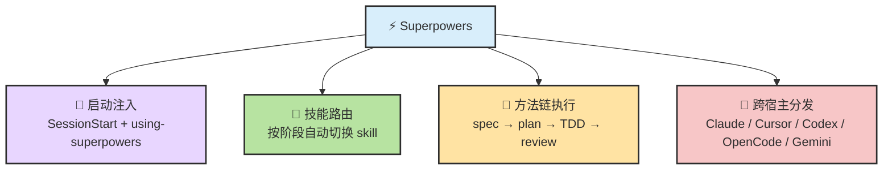
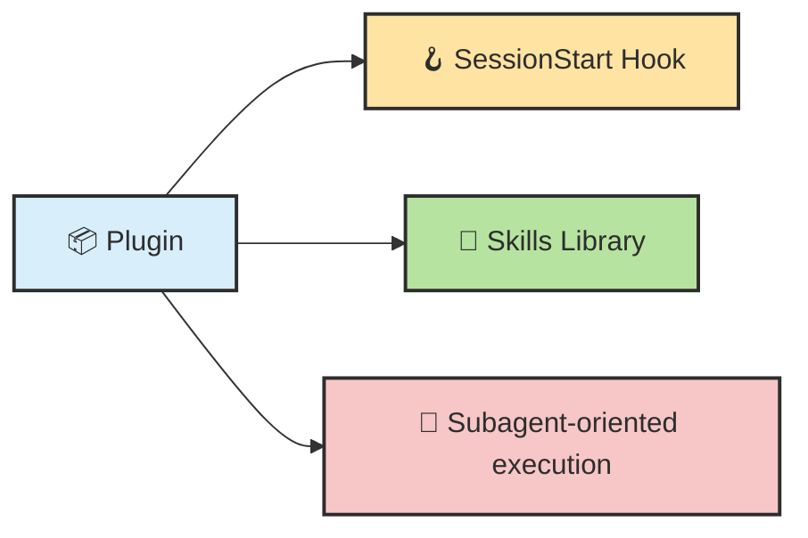
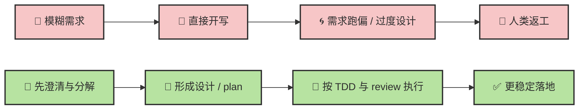
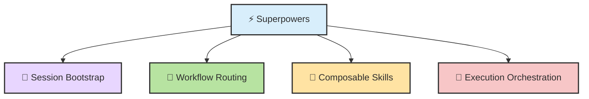

# Chapter 13.a · ⚡ Superpowers：从”技能库”到”方法论插件”

> 📦 **GitHub**：[obra/superpowers](https://github.com/obra/superpowers)（75K+ Stars）
>
> 🎯 **一句话用途**：Superpowers 是目前最知名的 Claude Code Plugin，它把软件开发的完整方法论（需求澄清 → 计划 → TDD → 审查 → 验证 → 交付）编码成一套可强制执行的 Skill 链。装了它之后，Agent 不会再”看到任务就开写”，而是自动进入严格的开发工作流。
>
> 🛠️ **怎么用**：`/install-plugin obra/superpowers` 安装后，Agent 会自动在对话中识别场景并触发对应 Skill。也可以手动调用如 `/brainstorm`、`/simplify` 等命令。
>
> 📖 **前置阅读**：[Ch13 · Skill 原理](./ch13-skill.md)

> 目标：把 **Superpowers** 从”一个很火的 Claude Code skill”拆回它真正的几层结构：**启动注入、技能路由、开发方法链、子 agent 执行、跨宿主分发**。读完这一章，你应该能看清三件事：
>
> - **它到底是什么？**
> - **它为什么不只是一个 skills library，而更像一个 software development methodology plugin？**
> - **它和官方 Skill Creator、Agent Skill Architect 分别处在什么位置？**

## 目录

- [🧭 0. 先校准几个直觉](#super-sec-0)
- [🧩 1. 一张总图：Superpowers 到底在系统里的哪一层](#super-sec-1)
- [🎯 2. 它真正解决的问题：不是“多几个 skill”，而是“给 agent 一条默认开发方法链”](#super-sec-2)
- [🧠 3. 一个够用的定义公式](#super-sec-3)
- [⚙️ 4. 五层架构：启动层、路由层、工作流层、执行层、分发层](#super-sec-4)
- [🔁 5. 核心工作流：从 brainstorming 到 finish 的强约束链](#super-sec-5)
- [🧭 6. 控制面机制：SessionStart、description、命令别名、技能切换](#super-sec-6)
- [🧰 7. 它和 Skill / Command / Hook / Subagent / Plugin / Codex 到底什么关系](#super-sec-7)
- [⚖️ 8. 为什么它很强，以及为什么它也更“重”](#super-sec-8)
- [🛠️ 9. 最值得抄走的工程套路](#super-sec-9)
- [📝 本章总结](#super-sec-summary)

> 📖 **阅读方式建议**：这篇最好和 Skill Creator、Agent Skill Architect 两篇一起读。
> `Skill Creator` 偏 **skill engineering / eval**；`Agent Skill Architect` 偏 **shape / boundary / routing 设计**；而 **Superpowers** 偏 **把一整条开发方法链直接塞进运行时**。
>
> 🧠 **主线先记一句**：
>
> > **Superpowers 不是“给 Claude 多加几个招式”，而是“给 Claude 安上一套默认的软件开发操作系统”。**

---

## 🧭 0. 先校准几个直觉

很多人第一次接触 Superpowers，会把它想轻了。真正理解它之前，先把几件最容易想歪的事摆正。

| #️⃣ | 🪤 常见直觉 | ✅ 更接近现实的说法 |
| --- | --- | --- |
| 1 | “它就是一个热门 skill” | **不准确。** 它是一个 **plugin + skills framework + workflow methodology** 的组合体，不是单个 skill[^plugin-page][^sp-readme] |
| 2 | “它只是给 Claude 增加一点 TDD / debugging 知识” | **只说对一半。** 它不只是补知识，而是在运行时尝试把 Claude 推进一条 **固定开发方法链**[^plugin-page][^sp-readme] |
| 3 | “装上后只是多了几个 `/skill-name`” | **不止。** 它还依赖 `SessionStart` 注入、命令层、hooks、子 agent 流程、工作区策略和跨平台安装适配[^marketplace][^hooks-dup][^hooks-async] |
| 4 | “它是一个被动技能包” | **更接近主动控制面。** 它试图在会话一开始就改变 Claude 的默认行为：先澄清、再出 spec、再写 plan、再执行、再 review[^sp-readme][^sp-using] |
| 5 | “它和官方 Skill Creator 是同一类东西” | **不是。** Skill Creator 更偏 “创建/评测/比较 skill”；Superpowers 更偏 “把开发方法论直接装进 agent”[^skill-creator][^plugin-page] |

先记住这一句，后面很多细节就会顺很多：

> 🎯 **Superpowers 的关键不是“让 agent 会更多技能”，而是“让 agent 更容易按一套强约束的方法去开发”。**

---

## 🧩 1. 一张总图：Superpowers 到底在系统里的哪一层

### 1.1 一句话定义

如果只压成一句最够用的话：

> ⚡ **Superpowers = 一个把 brainstorming → spec → plan → TDD → subagent execution → review → finish 串成默认工作流的 agentic development plugin。**

Anthropic 官方插件页把它描述为：一个 **comprehensive skills framework**，教 Claude 使用 **brainstorming、subagent development with code review、systematic debugging、TDD、skill authoring** 等结构化软件开发方法。Repo README 则更进一步，直接把它定义成 **complete software development workflow for your coding agents**。[^plugin-page][^sp-readme]

### 1.2 从“技能库”到“方法链”



这张图里最重要的点不是“技能很多”，而是 **这些技能被组织成一条有顺序的链**。

Repo README 明确写出了基础工作流：

1. `brainstorming`：写代码前先澄清需求、形成设计
2. `using-git-worktrees`：设计确认后隔离工作区
3. `writing-plans`：把实现拆成 2–5 分钟的细颗粒任务
4. `subagent-driven-development` 或 `executing-plans`：执行计划并做检查
5. `test-driven-development`
6. `requesting-code-review`
7. `finishing-a-development-branch`[^sp-workflow]

📌 这也是第一把钥匙：

> **Superpowers 不是一堆平铺的 skill，而是一条带阶段切换和默认下一步的 workflow graph。**

### 1.3 它在 Claude Code 体系里的真正位置

Claude Code 官方把扩展面分成：**skills、hooks、subagents、plugins、MCP servers**。其中 plugin 是打包层，可以把这些能力一起分发；plugin skills 还是 namespaced 的，便于共存。[^cc-features][^cc-plugins]

所以 Superpowers 在 Claude Code 里的真实位置，更接近：



也就是说：

> 🧭 **它不是“skills 体系之外”的附加说明书，而是“用 plugin 把 hook + skills + commands + 多宿主适配打包起来”的运行时控制面。**

---

## 🎯 2. 它真正解决的问题：不是”多几个 skill”，而是”给 agent 一条默认开发方法链”

### 2.1 普通 agent 最容易怎么失控

如果没有强方法链，很多 coding agent 很容易掉进下面这种轨迹：



Superpowers 的价值，就是尽量把 agent 拉到右边这条链上。Repo README 写得很直白：会话一开始，如果 agent 发现你在 build something，它**不会直接写代码**，而是先退一步问你到底想做什么；设计确认后再出 implementation plan；你说 “go” 后再进入 subagent-driven development。[^sp-readme]

### 2.2 它真正卖的不是知识，而是默认顺序

这点很关键。很多 skill 是：

- 我会 code review
- 我会 debugging
- 我会 TDD

但 Superpowers 更像：

- **什么时候该 brainstorming**
- **什么时候必须写 plan**
- **什么时候才允许进入 execution**
- **什么时候必须 review**
- **什么时候做 finish / merge / PR 决策**

换句话说，它卖的不是 isolated capability，而是 **ordered methodology**。[^sp-workflow][^brainstorming-skill][^writing-plans][^executing-plans]

### 2.3 这也是它为什么那么火

截至 **2026-03-30**，Anthropic 插件目录显示 Superpowers 在 Claude Code 插件市场里已有 **294,839 installs**；GitHub 仓库则显示 **124k stars**，最新 release 为 **v5.0.6（2026-03-25）**。这说明它不是一个小圈子实验，而是已经成为一个非常强的“默认方法论包”。[^anthropic-directory][^sp-stars]

---

## 🧠 3. 一个够用的定义公式

如果要把 Superpowers 压成一个够用、也便于和前两篇对照的公式，我会写成：

> ⚡ **Superpowers = Session Bootstrap + Workflow Routing + Composable Skills + Execution Orchestration + Host Adapters**

把这五项翻成白话：

- `Session Bootstrap`：会话启动时先注入 “using-superpowers” 这一层默认上下文[^sp-using][^hooks-dup]
- `Workflow Routing`：不是乱触发，而是按 brainstorming → planning → execution 之类的阶段路由[^sp-workflow][^brainstorming-skill]
- `Composable Skills`：TDD、debugging、review、parallel agents、skill authoring 都是模块[^plugin-page][^sp-skills]
- `Execution Orchestration`：偏爱 subagent-driven-development、两阶段 review、worktrees、批量任务[^subagent-skill][^executing-plans]
- `Host Adapters`：Claude Code、Cursor、Codex、OpenCode、Gemini CLI 都有适配安装路径[^sp-install]



这个公式的真正含义是：

> **Superpowers 不只是“给 agent 更多信息”，而是在“给 agent 一套默认动作倾向和阶段切换逻辑”。**

---

## ⚙️ 4. 五层架构：启动层、路由层、工作流层、执行层、分发层

### 4.1 看 repo 结构就知道它不是普通 skill 包

从 GitHub 根目录看，Superpowers 仓库同时包含：

- `.claude-plugin`
- `.codex`
- `.cursor-plugin`
- `.opencode`
- `agents/`
- `commands/`
- `docs/`
- `hooks/`
- `skills/`
- `tests/`[^sp-structure]

这个结构本身就在表达一件事：

> 🧱 **它不是“只有一个 skills/ 目录”的轻量 skill repo，而是一个多宿主、多组件、带测试和命令层的完整插件工程。**

### 4.2 启动层：SessionStart

Superpowers 的第一层不是 skill 本身，而是 **SessionStart**。多个 issue 都指向同一件事：Superpowers 在会话启动时会尝试注入 `using-superpowers` 的上下文，让 Claude 先带着这层默认“方法论前言”进入会话。[^hooks-dup][^hooks-win][^hooks-async][^sp-using]

这说明它的真实设计思路是：

> **不要等用户显式调用第一个 skill；而是在 session 刚开始时，就先把“你接下来该怎么工作”灌进去。**

这和普通按需激活 skill 的思路很不一样。普通 skill 更像“需要时再调用”；Superpowers 更像“先给你一层默认作业系统，再按需细分技能”。

### 4.3 路由层：description 与阶段切换

Superpowers 里一个非常值得学的经验，不在 README，而在它自己的 `writing-skills` 里：

- `description` 应该只写 **触发条件**
- 不要把完整工作流摘要塞进 `description`
- 否则 Claude 可能直接照 description 的摘要做，而不认真读完整 skill 正文[^desc-trap]

这点很有洞察力。因为这相当于承认：

> **metadata 不是纯路由层，它会反过来塑造执行行为。**

也就是说，在 Superpowers 这种强工作流系统里，`description` 不是小事，而是**一级控制面**。

### 4.4 工作流层：一条有“默认下一步”的图

它的很多 skill 不是孤立的，而是带 handoff 倾向。最典型的例子：

- `brainstorming` 明确说：**brainstorm 之后唯一该调用的是 `writing-plans`**[^brainstorming-skill]
- `executing-plans` 明确说：如果有 subagents，就优先转去 `subagent-driven-development`[^executing-plans]
- `requesting-code-review` 夹在任务之间，`finishing-a-development-branch` 放在尾部[^sp-workflow]

这说明它的本质不是目录树，而是 **state machine / workflow graph**。

### 4.5 执行层：subagent-driven-development

`subagent-driven-development` 是 Superpowers 最有代表性的执行层能力之一。它强调：

- 给每个任务一个 fresh context
- 支持并行安全
- 子 agent 可以在任务前和任务中提问
- 有两阶段 review（spec compliance → code quality）[^subagent-skill]

这代表它对执行层的判断是：

> **大任务不要让一个上下文越来越脏的主 agent 硬撑；而要让 controller 调度 fresh-context workers。**

这和你前面一直关心的 **session/context/compact/subagent** 这些问题，是一条线上的。

### 4.6 分发层：多宿主适配

Superpowers 不只是 Claude Code 插件市场里的一个条目。Repo README 明确给出了：

- Claude Code 官方 marketplace 安装
- 自建 marketplace 安装
- Cursor marketplace 安装
- Codex 手动安装
- OpenCode 手动安装
- Gemini CLI 扩展安装[^sp-install]

同时，Codex 官方文档也说明 skills 采用 **progressive disclosure**：先看 `name / description`，需要时才加载 `SKILL.md` 和 supporting files。[^codex-skills][^codex-customization]

这意味着 Superpowers 的目标明显不只是 “Claude Code 专属技巧”，而是：

> 🌉 **把一套 workflow methodology 尽量迁移到多个 agent runtime。**

---

## 🔁 5. 核心工作流：从 brainstorming 到 finish 的强约束链

Superpowers 最值得看的，不是 skill 名字，而是 skill 之间的顺序关系。

```mermaid
flowchart LR
    classDef spec fill:#d8eefb,stroke:#2d2d2d,stroke-width:2px,color:#2d2d2d
    classDef work fill:#e8d6ff,stroke:#2d2d2d,stroke-width:2px,color:#2d2d2d
    classDef plan fill:#b7e3a1,stroke:#2d2d2d,stroke-width:2px,color:#2d2d2d
    classDef exec fill:#ffe3a3,stroke:#2d2d2d,stroke-width:2px,color:#2d2d2d
    classDef review fill:#f7c6c7,stroke:#2d2d2d,stroke-width:2px,color:#2d2d2d

    A["💡 brainstorming"]:::spec --> B["🌿 using-git-worktrees"]:::work --> C["📝 writing-plans"]:::plan --> D["🤖 subagent-driven-development / executing-plans"]:::exec --> E["🧪 test-driven-development"]:::exec --> F["🔍 requesting-code-review"]:::review --> G["✅ finishing-a-development-branch"]:::review
```



### 5.1 这条链最强的地方：它尽量把“偷懒路径”堵住

Superpowers 的默认立场很鲜明：

- **不要直接开写**
- **不要跳过计划**
- **不要先写代码再补测试**
- **不要没 review 就结束**

README 甚至用很戏谑但很精准的话定义 plan 的目标：计划要写得足够清楚，让一个“有热情、没判断、不了解项目上下文、又不爱测试的初级工程师”也能照着做。[^sp-readme][^writing-plans]

这其实是在为 **未来的执行 agent** 反向设计输入质量。

### 5.2 它为什么尤其适合 agent

因为 agent 最怕的是：

- 模糊目标
- 跨文件大改
- 上下文越来越脏
- 人类默认它“应该懂”
- 没有显式检查点

Superpowers 用这条链解决的是：

- `brainstorming`：把模糊意图先压清楚
- `writing-plans`：把开放任务改成细颗粒任务
- `subagent-driven-development`：用 fresh-context 子 agent 做任务执行
- `requesting-code-review`：在任务间插入检查门
- `finishing-a-development-branch`：把交付动作标准化[^sp-workflow][^subagent-skill]

换句话说：

> **它本质上是在把“很像人类高级工程师隐式习惯”的东西，显式编码成 agent 也能遵守的流程。**

### 5.3 它的默认哲学非常强硬

README 明确把哲学写成了：

- Test-Driven Development
- Systematic over ad-hoc
- Complexity reduction
- Evidence over claims[^sp-skills]

这不是中性工具，而是**方法论立场很重**的工具。它并不打算让 Claude“自己选风格”，而是在强推一种它认为更可靠的软件开发路径。

---

## 🧭 6. 控制面机制：SessionStart、description、命令别名、技能切换

### 6.1 `using-superpowers`：一个“总前言”型 skill

搜索和 issue 内容都指向一个关键事实：Superpowers 会在 session start 尝试先加载 `using-superpowers`。这个 skill 更像一个 **方法论总前言**，告诉 Claude：现在你装了 Superpowers，你的默认工作方式应该怎么变。[^sp-using][^hooks-win]

这意味着 Superpowers 的第一层设计不是“某个具体 task skill”，而是：

> **先重写 Claude 的默认启动姿态。**

### 6.2 SessionStart 也暴露了它是“强控制面”的代价

多个 issue 暴露出同一类型的问题：

- 在 Claude Code 里双字段注入会导致 **重复注入**，浪费上下文[^hooks-dup]
- `async: true` 时 additionalContext 可能 **掉失**[^hooks-async]
- Windows 上 hook wrapper 曾出现 **启动失败/阻塞输入** 的问题[^hooks-win][^hooks-block]

这说明什么？

> **Superpowers 的力量，恰恰来自它更深入运行时；但越深入运行时，就越容易受到宿主 hook 语义、平台差异、兼容性细节的影响。**

这也是它比普通 skills repo 更“重”的核心原因。

### 6.3 `description` 是一级路由器，而不是附属字段

Superpowers 自己的 `writing-skills` 给出的一个经验非常值得记：

```yaml
# ✅ GOOD
name: executing-plans
description: Use when executing implementation plans with independent tasks in the current session
```

而不是：

```yaml
# ❌ BAD
name: executing-plans
description: Use for executing plans - dispatches subagent per task with code review between tasks
```

原因不是文风问题，而是模型行为问题：**description 太像流程摘要时，Claude 可能把它当完整指令，而跳过 skill 正文里的真正细节**。[^desc-trap]

这件事很重要，因为它说明：

> 🧭 **在技能系统里，metadata 不是“只影响发现”，它会参与执行层的认知捷径。**

### 6.4 命令层：带来手动入口，也带来兼容性债务

Superpowers Marketplace 明确把它描述成不仅提供 20+ skills，还提供 `/brainstorm`、`/write-plan`、`/execute-plan` 这类命令，以及 SessionStart context injection 和 skill-search 工具。[^marketplace]

但 issue 也显示了两类代价：

- 旧命令别名会让 slash list **变得混乱**[^cmd-deprecated][^cmd-list]
- 插件拦截 slash command 的策略还和 Claude Code 原生命令 `/btw` 发生过 **冲突**[^cmd-collision]

这说明它不是一个“纯 skill 设计”，而是已经踩进了 **命令命名空间与平台演进兼容** 这个更难的层。

---

## 🧰 7. 它和 Skill / Command / Hook / Subagent / Plugin / Codex 到底什么关系

这是最容易混淆的部分。一个更清楚的拆法如下：

| 组件 | 在 Superpowers 里扮演什么 | 它不是啥 |
| --- | --- | --- |
| **Skill** | 方法链中的具体步骤，如 brainstorming、writing-plans、TDD、debugging | 不是全部系统 |
| **Command** | 给人类一个显式入口，如 `/brainstorm` 的历史遗留与别名层 | 不是核心能力本体 |
| **Hook** | 在 session 启动时抢先注入默认上下文 | 不是具体任务工作流 |
| **Subagent** | 承担 fresh-context 任务执行与两阶段 review | 不是设计与路由层 |
| **Plugin** | 把上述组件与安装/更新/分发打包在一起 | 不是单个 workflow 说明书 |
| **Codex / Cursor / OpenCode / Gemini** | 宿主适配层，让同一方法论跨 runtime 迁移 | 不是 Superpowers 本身 |

### 7.1 它和普通 Claude Skills 的区别

Claude Code 官方 skills 文档说得很清楚：skill 本质上就是一个带 `SKILL.md` 的目录，Claude 会在相关时自动使用，或通过 `/skill-name` 直接调用。[^cc-skills]

Superpowers **当然也包含 skills**，但它的问题在于：

> **只用“skill”这个词去描述它，会严重低估它的真正复杂度。**

因为它还有：

- 启动时注入
- 命令层
- 多宿主安装策略
- hooks
- tests
- docs

所以它更像：

> 📦 **一个把 skills 当核心部件，但不止于 skills 的 methodology plugin。**

### 7.2 它和 Skill Creator 的关系

一句话最清楚：

> **Skill Creator 解决“skill 做没做好”；Superpowers 解决“agent 默认该怎么工作”。**

Skill Creator 偏：

- Create / Eval / Improve / Benchmark
- skill engineering 闭环
- 产出单个 skill 工件

Superpowers 偏：

- 默认 workflow graph
- 多阶段方法链
- startup bootstrap
- 让 agent 在长任务里更像“流程化工程师”[^skill-creator][^plugin-page]

### 7.3 它和 Agent Skill Architect 的关系

一句话也很清楚：

> **Architect 偏 design-time；Superpowers 偏 run-time。**

- Architect：决定 single skill / suite / plugin / command wrapper 的形态、边界与路由
- Superpowers：当 plugin 已存在后，把具体方法链灌进会话与执行过程

两者不是竞争关系，而是不同工位。

### 7.4 它为什么也适合放到 Codex 语境下看

Codex 官方文档同样支持 skills、progressive disclosure 和 repo/user 级自定义。Superpowers README 也明确给了 Codex 的安装入口。[^sp-install][^codex-skills][^codex-customization]

这意味着它的更深层价值，不是 “Claude 专属奇技淫巧”，而是：

> 🌉 **把一套对 agent 友好的开发方法链，尽量宿主无关地表达出来。**

---

## ⚖️ 8. 为什么它很强，以及为什么它也更”重”

### 8.1 它强在哪里

#### ① 它给的是“默认顺序”而不是零散建议
普通 best-practice 文档只是告诉你“最好这样做”；Superpowers 则试图通过 skill chain、hook 和命令入口把“最好这样做”推成默认行为。[^sp-readme][^sp-workflow]

#### ② 它非常适合陌生仓库和复杂改动
因为它天然强调：

- 先澄清
- 先设计
- 先计划
- 再执行
- 再 review

这正好对应复杂仓库最怕的几个坑：一上来就乱改、全靠主 agent 硬记、没有清晰检查点。

#### ③ 它很懂 agent 的短板
它的很多设计都在对冲 agent 的真实弱点：

- `writing-plans`：对冲“执行者没上下文”[^writing-plans]
- `subagent-driven-development`：对冲“长上下文变脏”[^subagent-skill]
- `requesting-code-review`：对冲“模型自我感觉良好”[^sp-workflow]
- `verification-before-completion`：对冲“看起来修好了其实没修好”[^sp-skills]

#### ④ 它是“经验产品化”的典型样本
你可以不认同它所有风格，但它确实把一整套开发经验做成了**可安装、可更新、可移植、可讨论、可 issue 化**的产品。[^sp-stars]

### 8.2 它重在哪里

#### ① 它深入运行时，所以更容易受平台细节影响
SessionStart 注入、命令拦截、Windows shell wrapper、async hook 语义，这些都不是“写个 SKILL.md”会碰到的问题。[^hooks-dup][^hooks-async][^hooks-win][^cmd-collision]

#### ② 它立场很强，所以不一定适合所有人
它对 TDD、plan-first、review-first 的偏好非常明确。对喜欢自由探索、快速 vibe coding 的人来说，可能会觉得“被方法论压得太重”。[^sp-skills]

#### ③ 它把很多控制做在全局层，代价是上下文预算与兼容性风险
例如社区 issue 曾报告过：

- SessionStart 可能双注入浪费 token[^hooks-dup]
- 启动时预加载 / 注入造成 context 压力的担忧[^startup-tokens]
- 子 agent 之间 discovery 不共享，会重复踩坑[^subagent-learning]

这些都不是方法论对错问题，而是：

> **当你把 methodology 从“提示建议”升级到“运行时控制面”后，工程代价会跟着一起升级。**

### 8.3 它也并不是“自动开发圣杯”

Open issues 很能说明这一点：

- `dispatching-parallel-agents` 在某些 feature development 场景会卡在权限/写入流程[^parallel-freeze]
- `subagent-driven-development` 的两阶段 review 能抓通用问题，但未必抓得住领域特定问题[^domain-review]
- 执行技能之间还在继续演化，例如 autonomous chunk execution、agent teams 兼容等[^autonomous-chunks][^agent-teams]

所以更准确的说法是：

> **Superpowers 是一个非常强的默认工作流框架，但不是不需要项目级 skill / domain review / repo 规则的万能替代品。**

---

## 🛠️ 9. 最值得抄走的工程套路

你不一定要直接用 Superpowers，但它有几套设计非常值得抄。

### 9.1 把“方法论”拆成有顺序的技能图，而不是一篇大总纲

不要只写一个 “best-practices” 大文档。更好的方式是：

- brainstorming
- writing-plans
- executing-plans
- requesting-code-review
- finishing-a-development-branch

让每一步都变成有明确触发条件的 skill，再通过正文里的 handoff 把它们连起来。[^sp-workflow][^brainstorming-skill]

### 9.2 启动层与任务层分离

`using-superpowers` 这种“总前言型 skill”很值得借鉴。它适合放：

- 总体行为偏好
- 默认方法链
- 风险红线
- 技能使用约定

而具体任务流程则放在后续 skill 里。这样比把所有哲学都塞进每个 task skill 更清晰。[^sp-using]

### 9.3 description 只写触发条件，不写完整流程摘要

这是 Superpowers 自己踩坑后的经验，含金量很高。因为对技能系统来说：

- `description` 太虚 → 触发不准
- `description` 太细 → Claude 可能把它当捷径，不读正文[^desc-trap]

### 9.4 对未来的执行者反向设计 plan

`writing-plans` 最值得抄的一点，不是语气，而是思路：

> **Plan 不是给当前最懂上下文的你自己看，而是给未来那个“上下文很少、容易犯错、还会偷懒”的执行者看。**

这非常适合 agent 场景。[^writing-plans]

### 9.5 用 fresh-context worker 执行任务，而不是让主 agent 硬撑长链

`subagent-driven-development` 的设计理念很适合作为复杂仓库默认策略：

- 主 agent 负责编排
- 子 agent 负责 focused execution
- review 放在任务边界
- 必要时并行[^subagent-skill][^parallel-agents]

### 9.6 真正成熟的版本，应该把“方法论插件”与“项目私有规则”叠加使用

最合理的实践通常不是：

- 只靠 Superpowers

而是：

- **Superpowers** 提供通用方法链
- **项目私有 skill / CLAUDE.md / AGENTS.md / review skill** 提供域规则
- **Skill Creator / evals** 提供质量验证

这样才能避免“通用流程很强，但项目细节抓不住”的问题。[^domain-review][^skills-oss]

---

## 📝 本章总结

### 三条最值得带走的判断

1. ⚡ **Superpowers 不是单个 skill，而是一个把 hook、skills、commands、subagent execution 和多宿主适配打包起来的方法论插件。**
2. 🧭 **它真正卖的不是零散能力，而是一条强约束的软件开发方法链：brainstorm → spec → plan → TDD → review → finish。**
3. 🧱 **它之所以强，是因为它更像运行时控制面；它之所以重，也是因为它更像运行时控制面。**

### 如果只用一句话概括 Superpowers

> **它不是“Claude 会更多技巧”那么简单，而是“Claude 更容易按一套流程化工程方法来工作”。**

### 如果你要把它放回前两篇的坐标系里

- **Skill Creator**：偏 skill engineering / eval / benchmark
- **Agent Skill Architect**：偏 shape / boundary / portable core 设计
- **Superpowers**：偏 run-time methodology injection / workflow orchestration

---

## 参考资料

[^plugin-page]: Anthropic 官方插件页对 Superpowers 的描述：它是一个 **comprehensive skills framework**，用于 brainstorming、subagent development with code review、debugging、TDD、skill authoring。来源：<https://claude.com/plugins/superpowers>
[^anthropic-directory]: Anthropic 插件目录显示 Superpowers 在 Claude Code 插件目录中的安装量为 **294,839 installs**（访问时可见）。来源：<https://claude.com/plugins>
[^sp-readme]: `obra/superpowers` README：将 Superpowers 定义为 **complete software development workflow for your coding agents**，并描述了从 spec 到 plan 再到 subagent execution 的整体流程。来源：<https://github.com/obra/superpowers>
[^sp-workflow]: `obra/superpowers` README 的 “The Basic Workflow” 与 “What’s Inside” 部分，列出 brainstorming、using-git-worktrees、writing-plans、subagent-driven-development / executing-plans、test-driven-development、requesting-code-review、finishing-a-development-branch。来源：<https://github.com/obra/superpowers>
[^sp-skills]: `obra/superpowers` README 的 skills library 与 philosophy 部分。来源：<https://github.com/obra/superpowers>
[^sp-stars]: GitHub 仓库页面显示 `obra/superpowers` 约 **124k stars**，最新 release 为 **v5.0.6（2026-03-25）**。来源：<https://github.com/obra/superpowers>
[^sp-install]: `obra/superpowers` README 的安装部分，列出了 Claude Code 官方 marketplace、自建 marketplace、Cursor、Codex、OpenCode、Gemini CLI 的安装入口。来源：<https://github.com/obra/superpowers>
[^marketplace]: `obra/superpowers-marketplace` README：Superpowers (Core) 提供 **20+ battle-tested skills**、`/brainstorm` `/write-plan` `/execute-plan`、skills-search tool 与 SessionStart context injection。来源：<https://github.com/obra/superpowers-marketplace>
[^sp-structure]: `obra/superpowers` 根目录可见 `.claude-plugin`、`.codex`、`.cursor-plugin`、`.opencode`、`agents`、`commands`、`docs`、`hooks`、`skills`、`tests` 等目录。来源：<https://github.com/obra/superpowers>
[^sp-using]: `using-superpowers` skill 页面提到在 Claude Code 中通过 `Skill` tool 访问 skill，在其他环境则依赖各自技能加载机制。来源：<https://github.com/obra/superpowers/blob/main/skills/using-superpowers/SKILL.md>
[^brainstorming-skill]: `brainstorming` skill 页面强调 brainstorming 后唯一应调用的是 `writing-plans`。来源：<https://github.com/obra/superpowers/blob/main/skills/brainstorming/SKILL.md>
[^writing-plans]: `writing-plans` skill 页面强调：implementation plan 要写给一个对代码库几乎没上下文、判断力一般、测试意识不足的执行者看。来源：<https://github.com/obra/superpowers/blob/main/skills/writing-plans/SKILL.md>
[^executing-plans]: `executing-plans` skill 页面说明：如果宿主支持 subagents，应优先改用 `subagent-driven-development`。来源：<https://github.com/obra/superpowers/blob/main/skills/executing-plans/SKILL.md>
[^subagent-skill]: `subagent-driven-development` skill 页面强调 fresh context per task、parallel-safe、两阶段 review 等优势。来源：<https://github.com/obra/superpowers/blob/main/skills/subagent-driven-development/SKILL.md>
[^parallel-agents]: `dispatching-parallel-agents` skill 页面概述：通过精确构造子 agent 指令与上下文，让它们保持聚焦，也保护主会话上下文。来源：<https://github.com/obra/superpowers/blob/main/skills/dispatching-parallel-agents/SKILL.md>
[^desc-trap]: `writing-skills` 中关于 description 的经验：若 description 总结 workflow，Claude 可能照 description 走而跳过 skill 正文；因此 description 应只表达触发条件。来源：<https://github.com/obra/superpowers/blob/main/skills/writing-skills/SKILL.md>
[^hooks-dup]: Issue #648：SessionStart hook 同时输出两个字段时，Claude Code 会双注入，浪费上下文。来源：<https://github.com/obra/superpowers/issues/648>
[^hooks-async]: Issue #444：`async: true` 会导致 SessionStart hook 的 additionalContext 输出被丢弃。来源：<https://github.com/obra/superpowers/issues/444>
[^hooks-win]: Issue #393：Windows 上 SessionStart hook 因 wrapper / shell 兼容问题而失败。来源：<https://github.com/obra/superpowers/issues/393>
[^hooks-block]: Issue #419：Windows 上 Superpowers SessionStart hook 曾导致输入被阻塞。来源：<https://github.com/obra/superpowers/issues/419>
[^startup-tokens]: Issue #190：社区用户报告 startup 阶段上下文预载入导致显著 token 消耗压力。来源：<https://github.com/obra/superpowers/issues/190>
[^cmd-collision]: Anthropic `claude-code` issue #35585：Superpowers 插件曾拦截 `/btw` 这类 Claude Code 原生命令。来源：<https://github.com/anthropics/claude-code/issues/35585>
[^cmd-deprecated]: Superpowers issue #756：新安装仍看到 deprecated slash commands，造成命令列表混乱。来源：<https://github.com/obra/superpowers/issues/756>
[^cmd-list]: Superpowers issue #669：`commands/brainstorm.md`、`execute-plan.md`、`write-plan.md` 仍出现在 slash command 列表。来源：<https://github.com/obra/superpowers/issues/669>
[^subagent-learning]: Superpowers issue #601：每个 task 的 isolated subagent 不共享发现，导致重复踩坑。来源：<https://github.com/obra/superpowers/issues/601>
[^parallel-freeze]: Superpowers issue #473：`dispatching-parallel-agents` 在某些 feature development 场景会冻结或被权限流阻断。来源：<https://github.com/obra/superpowers/issues/473>
[^domain-review]: Superpowers issue #993：两阶段通用 review 仍可能漏掉领域特定问题，需要项目级 review skill 补充。来源：<https://github.com/obra/superpowers/issues/993>
[^autonomous-chunks]: Superpowers issue #897：社区提出更适合多 session / 多 PR 的 autonomous chunk execution 模式。来源：<https://github.com/obra/superpowers/issues/897>
[^agent-teams]: Superpowers issue #429 与 #469：围绕 Claude Code agent teams / teammate tool 的兼容与并行编排仍在演化。来源：<https://github.com/obra/superpowers/issues/429> 、<https://github.com/obra/superpowers/issues/469>
[^skill-creator]: Anthropic 官方 Skill Creator 插件页：Create / improve / measure skills；更偏 skill engineering / benchmarking 闭环。来源：<https://claude.com/plugins/skill-creator>
[^cc-skills]: Claude Code 官方 skills 文档：skill 通过 `SKILL.md` 扩展 Claude，Claude 会在相关时自动使用，或通过 `/skill-name` 直接调用。来源：<https://code.claude.com/docs/en/skills>
[^cc-features]: Claude Code features overview：plugins 是打包层，可打包 skills、hooks、subagents、MCP servers；plugin skills 带 namespace。来源：<https://code.claude.com/docs/en/features-overview>
[^cc-plugins]: Claude Code plugins 文档与 reference：plugin 是自包含目录，可包含 skills、agents、hooks、MCP、LSP 等。来源：<https://code.claude.com/docs/en/plugins> 、<https://code.claude.com/docs/en/plugins-reference>
[^codex-skills]: Codex 官方 skills 文档：skills 使用 progressive disclosure，先读 metadata，再按需加载 `SKILL.md` 与 supporting files。来源：<https://developers.openai.com/codex/skills/>
[^codex-customization]: Codex customization 文档：skills 在 user/repo 范围可发现，`name` / `description` 先参与 discovery，之后再加载正文与 supporting files。来源：<https://developers.openai.com/codex/concepts/customization/>
[^skills-oss]: OpenAI 关于 skills 的 OSS 维护实践也强调 progressive disclosure 与将 workflows 靠近代码。来源：<https://developers.openai.com/blog/skills-agents-sdk/>

---

<div align="center">

[📚 返回目录](../../README.md#tutorial-contents) | [⬅️ 上一章：Ch13 Skill](./ch13-skill.md) | [➡️ 下一篇：Ch13.b Skill Creator](./ch13b-skill-creator.md)

</div>
