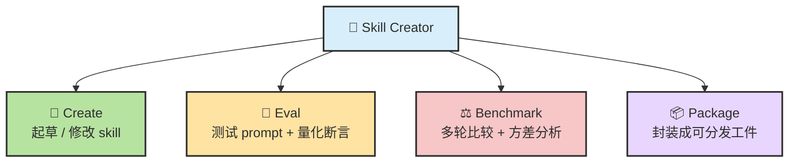
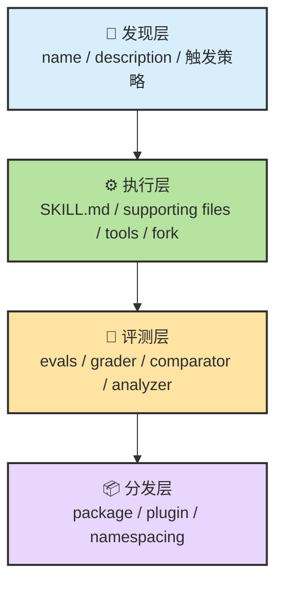
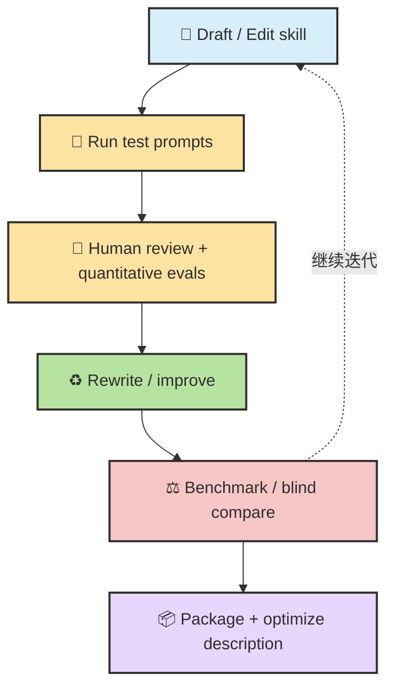
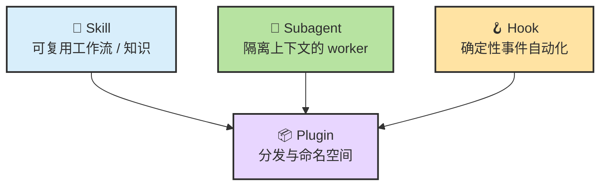
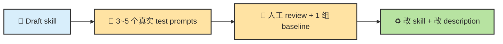

# Chapter 13.b · 🧪 Claude Code 官方 Skill Creator：从”写 Skill”到”做 Skill Engineering”

> 📦 **GitHub**：[anthropics/claude-code-skill-creator](https://github.com/anthropics/claude-code-skill-creator)
>
> 🎯 **一句话用途**：Anthropic 官方出品的 meta 工具——用 Agent 来写 Skill、测试 Skill、改进 Skill。它不只是一个 Skill 模板生成器，而是一个完整的 Skill Engineering 实验平台，内置了”创建 → 评测 → 改进 → 打包”的闭环。
>
> 🛠️ **怎么用**：`/install-skill https://github.com/anthropics/claude-code-skill-creator` 安装后，可以直接对 Agent 说”帮我创建一个 xxx Skill”，它会引导你完成定义、测试和打包。
>
> 📖 **前置阅读**：[Ch13 · Skill 原理](./ch13-skill.md)

> 目标：把 **Claude Code 官方 Skill Creator** 从“一个帮你起草 `SKILL.md` 的工具”拆回它真正的四层结构：**路由、执行、评测、打包**。读完这一章，你应该能看清它为什么更像一个 **skill engineering lab**，而不是单纯的 skill generator；也能判断哪些设计值得你在自己的 skill / plugin / agent 工作流里直接借鉴。

## 目录

- [🧭 0. 先校准几个直觉](#skill-sec-0)
- [🧩 1. 一张总图：Skill Creator 到底在系统里的哪一层](#skill-sec-1)
- [🧠 2. 它真正解决的问题：不是“写出来”，而是“证明确实更好”](#skill-sec-2)
- [🧰 3. 四层架构：发现层、执行层、评测层、分发层](#skill-sec-3)
- [🧭 4. 路由机制：description 才是第一触发器](#skill-sec-4)
- [🔁 5. 核心闭环：Create → Eval → Improve → Benchmark → Package](#skill-sec-5)
- [🤖 6. 四类专用 agent：为什么它不靠一个大 prompt 硬撑](#skill-sec-6)
- [🧱 7. 它和 Skill / Command / Hook / Subagent / Plugin 到底什么关系](#skill-sec-7)
- [⚖️ 8. 优势、限制与适用边界](#skill-sec-8)
- [🛠️ 9. 最值得抄走的工程套路](#skill-sec-9)
- [📝 本章总结](#skill-sec-summary)

> 📖 **阅读方式建议**：这一章默认你已经知道 `Skill / Hook / Subagent / Plugin` 这些词的大致含义；如果还不熟，建议把 Claude Code 官方的 skills / hooks / subagents / features overview 几页对照着读。  
> 🧠 **本章重点**：不是教你“怎么装 skill-creator”，而是教你看懂它背后的设计哲学：**为什么官方要把 skill 开发做成一个评测闭环，而不是一个 prompt 模板。**

---

## 0. 先校准几个直觉

在进入结构之前，先把最容易想歪的几件事摆正。很多人第一次看到 **Skill Creator**，会把它想得太轻。

| #️⃣ | 🪤 常见直觉 | ✅ 更接近现实的说法 |
| --- | --- | --- |
| 1 | “它就是帮我生成一个 `SKILL.md` 模板” | **不准确。** 它更像一个围绕 skill 设计、测试、比较、迭代、打包的工程工作台 |
| 2 | “skill 的核心是 prompt 写得好不好” | **只说对一半。** 真正影响效果的还有触发描述、支持文件、工具限制、评测数据、盲测比较 |
| 3 | “只要能用 `/skill-name` 跑起来就算完成” | **通常不够。** 官方设计更关心：它是否触发准确、输出稳定、比 baseline 更好 |
| 4 | “多写一点规则就会更强” | **不一定。** 描述太虚会不触发，正文太胖会增加噪音，支持文件组织不好会浪费上下文 |
| 5 | “它是写 skill 的工具” | **更准确地说，它是做 skill engineering 的工具。** “写”只是第一步，“评测和迭代”才是重心 |

先记住这一句，后面很多细节就不容易看偏：

> 🎯 **官方 Skill Creator 的目标不是“帮你把 skill 写出来”，而是“帮你把 skill 做成一个可测试、可比较、可迭代、可打包的工件”。**

---

## 1. 一张总图：Skill Creator 到底在系统里的哪一层

### 1.1 一句话定义

如果只压成一句最够用的话：

> 🧪 **Skill Creator = 一个围绕 skill 生命周期构建的实验与优化闭环。**

插件页把它的四种模式写得很清楚：**Create / Eval / Improve / Benchmark**；技能仓库里的 `skill-creator/SKILL.md` 也把主流程写成了：起草 skill → 准备测试 prompt → 运行 with-skill → 做定性与定量评估 → 重写 skill → 扩大测试集 → 最后再做 description 优化与打包。[^plugin][^skillcreator]

### 1.2 从“一个 skill”到“一个技能工程系统”

这张图里最关键的不是四个动词本身，而是它们的顺序。它表达的不是“写完就结束”，而是：

- **先把东西做出来**
- **再证明它是不是有效**
- **再比较它是不是更好**
- **最后才把它封装出去**

这已经不是“提示词创作”，而是非常典型的**工程化对象生命周期**。

### 1.3 它在 Claude Code 体系中的位置

Claude Code 官方现在把扩展面拆得相当清楚：

- **Skills**：可复用内容 / 知识 / 工作流
- **Subagents**：隔离上下文的独立 worker
- **Hooks**：事件驱动、确定性自动化
- **Plugins**：把 skills、hooks、subagents、MCP 一起打包的分发层[^features][^hooks]

所以 Skill Creator 在体系里的真正位置，更接近：

📌 这也是理解它的第一把钥匙：

> **Skill Creator 不是在“技能系统之外”给你写文档，而是在“技能系统之上”补了一层开发与质量闭环。**

---

## 2. 它真正解决的问题：不是“写出来”，而是“证明确实更好”

### 2.1 普通 skill 创作最容易卡在哪

很多人自己写 skill，会停在下面这个阶段：

1. 写一份 `SKILL.md`
2. 手动试两个 prompt
3. 感觉“好像能用”
4. 结束

问题在于，这种流程回答不了几个关键问题：

- 它比 **不用 skill** 真的更好吗？
- 它是**稳定更好**，还是只是这次碰巧更好？
- 它触发不准，到底是正文问题，还是 `description` 问题？
- 输出差，是 skill 写得差，还是执行 agent 没按它做？

Skill Creator 的价值，就是把这些“凭感觉”的问题，压成更可检查的对象。

### 2.2 从“可用”到“可证明确实更好”

官方 Skill Creator 反复强调几件事：

- **先让人类看 qualitative 输出**，不要只盯数字[^skillcreator]
- 在运行样例的同时，**补 quantitative evals / assertions**[^skillcreator]
- 需要更严谨时，再做 **blind comparison**，并用 analyzer 分析“为什么赢”[^skillcreator]

这说明它的哲学非常明确：

> 🧠 **Skill 的改进不是“把 prompt 继续润色”，而是“用定性 + 定量 + 对照实验把它逐步收敛”。**

### 2.3 它为什么不是单纯 prompt engineering

因为官方把 skill 当成的是一种**有接口、有触发器、有支持文件、有工具权限、有评测数据的运行工件**，而不是一段纯文本。Claude Code 官方文档也明确把 skill 定义为：一个以 `SKILL.md` 为入口、可带 supporting files、可限制工具、可配置手动/自动调用、可在 subagent 中运行的扩展单元。[^skills]

所以最准确的判断是：

> 🧱 **Prompt engineering 主要在调“模型怎么说”；skill engineering 在调“系统什么时候加载什么内容，用什么方式执行，并如何证明输出质量”。**

---

## 3. 四层架构：发现层、执行层、评测层、分发层

理解官方 Skill Creator，最省力的方法不是按目录背，而是按层来看。

### 3.1 第一层：发现层（Discovery Layer）

这里的核心是：**Claude 什么时候意识到有这个 skill 可用。**

决定这件事的头号输入，不是正文，而是 frontmatter 里的 `description`。官方文档写得很直接：`description` 是推荐字段，Claude 用它判断何时应用这个 skill；如果省略，就退回用正文第一段。[^skills]

这一层关心的是：

- 名字能不能被看见
- 描述有没有前置关键 use case
- 自动触发还是手动调用
- 是否会因为太多 skills 导致描述被截断

### 3.2 第二层：执行层（Execution Layer）

这里的核心是：**一旦 skill 触发，Claude 到底会怎么干。**

这时才轮到：

- `SKILL.md` 正文
- supporting files
- `allowed-tools`
- `$ARGUMENTS`
- `context: fork`
- `agent: Explore / Plan / ...`

这一层其实就是 skill 的真正“操作面”。

### 3.3 第三层：评测层（Measurement Layer）

这是 Skill Creator 最不像“普通 skill”的地方。

它不只运行 skill，还把评测对象拆出来：

- test prompts
- assertions / grading schema
- benchmark 聚合
- blind comparison
- analyzer 解释输赢原因
- eval viewer 给人类 review

也就是说，它明确把“**输出质量**”从聊天里剥离出来，变成一个单独层。

### 3.4 第四层：分发层（Packaging Layer）

最后一层才是封装与复用。

在 Claude Code 当前体系里，**plugin 才是分发层**：一个 plugin 可以打包 skills、hooks、subagents、MCP servers；plugin skills 会命名空间隔离，例如 `/my-plugin:review`。[^features]

所以 Skill Creator 最后做 package，不是在“生成 markdown 归档”，而是在把前面三层磨好的对象，变成一个能分发、能共存、能安装的工件。

### 3.5 四层总图

📌 这个四层视角很重要，因为它会直接改变你的设计顺序：

- **别一上来就打磨正文**
- 先想清楚：它如何被发现、如何执行、如何衡量、如何分发

---

## 4. 路由机制：description 才是第一触发器

### 4.1 触发不是从正文开始的

Claude Code 的 skills 文档把这件事说得很明确：常规会话里，**技能描述会先进入上下文用于“知道有哪些可用 skill”**，而完整 skill 内容只有在被调用时才加载；supporting files 则是更晚、按需再读。[^skills]

这意味着一个经常被忽略的事实：

> 🧭 **大多数 skill 的第一层路由，不发生在 `SKILL.md` 正文，而发生在 frontmatter 的 `description`。**

### 4.2 这其实是一种“渐进式装配”

虽然官方文档不一定总用这个词，但从行为上看，它很像一种渐进式装配：

它的好处是：

- 减少上下文负担
- 让 `SKILL.md` 保持总控台而不是资料库
- 让大 reference 文档和脚本按需进入

这也是为什么官方建议：**`SKILL.md` 保持在 500 行以内**，重资料移到 supporting files。[^skills]

### 4.3 description 为什么比很多人想的更重要

因为它同时承担三件事：

1. **召回**：Claude 能不能想到这个 skill
2. **意图匹配**：用户的话和 description 的关键词是否对齐
3. **边界控制**：它是应该常驻自动触发，还是只适合手动 `/skill-name`

文档里的 troubleshooting 也佐证了这一点：skill 不触发时，优先检查的就是 `description` 是否包含用户自然会说的关键词；触发过度时，则优先把描述写得更具体，或者直接 `disable-model-invocation: true`。[^skills]

### 4.4 官方为什么会强调“略微 pushy”的 description

Skill Creator 自己在说明里写得很直接：当前 Claude **更容易 undertrigger** skill，因此 description 需要同时写清楚“做什么”和“什么时候该用”，甚至要稍微“pushy”一点。[^skillcreator]

这个建议背后的含义非常工程化：

> 📈 **description 不是文案，它更像一个低成本路由器。**

### 4.5 还有一个容易忽略的限制：字符预算

Claude Code 文档专门提醒：

- 所有 skill 名字都会被纳入可见范围
- description 可能因为字符预算被截断
- 每条 skill 描述在列表里会被限制长度；整体预算会随 context window 变化，并有 fallback 限制[^skills]

这意味着：

- **关键信息必须前置**
- 描述不能把最重要的触发词放在后半段
- 你有很多 skills 时，description 设计比正文润色更值钱

📌 这也是为什么 Skill Creator 把 **description optimization** 放到流程最后：先把 skill 做对，再优化召回。

---

## 5. 核心闭环：Create → Eval → Improve → Benchmark → Package

### 5.1 这不是单向流程，而是迭代环

Skill Creator 的真正主循环，不是“写完结束”，而是：

官方 `skill-creator/SKILL.md` 里反复强调的核心 loop 基本就是这张图：**先起草，后跑样例，再做人类 review 和 quantitative eval，再重写，再扩充测试集，最后再打包。**[^skillcreator]

### 5.2 为什么要“先人审，再自改”

Skill Creator 里有一段口气很重的说明：**先生成 eval viewer，让人类尽快看案例，再决定怎么改 skill。**[^skillcreator]

这背后的判断很值得学：

- 模型自己做自我评价，容易被表面流畅度骗过
- benchmark 数字好看，不代表具体案例真的对
- 人类先看 qualitative case，能更快发现“方向错了”的问题

所以它不是“相信人类直觉”或者“相信数字”，而是：

> ⚖️ **先用人类快速发现方向性错误，再用定量手段验证收敛是否真实。**

### 5.3 为什么要有 baseline

Skill Creator 的高级比较模式本质上在问：

- 新版 skill 比旧版 skill 更好吗？
- 有 skill 比无 skill 更好吗？

如果没有 baseline，你只能知道“它能跑”；但你无法知道“它值不值得留”。

这和普通编码 agent 很像：

- 没有测试，你只能说“看上去差不多”
- 没有对照组，你只能说“我主观更喜欢”

### 5.4 blind comparison 为什么重要

blind comparison 的意义不只是防止“人类偏心”，更是防止 **作者偏心**：

- 你知道哪个是新版，就容易替新版脑补优点
- 你知道哪个是自己花很多时间打磨的版本，就容易不舍得判它输

Skill Creator 把比较和分析拆成 `comparator` 与 `analyzer` 两个 agent，其实就是把“判输赢”和“解释原因”分开，避免一个 prompt 一口气又裁判又复盘。[^skillcreator]

---

## 6. 四类专用 agent：为什么它不靠一个大 prompt 硬撑

### 6.1 角色分工不是装饰，而是隔离责任

插件页和 skill 源码都提到四类可组合 agent：

- **Executor**：执行 skill / 跑 eval prompts
- **Grader**：按断言与期望打分
- **Comparator**：盲测 A/B 输出
- **Analyzer**：解释胜负与波动来源[^plugin][^skillcreator]

### 6.2 把它画成一条职责链

### 6.3 为什么不让一个 agent 全包

因为一个 agent 同时承担“执行、打分、比较、解释”会把几类误差叠在一起：

- **执行误差**：没按 skill 做
- **评分误差**：评判标准模糊
- **比较偏差**：知道版本身份后带入预设
- **分析误差**：先有结论再找解释

把角色拆开，本质上是在做**责任隔离**。

📌 这正是它从“提示词工具”变成“工程工具”的地方：

> 🧱 **一个大 prompt 擅长快速出结果；多个专职角色更适合做相对可信的闭环。**

### 6.4 这套分工也揭示了 skill 的本质

Skill Creator 默认你需要：

- 一个能跑出样例的执行者
- 一个能依据 schema / assertions 评分的人
- 一个能做盲测比较的人
- 一个能从统计和案例里读模式的人

这说明在官方视角里，**skill 已经不再是“提示词片段”，而是一个值得被实验、评测和版本比较的对象。**

---

## 7. 它和 Skill / Command / Hook / Subagent / Plugin 到底什么关系

很多人第一次接触 Claude Code 扩展面时，会把这几个词混在一起。Skill Creator 恰好是把这些能力串起来的一个好例子。

### 7.1 Skill vs Command

Claude Code 官方已经把 **custom commands 合并进 skills**：

- `.claude/commands/deploy.md`
- `.claude/skills/deploy/SKILL.md`

都可以形成 `/deploy`，而且现有 commands 仍然继续兼容。[^skills]

所以从用户视角看，Skill Creator 既是：

- 一个 **自动触发的 skill**
- 也是一个 **可手动 `/skill-creator` 调用的工作流入口**

### 7.2 Skill vs Subagent

官方对这两者的边界很清楚：

- **Skill**：可复用内容 / 知识 / 工作流
- **Subagent**：独立上下文里的 worker，只返回摘要[^features]

Skill Creator 之所以强，不是因为它自己就是 subagent，而是因为它**会调用 subagent 去做更隔离的比较和分析**。换句话说：

> 🧩 **Skill 是 playbook，subagent 是 worker。Skill Creator 则是“会调 worker 的 playbook”。**

### 7.3 Skill vs Hook

Hooks 是确定性自动化，不依赖模型“想起来”；它们在生命周期事件上触发，比如格式化、阻止危险编辑、重新注入上下文、通知用户。[^hooks]

所以：

- Skill Creator 更擅长 **设计和评测 workflow**
- Hooks 更擅长 **保证某些动作必定发生**

一个很实用的组合是：

- 用 Skill Creator 设计一个 review / deploy / migration skill
- 用 hooks 确保关键校验总会执行

### 7.4 Skill vs Plugin

Plugin 是打包层。官方 features overview 直接说了：plugin 可以把 skills、hooks、subagents、MCP servers 打成一个可安装单元，plugin skills 会自动 namespacing。[^features]

这意味着 Skill Creator 做完 package 后，最终落点不是“保存一份 markdown”，而是进入更大的可安装生态。

### 7.5 关系总图

---

## 8. 优势、限制与适用边界

### 8.1 它最强的地方

| 优势 | 为什么重要 |
| --- | --- |
| **把 skill 开发做成闭环** | 从“写完”升级成“评测—迭代—比较—打包” |
| **把定性和定量并列** | 避免只看数字或只看主观印象 |
| **把比较做成盲测** | 降低作者偏见和版本偏见 |
| **把 description 提升到一级公民** | 真正解决“触发准不准”而不是只改正文 |
| **把 supporting files / scripts 用起来** | 不让所有信息都堆进主 prompt |

### 8.2 它不适合所有任务

它明显更适合：

- 要长期复用的 skill
- 你希望交给别人也能稳定使用的 workflow
- 需要解释“为什么这个 skill 值得保留”的团队环境
- 需要比较多个版本差异的迭代式开发

它不一定适合：

- 一次性 throwaway skill
- 只是想把某次对话总结成简短 playbook
- 变化太快、测试集还没稳定的纯探索阶段

### 8.3 它真正的成本不在“写”，在“测”

Skill Creator 最重的部分，不是起草 `SKILL.md`，而是后面的整套评测基础设施：

- 要准备 test prompts
- 要补 grading / assertions
- 要跑 with-skill / baseline
- 要做人类 review
- 要看 benchmark 方差
- 要做 blind comparison

也就是说，它的成本主要是**实验设计成本**，不是文本生成成本。

### 8.4 一个很容易被忽视的限制：它仍然受技能系统本身约束

无论 Skill Creator 再强，它最终落地仍要受 Claude Code 技能系统的现实边界影响，例如：

- 自动触发本身受 `description` 与上下文预算影响[^skills]
- supporting files 是否按需加载，依赖你的 `SKILL.md` 导航是否写清楚[^skills]
- `context: fork` 是否有意义，取决于 skill 是否自带明确任务，而不只是背景知识[^skills]
- tool 权限、subagent 权限、plugin 打包边界，都还是外层系统说了算[^subagents][^features]

所以它不是魔法；它只是把你更稳地引到系统能力的上限附近。

---

## 9. 最值得抄走的工程套路

如果你不打算完整照搬官方 Skill Creator，下面这些设计依然非常值得抄。

### 9.1 把 skill 设计顺序改成“四问”

在写正文之前，先回答：

1. **它如何被发现？**（name / description / 自动 or 手动）
2. **它如何执行？**（inline or fork / tools / args / files）
3. **它如何被衡量？**（样例、断言、baseline、人工 review）
4. **它如何被分发？**（项目内 skill、plugin、还是只是局部 playbook）

### 9.2 正文瘦身，重资料外置

Claude Code 官方已经给了非常清晰的建议：`SKILL.md` 维持总览与导航，把详细 reference、examples、scripts 挪到 supporting files。[^skills]

这比“把所有知识都塞进一个大 markdown”稳得多。

### 9.3 先修正文，再优化触发，是错序

官方 Skill Creator 反而是在 skill 基本成型后，才去优化 `description` 的 triggering accuracy。这个顺序非常合理：

- 先保证 skill **本身有价值**
- 再保证它 **被正确召回**

### 9.4 最小可行版 Skill Engineering 流程

如果你不想上完整 Skill Creator，可以先用一个轻量版：

这套轻量闭环，已经比“写完就用”高出一截。

### 9.5 一个最值得带走的判断

> 🧠 **好的 skill，不只是“说明写得好”；而是“被发现得准、被执行得稳、被评测得清、被分发得明”。**

---

## 📝 本章总结

### 三条最值得带走的判断

1. 🧪 **官方 Skill Creator 的重点不是“帮你写 skill”，而是“帮你把 skill 变成一个可测试、可比较、可迭代的工程工件”。**
2. 🧭 **在 Claude Code 技能系统里，`description` 是一级路由器；`SKILL.md` 正文只是第二层。**
3. 🧱 **真正让它像“工程实验室”的，不是模板生成，而是评测层：test prompts、grader、blind compare、analyzer、viewer、benchmark。**

### 如果你只记一句话

> **Skill Creator 最强的不是“生成 skill”，而是把“skill 开发”从 prompt 手工活，升级成一个带实验设计与质量闭环的 engineering workflow。**

---

## 参考资料

[^plugin]: Anthropic, **Skill Creator – Claude Plugin**：说明了 Create / Eval / Improve / Benchmark 四种模式，以及 Executor / Grader / Comparator / Analyzer 四类专用 agent。
<https://claude.com/plugins/skill-creator>

[^skills]: Anthropic, **Extend Claude with skills**：官方 skills 文档，涵盖 frontmatter、description、supporting files、tool restriction、manual/auto invocation、`context: fork`、commands merge into skills、char budget、nested discovery 等。  
<https://code.claude.com/docs/en/skills>

[^skillcreator]: Anthropic skills repo, **skills/skill-creator/SKILL.md**：官方 skill-creator 主流程与说明，包括 test prompts、quantitative evals、eval viewer、blind comparison、description optimization、package。  
<https://github.com/anthropics/skills/blob/main/skills/skill-creator/SKILL.md>

[^features]: Anthropic, **Extend Claude Code / Features overview**：说明 plugin 是分发层，可打包 skills、hooks、subagents、MCP，并解释 skill 与 subagent 的差异。  
<https://code.claude.com/docs/en/features-overview>

[^hooks]: Anthropic, **Hooks guide / Hooks reference**：说明 hooks 是 Claude Code 生命周期中的确定性自动化，而不是 prompt 记忆。  
<https://code.claude.com/docs/en/hooks-guide>  
<https://code.claude.com/docs/en/hooks>

[^subagents]: Anthropic, **Create custom subagents**：说明 subagent 的上下文隔离、skills 预加载、memory、permission 继承等机制。
<https://code.claude.com/docs/en/sub-agents>

---

[📚 返回目录](../../README.md#tutorial-contents) | [⬅️ 上一篇：Ch13.a Superpowers](./ch13a-skill-superpowers.md) | [➡️ 下一篇：Ch13.c Agent Skill Architect](./ch13c-skill-architect.md)

