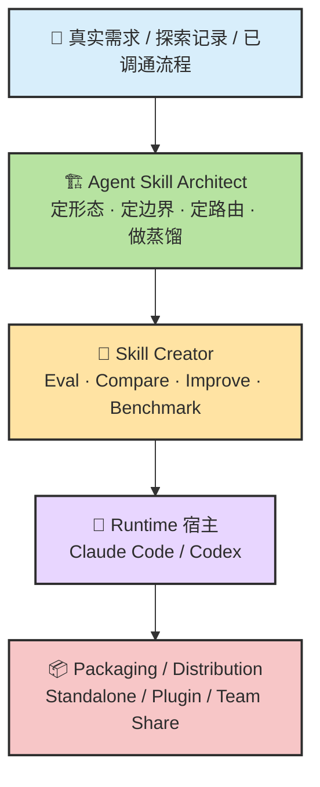
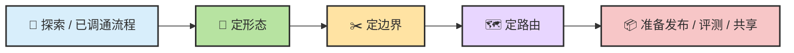
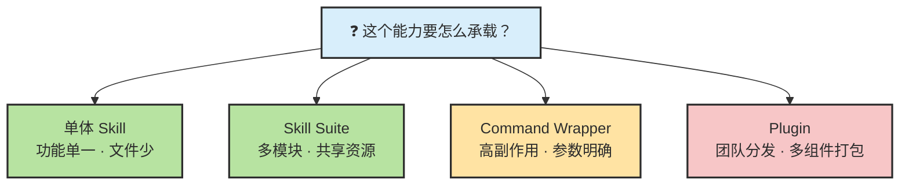
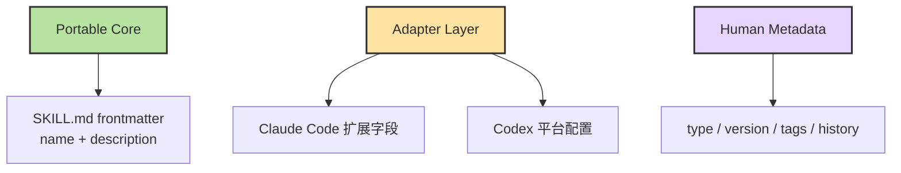
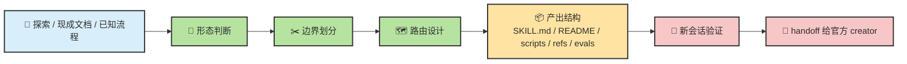
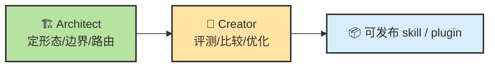
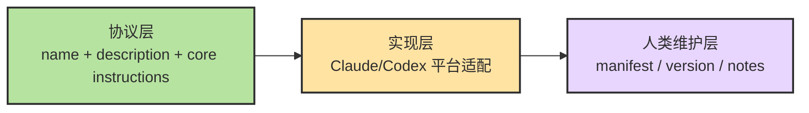
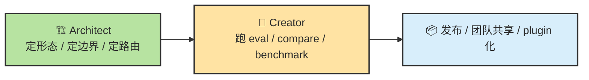

# Chapter 13.c · 🏗️ Agent Skill Architect：把成功探索蒸馏成可复用 Skill

> 📦 **GitHub**：[zht043/agent-skill-architect](https://github.com/zht043/agent-skill-architect)
>
> 🎯 **一句话用途**：一个"Skill 的结构设计器与经验蒸馏器"。当你在一次成功的 Agent 协作中发现了可复用的工作流模式，这个工具帮你把它从"一次性对话经验"蒸馏成"可跨项目复用的 Skill 结构"——包括触发条件设计、Portable Core 提取、平台适配层生成。
>
> 🛠️ **怎么用**：安装后，对 Agent 说"帮我把刚才的调试流程蒸馏成一个 Skill"，它会引导你完成边界分析、结构设计和多平台适配。
>
> 📖 **前置阅读**：[Ch13 · Skill 原理](./ch13-skill.md) · [Ch13.b · Skill Creator](./ch13b-skill-creator.md)

> 目标：把 **Agent Skill Architect** 放回整个 agent extensibility / skills 体系里看清楚。读完这篇，你应该能回答三个问题：
>
> - **它到底是什么？**
> - **它和官方 Skill Creator、Hooks、Subagents、Plugins 分别差在哪？**
> - **为什么它更像“前置架构工序”，而不是“另一个 skill 生成器”？**

## 目录

- [🧭 0. 先校准几个直觉](#sec-0)
- [🧩 1. 一张总图：它在技能体系里的位置](#sec-1)
- [🎯 2. 它到底在解决什么问题](#sec-2)
- [🧠 3. 一个够用的定义公式](#sec-3)
- [⚙️ 4. 它的核心机制：三层判断 + 一条蒸馏链](#sec-4)
- [🧭 5. 它的路由机制，到底在路由什么](#sec-5)
- [🪜 6. 它和官方 Skill Creator 的关系：不是替身，而是前置工序](#sec-6)
- [🧰 7. 它和 Skills / Commands / Hooks / Subagents / Plugins / MCP 的边界](#sec-7)
- [🌉 8. 为什么它的“Portable Core + Adapter Layer”思路是对的](#sec-8)
- [📌 9. 它真正擅长的场景](#sec-9)
- [🚧 10. 当前短板与下一步该补什么](#sec-10)
- [✍️ 11. 最推荐的使用方式与提示词模板](#sec-11)
- [📝 本章总结](#sec-summary)

> 📖 **阅读方式建议**：如果你已经看过官方 Skill Creator，那这篇最好和它对照着读。两者不是竞争关系，而是一前一后两段工序。
>
> 🧠 **主线先记一句**：
>
> > **官方 Skill Creator 更像“skill 体检和实验平台”；Agent Skill Architect 更像“skill 的结构设计器与经验蒸馏器”。**

---

## 🧭 0. 先校准几个直觉

很多人第一次看这个项目，很容易把它想成错误的东西。

| #️⃣ | 🪤 常见直觉 | ✅ 更接近现实的说法 |
| --- | --- | --- |
| 1 | “它就是官方 Skill Creator 的民间复刻版” | **不对。** 它不是以 eval / benchmark 为中心，而是以 **形态判断、边界划分、路由设计、经验提炼** 为中心 |
| 2 | “它只是帮你多写一个 `SKILL.md`” | **不止。** 它试图先回答：这个东西到底该是 **single skill / suite / command / plugin** 哪一种 |
| 3 | “它的价值在生成内容” | **只说对一半。** 它更大的价值在于 **抽象结构**，把一次临时探索变成可复用设计 |
| 4 | “既然官方已经有 creator，就没必要有 architect” | **不对。** Creator 解决“做得好不好”；Architect 解决“该长成什么样” |
| 5 | “它只是 Claude Code 生态内的小技巧” | **不完全对。** 它的一个关键主张恰恰是 **先做 portable core，再做 Claude / Codex 适配** |

先记住这一句，后面很多细节都会顺：

> 🎯 **Agent Skill Architect 的关键不是“替你把 skill 写出来”，而是“把隐性经验组织成可复用、可移植、可继续评测的 skill 结构”。**

---

## 🧩 1. 一张总图：它在技能体系里的位置

如果把整个 agent 扩展体系压缩成一个最够用的全景图，Agent Skill Architect 所在的位置大致如下：



这张图里最重要的不是箭头顺序，而是 **工种分层**：

- **Architect**：偏设计时（design-time）
- **Creator**：偏实验与评测时（quality loop）
- **Runtime Host**：偏执行时（Claude / Codex）
- **Packaging**：偏传播与复用时（standalone / plugin / team distribution）

也就是说：

> 🧭 **Architect 不在“执行层”，也不在“质量验证层”的中心；它更接近“结构设计层”。**

---

## 🎯 2. 它到底在解决什么问题

### 2.1 一个真实痛点：成功经验最容易死在聊天记录里

很多 skill 的真正起点不是“我想设计一个抽象能力”，而是：

1. 某个流程终于调通了  
2. 某次探索终于找到可行路径  
3. 某个复杂操作终于被一步步验证成功  
4. 你不想下次再从头讲一遍  

这个 moment 很关键。因为这里最容易发生的事，是经验留在：

- 聊天记录里
- 临时 prompt 里
- 一次性 shell 历史里
- 某个你自己也说不清的“当时就是这样试出来的”里

而 Agent Skill Architect 的目标，恰恰就是把这种“已经成功但还没沉淀”的东西，往结构化 skill 推一把。

### 2.2 它补的是官方 Skill Creator 的上游空缺

官方 Skill Creator 很强，但它最擅长的阶段更靠后：

- 起草 skill
- 设计 test prompts
- 跑 baseline / with-skill
- 做 blind compare
- 做 benchmark aggregation
- 优化 description 触发

这意味着它默认更适合：

> **skill 已经有一个相对稳定的对象了。**

而 Agent Skill Architect 处理的是前面一步：

- 它是不是一个 skill？
- 是单体 skill 还是 suite？
- 要不要直接做成 command wrapper？
- 什么时候应该上 plugin？
- 哪些内容该进 `SKILL.md`？
- 哪些应该放 `references/`、`scripts/`、`evals/`？
- 这份能力怎么做成 Claude / Codex 都能认的结构？

所以它补的不是“不会写 skill”，而是：

> **不会给 skill 定形。**

### 2.3 它还在解决另一个工程问题：过早绑定宿主

官方文档已经越来越明确：  
Claude Code 的 skills、plugins、hooks、subagents 是一套扩展体系；Codex 也有 skills、AGENTS.md、repo/user 级配置、plugins 和 MCP。两边都支持 skills，但宿主特性并不完全相同。Claude Code 明确支持 skill 自动调用、直接 `/skill-name` 调用、调用控制、subagent 运行技能与插件打包；Codex 也支持 skills 的显式/隐式触发，并且同样使用 metadata → `SKILL.md` → `scripts/references` 的 progressive disclosure。([code.claude.com](https://code.claude.com/docs/en/skills), [developers.openai.com](https://developers.openai.com/codex/skills), [developers.openai.com](https://developers.openai.com/codex/concepts/customization/))

这就带来一个很现实的问题：

> ❓ **你是先写死在 Claude 的某种扩展能力里，还是先保留一个更可移植的 skill 核？**

Agent Skill Architect 的回答很明确：

> 🌉 **先做 portable core，再做 adapter layer。**

这不是洁癖，而是避免未来迁移成本。

---

## 🧠 3. 一个够用的定义公式

对大多数读者来说，最够用的理解公式可以是：

> 🏗️ **Agent Skill Architect = Distillation + Shape Decision + Boundary Design + Routing Design + Packaging Readiness**

把这五个词翻成白话：

- **Distillation**：把探索经验提炼成稳定流程
- **Shape Decision**：决定是 single skill / suite / command / plugin
- **Boundary Design**：划清做什么、不做什么、和谁解耦
- **Routing Design**：决定 description、目录和入口如何让 agent 更容易用对
- **Packaging Readiness**：为发布、共享、评测、跨宿主兼容做准备



这条公式最重要的点在于：  
它强调的不是“输出文档”，而是 **输出结构判断**。

---

## ⚙️ 4. 它的核心机制：三层判断 + 一条蒸馏链

### 4.1 第一层判断：这东西到底该长成什么形态？

从你仓库当前的设计看，最核心的第一问其实不是“怎么写”，而是：

> **它该是 single skill、skill suite、command wrapper，还是 plugin？**



这里有一个很重要的工程判断：

- **single skill** 解决能力聚焦
- **suite** 解决模块拆分与共享底座
- **command wrapper** 解决手动触发与强控制
- **plugin** 解决分发与跨项目复用

Claude Code 官方文档现在把 plugins 直接定义成“打包层”：插件可把 skills、agents、hooks 和 MCP servers 打成一个可安装单元；适合团队共享、版本化与 marketplace 分发。([code.claude.com](https://code.claude.com/docs/en/plugins), [code.claude.com](https://code.claude.com/docs/en/features-overview))

这恰恰说明：  
**把 plugin 视为更高一级的发布形态，是对的。**

### 4.2 第二层判断：它是能力型，还是流程型？

这个判断比看起来更重要。因为它决定了：

- `SKILL.md` 是不是主角
- `scripts/` 是否会成为重心
- eval 怎么设计
- 触发描述该偏“任务场景”还是偏“操作能力”

| 类型 | 更像什么 | `SKILL.md` 重心 | 典型配套 |
| --- | --- | --- | --- |
| **能力型 capability** | 封装一类操作能力 | 调度说明 + 输入输出约束 | `scripts/`、工具权限、参数 |
| **流程型 process** | 封装一套方法论流程 | 步骤说明 + 决策路径 | `references/`、模板、示例 |

这也是为什么 Architect 不该只是一个模板机。  
它需要先把 **“能力” 和 “流程”** 分开。

### 4.3 第三层判断：先做 portable core，还是直接宿主特化？

这是你这个仓最有价值、也最容易被低估的设计点之一。



为什么这套结构是合理的？

因为官方公开资料已经在共同指向同一件事：

- Claude Code skills 遵循 Agent Skills open standard，并在其上扩展 invocation control、subagent execution、dynamic context injection。([code.claude.com](https://code.claude.com/docs/en/skills))
- Codex 同样从 `name` / `description` 开始发现 skills，仅在选中时才加载完整 `SKILL.md`，再按需读取 `scripts/` / `references/`。([developers.openai.com](https://developers.openai.com/codex/skills), [developers.openai.com](https://developers.openai.com/codex/concepts/customization/))
- OpenAI 在 OSS 维护的技能实践里也明确把 `description` 视作重要路由元数据，而不是随便写的说明文字。([developers.openai.com](https://developers.openai.com/blog/skills-agents-sdk/))

所以你这个仓强调：

> **frontmatter 里先只保留最小共识层，平台私有能力放适配层，人类维护元数据放 references。**

这不是抽象过度，而是把未来兼容成本前置消化掉。

### 4.4 最后才是一条蒸馏链

把前面三层判断串起来，它真正的工作流大致是：



Architect 的重心在 **B / C / D / E**，不是在最后的 benchmark。

---

## 🧭 5. 它的路由机制，到底在路由什么

很多人说“这个 skill 会不会触发”，但这里真正要路由的，其实有三层。

### 5.1 路由层 1：用户意图 → 产物形态

这是最上游的路由。

- “帮我设计一个新的 skill” → single / suite 判断
- “这个应该做成 skill 还是 plugin？” → packaging decision
- “把这次探索过程提炼成 skill” → distillation 模式
- “帮我检查这个 skill 是否耦合过高” → boundary / split-readiness 模式

### 5.2 路由层 2：产物形态 → 目录结构

一旦形态定下，后面很多事其实是机械推导：

| 形态 | 目录组织思路 |
| --- | --- |
| **Single Skill** | 平铺结构，低耦合，轻量配套 |
| **Skill Suite** | 入口路由 + 子模块 + 共享 `_lib` / `references` |
| **Command Wrapper** | 更强调手动入口、参数与副作用约束 |
| **Plugin** | 提升到打包层，带命名空间、版本、共享安装路径 |

### 5.3 路由层 3：结构稳定后 → 谁来继续做质量闭环

这是很多人忽略的路由。  
不是所有路由都发生在运行时，也有 **工序级路由**。

> 当结构还不稳定时，交给 Architect；  
> 当结构已成形，要评测、benchmark、优化触发时，再交给 Creator。

这个 handoff 非常关键。因为它本质上是在说：

> **Architect 不是闭环终点。**

---

## 🪜 6. 它和官方 Skill Creator 的关系：不是替身，而是前置工序

把两者放在一起最容易看清。

| 维度 | 官方 Skill Creator | Agent Skill Architect |
| --- | --- | --- |
| 核心问题 | **这个 skill 做得好不好？** | **这个 skill 该长成什么样？** |
| 默认阶段 | skill 已经有雏形 | skill 还在定义 / 蒸馏 / 拆分 |
| 重心 | eval、compare、benchmark、improve | shape、boundary、routing、portable core |
| 典型动作 | with-skill vs baseline、盲测比较、聚合报告 | single vs suite、skill vs plugin、经验提炼 |
| 配套设施 | grader / comparator / analyzer / viewer / 脚本 | acceptance、trigger eval、任务样例、结构原则 |
| 更像什么 | **实验平台 / 体检中心** | **结构设计器 / 蒸馏器** |

一句话最准确：

> ⚖️ **Skill Creator 解决“效果验证”；Agent Skill Architect 解决“结构定形”。**



---

## 🧰 7. 它和 Skills / Commands / Hooks / Subagents / Plugins / MCP 的边界

很多混乱，都是从这里开始的。下面这张表最值得反复看。

| 概念 | 更像什么 | 解决的问题 | 和 Architect 的关系 |
| --- | --- | --- | --- |
| **Skill** | 可复用能力包 | 重复工作如何标准化 | 它的直接设计对象 |
| **Command** | 手动入口 | 高副作用、明确参数、想要人工显式调用 | 它可能建议你别做自动 skill，改做 wrapper |
| **Hook** | 确定性生命周期自动化 | 有些事必须每次发生 | Architect 不替代 hook，只决定什么时候该上 hook |
| **Subagent** | 隔离上下文的工作者 | 复杂任务需要独立视角 / 上下文隔离 | Architect 可以建议 skill 内部调用 subagent，但不是 subagent 本身 |
| **Plugin** | 打包分发层 | 共享、版本化、复用、多组件组合 | Architect 会判断何时从 standalone 升级到 plugin |
| **MCP** | 外部系统能力接入 | 需要访问 repo 外部工具 / 数据 / 服务 | Architect 可建议使用 MCP，但不替代 MCP |

官方文档对这些边界其实越来越清楚：

- Claude Code 里 **skills** 可自动触发，也可 `/skill-name` 直接调用；自定义 commands 已并入 skills。([code.claude.com](https://code.claude.com/docs/en/skills))
- **hooks** 提供 deterministic control，保证某些动作一定发生，而不是依赖 LLM 自觉。([code.claude.com](https://code.claude.com/docs/en/hooks-guide))
- **plugins** 是包装层，用来把 skills、hooks、subagents、MCP servers 统一打包分发。([code.claude.com](https://code.claude.com/docs/en/plugins), [code.claude.com](https://code.claude.com/docs/en/features-overview))
- Codex 也把 **skills**、`AGENTS.md`、MCP、plugins 放在一套可组合的 customization 体系里。([developers.openai.com](https://developers.openai.com/codex/concepts/customization), [developers.openai.com](https://developers.openai.com/codex/skills))

### 一个最容易学歪的点：Architect 不是“更强的 Hook / 更高阶的 Skill”

它不是 runtime 行为本身，而是：

> **runtime 行为该如何被组织出来的设计器。**

---

## 🌉 8. 为什么它的”Portable Core + Adapter Layer”思路是对的

这一节值得单独拎出来，因为它不是一个小技巧，而是整个项目最有工程味的判断之一。

### 8.1 为什么不要一开始就把宿主私货写死？

因为 skills 现在已经不是某一家产品的私有概念了。

- Claude Code 明确说 skills 遵循 Agent Skills open standard，同时在标准之上加调用控制、subagent 运行、动态上下文注入。([code.claude.com](https://code.claude.com/docs/en/skills))
- Codex 公开文档也强调 skills 用 progressive disclosure：先读 metadata，再按需加载 `SKILL.md` 和 supporting files。([developers.openai.com](https://developers.openai.com/codex/skills), [developers.openai.com](https://developers.openai.com/codex/concepts/customization/))
- OpenAI 还把同样的结构用于其官方 skills catalog。([github.com](https://github.com/openai/skills))

这意味着：  
**跨宿主的最小公分母，已经开始存在。**

### 8.2 Portable Core 真正解决的不是“兼容性炫技”，而是演化成本

如果你一开始就把 skill 绑死在某个宿主私有字段、私有目录约定、私有命令模型里，后面会遇到这些问题：

- 迁移到别的 agent 成本高
- 很难解释哪些是能力本体，哪些是宿主适配
- 做 plugin / suite 时容易层次混乱
- eval 和 repo 结构设计很容易掺杂平台私货
- 团队协作时可读性差

而把它拆成：

- **Portable Core**
- **Adapter Layer**
- **Human Metadata**

就等于把这些问题前置隔离了。

### 8.3 更深一层地看：这其实是在做“协议层”和“实现层”的分离



这不是“为了漂亮而分层”，而是很典型的工程化思路：

> **协议层稳定，适配层可变，元数据层可维护。**

---

## 📌 9. 它真正擅长的场景

Agent Skill Architect 最适合的，不是任何“想做点自动化”的场景，而是下面这些：

### 9.1 你刚刚把一个复杂流程调通

例如：

- 某个本地环境终于成功安装
- 某个部署/构建/调试步骤终于顺了
- 某类仓库理解流程已经摸清套路
- 某个固定格式输出的文档生成路径已经稳定

这时最怕的是“下次再说一遍”。

### 9.2 你已经感觉单体 skill 变胖了

这是 Architect 最有价值的时机之一。  
它适合回答：

- 现在是不是该拆 suite？
- 哪块应该抽 `_lib`？
- 哪些逻辑其实是可共享的 capability？
- 哪些 prompt 内容更像 human docs，不该塞进核心 `SKILL.md`？

### 9.3 你正在做跨宿主设计

尤其当你希望：

- Claude Code 可直接用
- Codex 也能识别
- 后续还想打包成 plugin
- 不想以后到处替换宿主私有字段

这时 Architect 的价值会明显高于“先随便写一个版本再说”。

### 9.4 你想把个人经验升级成团队资产

这个场景最容易被低估。  
个人经验在聊天里是一次性的；skill / suite / plugin 才是团队资产的形态。

---

## 🚧 10. 当前短板与下一步该补什么

这部分恰恰能看出它现在还是一个很早期、但方向清晰的项目。

### 10.1 它现在更像“文档型元技能”，而不是“自动化工作台”

当前仓库结构很克制：

- `SKILL.md`
- `README.md`
- `evals/`
- `references/`

但缺少更强的自动化层，例如：

- skill skeleton generator
- suite split-readiness lint
- coupling detector
- trigger matrix generator
- module map / route map 自动产出
- plugin scaffold export

这说明它现在强在 **方法论和结构判断**，不强在 **脚本化执行**。

### 10.2 它的“跨宿主适配”还偏原则，样例还不够多

比如现在思路是对的，但还可以进一步补：

- Claude 专属字段示例
- Codex `agents/openai.yaml` / repo layout 示例
- standalone → plugin 迁移样板
- suite → plugin 的目录映射例子

### 10.3 它还没真正长出“重构模式”

这是我觉得最值得补的下一步：

> 输入一个已经变胖、变乱、耦合高的老 skill，  
> 输出一个拆分方案、路由表和迁移计划。

一旦做到这点，它会从“设计器”进一步升级成“skill refactor architect”。

### 10.4 它目前的 eval 更偏职责边界，不太偏质量闭环

这是合理的，因为质量闭环本来就更适合交给官方 Creator。  
但如果未来要增强，也可以加：

- split-quality rubric
- portability rubric
- overcoupling checks
- plugin-readiness checklist

---

## ✍️ 11. 最推荐的使用方式与提示词模板

### 11.1 最顺的组合流程



### 11.2 三种最好用的输入姿势

#### 姿势 A：从探索记录蒸馏
```text
我刚刚调通了一个流程，想把它沉淀成可复用 skill。
请先不要直接写 SKILL.md，而是先判断：
1. 它适合做 single skill、suite、command wrapper 还是 plugin？
2. 它更偏 capability 还是 process？
3. 哪些内容应放核心 skill，哪些应放 references / scripts / evals？
4. 怎样设计成 Claude Code 与 Codex 都更容易兼容？
```

#### 姿势 B：给一个已经变胖的 skill 做架构审查
```text
请把这个 skill 当成一个待重构对象来审查：
1. 是否已经超过单体 skill 的合理粒度？
2. 是否存在可以拆成 suite 的模块边界？
3. 哪些部分耦合过高？
4. 哪些平台私有配置不该写死在 portable core？
5. 输出一个拆分与迁移建议。
```

#### 姿势 C：先做形态决策，再生成骨架
```text
我想做一个 [能力/流程]。
先不要写内容，先做 shape decision：
- single skill / suite / command / plugin 哪个更合适？
- 给出判断理由
- 再输出推荐的目录骨架和每个文件的职责
```

### 11.3 一个特别重要的习惯

> **不要一上来就让它“帮我写个 skill”。**  
> 先让它回答：**这东西到底是不是 skill，以及它该长成哪种形态。**

这一步，恰恰就是它存在的意义。

---

## 📝 本章总结

### 三条最值得带走的判断

1. 🏗️ **Agent Skill Architect 不是官方 Skill Creator 的替身，而是它的前置架构工序。**
2. 🌉 **它最有价值的点，不是“多写一份 skill 文档”，而是“先做 portable core，再做宿主适配”。**
3. 🧭 **它解决的核心问题不是“怎么评测一个 skill”，而是“这个 skill 到底该长成什么形态、如何拆边界、如何设计路由”。**

### 如果只用一句话概括它

> **它是一把“经验蒸馏器 + 结构设计尺”，把一次调通的流程，变成一个可复用、可移植、可继续评测的 skill 设计。**

### 如果只用一句话概括它和官方 Creator 的分工

> **Architect 先定骨架，Creator 再做体检。**

---

## 参考资料

### 项目仓库
- [GitHub: zht043/agent-skill-architect](https://github.com/zht043/agent-skill-architect)

### 官方与相关文档
- [Claude Code Docs — Skills](https://code.claude.com/docs/en/skills)
- [Claude Code Docs — Plugins](https://code.claude.com/docs/en/plugins)
- [Claude Code Docs — Hooks](https://code.claude.com/docs/en/hooks)
- [Claude Code Docs — Features Overview](https://code.claude.com/docs/en/features-overview)
- [OpenAI Codex Docs — Skills](https://developers.openai.com/codex/skills)
- [OpenAI Codex Docs — Customization](https://developers.openai.com/codex/config-advanced)

---

<div align="center">

[📚 返回目录](../../README.md#tutorial-contents) | [⬅️ 上一篇：Ch13.b Skill Creator](./ch13b-skill-creator.md) | [➡️ 下一篇：Ch13.d SSH Dev Suite](./ch13d-skill-ssh-dev-suite.md)

</div>
