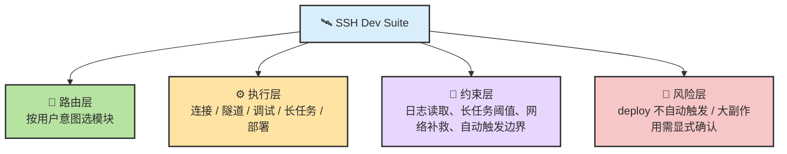
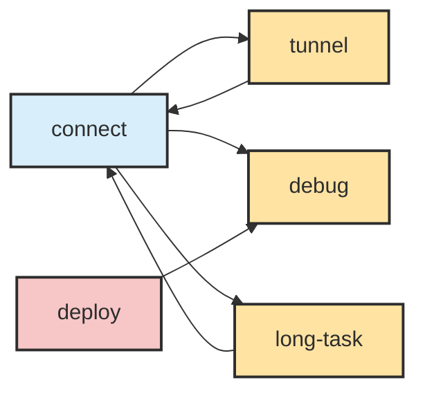
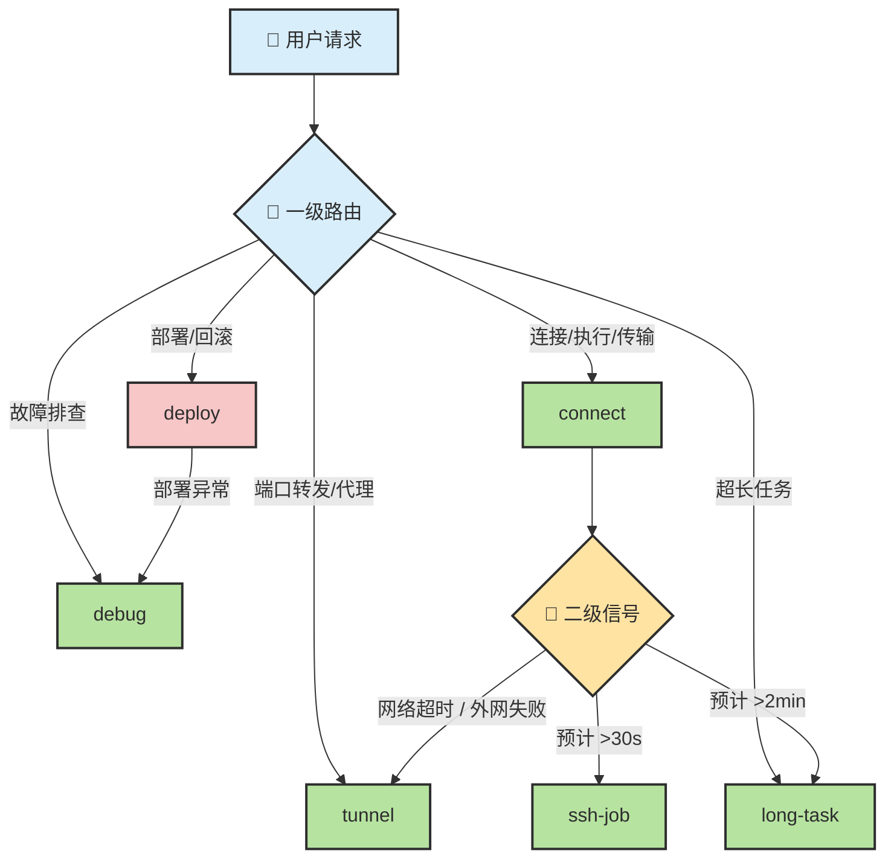
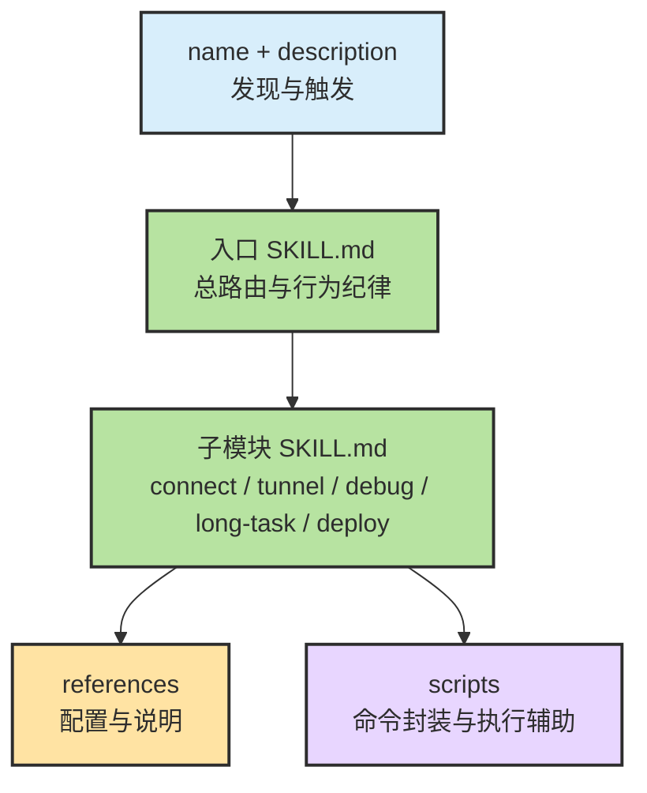

# Chapter 13.d · 🛰️ SSH Dev Suite：远程开发场景的领域型 Skill

> 📦 **GitHub**：[zht043/ssh-dev-suite](https://github.com/zht043/ssh-dev-suite)
>
> 🎯 **一句话用途**：一套专为远程开发场景设计的领域型 Skill Suite。它不是”SSH 命令合集”，而是把远程开发中的连接管理、环境探测、文件同步、进程监控、安全约束等经验写成了 Agent 可执行的纪律——知道该路由到哪个模块、何时切策略、哪些高副作用动作绝不能自动触发。
>
> 🛠️ **怎么用**：安装后，当你在远程服务器上工作时，Agent 会自动识别远程环境并按 Suite 的约束执行操作。也可以手动触发特定模块。
>
> 📖 **前置阅读**：[Ch13 · Skill 原理](./ch13-skill.md)

> **一句话版本：它不是”SSH 命令合集”，而是一套把远程开发经验写成 Agent 可执行纪律的领域型 skill suite。**
>
> 真正重要的不是“会连服务器”，而是：
>
> - 🧭 **知道该路由到哪个模块**
> - 🔁 **知道运行中何时该切策略**
> - 🚫 **知道哪些高副作用动作绝不能自动触发**
> - 🪶 **知道如何控制 token、日志读取与远程操作成本**

---

## 目录

- [🧭 0. 先校准几个直觉](#sec-0)
- [🧩 1. 一张总图：它到底是什么系统](#sec-1)
- [🧠 2. 为什么它必须是 suite，而不是单体 skill](#sec-2)
- [🗺️ 3. 双层路由：用户意图 + 运行时信号](#sec-3)
- [🧱 4. 五大模块怎么分工](#sec-4)
- [⚙️ 5. 真正的杠杆：约束、状态与成本控制](#sec-5)
- [🌉 6. Claude Code / Codex / Command / Plugin 视角下怎么看它](#sec-6)
- [📏 7. 它已经开始像“可评估技能系统”了](#sec-7)
- [🔧 8. 当前短板与下一步演化方向](#sec-8)
- [📝 本章总结](#sec-summary)

---

## 🧭 0. 先校准几个直觉

在真正进入分析前，先把几件最容易想错的事摆正。

| #️⃣ | 🪤 常见直觉 | ✅ 更接近现实的说法 |
| --- | --- | --- |
| 1 | “它就是一个会 SSH 的 skill” | **不准确。** 它更像一个围绕远程开发场景搭出来的 **领域型 suite** |
| 2 | “connect / tunnel / debug / deploy 只是分类目录” | **不止。** 这些模块之间存在明确的 **handoff 和切换规则** |
| 3 | “远程命令执行就是 `ssh` 包一层” | **太浅。** 长任务、后台任务、容器上下文、代理补救都改变了任务形态 |
| 4 | “功能越多越强” | **只说对一半。** 真正的价值在于 **什么时候该用哪个模块、什么时候不能乱用** |
| 5 | “SSH 场景里最重要的是命令清单” | **不对。** 更关键的是 **行为纪律、风险边界、日志/网络/长任务策略** |

先记住这一句，后面很多分析就不会学歪：

> 🎯 **SSH Dev Suite 的核心不是“会远程操作”，而是“把远程开发中的判断、切换、约束与恢复流程，写成 Agent 可执行的控制面”。**

---

## 🧩 1. 一张总图：它到底是什么系统

从外观上看，它像一个 skill suite；从运行逻辑看，它更像一套围绕 **SSH 远程开发** 设计的轻量 scaffold。



再压一层，可以写成：

> **SSH Dev Suite = Remote Dev Domain Knowledge + Routing + Runtime Switching + Safety Boundaries**

这比“一个会 SSH 的 skill”要高一层，因为它不仅给命令，还给 **状态迁移规则**、**异常补救路径** 和 **什么时候必须停下来问人**。

---

## 🧠 2. 为什么它必须是 suite，而不是单体 skill

这是这类远程开发 skill 最值得讲清的地方。

### 2.1 因为“SSH 远程开发”不是一个动作，而是一整串任务形态

本地开发里，很多动作可以看成同一类“改代码 + 跑命令”。  
但远程开发场景里，任务天然分裂成多种形态：

- 🔌 **连接 / 执行 / 传输**
- 🌉 **端口转发 / 代理补救**
- 🩺 **结构化排障**
- 💤 **超长任务与 checkpoint 恢复**
- 🚨 **高副作用部署与回滚**

把这些硬塞进一个单体 skill，会导致几个问题：

1. `description` 变得太泛，自动触发会失真  
2. `SKILL.md` 过长，路由和约束会互相干扰  
3. 高风险动作和低风险动作混在一起，不利于权限和触发控制  
4. 运行时根本没法表达“现在该切 tunnel 还是 long-task”

所以它做成 suite，不是为了“看起来更专业”，而是因为 **远程开发本身就是多任务形态系统**。

### 2.2 它不是把模块摆一起，而是写出了模块之间的依赖链



这张图最关键的不是“有五个模块”，而是：

- `connect` 是底座
- `tunnel` 是网络失败的正式补救通道
- `debug` 是失败后的结构化调查路径
- `long-task` 是长任务的状态化容器
- `deploy` 是明确高副作用、必须显式触发的出口

> 📌 也就是说，它不是 5 个平级 skill，而是 1 个领域入口 + 4 类场景化分流。

---

## 🗺️ 3. 双层路由：用户意图 + 运行时信号

这篇里最值得放大的亮点，就是它同时写了 **两套路由系统**。

---

### 3.1 第一层：用户意图路由

用户说什么，先落到哪个模块。

| 用户意图 | 应该进入的模块 |
| --- | --- |
| 测试连接、执行远程命令、上传下载 | `connect` |
| 端口映射、远程访问本地、代理共享 | `tunnel` |
| 服务异常、资源检查、日志排查 | `debug` |
| 训练 2 小时、构建很久、需要以后再回来 | `long-task` |
| 发布、同步、回滚 | `deploy` |

这层其实就是 suite 的“一级路由器”。

---

### 3.2 第二层：运行时信号路由

真正高级的地方在这里：  
它不是只在任务开始前选模块，而是**执行过程中根据信号自动切换策略**。



这说明它已经不只是“根据话题选一个 skill”，而是开始具备一点点 **状态机** 味道：

- 一开始走 `connect`
- 执行中发现网络不通 → 切 `tunnel`
- 命令太长 → 切 `long-task`
- 部署后不健康 → 切 `debug`

> 🎯 这就是它和普通“说明书型 skill”的根本区别：  
> **它不只描述做法，还描述做法之间的切换条件。**

---

## 🧱 4. 五大模块怎么分工

### 4.1 `connect`：不是”连上服务器”，而是一切远程动作的底座

`connect` 负责：

- SSH 连接测试
- 远程命令执行
- 文件上传下载
- 后台任务管理
- 容器上下文自动包装

它最关键的设计，不是这些动作本身，而是 **不同执行时长对应不同任务形态**：

| 任务长度 | 推荐策略 |
| --- | --- |
| `< 30s` | 直接 `ssh-exec` |
| `30s ~ 2min` | 改成 `ssh-job + 轮询` |
| `> 2min` | 进入 `long-task`，写 checkpoint |

这背后其实是一条很成熟的工程判断：

> **长命令不是“慢一点的 exec”，而是另一种任务类型。**

如果不把它拆出来，Agent 很容易犯两个错：

- 同步等一个超长命令，长时间无反馈  
- 把后台任务当普通命令，导致状态丢失  

所以 `connect` 的真实价值是：  
**把“执行远程命令”从单一动作，拆成了三种时长语义。**

---

### 4.2 `tunnel`：把”网络问题”从临时救火变成正式分支

`tunnel` 包含几类能力：

- `forward`：本地访问远程服务
- `reverse`：远程回连本地服务
- `socks`：借远程机器做跳板代理
- `proxy`：把本地代理共享给远程环境

它最大的价值，不是“会端口转发”，而是：

> **它把“远程网络失败怎么办”这件事，写成了正式策略，而不是让 Agent 即兴乱补。**

例如以下场景：

- `pip install` 超时
- `git clone/fetch` 外网失败
- `curl/wget` 拉不到包
- 远程机需要走本地代理访问公网

这类情况如果没有显式规则，Agent 很容易走歪路：

- 复制现成 wheel 包糊弄过去
- 建奇怪的软链接偷渡依赖
- 跳过安装步骤
- 用非正式环境混装依赖

`tunnel` 的价值正是把这些“野路子”排除掉。

> 🌉 **网络失败不是让 Agent 自由发挥，而是必须进入正规补救通道。**

---

### 4.3 `debug`：把”看服务器问题”写成结构化排障流程

很多 SSH 场景真正难的，不是执行命令，而是**知道先查什么、后查什么**。

`debug` 的价值就在于，它不是堆命令，而是强制 Agent 走一个分阶段流程：

1. 🎯 确认问题目标与现象
2. 🧪 做环境上下文检查
3. 📜 读取最小必要日志
4. 🔬 根据证据验证假设
5. 📝 输出结构化结论和 next steps


它还带一点“上下文感知排障”的味道：

- 检测到 GPU / PyTorch 线索 → 查 `nvidia-smi`
- 检测到 CANN / NPU 线索 → 查 `npu-smi info`
- 检测到 Docker 线索 → 查容器状态与资源
- 检测到数据库依赖 → 补连通性与连接数检查

这说明它不是万能排障百科，而是在努力做：

> **先识别当前环境，再做最相关的排障路径。**

---

### 4.4 `long-task`：把长任务变成”可恢复流程”而不只是后台进程

这是整套设计里最有特色的一层。

它不是单纯让命令跑到后台，而是要求：

- 任务启动就拿到 `job_id`
- 立刻写 checkpoint
- 记录任务目标、预计时长、完成后的 next steps
- 允许 Agent “休息”并在之后恢复


它比普通后台任务高级的地方在于：

| 普通后台任务 | `long-task` |
| --- | --- |
| 只知道“有个进程在跑” | 知道任务目标、进度、下一步是什么 |
| 容易和当前对话割裂 | 可以跨会话恢复上下文 |
| 只解决“别卡住终端” | 解决“别丢掉任务链” |

> 💤 **它把“长任务执行”升级成了“长任务编排”。**

---

### 4.5 `deploy`：显式高副作用模块，必须抬高触发门槛

`deploy` 的边界写得非常对：

- 不应自动触发
- 部署和回滚必须由用户明确指示
- 删除远程多余文件等 destructive 动作要谨慎确认

这类约束的价值非常高，因为它告诉 Agent：

> **不是所有能自动化的动作，都应该自动化。**

副作用越大，越该从“自动发现相关 skill”转向“显式命令入口”。

所以从交互安全的角度，它最适合再被包装成类似：

- `/ssh-deploy`
- `/ssh-rollback`

这样的 command-first 入口。

---

## ⚙️ 5. 真正的杠杆：约束、状态与成本控制

这篇如果只讲“模块功能”，其实还没打到最深处。  
真正让它像 Ch8 那章的地方，是它在模块之上还写了三层控制逻辑。

---

### 5.1 它把“约束”写进了 skill，而不只是写 happy path

几个最值钱的约束是：

- 网络失败不能乱糊弄，必须走 `proxy` / `tunnel`
- 长命令不能继续用同步 `exec`
- 大日志不能整段吞进上下文
- 部署不能自动触发

这些不是补充说明，而是**行为纪律**。

> 📏 **成熟的领域 skill，最珍贵的往往不是“会做什么”，而是“绝不能怎么做”。**

---

### 5.2 它已经有一点“状态机”味道，但又没有走太重

它不是 formal FSM，也不是 workflow engine。  
但它已经把几个重要状态写清楚了：

- 连接前 / 连接中 / 已连接
- 同步执行 / 后台执行 / checkpoint 恢复
- 网络正常 / 网络失败 / 代理补救
- 部署前 / 部署后 / 异常后调试

这很重要，因为远程开发和普通本地 coding 的一个核心区别就是：

> **环境本身会变化，连接状态、网络可达性、任务存活性都不是静态前提。**

如果 skill 不表达状态变化，Agent 的行为就会看起来像“失忆”。

---

### 5.3 它非常有 token 经济学意识

这一点其实很工程化。

典型约束包括：

- 先 `tail`、`grep`、摘要读取，再决定是否深入
- 大输出先看大小和头尾，不整段读
- 不重复复述已经知道的日志和上下文
- 轮询频率要受控，不把上下文烧在无意义检查上

这说明它不是把知识写成教程，而是把知识写成：

> **真实运行时的上下文预算规则。**

对 Agent 来说，这比“多给几个命令示例”更值钱。

---

## 🌉 6. Claude Code / Codex / Command / Plugin 视角下怎么看它

这一节是把它放回更大的技能生态里看。

### 6.1 作为 Claude Code / Codex skill，它天然成立

Claude Code 和 Codex 都把 skill 定义成：

- 一个带 `SKILL.md` 的目录
- 必要时再加载 `scripts/`、`references/`
- 根据 `name + description` 做发现与路由

所以像 SSH Dev Suite 这种：

- 有入口 `SKILL.md`
- 有子模块 `SKILL.md`
- 有 `scripts/`
- 有 `references/`
- 有 `evals/`

的结构，本质上就是很典型的 **领域型 suite skill**。



---

### 6.2 它特别适合被继续包装成 commands

Claude Code 现在已经把 custom commands 合并进 skills。  
所以像下面这些入口都很自然：

- `/ssh-connect`
- `/ssh-tunnel`
- `/ssh-debug`
- `/ssh-long-task`
- `/ssh-deploy`

这种 command 化有两个好处：

1. 对用户来说更显式  
2. 对高副作用模块来说更安全  

特别是 `deploy`，强烈适合 command-first，而不是单纯靠语义自动触发。

---

### 6.3 它也很适合 plugin 化分发

如果这套 suite 要跨项目、跨团队复用，那么 plugin 会比单仓 `.claude/` 配置更顺：

- 可以版本化
- 可以 namespaced，避免命令冲突
- 可以带 hooks / agents / MCP servers
- 方便整体安装和更新

所以它很自然地可以沿着这条路演化：

> **先作为 standalone suite 快速迭代，再封装为 plugin 做团队分发。**

---

### 6.4 它和普通 SSH 工具的本质区别

| 维度 | 普通 SSH 工具 | SSH Dev Suite |
| --- | --- | --- |
| 关注点 | 会不会执行命令 | 什么时候该执行、怎么执行、何时切策略 |
| 网络失败 | 用户自己补救 | skill 内有正式 proxy / tunnel 路径 |
| 长任务 | 后台跑就完了 | checkpoint、恢复、next-step 一起管理 |
| 调试 | 靠人自己排查 | 结构化流程 + 上下文感知 |
| 副作用 | 工具本身不管 | deploy 明确提高触发门槛 |
| token 成本 | 不关心 | 明确限制大日志读取与轮询成本 |

> ✅ 所以它不是“SSH wrapper”，而是“SSH remote dev workflow layer”。

---

## 📏 7. 它已经开始像”可评估技能系统”了

这一点很容易被低估。

它不仅有 suite 设计，还有：

- `acceptance.md`
- `trigger-eval.json`
- `task-prompts`

这意味着它已经开始从“说明文档”迈向“可以测的 skill system”。

### 它在测什么？

- 会不会误触发
- 该触发时能不能触发
- 模块路由对不对
- 关键约束有没有被违反

### 这类指标为什么关键？

因为这类 suite 最大的风险不是“会不会 SSH”，而是：

- 该走 `connect` 时错走 `deploy`
- 明明是长任务却没进入 `long-task`
- 网络失败后没走 proxy，开始野路子补救
- 一上来把整段日志全读进上下文

换句话说，它真正需要评估的是：

> **行为是否守纪律，而不是输出是否看起来聪明。**

---

## 🔧 8. 当前短板与下一步演化方向

这篇最有价值的地方，不只是夸它设计得不错，还要说清它还能怎么变强。

### 8.1 根入口 description 还能更锋利

现在它已经覆盖 SSH、传输、部署、调试、隧道这些词。  
但如果要进一步提升自动路由，可以更明确强调：

- 远程服务器 / 训练机 / 开发机
- 后台任务 / checkpoint 恢复
- 端口映射 / 本地代理共享
- 容器感知执行

这样更利于和泛化的“部署 skill”“debug skill”区分。

---

### 8.2 `connect` 与 `long-task` 的 handoff 可以再写硬一点

现在的规则已经有了，但可以再明确成一句“执行纪律”：

> **当任务预计超过 2 分钟时，先进入 `long-task` 流程，由 `long-task` 负责调度 `connect/ssh-job`，而不是先用 `connect` 执行后再临时切换。**

这样会让状态转移更自然，也更不容易让 Agent 在半路“改想法”。

---

### 8.3 `debug` 非常适合再补一个“症状 → 分支”决策图

例如：

- 服务不可用 → 端口 / 进程 / systemd / 日志
- GPU 异常 → 驱动 / 显存 / CUDA / 框架版本
- 容器异常 → 容器状态 / 容器日志 / 宿主资源
- DB 异常 → 连通性 / 连接数 / 权限 / 慢查询

这会让它从“结构化排障 skill”进一步变成“半自动诊断器”。

---

### 8.4 `deploy` 最适合 command-first + hooks 守门

`deploy` 这类模块如果未来要做得更稳，可以考虑：

- 通过 command 显式入口触发
- 用 hooks 在真正执行前做路径、环境、分支、危险命令拦截
- 要求预检查和回滚计划显式输出

这样它会更接近真实生产环境的“审批式自动化”。

---

### 8.5 很适合补一个 `/ssh-resume` 恢复入口

这会极大改善用户心智负担。  
用户不需要理解内部 checkpoint 设计，只需要记住：

```text
/ssh-resume <job_id>
```

对长任务使用体验会非常自然。

---

## 📝 本章总结

### 三条最值得带走的判断

1. 🛰️ **SSH Dev Suite 不是“会 SSH 的 skill”，而是一个围绕远程开发写出来的领域型 suite。**
2. 🔁 **它真正的亮点不是模块数量，而是“用户意图路由 + 运行时信号切换”的双层机制。**
3. 📏 **它最值钱的部分不是命令说明，而是行为纪律：什么时候切代理、什么时候转长任务、什么时候绝不能自动部署。**

### 如果只用一句话概括它

> **它是在把“远程开发老手的经验”压缩成 Agent 能执行、能切换、能恢复、还能少烧 token 的规则系统。**

### 它最像什么？

不是 SSH cheatsheet。  
不是命令包装脚本集合。  
更像一个小型的：

> **Remote Dev Agent Scaffold**

---

## 参考资料

- [GitHub: zht043/ssh-dev-suite](https://github.com/zht043/ssh-dev-suite)
- [Claude Code Docs — Skills](https://code.claude.com/docs/en/skills)
- [Claude Code Docs — Plugins](https://code.claude.com/docs/en/plugins)
- [Claude Code Docs — Hooks](https://code.claude.com/docs/en/hooks)
- [OpenAI Codex Docs — Skills](https://developers.openai.com/codex/skills)

---

<div align="center">

[📚 返回目录](../../README.md#tutorial-contents) | [⬅️ 上一篇：Ch13.c Agent Skill Architect](./ch13c-skill-architect.md) | [➡️ 下一章：Ch14 MCP](./ch14-mcp.md)

</div>
