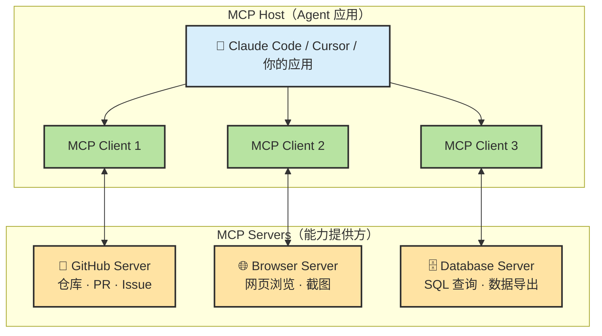
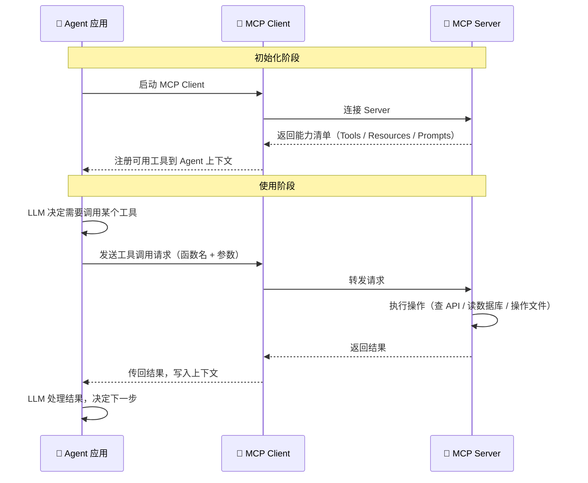
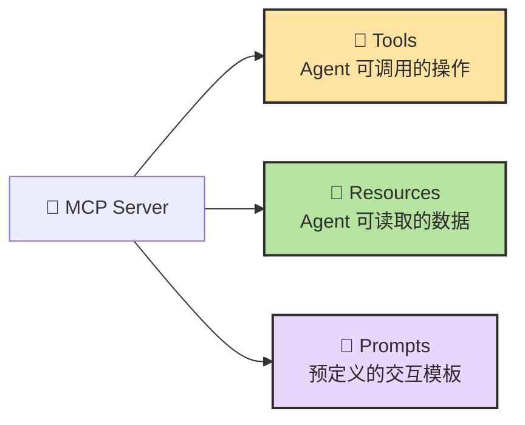
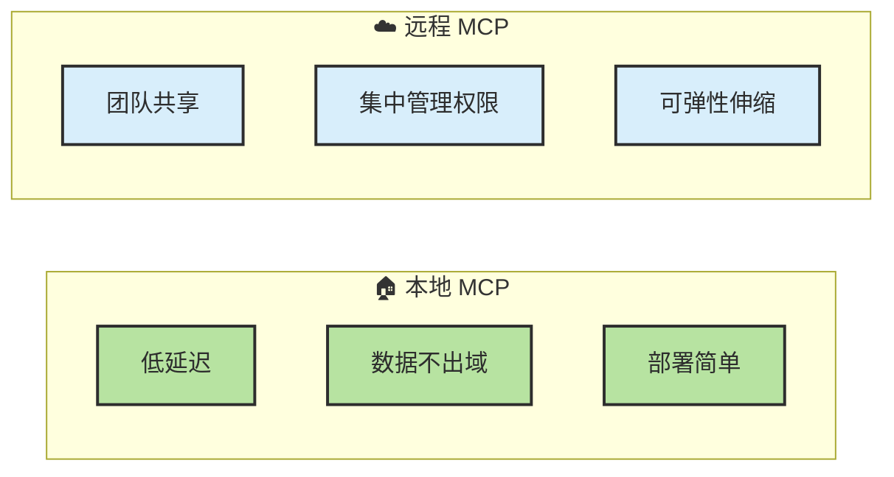
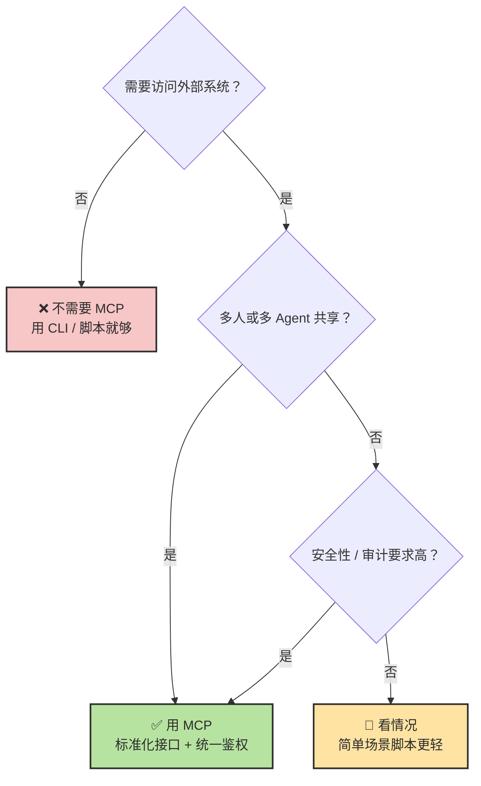
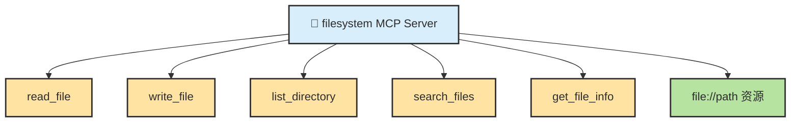
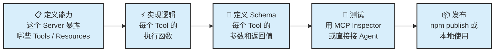
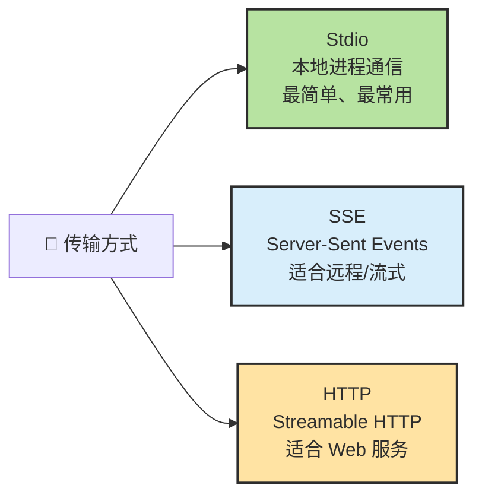

# Chapter 14 · 🔌 MCP

> 🎯 **目标**：从协议层面理解 MCP 是什么、架构怎么运作、什么时候该用、以及怎么开发一个新的 MCP Server。读完这一章，你应该能看懂一个 MCP Server 的代码结构，并判断什么场景值得把能力封装成 MCP。

## 📑 目录

- [1. MCP 的原理与架构](#1-mcp-的原理与架构)
- [2. MCP 的工作流：从连接到调用](#2-mcp-的工作流从连接到调用)
- [3. MCP 提供的三种能力](#3-mcp-提供的三种能力)
- [4. 本地 MCP vs 远程 MCP](#4-本地-mcp-vs-远程-mcp)
- [5. 什么时候该用 MCP](#5-什么时候该用-mcp)
- [6. 案例分析：一个最小 MCP Server 的结构](#6-案例分析一个最小-mcp-server-的结构)
- [7. 如何开发一个新的 MCP Server](#7-如何开发一个新的-mcp-server)

---

## 1. MCP 的原理与架构

MCP（Model Context Protocol）是一层**标准化连接协议**，用来把外部工具、资源和服务暴露给 Agent。



**核心设计**：每个 MCP Host（Agent 应用）通过一个或多个 MCP Client 与 MCP Server 通信。Client 和 Server 之间走统一协议，所以**接入 N 个 Agent × M 个工具的复杂度从 O(N×M) 降到了 O(N+M)**。

### MCP 不是什么

| MCP 不是 | MCP 是 |
|---------|--------|
| 一个模型 | Agent 与外部能力之间的连接协议 |
| Agent 框架 | 工具暴露和调用的标准接口 |
| 某家公司的专属标准 | 开放协议（Linux Foundation / AAIF 治理） |
| Function Calling 的替代品 | Function Calling 的标准化和扩展 |
| Skill | Skill 教方法，MCP 接能力——两者互补 |

---

## 2. MCP 的工作流：从连接到调用



> 💡 **关键认知**：MCP Server 在初始化时就会把自己的**能力清单**（有哪些工具、每个工具的参数 schema）发给 Client。这就是为什么每个 MCP Server 会消耗 8K-18K tokens 上下文——这些工具定义始终在 Context 里。

---

## 3. MCP 提供的三种能力



| 能力类型 | Agent 怎么用 | 典型例子 |
|---------|------------|---------|
| **Tools** | 主动调用，执行操作 | 创建 PR、执行 SQL、发送消息、浏览网页 |
| **Resources** | 读取数据，作为上下文 | 文件内容、数据库记录、API 响应、日志 |
| **Prompts** | 使用预定义模板 | 代码审查模板、Bug 报告模板、需求模板 |

---

## 4. 本地 MCP vs 远程 MCP



| 维度 | 本地 MCP | 远程 MCP |
|------|---------|---------|
| **延迟** | 极低 | 取决于网络 |
| **数据安全** | 数据不出本机 | 需要考虑传输加密 |
| **共享性** | 仅本人 | 团队 / 组织共享 |
| **适合** | 本地文件、浏览器、本地数据库 | GitHub、Jira、知识库、云服务 |

---

## 5. 什么时候该用 MCP



> ⚖️ **先问"现有 CLI / API 能不能直接解决"，再问"要不要把它标准化成 MCP"。**

---

## 6. 案例分析：一个最小 MCP Server 的结构

以 `@modelcontextprotocol/server-filesystem` 为例——一个让 Agent 对指定目录做文件操作的 MCP Server。

### 它暴露了什么



### 配置方式

```json
{
  "mcpServers": {
    "filesystem": {
      "command": "npx",
      "args": ["-y", "@modelcontextprotocol/server-filesystem", "--dir", "/path/to/project"]
    }
  }
}
```

### 调用链路

```text
Agent: "请列出 src/ 目录下的所有 TypeScript 文件"
  ↓ LLM 决定调用 list_directory 工具
  ↓ MCP Client 转发请求：{ tool: "list_directory", args: { path: "src/" } }
  ↓ MCP Server 执行 fs.readdir("src/")，过滤 .ts 文件
  ↓ 返回文件列表
  ↓ Agent 把结果写入上下文，继续推理
```

### 关键观察

| 观察 | 含义 |
|------|------|
| 它只暴露了 5 个工具 | 工具数量越少越精准 |
| 每个工具有严格的参数 schema | 确保 LLM 不会编造参数 |
| `--dir` 参数限定了可访问范围 | 安全边界在 Server 启动时就锁定 |
| 它不教 Agent"怎么审查代码" | 那是 Skill 的职责 |

---

## 7. 如何开发一个新的 MCP Server

### 开发流程



### 最小代码骨架（TypeScript）

```typescript
import { McpServer } from "@modelcontextprotocol/sdk/server/mcp.js";
import { StdioServerTransport } from "@modelcontextprotocol/sdk/server/stdio.js";
import { z } from "zod";

// 1. 创建 Server 实例
const server = new McpServer({
  name: "my-tool",
  version: "1.0.0",
});

// 2. 注册一个 Tool
server.tool(
  "hello",                              // 工具名
  "Say hello to someone",               // 描述（Agent 靠这个决定是否调用）
  { name: z.string() },                 // 参数 Schema（用 Zod 定义）
  async ({ name }) => ({                 // 执行函数
    content: [{ type: "text", text: `Hello, ${name}!` }],
  })
);

// 3. 启动 Server（stdio 传输）
const transport = new StdioServerTransport();
await server.connect(transport);
```

### 关键设计决策

| 决策 | 说明 |
|------|------|
| **工具粒度** | 一个 Tool 只做一件事。"搜索文件"和"读取文件"应该是两个 Tool，不要合成一个 |
| **描述质量** | description 是 LLM 选择工具的唯一依据——写得不好，LLM 就选错或不选 |
| **参数 Schema** | 用 Zod / JSON Schema 严格定义，不要留模糊字段 |
| **错误处理** | 返回结构化错误信息，不要抛未处理的异常 |
| **安全边界** | 在 Server 层做权限限制（如限定目录、限定 API scope），不要依赖 LLM 自觉 |

### 传输方式



| 传输 | 适合 | 复杂度 |
|------|------|:---:|
| **Stdio** | 本地 MCP，Claude Code / Cursor 默认 | 最简单 |
| **SSE** | 远程 MCP，需要流式响应 | 中等 |
| **Streamable HTTP** | Web 服务集成，RESTful 风格 | 较复杂 |

### 测试你的 MCP Server

```bash
# 方式一：用 MCP Inspector（官方调试工具）
npx @modelcontextprotocol/inspector node my-server.js

# 方式二：直接接入 Claude Code 测试
# 在 settings.json 中添加配置，重启后用 /mcp 查看状态
```

### 发布与分发

| 方式 | 说明 |
|------|------|
| **本地使用** | 直接在 `settings.json` 里指定 `command` 和 `args` |
| **npm 发布** | `npm publish`，用户通过 `npx -y your-package` 安装 |
| **团队共享** | 放在内部 npm registry 或 Git 仓库 |

---

## 📌 本章总结

- **MCP 是标准化连接层**——把 N×M 的集成复杂度降到 N+M。
- **架构**：Host（Agent 应用）→ Client → Server，三层分离。
- **三种能力**：Tools（操作）、Resources（数据）、Prompts（模板）。
- **本地 vs 远程**：本地更快更安全，远程更适合团队共享。
- **选型决策**：先 CLI，不行再 MCP。共享需求和安全需求是上 MCP 的关键触发点。
- **开发一个 MCP Server**：定义能力 → 实现逻辑 → 严格 Schema → 测试 → 发布。
- **工具粒度要小、description 要准、Schema 要严、安全边界在 Server 层锁**。

## 📚 继续阅读

- 想看方法论层怎么教 Agent 做事：回看 [Ch13 · Skill](./ch13-skill.md)
- 想看事件自动化和打包分发：[Ch15 · Command、Hook 与 Plugin](./ch15-hook-plugin.md)
- 想把连接层放回总图理解：[Ch12 · Tools](./ch12-tools.md)

---

<div align="center">

[📚 返回目录](../../README.md#tutorial-contents) | [⬅️ 上一章：Ch13 Skill](./ch13-skill.md) | [➡️ 下一章：Ch15 Command、Hook 与 Plugin](./ch15-hook-plugin.md)

</div>
