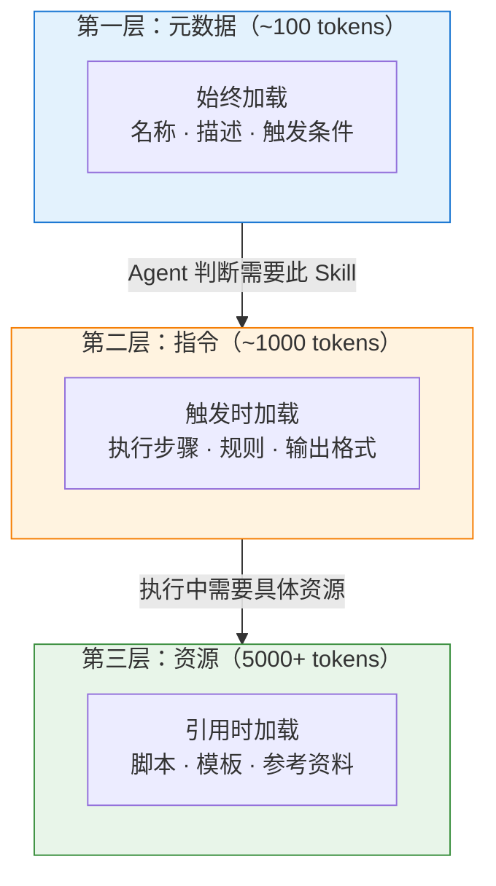
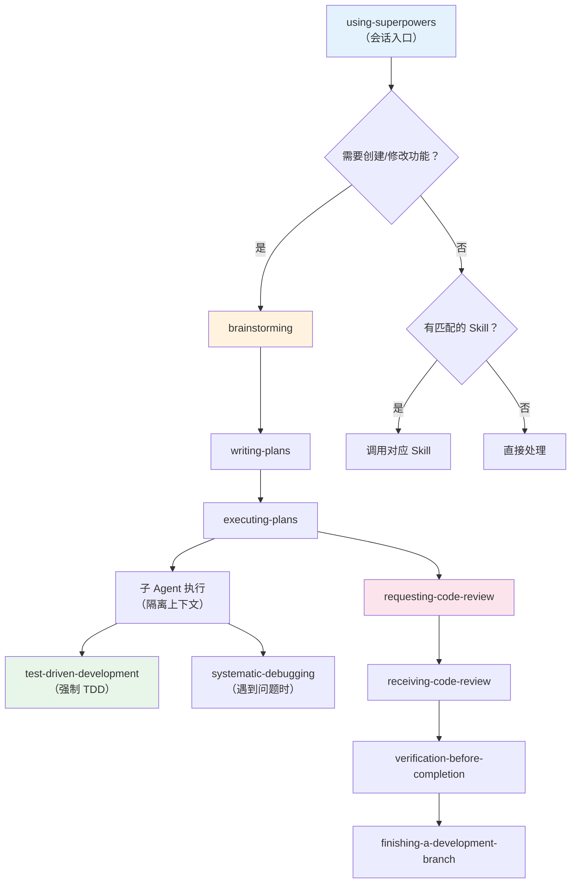

# Chapter 14 · 📝 Skill

> 目标：把 Skill 从“某个产品的附属功能”重新理解成方法论载体。读完这一章，你应该知道 Skill 最适合沉淀什么，以及它和 MCP、Command 的边界在哪。

## 目录

- [1. Skill 最本质的作用](#1-skill-最本质的作用)
- [2. Skill 最适合装什么](#2-skill-最适合装什么)
- [3. Skill 最不适合装什么](#3-skill-最不适合装什么)
- [4. Skill 和 MCP / Command 的边界](#4-skill-和-mcp--command-的边界)
- [5. 一个最小示例](#5-一个最小示例)
- [6. 什么时候该写 Skill](#6-什么时候该写-skill)

## 1. Skill 最本质的作用

Skill 的核心价值不是给 Agent 新接口，而是：

> 🧠 **把可复用的方法、流程、约束和经验沉淀下来。**

## 2. Skill 最适合装什么

最适合写进 Skill 的内容通常是：

- 任务拆解方法
- 审查清单
- 调试流程
- 写计划和验收的套路

## 3. Skill 最不适合装什么

它最不适合装的是：

- 短期临时需求
- 项目私有事实
- 直接替代工具接口

一个够用的判断是：

> 📝 **只要这段东西的价值主要来自“方法”和“顺序”，它就更像 Skill；只要价值主要来自“连上外部能力”，它就更像 MCP。**

## 4. Skill 和 MCP / Command 的边界

一句话区分：

- MCP：给 Agent 接能力
- Skill：教 Agent 怎么更稳地使用能力
- Command：给人一个显式触发这套流程的入口

所以这两者不是替代关系，而是经常配套使用。

再补一个最实用的判断：

> 🧭 **如果你希望“碰到这类任务时就自动按这套方法做”，更像 Skill；如果你希望“我输入一次命令，就执行这段固定流程”，更像 Command。**

## 5. 一个最小示例

比如“代码审查 Skill”：

- 它不会给 Agent 新的 GitHub API
- 它会告诉 Agent 审查时该优先看逻辑、边界条件、验证缺口和风险点

因此它更像方法论模块，而不是连接模块。

一个最小 `SKILL.md` 往往长这样：

```markdown
---
name: review
description: 用固定清单审查代码改动
---

## 当用户要求 review 时

1. 先读 diff 和相关测试
2. 优先检查逻辑、边界、风险与验证缺口
3. findings 按严重度排序输出
```

## 6. 什么时候该写 Skill

这些场景最适合沉淀成 Skill：

- 你已经反复做过同类任务
- 你发现“流程”比“灵感”更重要
- 你希望团队里不同人和不同 Agent 都按同一套路做事

这些场景不一定要急着写 Skill：

- 任务只做一次
- 规则还不稳定
- 你现在连问题本身都还没想清楚

## 📌 本章总结

- Skill 是方法论载体，不是能力接口。
- 它最适合沉淀流程、检查清单、调试套路和审查方法。
- 项目事实、临时需求和外部连接能力，不该硬塞进 Skill。
- 真正值得写成 Skill 的，通常都是“会重复出现，而且步骤相对稳定”的工作。

## 📚 继续阅读

- 想看“接能力”和“教方法”怎么配合：回看 [Ch13 · MCP](./ch13-mcp.md) 和 [Ch12 · Tools](./ch12-tools.md)
- 想继续看事件自动化和打包分发：继续看 [Ch15 · Hook](./ch15-hook.md) 与 [Ch16 · Plugin](./ch16-plugin.md)

---

<div align="center">

[📚 返回目录](../../README.md#tutorial-contents) | [⬅️ 上一章：Ch13 MCP](./ch13-mcp.md) | [➡️ 下一章：Ch15 Hook](./ch15-hook.md)

</div>

---

<details>
<summary><span style="color: #e67e22; font-weight: bold;">📝 进阶：Skill 结构详解与三层渐进加载</span></summary>

### SKILL.md 结构解剖

一个 Skill 就是一个包含 `SKILL.md` 文件的目录。`SKILL.md` 使用 YAML frontmatter 定义元数据，正文是 Markdown 格式的指令。

```
my-skill/
├── SKILL.md          # 核心：触发条件、工作流程、规则
├── scripts/          # 确定性脚本（可选）
├── templates/        # 可复用模板（可选）
└── references/       # 补充资料（可选）
```

一个典型的 `SKILL.md` 示例：

```markdown
---
name: code-review
description: 使用标准清单进行代码审查
---

## 当用户要求代码审查时

1. 先阅读变更的所有文件
2. 按以下清单逐项检查：
   - [ ] 是否有未处理的错误
   - [ ] 是否有安全漏洞（注入、XSS 等）
   - [ ] 是否有性能问题
   - [ ] 命名是否清晰
   - [ ] 是否有足够的测试覆盖
3. 输出审查报告，按严重性分级
```

Frontmatter 可控制触发行为：

```yaml
---
name: my-skill
description: 做某事的标准流程
user-invocable: true           # 用户可以用 /my-skill 调用（默认 true）
disable-model-invocation: false # 是否禁止 Agent 自动触发（默认 false）
---
```

### 三层渐进加载机制

Skill 相比传统 System Prompt 最大的优势是**渐进式披露**——不是一次性加载所有内容，而是按需逐层展开：



**对比传统做法**：把所有规则写进 System Prompt（可能 40,000 tokens），每次对话全量加载。Skill 通过渐进加载，可以将 token 消耗降低 50-80%。

### 编写 Skill 的原则

| 原则 | 说明 | 反例 |
|------|------|------|
| **聚焦单一场景** | 一个 Skill 只解决一类问题 | 一个 Skill 试图覆盖"代码审查 + 测试 + 部署" |
| **步骤明确** | 给 Agent 清晰的执行步骤 | "请认真审查代码" |
| **控制上下文** | Skill 本身不应引入大量噪音 | SKILL.md 写了 2000 行 |
| **可测试** | 能明确判断 Skill 是否被正确执行 | 没有明确的输出格式要求 |
| **迭代优化** | 根据实际使用效果持续调整 | 写完就再也不改 |

### 减少上下文噪音的技巧

- 只写对该类任务**稳定成立**的规则
- 把长篇资料放进 `references/`，由 Agent 按需引用
- 把可执行逻辑交给 `scripts/`
- 把格式要求交给 `templates/`
- 用简短的触发描述（description），不要把整个工作流塞进描述字段

### Google 总结的 5 种 Skill 设计模式

| 模式 | 一句话定义 |
|------|----------|
| **工具包装器（Tool Wrapper）** | 按需为 Agent 加载特定库的专家知识 |
| **生成器（Generator）** | 模板 + 风格指南驱动结构化输出 |
| **审查器（Reviewer）** | 基于清单的自动化审计与分级反馈 |
| **反向提问（Inversion）** | 强制门控——先采访用户，再行动 |
| **流水线（Pipeline）** | 有硬性检查点的严格顺序工作流 |

五种模式可以组合：例如 Inversion（收集需求） -> Generator（生成初稿） -> Reviewer（质量审查） -> Pipeline（串联全流程）。

</details>

<details>
<summary><span style="color: #e67e22; font-weight: bold;">🔧 进阶：Superpowers 7 阶段工作流实战</span></summary>

### Superpowers 7 阶段工作流实战演示

> 场景：用 Agent 开发一个新的 Skill（Changelog 生成器），完整体验 superpowers 7 阶段工作流。

这是一个「meta 案例」——**用 Agent 来给 Agent 写 Skill**。这正好体现了 Skill 体系的递归价值。

**第 1 阶段：Brainstorming（需求澄清）**

```
/superpowers:brainstorm

我想为项目添加一个"changelog 生成器" Skill。
```

superpowers 的 brainstorming Skill 会用苏格拉底式提问来帮你厘清需求：

- Changelog 覆盖哪些类型的变更？（feature / fix / breaking change / ...）
- 输入来源是什么？（Git log? Conventional Commits?）
- 输出格式？（Markdown? 按版本分组?）
- 是否需要自动分类？
- 目标受众是开发者还是最终用户？

> 很多人会跳过这一步直接让 Agent 写代码。但 superpowers 的设计哲学是：**写代码前先把需求想清楚，比写出来再改要便宜得多。**

**第 2 阶段：Writing Plans（计划）**

```
/superpowers:writing-plans
```

Agent 会基于 brainstorming 阶段的输出，生成分步实现计划——具体到会创建哪些文件、每个文件的作用、实现的先后顺序和验证标准。

**第 3 阶段：Executing Plans（执行）**

```
/superpowers:executing-plans
```

superpowers 会在**子 Agent** 中执行计划，带有审查检查点。执行过程中遵循 TDD：先写测试，再写实现。

**第 4-5 阶段：Code Review（审查与修正）**

执行完成后，`requesting-code-review` Skill 自动激活：

- 对照计划审查实现
- 按严重性分级报告问题（Critical / Major / Minor）
- Critical 问题会阻塞进度直到修复

**第 6 阶段：Verification（验证）**

`verification-before-completion` Skill 确保：
- 所有测试通过
- 构建成功
- 没有遗留的 TODO 或 FIXME

**第 7 阶段：Finishing（收尾）**

`finishing-a-development-branch` Skill 引导你选择合并到主分支、创建 PR 或继续迭代。

### Skill 间的协作机制

superpowers 的 Skills 不是孤立的，它们通过 `using-superpowers` 入口 Skill 来协调：



### 经验沉淀

1. **Brainstorm** -- 不要跳过，需求澄清比写代码重要
2. **Plan** -- 计划要具体到文件和步骤
3. **Execute** -- 用 TDD，先测试后实现
4. **Review** -- 让 Agent 对照计划审查
5. **Verify** -- 必须运行验证命令，不能只"看起来对"
6. **Finish** -- 明确收尾方式（merge / PR / 继续迭代）

### superpowers 为什么值得学习

superpowers 不是「一堆快捷命令的集合」，而是一套**完整的软件开发方法论**被编码成了 Skill。核心信念：

1. **Agent 不应该一看到任务就开始写代码** -- 先 brainstorm，再 plan，最后才 execute
2. **TDD 不是可选的** -- RED->GREEN->REFACTOR 是强制流程
3. **审查内建于流程中** -- 不是做完才审查，而是每个微任务完成后都审查
4. **验证必须有证据** -- 不允许 Agent 声称"已完成"而没有运行验证命令

### 适合什么项目

| 适合 | 不太适合 |
|------|---------|
| 需要多步骤实现的功能开发 | 一行代码的快速修复 |
| 团队希望统一开发流程 | 个人随意探索和原型 |
| 代码质量要求高的项目 | 一次性脚本和 demo |
| 想要学习工程最佳实践 | 已有成熟流程的团队（可能冲突） |

</details>
