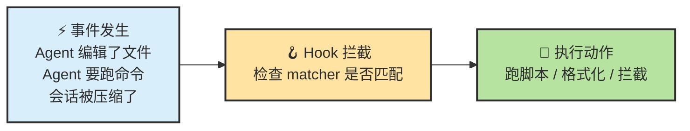
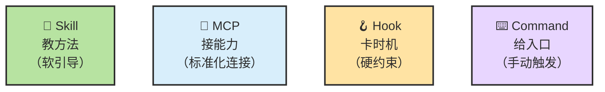
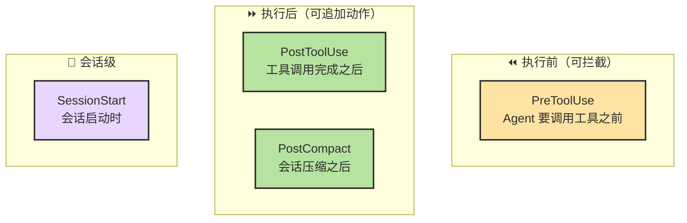
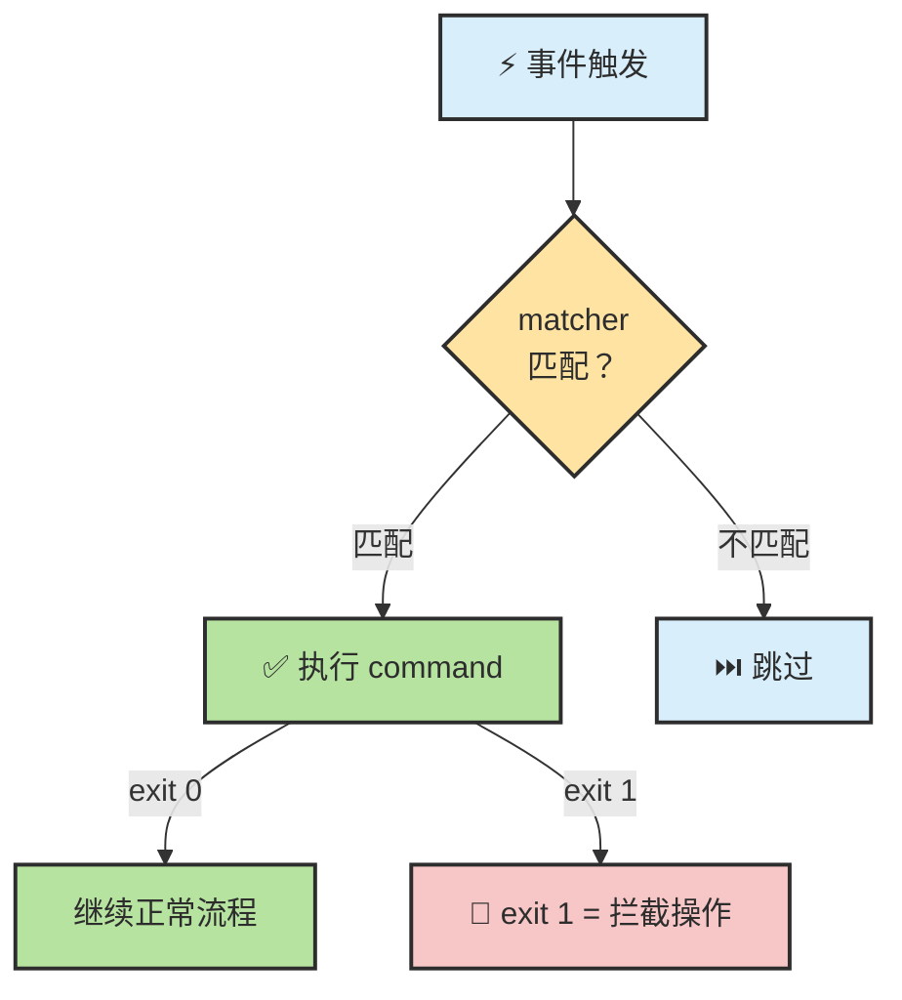
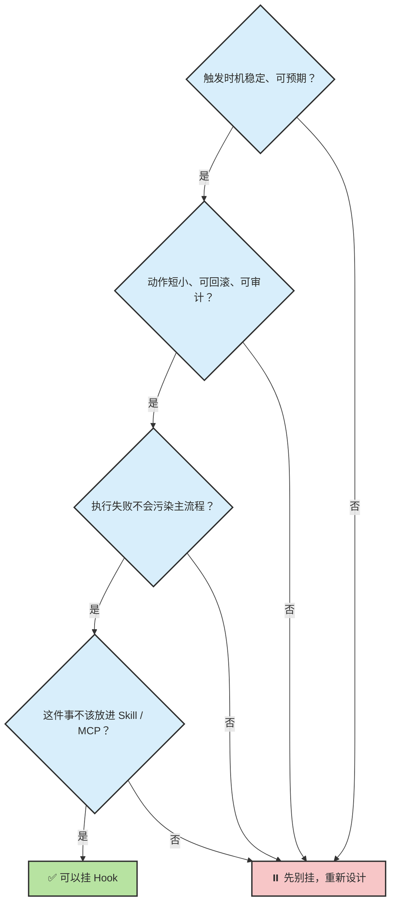
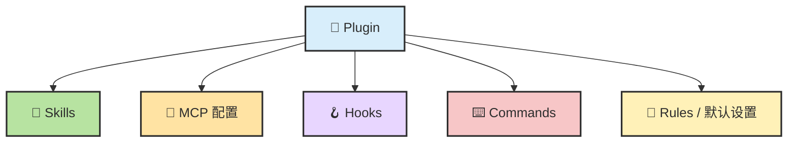
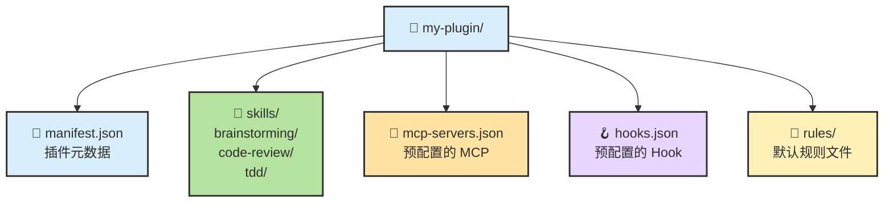
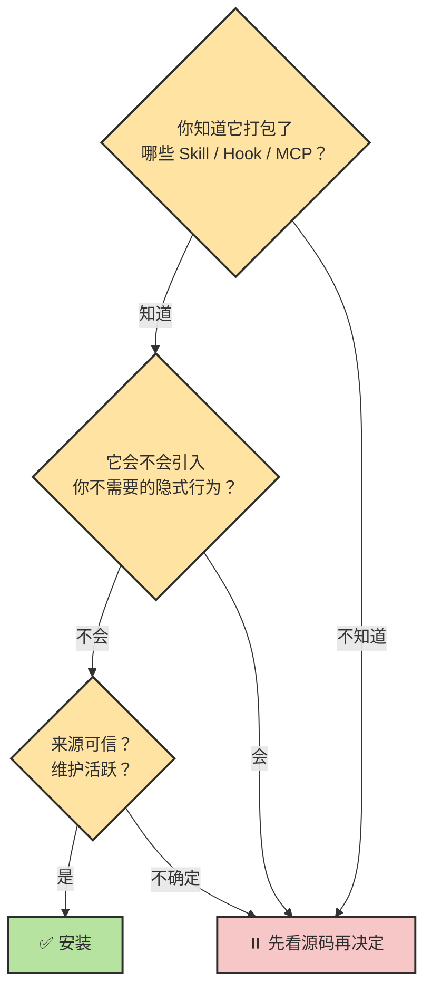
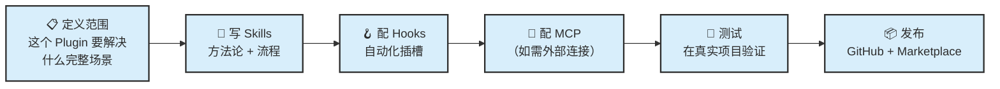

# Chapter 15 · ⌨️ Command、🪝 Hook 与 🧰 Plugin

> 🎯 **目标**：理解 Command（手动触发入口）、Hook（事件自动化）和 Plugin（打包分发）的原理、配置方式和开发方法。这三者是工具栈六层中偏"工程化交付"的三层——Command 给人快捷入口，Hook 在流程中卡时机，Plugin 把一切打包分发。

## 📑 目录

**Command 篇**
- [1. Command 的原理：可复用的手动入口](#1-command-的原理可复用的手动入口)
- [2. 如何开发 Command](#2-如何开发-command)

**Hook 篇**
- [3. Hook 的原理：事件驱动的自动化插槽](#3-hook-的原理事件驱动的自动化插槽)
- [4. Hook 的事件时机与执行流程](#4-hook-的事件时机与执行流程)
- [5. 如何配置和开发 Hook](#5-如何配置和开发-hook)

**Plugin 篇**
- [6. Plugin 的原理：打包与分发层](#6-plugin-的原理打包与分发层)
- [7. Plugin 的结构与安装](#7-plugin-的结构与安装)
- [8. 如何开发一个 Plugin](#8-如何开发一个-plugin)

---

# Command 篇

## 1. Command 的原理：可复用的手动入口

Command 是最简单的扩展形态——一个 Markdown 文件就是一条斜杠命令。你手动输入 `/command-name`，Agent 按文件里的指令执行。


### Command vs Skill vs Hook

| 维度 | Command | Skill | Hook |
|------|---------|-------|------|
| **触发方式** | 用户手动 `/xxx` | Agent 自动或自然语言 | 事件自动触发 |
| **文件形式** | 单个 `.md` 文件 | 目录 + `SKILL.md` | settings.json 配置 |
| **核心能力** | 可注入实时 shell 输出 | 可渐进加载资源 | 可拦截操作 |
| **适合** | 固定流程、一键操作 | 方法论、上下文感知 | 机械自动化 |

### 存放位置

| 位置 | 命令前缀 | 作用域 |
|------|---------|--------|
| `.claude/commands/` | `/project:xxx` | 项目级，提交 Git，团队共享 |
| `~/.claude/commands/` | `/user:xxx` | 个人级，所有项目可用 |

---

## 2. 如何开发 Command

### 核心能力：shell 输出注入

用 `` !`shell command` `` 语法在 Agent 看到 prompt 之前执行 shell 命令并嵌入输出：

```markdown
---
description: Review the current branch diff before merging
---
## 待审查的改动

!`git diff --name-only main...HEAD`

## 详细 Diff

!`git diff main...HEAD`

请按以下清单审查：逻辑错误、安全漏洞、缺失测试、命名一致性。
按文件逐个给出具体反馈，按严重性分级。
```

### 传递参数

用 `$ARGUMENTS` 接收命令后面的文本：

```markdown
---
description: Investigate and fix a GitHub issue
argument-hint: [issue-number]
---
请查看 Issue #$ARGUMENTS：

!`gh issue view $ARGUMENTS`

理解问题 → 定位代码 → 给修复方案（不直接改） → 确认后执行 → 跑测试验证。
```

使用：`/project:fix-issue 234`

### 开发原则

| 原则 | 说明 |
|------|------|
| **description 要精准** | 这是用户在 `/` 补全菜单里看到的唯一说明 |
| **用 shell 注入实时数据** | 不要让 Agent 自己去跑 git diff，直接注入更快更准 |
| **保持聚焦** | 一个 Command 只做一件事 |
| **考虑参数化** | 用 `$ARGUMENTS` 让 Command 更通用 |

---

# Hook 篇

## 3. Hook 的原理：事件驱动的自动化插槽

Hook 不负责推理，不负责连接外部服务，而是负责在**特定事件发生时自动触发一段短动作**。



### Hook vs 其他扩展层



> 🪝 **Hooks 做硬约束，Skill 做软引导。** Hook 适合"固定时机 + 短动作 + 明确副作用"；需要复杂推理时交给 Skill 或 Agent 本体。

---

## 4. Hook 的事件时机与执行流程

Claude Code 支持的 Hook 事件时机：



| 事件 | 时机 | 典型用途 |
|------|------|---------|
| **PreToolUse** | Agent 调用工具**之前** | 拦截危险操作、保护敏感文件 |
| **PostToolUse** | 工具调用完成**之后** | 自动格式化、记录日志 |
| **PostCompact** | `/compact` **之后** | 备份摘要、写入 HANDOFF.md |
| **SessionStart** | 会话**启动时** | 注入环境信息（分支名、最近 commit） |

### 执行逻辑



> 💡 **PreToolUse 的 Hook 如果 exit 1，可以直接阻止工具调用**——这是比 CLAUDE.md 里的规则更硬的约束。

---

## 5. 如何配置和开发 Hook

### 配置方式

Hook 配置在 `.claude/settings.json` 的 `hooks` 字段里：

```json
{
  "hooks": {
    "<事件名>": [
      {
        "matcher": "<匹配条件>",
        "hooks": [
          {
            "type": "command",
            "command": "<要执行的 shell 命令>"
          }
        ]
      }
    ]
  }
}
```

### 三个最实用的 Hook

**1. 文件修改后自动格式化**

```json
{
  "hooks": {
    "PostToolUse": [{
      "matcher": "Edit|Write",
      "hooks": [{
        "type": "command",
        "command": "npx prettier --write $CLAUDE_FILE_PATH 2>/dev/null || true"
      }]
    }]
  }
}
```

**2. 保护敏感文件不被修改**

```json
{
  "hooks": {
    "PreToolUse": [{
      "matcher": "Edit|Write",
      "hooks": [{
        "type": "command",
        "command": "echo $CLAUDE_FILE_PATH | grep -qE '\\.(env|pem|key)$' && echo 'BLOCK: 禁止修改敏感文件' && exit 1 || true"
      }]
    }]
  }
}
```

**3. 会话启动时注入环境信息**

```json
{
  "hooks": {
    "SessionStart": [{
      "matcher": "",
      "hooks": [{
        "type": "command",
        "command": "echo '当前分支: '$(git branch --show-current)' | 最近commit: '$(git log --oneline -1)"
      }]
    }]
  }
}
```

### 开发 Hook 的检查清单

在挂一个新 Hook 之前，过这四个问题：



### 可用的环境变量

| 变量 | 说明 | 可用事件 |
|------|------|---------|
| `$CLAUDE_FILE_PATH` | 被操作的文件路径 | PostToolUse(Edit/Write) |
| `$CLAUDE_TOOL_NAME` | 被调用的工具名 | PreToolUse / PostToolUse |

---

# Plugin 篇

## 6. Plugin 的原理：打包与分发层

Plugin 不是"比 Skill / MCP 更高一层的智能"，而是把**多种零散能力打包成一个可安装的整体**。



**Plugin 真正节省的不是推理成本，而是：**

| 成本 | 没有 Plugin | 有 Plugin |
|------|-----------|---------|
| 新成员装配 | 手动装 Skill + 配 MCP + 写 Hook + ... | `/install-plugin` 一键搞定 |
| 团队默认配置 | 每人复制一遍 | 装完即用 |
| 多工具协调 | 各自独立配置，容易遗漏 | 打包好的一致性 |

---

## 7. Plugin 的结构与安装

### 典型文件结构



### 安装方式

```bash
# Claude Code
/install-plugin obra/superpowers
/install-plugin tanweai/pua

# 查看已安装的 Plugin
/customize  # → Plugin 管理面板
```

### 安装前的检查清单



> 🔍 **先把 Plugin 当成"会修改你工作系统的配置包"，而不是"装上就更强"的魔法增强。**

---

## 8. 如何开发一个 Plugin

### 开发流程



### 最小 Plugin 结构

```text
my-team-plugin/
├── manifest.json              # 插件元数据
│   {
│     "name": "my-team-plugin",
│     "version": "1.0.0",
│     "description": "团队工程规范一键安装",
│     "skills": ["skills/*"],
│     "hooks": "hooks.json",
│     "rules": ["rules/*"]
│   }
│
├── skills/
│   └── code-review/
│       └── SKILL.md           # 代码审查 Skill
│
├── hooks.json                 # Hook 配置
│   {
│     "PostToolUse": [{
│       "matcher": "Edit|Write",
│       "hooks": [{ "type": "command", "command": "npx prettier --write $CLAUDE_FILE_PATH" }]
│     }]
│   }
│
└── rules/
    └── team-conventions.md    # 团队编码规范
```

### 关键设计原则

| 原则 | 说明 |
|------|------|
| **透明** | 用户能清楚看到 Plugin 装了什么、改了什么 |
| **可卸载** | 卸载后系统回到原来的状态 |
| **最小依赖** | 不强制引入用户不需要的 MCP / Hook |
| **文档完整** | README 说明每个组件的作用 |
| **版本管理** | 有明确的版本号和 changelog |

### 发布与分发

| 方式 | 说明 |
|------|------|
| **GitHub 仓库** | 用户通过 `/install-plugin owner/repo` 安装 |
| **Anthropic Marketplace** | 提交审核后上架，用户可发现和安装 |
| **团队内部** | 放在内部 Git 仓库，团队成员通过 URL 安装 |

### Plugin 不是越多越好

常见风险：

- **供应链风险**：来源不受控的 Plugin 可能包含恶意 Hook
- **边界不透明**：装了太多 Plugin 后，不知道哪条行为是谁触发的
- **隐式冲突**：多个 Plugin 的 Hook 可能在同一事件上冲突

> 🧱 **更稳的做法**：只保留少量高频、可信、可审计的 Plugin。团队真正长期依赖的能力，最终应该沉淀成清晰的 Skill / Hook / MCP 配置，而不是只靠黑盒插件。

---

## 📌 本章总结

**Hook：**
- 事件驱动的自动化插槽——固定时机 + 短动作 + 明确副作用。
- PreToolUse 可以**拦截**危险操作，比 CLAUDE.md 规则更硬。
- 开发前过四问：时机稳定？动作短小？失败不污染？不该用 Skill/MCP？

**Plugin：**
- 打包分发层——把 Skill + MCP + Hook + Command + Rules 装成一键安装包。
- 节省的不是推理成本，而是团队装配、复制和协调成本。
- 安装前先看内容，发布时保持透明和可卸载。

## 📚 继续阅读

- 想看这些能力在真实工程流里怎么组合：[Ch17 · Agent 错误用法](./ch17-agent-failure-modes.md)
- 想回到工具栈总览：[Ch12 · Tools](./ch12-tools.md)

---

<div align="center">

[📚 返回目录](../../README.md#tutorial-contents) | [⬅️ 上一章：Ch14 MCP](./ch14-mcp.md) | [➡️ 下一章：Ch17 Agent 错误用法](./ch17-agent-failure-modes.md)

</div>
