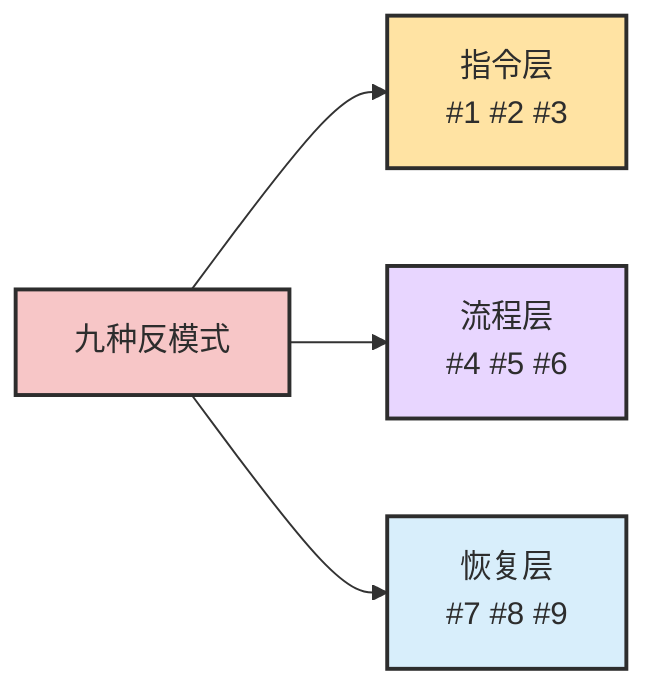
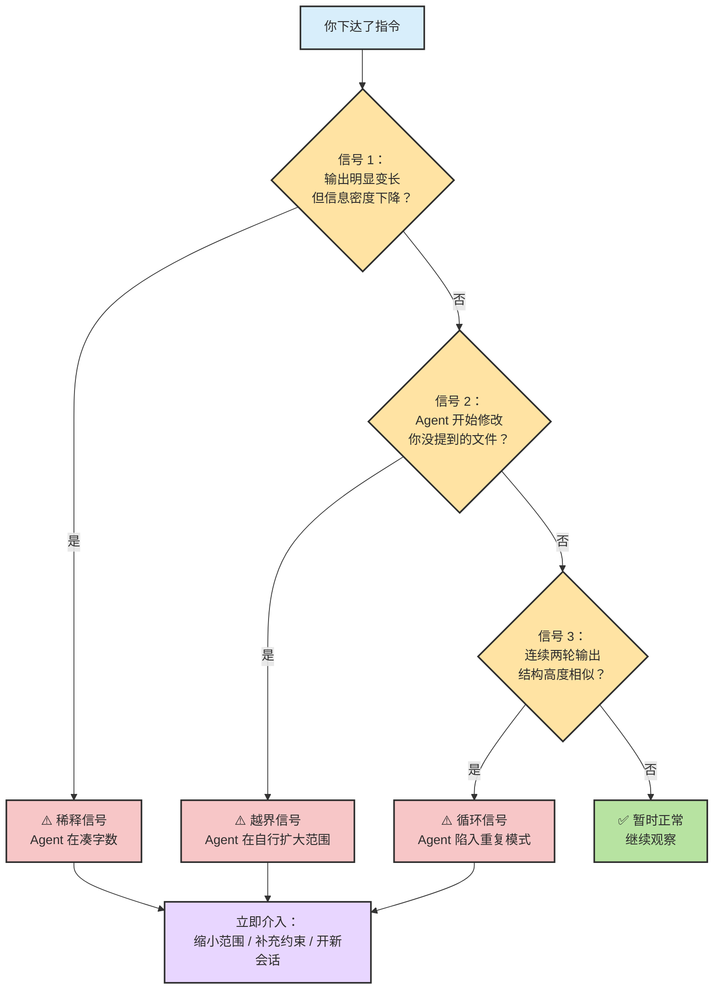
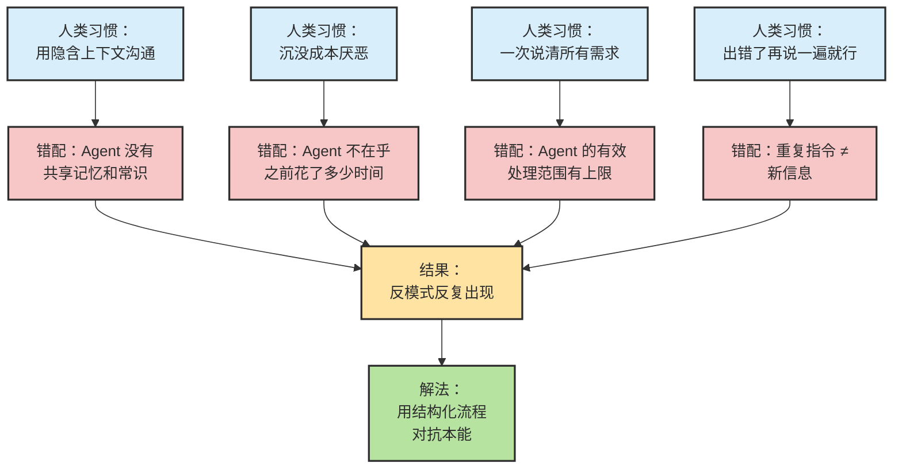
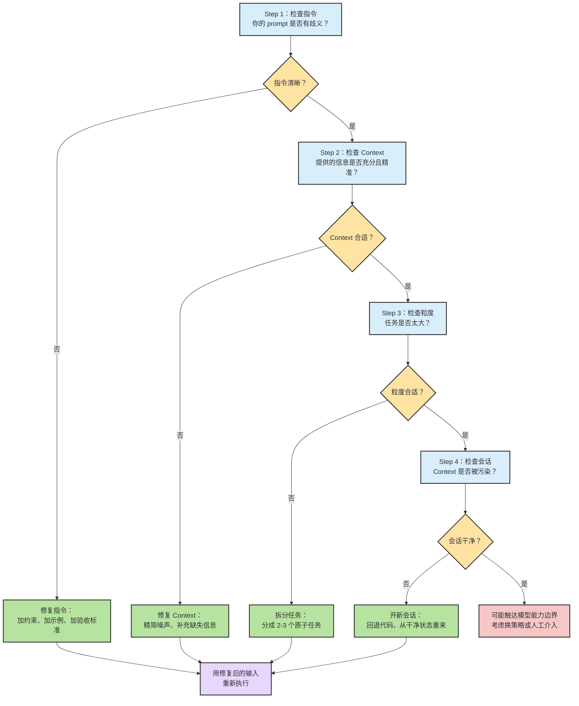
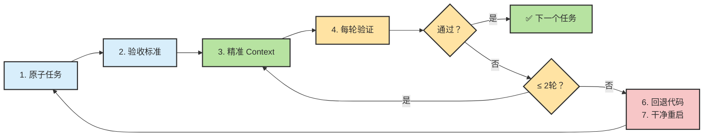

# Chapter 17 · 🚨 Agent 错误用法

> 🎯 **目标**：列举最常见的 Agent 使用反模式，给出预警信号、诊断方法和恢复动作。读完这一章，你应该知道如何在 Agent 「跑偏」的第一时间识别问题，并用最小成本把项目拉回正轨。

> 📌 **和其他章节的分工**：本章讲「哪些做法会让 Agent 出错，以及怎么救」；Ch07 讲 LLM 与 Agent 的本质区别；Ch16 讲 Agent 的基本操作原则；Ch18 讲 XDD 开发方法链中如何预防这些错误。

## 📑 目录

- [17.1 先校准直觉：你以为的 vs 实际的](#171-先校准直觉你以为的-vs-实际的)
- [17.2 九种 Agent 反模式](#172-九种-agent-反模式)
- [17.3 三个预警信号：Agent 正在跑偏](#173-三个预警信号agent-正在跑偏)
- [17.4 真实翻车案例](#174-真实翻车案例)
- [17.5 为什么这些错误会反复出现](#175-为什么这些错误会反复出现)
- [17.6 四步诊断法](#176-四步诊断法)
- [17.7 恢复动作清单](#177-恢复动作清单)
- [17.8 七条操作原则](#178-七条操作原则)
- [📌 本章总结](#-本章总结)
- [📚 继续阅读](#-继续阅读)

---

## 17.1 先校准直觉：你以为的 vs 实际的

Agent 不是魔法。很多新手对 Agent 能力的预期来自 ChatGPT 的对话体验——但 Agentic Coding 的运行方式和「聊天」截然不同。下表帮你快速校准。

| 常见直觉 | 更接近现实 |
|:---|:---|
| 「Agent 理解了我的意图，它会做对的」 | Agent 只执行 prompt 里的字面指令，意图要靠结构传递 |
| 「出错就多试几次，总会对」 | 没有新信息的重试 = 随机游走，成功率不升反降 |
| 「给的 context 越多越好」 | 超过有效窗口的 context 会被截断或稀释，精准 > 海量 |
| 「Agent 一次能搞定整个需求」 | 单轮最佳粒度 ≈ 一个函数/一个测试/一个配置块 |
| 「报错了就让 Agent 自己修」 | Agent 修 bug 的成功率取决于你给的诊断信息质量 |
| 「我的指令已经够清楚了」 | 人觉得清楚 ≠ 对 LLM 无歧义，需要验收标准辅助 |
| 「Agent 会记住之前所有对话」 | Context window 有限，跨轮次记忆衰减严重 |

> 🧠 **核心认知**：Agent 出错的根源几乎从不是「模型太笨」，而是「人给的输入不够结构化」。你的指令质量决定了 Agent 的输出上限。

---

## 17.2 九种 Agent 反模式

下面是 Agentic Coding 中最常见的九种错误用法。每种反模式都附有错误示范与正确做法的对比。

### 反模式总览



### #1 许愿式 Prompt

| 维度 | 说明 |
|:---|:---|
| **表现** | 「帮我做一个用户管理系统」—— 一句话扔给 Agent，不给约束 |
| **根因** | 把 Agent 当人类同事，默认它能脑补上下文 |
| **后果** | Agent 用自己的「想象」填充空白，产出偏离预期 |

> ❌ **错误示范**
> ```
> 帮我写一个登录功能
> ```

> ✅ **正确做法**
> ```
> 在 src/auth/login.ts 中实现登录函数：
> - 输入：email (string), password (string)
> - 使用 bcrypt 校验密码
> - 成功返回 JWT token，失败抛出 AuthError
> - 写对应的单元测试到 tests/auth/login.test.ts
> ```

### #2 Context 过载

| 维度 | 说明 |
|:---|:---|
| **表现** | 把整个 codebase、设计文档、会议记录一股脑塞进 prompt |
| **根因** | 误以为「信息越全，Agent 越准」 |
| **后果** | 关键信息被噪声淹没，Agent 抓不到重点 |

> ❌ **错误示范**
> ```
> 这是我们的 README（2000行）、设计文档（500行）、
> 所有源码（50个文件）。请修复登录 bug。
> ```

> ✅ **正确做法**
> ```
> Bug：登录时密码正确但返回 401
> 相关文件：src/auth/login.ts (第 42-58 行)
> 错误日志：[粘贴精简日志]
> 预期行为：密码匹配时返回 200 + token
> ```

### #3 缺少验收标准

| 维度 | 说明 |
|:---|:---|
| **表现** | 只描述「做什么」，不描述「怎样算做对了」 |
| **根因** | 人脑里有隐含标准，但没有外化给 Agent |
| **后果** | Agent 产出「形似神不似」的代码，返工率高 |

> ❌ **错误示范**
> ```
> 优化这个查询的性能
> ```

> ✅ **正确做法**
> ```
> 优化 getUserOrders 查询：
> - 当前：平均 1200ms（附 profile 截图）
> - 目标：< 200ms
> - 约束：不改表结构，可以加索引
> - 验证：运行 npm run bench:orders，P95 < 200ms
> ```

### #4 跳过验证循环

| 维度 | 说明 |
|:---|:---|
| **表现** | Agent 一口气生成 500 行代码，人直接 commit 不测试 |
| **根因** | 「既然用了 Agent，就不用我检查了」 |
| **后果** | Bug 被打包进后续迭代，越积越多 |

> ❌ **错误示范**
> Agent 输出 → 直接 `git add . && git commit`

> ✅ **正确做法**
> Agent 输出 → 运行测试 → 人工 review 关键逻辑 → 确认后 commit

### #5 单轮贪多

| 维度 | 说明 |
|:---|:---|
| **表现** | 一个 prompt 里要求完成多个不相关任务 |
| **根因** | 想减少交互轮次，追求「一步到位」 |
| **后果** | 任务间互相干扰，每个都做不好 |

> ❌ **错误示范**
> ```
> 帮我：1) 重构用户模型  2) 添加支付功能  3) 修复邮件 bug  4) 写部署脚本
> ```

> ✅ **正确做法**
> 每轮一个原子任务，完成并验证后再开下一个。

### #6 忽略 Agent 的不确定性信号

| 维度 | 说明 |
|:---|:---|
| **表现** | Agent 回复「我不确定这样是否正确」「可能需要...」，人直接忽略继续 |
| **根因** | 把 Agent 的犹豫当客气话 |
| **后果** | Agent 在不确定状态下硬做，输出质量骤降 |

> ❌ **错误示范**
> Agent: "I'm not sure about the database schema..."  
> 人: "没事，继续"

> ✅ **正确做法**
> 停下来，补充 Agent 缺少的信息，或缩小任务范围到 Agent 有把握的部分。

### #7 无信息重试

| 维度 | 说明 |
|:---|:---|
| **表现** | Agent 做错了 → 「再试一次」 → 还是错 → 「再试一次」 |
| **根因** | 期望随机波动能碰出正确答案 |
| **后果** | 浪费 token 和时间，Context 被错误尝试污染 |

> ❌ **错误示范**
> ```
> 这不对，重新做一遍
> ```

> ✅ **正确做法**
> ```
> 上一版的问题：函数在 items 为空数组时返回 null 而非空列表。
> 请修复这个边界情况，其他逻辑不变。
> ```

### #8 Context 中毒后继续

| 维度 | 说明 |
|:---|:---|
| **表现** | 对话中已经积累了多轮错误输出，但继续在同一会话里修补 |
| **根因** | 不舍得「浪费」之前的对话历史 |
| **后果** | 错误输出成为后续推理的「事实基础」，越修越偏 |

> ❌ **错误示范**
> 在已经产生 3 轮错误的会话里继续发第 4 轮修复指令

> ✅ **正确做法**
> 开新会话，只带入正确的代码和精准的任务描述，从干净 context 重新开始。

### #9 不回退代码

| 维度 | 说明 |
|:---|:---|
| **表现** | Agent 的修改已经把代码搞乱了，但不愿意 `git reset` |
| **根因** | 沉没成本心理：「已经改了这么多，回退太可惜」 |
| **后果** | 在污染的代码基础上继续开发，债务指数级增长 |

> ❌ **错误示范**
> 「虽然代码有点乱，但大部分能用，就这样吧」

> ✅ **正确做法**
> ```bash
> git stash  # 或 git reset --hard HEAD~3
> # 从干净状态重新开始，用更好的 prompt
> ```

---

## 17.3 三个预警信号：Agent 正在跑偏

不是每次 Agent 出错都会报 error。很多时候它会「自信地走向悬崖」。以下三个信号帮你在灾难发生前踩刹车。



| 预警信号 | 具体表现 | 你应该做什么 |
|:---|:---|:---|
| **稀释信号** | 输出从 30 行暴增到 200 行；出现大段注释、重复解释 | 停下来，检查 prompt 是否有歧义，缩小任务范围 |
| **越界信号** | Agent 修改了你没提到的文件；引入了新依赖；改了不相关的配置 | 立即 `git diff` 审查，回退越界部分 |
| **循环信号** | 两轮输出只有微小差异；反复在同一个错误上打转 | 开新会话，补充 Agent 缺少的关键信息 |

> 🧭 **经验法则**：看到任何一个信号，最多再给 Agent 一轮机会。如果第二轮仍然触发信号，立即停止并切换策略。

---

## 17.4 真实翻车案例

以下案例来自真实的 Agentic Coding 实践，名称和细节已做脱敏处理。

### 案例 1：「帮我重构整个项目」

| 维度 | 内容 |
|:---|:---|
| **场景** | 开发者让 Agent 一次性重构一个 50 文件的 Express 项目为 NestJS |
| **指令** | 「把这个项目从 Express 迁移到 NestJS，保持所有功能不变」 |
| **结果** | Agent 重写了 30 个文件后 context window 耗尽，剩余 20 个文件未处理，已改文件之间接口不一致 |
| **触发的反模式** | #1 许愿式 Prompt + #5 单轮贪多 |
| **正确做法** | 按模块拆分（auth → user → order），每个模块一轮，每轮包含迁移 + 测试 |

> 🔍 **分析**：这个案例的核心问题不是 Agent 能力不足，而是任务粒度远超 Agent 的有效处理范围。即使是最强的模型，在单轮中处理 50 个文件的跨框架迁移也注定失败。

### 案例 2：「错误日志里修 bug」

| 维度 | 内容 |
|:---|:---|
| **场景** | 测试报错，开发者把完整的 300 行 stack trace 扔给 Agent |
| **指令** | 「这个测试挂了，帮我修」 |
| **结果** | Agent 修了表层的 TypeError，但真正的 bug 在数据库连接配置里，Agent 没看到也没问 |
| **触发的反模式** | #2 Context 过载 + #3 缺少验收标准 |
| **正确做法** | 先自己定位到可疑区域，然后给 Agent：精简错误信息 + 相关代码 + 预期行为 |

> 🔍 **分析**：300 行 stack trace 里只有 3 行是关键的。人需要先做「信息过滤」，Agent 才能做「问题修复」。诊断和修复是两个不同的任务。

### 案例 3：「越修越烂的死循环」

| 维度 | 内容 |
|:---|:---|
| **场景** | Agent 实现的函数有一个边界 bug，开发者在同一会话里连续修了 8 轮 |
| **指令** | 反复说「这还是不对」「再试一次」 |
| **结果** | 到第 8 轮时，函数从最初的 20 行膨胀到 150 行，引入了 3 个新 bug |
| **触发的反模式** | #7 无信息重试 + #8 Context 中毒后继续 + #9 不回退代码 |
| **正确做法** | 第 2 轮失败后就应该：回退代码 → 开新会话 → 提供具体的边界条件描述 |

> 🔍 **分析**：每一轮错误的输出都会成为下一轮的 context，形成「毒性累积」。第 8 轮的 Agent 看到的不是干净的问题，而是 7 轮错误尝试的残骸。

---

## 17.5 为什么这些错误会反复出现

这些反模式不是因为开发者「不够聪明」，而是因为人类的思维习惯和 Agent 的工作方式之间存在系统性的错配。



总结一下根本原因：

| 人类本能 | Agent 现实 | 导致的反模式 |
|:---|:---|:---|
| 用隐含上下文沟通 | Agent 只看字面指令 | #1 许愿式 Prompt、#3 缺少验收标准 |
| 厌恶沉没成本 | 对话历史不是资产，可能是负债 | #8 Context 中毒后继续、#9 不回退代码 |
| 一次说清所有事 | 有效处理范围有上限 | #2 Context 过载、#5 单轮贪多 |
| 「再说一遍就行」 | 重复 ≠ 新信息 | #7 无信息重试 |
| 信任权威输出 | Agent 没有自我怀疑能力 | #4 跳过验证循环、#6 忽略不确定性信号 |

> 🧠 **核心认知**：克服这些反模式，不是靠「记住规则」，而是靠建立结构化的工作流程。流程替你做决策，比意志力可靠得多。这正是 Ch18 XDD 方法链要解决的问题。

---

## 17.6 四步诊断法

当你感觉 Agent 的输出「不太对」时，按以下顺序诊断。不要跳步。



> 📌 **关键点**：80% 的 Agent 错误在 Step 1 和 Step 2 就能解决。如果你发现自己经常走到 Step 4，说明前面的流程需要加强。

---

## 17.7 恢复动作清单

诊断出问题后，用对应的恢复动作。下表是从轻到重排列的恢复手段。

| 恢复级别 | 动作 | 适用场景 | 成本 |
|:---|:---|:---|:---|
| **L1 微调** | 在当前会话补充一条约束 | 输出方向对，细节偏差 | 低 |
| **L2 重述** | 重写 prompt，加入验收标准和反例 | 输出方向有偏差 | 低-中 |
| **L3 缩减** | 把任务拆成更小的子任务 | 任务太大，Agent 顾此失彼 | 中 |
| **L4 新会话** | 开新 conversation，只带正确的代码和精准描述 | Context 被多轮错误污染 | 中 |
| **L5 回退** | `git reset` 到最后一个已验证的 commit | Agent 的修改已经破坏代码一致性 | 中-高 |
| **L6 换策略** | 人工写核心逻辑，Agent 只写辅助部分 | 触达模型能力边界 | 高 |

恢复动作的选择原则：

> 🧭 **恢复决策树**：先试最轻的动作。如果 L1-L2 在两轮内没有改善，直接跳到 L4-L5，不要在 L3 纠缠。「快速失败，干净重启」比「缓慢修补」更高效。

<details>
<summary><span style="color: #e67e22; font-weight: bold;">🔬 进阶：高频恢复动作详解</span></summary>

### L4 新会话的最佳实践

开新会话不是简单地「重新开始」。你需要：

1. **提取成果**：从旧会话中复制出所有正确的代码片段
2. **提炼教训**：旧会话中的失败告诉你什么？把它变成新 prompt 的约束
3. **精简 context**：只带入新任务真正需要的文件和信息
4. **写明边界**：明确告诉 Agent「不要修改 X 文件」「不要引入新依赖」

### L5 回退的心理建设

回退代码最大的障碍是心理。以下认知可以帮你克服：

- Agent 生成代码的边际成本趋近于零——回退后重新生成的成本很低
- 保留有 bug 的代码的隐性成本远高于回退——每个 bug 都会在后续开发中产生连锁反应
- `git stash` 可以保存当前状态以备参考，你并没有「丢失」任何东西

### 恢复级别判断速查

| 症状 | 建议起始级别 |
|:---|:---|
| 输出 90% 正确，少量细节需调整 | L1 |
| 输出方向正确但遗漏关键需求 | L2 |
| 输出包含大量不相关的修改 | L3 + L5 |
| 连续 2 轮输出质量未改善 | L4 |
| 代码已经无法通过测试套件 | L5 |
| Agent 反复在同一问题上失败 | L6 |

</details>

---

## 17.8 七条操作原则

把上面所有内容浓缩为可执行的原则。建议打印贴在显示器旁边。

| # | 原则 | 一句话解释 |
|:---|:---|:---|
| 1 | **原子任务** | 每轮只做一件事：一个函数、一个测试、一个配置。 |
| 2 | **先写验收标准** | 在让 Agent 动手之前，先定义「怎样算做对了」。 |
| 3 | **精准 Context** | 只给 Agent 需要的信息，不多不少。 |
| 4 | **每轮验证** | Agent 的每一轮输出都必须经过测试或人工审查。 |
| 5 | **两轮熔断** | 连续两轮未达标？停下来诊断，不要继续重试。 |
| 6 | **敢于回退** | `git reset` 是你最好的朋友，不是失败的标志。 |
| 7 | **干净重启** | 会话被污染时，开新会话的成本远低于在污染的 context 里挣扎。 |



<details>
<summary><span style="color: #e67e22; font-weight: bold;">🔬 进阶：Canonical 诊断表</span></summary>

以下是完整的「症状 → 反模式 → 诊断步骤 → 恢复动作」对照表，适合作为日常 reference card 使用。

| 症状 | 可能的反模式 | 诊断重点 | 推荐恢复动作 |
|:---|:---|:---|:---|
| Agent 输出和需求完全不搭 | #1 许愿式 Prompt | 检查 prompt 是否包含具体约束 | L2 重述 |
| 输出正确但遗漏关键需求 | #3 缺少验收标准 | 检查是否定义了完成标准 | L2 重述 |
| 输出大量不相关内容 | #2 Context 过载 | 检查 context 信噪比 | L3 缩减 + L4 新会话 |
| 修改了不该改的文件 | #5 单轮贪多 / #6 忽略信号 | 检查任务范围是否过大 | L5 回退 + L3 缩减 |
| 连续多轮质量不升反降 | #7 无信息重试 | 检查每轮是否提供了新信息 | L4 新会话 |
| 代码越改越复杂 | #8 Context 中毒 + #9 不回退 | 检查会话长度和错误累积 | L5 回退 + L4 新会话 |
| 测试全部失败 | #4 跳过验证循环 | 检查是否每轮都运行了测试 | L5 回退 |
| Agent 表达不确定但输出被采纳 | #6 忽略不确定性信号 | 检查 Agent 的犹豫措辞 | L1 微调（补充信息） |
| 同一 bug 反复出现 | #7 无信息重试 + #3 缺少验收标准 | 检查边界条件是否被明确描述 | L2 重述 + 加测试用例 |

</details>

---

## 📌 本章总结

- **Agent 出错的根源几乎都是输入问题**，不是模型能力问题。许愿式 prompt、context 过载、缺少验收标准是三大元凶。
- **三个预警信号**（稀释、越界、循环）能帮你在灾难发生前识别跑偏，最多再给一轮机会就要介入。
- **四步诊断法**（指令 → Context → 粒度 → 会话）覆盖了 80% 以上的失败场景，按顺序走不要跳步。
- **恢复动作从轻到重**：微调 → 重述 → 缩减 → 新会话 → 回退 → 换策略。两轮无改善就跳级。
- **七条操作原则**是防线：原子任务、验收标准、精准 context、每轮验证、两轮熔断、敢于回退、干净重启。

---

## 📚 继续阅读

| 章节 | 关联 |
|:---|:---|
| [Ch07 · LLM → Agent](./ch07-llm-to-agent.md) | 理解 Agent 的本质，才能理解它为什么会犯这些错 |
| [Ch18 · XDD 开发方法链](./ch18-xdd-method-chain.md) | 用结构化流程从源头预防本章列举的错误 |
| [Ch20 · 质量保障与验收](./ch20-quality-assurance.md) | 把恢复动作接到交付链上 |
| [Ch15 · Command、Hook 与 Plugin](./ch15-command-hook-plugin.md) | 通过工具配置减少人工犯错的机会 |

---

<div align="center">

[📚 返回目录](../../README.md#tutorial-contents) | [⬅️ 上一章：Ch15 Command、Hook 与 Plugin](./ch15-command-hook-plugin.md) | [➡️ 下一章：Ch18 XDD 开发方法链](./ch18-xdd-method-chain.md)

</div>
