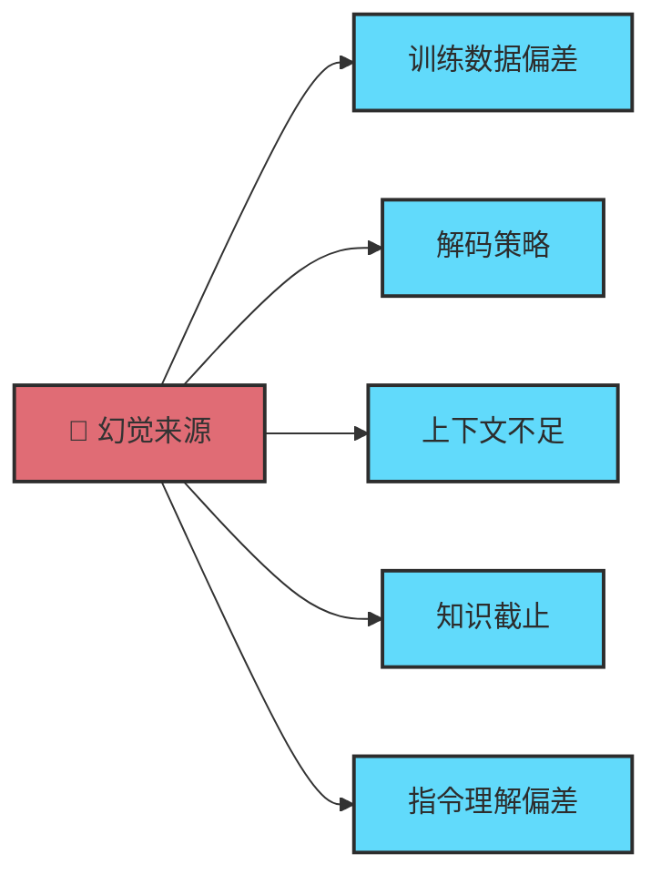

# Chapter 17 · 🚨 Agent 错误用法

> 目标：把“Agent 为什么会跑偏”这件事讲成一套错误用法清单。读完这一章，你应该知道最常见的 9 种错误用法分别长什么样，以及第一恢复动作应该是什么。

## 目录

- [1. 九种最常见错误用法](#1-九种最常见错误用法)
- [2. 为什么这些错误会反复出现](#2-为什么这些错误会反复出现)
- [3. 第一恢复动作](#3-第一恢复动作)
- [4. 一个更稳的诊断顺序](#4-一个更稳的诊断顺序)

## 1. 九种最常见错误用法

| 错误用法 | 典型表现 | 第一动作 |
|---|---|---|
| 1. 把所有任务塞进同一条会话 | 什么都在一条对话里滚，越聊越乱 | 新开 session，按任务域拆开 |
| 2. 不探索就直接让 Agent 改代码 | 一上来就改，方向错了两轮才发现 | 先读入口文件、日志和调用链 |
| 3. 不写范围约束 | 改动蔓延到你没打算碰的区域 | 明确文件范围、模块边界和禁止区 |
| 4. 不给验证要求 | 看起来像对了，但没人真跑测试 | 先写验证命令和完成定义 |
| 5. 连续多轮失败还不清上下文 | 失败尝试本身成了新噪音 | `/compact` 或直接重开干净上下文 |
| 6. 把高风险动作直接放权 | 发布、删数据、改权限全交给自治 | 拉回人工审批和风险分级 |
| 7. 把临时需求写进永久规则文件 | 一次性要求污染长期控制面 | 临时需求留在当前任务，稳定规则才写文件 |
| 8. 看到输出很流畅就默认它是对的 | 没证据也直接接受 | 强制补测试、diff、日志或截图 |
| 9. 试图靠补 Prompt 解决本来属于 Context / Harness 的问题 | 不断换说法，但系统级问题没动 | 回头改上下文装配、验证链和规则文件 |

## 2. 为什么这些错误会反复出现

因为 Agent 很容易给人一种错觉：

- 它看起来很懂
- 它输出得很快
- 它说得很自信

这让人误以为“只要继续聊下去，它总会自己变对”。

更底层的共同根因通常只有四类：

- 上下文已经脏了，但你还在继续加历史
- 任务没拆开，Agent 被迫在模糊目标里自由发挥
- 验证链缺失，错误没有及时被外部世界拉回来
- 把控制面问题误诊成 Prompt 措辞问题

## 3. 第一恢复动作

遇到明显跑偏时，最稳的第一恢复动作通常不是继续追问，而是：

- 重写目标
- 收缩范围
- 清理上下文
- 补齐验证要求
- 必要时把长期信息写回文件

> 🧭 **错误用法往往不是某一轮说错话，而是把整个协作方式搭错了。**

## 4. 一个更稳的诊断顺序

看到 Agent 跑偏时，按这个顺序排查最稳：

1. **先看目标和范围**：是不是一开始就没说清楚？
2. **再看上下文**：是不是已经被旧历史和失败尝试污染？
3. **再看验证**：是不是没有任何外部证据拉回正确轨道？
4. **最后才看 Prompt**：如果前三步都没问题，再去调说法和结构

一句话压缩就是：

> 🧯 **先改任务边界和系统护栏，再改措辞。**

## 📌 本章总结

- Agent 最常见的错误，不是“模型突然坏了”，而是协作方式从一开始就搭错了。
- 九种高频错误里，最常见的共因还是脏上下文、模糊目标、缺少验证和错误放权。
- 最稳的恢复动作通常不是继续追问，而是收缩范围、清理上下文、补齐验证、把长期信息写回文件。
- 很多所谓 Prompt 问题，最后都要回到 Context 和 Harness 解决。

## 📚 继续阅读

- 想把失效背后的系统原因看透：回看 [Ch11 · Memory、Context 与 Harness](./ch11-memory-context-harness.md) 和 [Ch12 · Tools](./ch12-tools.md)
- 想把恢复动作接到交付链上：继续看 [Ch21 · 质量保障与验收](./ch21-quality-assurance-review-eval.md)

---

<div align="center">

[📚 返回目录](../../README.md#tutorial-contents) | [⬅️ 上一章：Ch16 Plugin](./ch16-plugin.md) | [➡️ 下一章：Ch18 Agent 设计模式](./ch18-agent-patterns.md)

</div>

---

## 📎 保留原文与延伸材料

错误用法和失败恢复现在是独立章节，下面把失败模式专题与幻觉专题整体并入，先确保“症状、根因、恢复、技术成因”四块都在。

<details>
<summary>📎 保留原文：原专题：失败模式与恢复术</summary>

---
> 📚 **Part IV · 进阶专题** | [← 返回专题目录](../../README.md#tutorial-contents)
---

# 🚨 失败模式与恢复术

> 🎯 系统总结 Agent 常见的失败模式，以及对应的诊断方法和恢复策略。

## 目录
- [1. 概述](#1-概述)
- [2. 核心内容](#2-核心内容)
- [3. 实战建议](#3-实战建议)

---

## 1. 概述

Agent 不是万能的——它会跑偏、会死循环、会产生幻觉、会在长任务中迷失方向。但如果你能识别这些失败模式，就能提前预防或快速恢复。这篇专题从"症状→原因→处方"的角度，系统梳理最常见的 Agent 失败模式。

---

## 2. 最常见的失败模式

| 失败模式 | 典型表现 | 本质问题 | 更稳的处理方式 |
|----------|----------|----------|----------------|
| **厨房水槽会话** | 什么都往一个会话里塞 | 上下文被无关信息污染 | 不相关任务及时新开会话 |
| **反复纠错循环** | 同一个问题改三次还在原地打转 | 错误尝试本身进入了上下文 | 清会话，重新描述任务与约束 |
| **假设传播** | 早期误解一路扩散到后面所有改动 | 没有及时在 plan 阶段纠偏 | 复杂任务先确认理解，再执行 |
| **抽象膨胀** | 100 行能做完的事写成 1000 行 | Agent 倾向于过度设计 | 明确要求"最小实现""不要过度抽象" |
| **理解债务** | 代码越来越多，但你越来越看不懂 | 生成速度超过 review 速度 | 控制单次改动范围，强制做摘要和验证 |
| **信任-验证缺口** | 看起来像对了，于是直接合并 | 没有外部验证护栏 | 测试、截图、命令结果必须跟上 |
| **盲目放权** | 没看 diff 就让 Agent 连续执行高风险动作 | 把自治当成无需监督 | 高风险任务默认保留人工审批 |

---

## 3. 实战建议

### 预防：默认带上的三句话

这是最值得长期保留的通用指令：

- **先分析再执行**
- **修改后必须验证**
- **如果不确定，就停下来说明**

### 恢复：信号与动作

| 信号 | 恢复动作 |
|------|---------|
| Agent 开始重复读同样的文件 | 清上下文或新开会话 |
| 同一个错误修了两次以上 | 停下来，重新描述约束 |
| Agent 忘了早先强调的约束 | 把约束写进 CLAUDE.md，而非只靠对话记忆 |
| 日志、diff、讨论内容明显过长 | 分阶段执行，做摘要后继续 |

---

> 📖 **相关章节**：[🧩 上下文工程深入](../topics/topic-context-engineering.md) · [🧠 大模型幻觉问题](../topics/topic-llm-hallucination.md) · [🤝 人机协同详解](../topics/topic-human-agent-collab.md)

---

返回目录：[README · 章节目录](../../README.md#tutorial-contents)

</details>

<details>
<summary>📎 保留原文：原专题：大模型幻觉问题</summary>

---
> 📚 **Part IV · 进阶专题** | [← 返回专题目录](../../README.md#tutorial-contents)
---

# 🧠 大模型幻觉问题（LLM Hallucination）

> 🎯 深入理解大语言模型为什么会"编造事实"——幻觉的成因、分类、检测方法与缓解策略。

## 📑 目录

- [1. 什么是大模型幻觉](#1-什么是大模型幻觉)
- [2. 幻觉的分类](#2-幻觉的分类)
- [3. 幻觉的技术成因](#3-幻觉的技术成因)
- [4. 在 Coding Agent 中的典型表现](#4-在-coding-agent-中的典型表现)
- [5. 检测与缓解策略](#5-检测与缓解策略)
- [6. 与质量章节如何配合](#6-与质量章节如何配合)

---

## 1. 什么是大模型幻觉

**幻觉（Hallucination）** 是指大语言模型生成的内容看起来流畅合理，但实际上与事实不符或完全虚构的现象。

| 类型 | 描述 | 举例 |
|------|------|------|
| **事实性幻觉** | 生成与已知事实矛盾的信息 | "Python 3.12 移除了 async/await 语法" |
| **忠实性幻觉** | 生成与给定上下文/指令不一致的内容 | 你要求修改文件 A，Agent 却修改了文件 B |
| **虚构性幻觉** | 凭空编造不存在的实体 | 引用一个不存在的 npm 包 `@util/magic-parser` |

> ⚠️ 幻觉不是 Bug——它是生成式模型的**固有特性**。模型的工作原理是预测下一个 token，而非查询事实数据库。

---

## 2. 幻觉的分类

### 按来源分



| 来源 | 说明 | Coding 场景举例 |
|------|------|---------------|
| **训练数据偏差** | 训练语料中的错误或过时信息 | 推荐已废弃的 API 用法 |
| **解码策略** | 温度/采样参数导致的随机性 | 相同 Prompt 每次生成不同的（有时错误的）代码 |
| **上下文不足** | 缺乏足够信息做出正确判断 | 不了解项目架构，猜测错误的文件路径 |
| **知识截止** | 训练数据有截止日期 | 不知道新版本框架的 breaking changes |
| **指令理解偏差** | 模型对指令的理解与人类意图不一致 | 你说"优化"，它理解为"重写" |

### 按严重程度分

| 级别 | 表现 | 危害 | 频率 |
|------|------|------|------|
| 🟢 **轻微** | 注释不准确、变量命名略奇怪 | 低 | 高 |
| 🟡 **中等** | 使用了不存在的 API 参数、import 路径错误 | 编译失败 | 中 |
| 🔴 **严重** | 编造安全漏洞修复方案、虚构依赖包 | 安全风险 | 低 |
| ⚫ **致命** | 生成看似正确但逻辑错误的代码（运行不报错但结果错误） | 极高 | 低 |

---

## 3. 幻觉的技术成因

### 3.1 Next-Token Prediction 的本质

LLM 的核心机制是**预测下一个 token 的概率分布**，而非"理解事实"：

```
输入: "Python 的创建者是"
输出概率: { "Guido": 0.85, "Linus": 0.05, "James": 0.03, ... }
```

模型选择最高概率的 token 继续生成。当关于某个主题的训练数据不足时，概率分布会趋于平坦，模型就可能"猜错"。

### 3.2 Softmax Bottleneck

Transformer 的 softmax 输出层在表示某些复杂知识时存在信息瓶颈，导致模型无法精确区分相似但不同的事实。

### 3.3 训练目标与忠实性的矛盾

- **训练目标**：生成人类偏好的流畅文本（RLHF）
- **副作用**：模型学会了"自信地胡说八道"——因为在训练中，自信的回答通常获得更高评分

> 🔑 **核心矛盾**：模型被奖励"听起来正确"，而非"实际正确"。

### 3.4 上下文窗口的衰减效应

随着对话变长，模型对早期上下文的注意力逐步衰减。在长会话中：

| 上下文位置 | 注意力 | 幻觉风险 |
|-----------|--------|---------|
| 最近 10% | ⬆️ 高 | 低 |
| 中间 50% | ➡️ 中 | 中 |
| 最早 40% | ⬇️ 低 | 高 |

这就是为什么 Agent 在长对话后期容易"忘记"你之前强调的约束。

---

## 4. 在 Coding Agent 中的典型表现

| 幻觉类型 | 表现 | 检测方法 |
|---------|------|---------|
| **API 虚构** | 调用不存在的函数/参数 | 跑测试、查官方文档 |
| **依赖幻觉** | `import` 不存在的包 | `pip install` / `npm install` 失败 |
| **路径虚构** | 引用不存在的文件路径 | `ls` 验证 |
| **逻辑幻觉** | 代码能运行但结果错误 | 单元测试覆盖边界条件 |
| **版本混淆** | 混用不同版本的 API | 锁定版本号 + 查 changelog |
| **配置编造** | 生成看似合理但无效的配置项 | 对照官方配置文档 |
| **过度自信** | 声称"已修复"但实际未修复 | 必须跑验证命令 |

### 真实案例：依赖幻觉

```
你：帮我解析 YAML 文件
Agent：安装 @yaml/fast-parser 包...

问题：@yaml/fast-parser 这个包根本不存在。
      真正的包是 js-yaml 或 yaml。
```

**防御**：让 Agent 在推荐依赖前先 `npm search` 或 `pip search` 验证。

---

## 5. 检测与缓解策略

### 5.1 事前预防

| 策略 | 做法 | 效果 |
|------|------|------|
| **提供充足上下文** | 附上相关代码文件、文档链接 | 减少 Agent 猜测的必要性 |
| **指定版本** | "使用 React 18 的 API" | 减少版本混淆 |
| **约束范围** | "只修改这个文件" | 减少无关改动 |
| **要求引用** | "引用你参考的文件和行号" | 让幻觉可追溯 |

### 5.2 事中检测

| 信号 | 含义 | 行动 |
|------|------|------|
| Agent 的回答过于流畅、没有犹豫 | 可能在编造 | 追问细节 |
| 提到你从未见过的 API/包/配置项 | 可能是虚构 | 搜索验证 |
| 修改了你没要求修改的文件 | 忠实性幻觉 | `git diff` 审查 |
| 声称"已测试通过"但没有运行测试 | 过度自信 | 要求实际执行 |

### 5.3 事后验证

- ✅ **运行测试** — 最有效的验证手段
- ✅ **`git diff` 审查** — 检查所有实际改动
- ✅ **依赖验证** — `npm ls` / `pip list` 确认安装
- ✅ **文档交叉检查** — 用 Agent 的 WebSearch 验证其声称

### 5.4 架构级缓解

| 架构 | 说明 |
|------|------|
| **Writer-Reviewer 双 Agent** | 一个 Agent 写，另一个 Agent 审，互相校验 |
| **RAG 增强** | 让 Agent 先检索项目代码再生成，减少猜测 |
| **验证驱动循环** | Agent 每次修改后必须跑测试、看输出（详见 Ch05） |
| **Spec 驱动** | 用明确的 Spec 约束 Agent 行为范围（详见 Ch08） |

---

## 6. 与质量章节如何配合

| 维度 | 本专题（大模型幻觉问题） | [Ch11 · 质量保障与验收](../chapters/ch21-quality-assurance-review-eval.md) |
|------|----------------------|------------------------------------------------|
| **侧重** | 技术原理、分类体系、成因分析 | 工程落地、验证动作、合并前护栏 |
| **深度** | 解释为什么会产生幻觉 | 聚焦怎么在真实交付里发现并拦住它 |
| **读者** | 想把机制讲透的读者 | 想把质量流程搭起来的读者 |
| **配合方式** | 负责建立认知模型 | 负责把认知模型变成执行清单 |

---

> 📖 **相关章节**：
> - [Ch02 · Agent 核心原理](../chapters/ch08-agent-formula.md) — 理解 Agent 的工作循环、上下文衰减与失效机制
> - [Ch11 · 质量保障与验收](../chapters/ch21-quality-assurance-review-eval.md) — 实战中的幻觉检测
> - [Ch09 · 驾驭 Agent：控制面与会话管理](../chapters/ch11-memory-context-harness.md) — 验证闭环

---

返回目录：[README · 章节目录](../../README.md#tutorial-contents)

</details>
