# Chapter 18 · 🧬 Agent 设计模式

> 目标：把 Agent 的常见组织方式放进模式语言里理解。读完这一章，你应该知道多 Agent、Reviewer、Router、Planner-Worker 一类模式分别解决什么问题，以及什么时候根本不该上模式。

## 📑 目录

- [1. 为什么会走向 Multi-Agent](#1-为什么会走向-multi-agent)
- [2. 最常见的模式](#2-最常见的模式)
- [3. 大型代码库为什么更需要分工](#3-大型代码库为什么更需要分工)
- [4. Worktree 隔离为什么重要](#4-worktree-隔离为什么重要)
- [5. 什么时候不该上 Multi-Agent](#5-什么时候不该上-multi-agent)

---

## 1. 为什么会走向 Multi-Agent

单 Agent 的上限通常卡在两件事上：

- 上下文窗口有限
- 顺序执行无法并行

多 Agent 试图解决的是：

- 把不同职责拆给不同上下文
- 让相对独立的任务并行推进

所以它的本质，不是“数量更多”，而是：

> 🧩 **分工更清楚，上下文更干净，整体吞吐更高。**

---

## 2. 最常见的模式

最值得先记住的是这些模式：

| 模式 | 适合解决什么问题 |
|---|---|
| Planner-Worker | 先由强模型拆解，再让执行代理分头落地 |
| Writer-Reviewer | 实现和审查分离，减少确认偏误 |
| Evaluator-Optimizer | 让生成和评估构成迭代循环 |
| Router | 根据任务类型分发给不同专长代理 |
| Worktree Isolation | 并行修改时避免互相踩文件 |

---

## 3. 大型代码库为什么更需要分工

仓库越大，越不适合把所有角色塞进一个上下文里。

常见的问题包括：

- 读仓和写码混在一起，历史越来越脏
- 一个 Agent 既实现又审查，偏见太重
- 多个独立子任务只能排队做，吞吐很差

因此大型代码库里，更稳的策略往往是：

- 研究代理只负责探索
- 规划代理只负责拆解
- 执行代理只负责一小块变更
- 审查代理只看 diff、Spec 和验证结果

---

## 4. Worktree 隔离为什么重要

只要开始并行执行，worktree 很快就会从“可选技巧”变成“必要基础设施”。

它的价值是：

- 每个代理有自己独立目录
- 不会互相覆盖文件
- 每条实验路径都能单独保留
- 最后更容易做对比和汇总

如果没有隔离，多 Agent 往往只会变成多处冲突。

---

## 5. 什么时候不该上 Multi-Agent

这些场景通常不值得上多 Agent：

- 任务本身很小
- 目标都没定义清楚
- 验证链还没搭好
- 任务拆不开，只会互相阻塞

一句话判断：

> 🚫 **如果你连单 Agent 的闭环都还没搭稳，多 Agent 往往只会把混乱放大。**

---

## 📌 本章总结

- 多 Agent 解决的核心问题是分工、上下文隔离和并行，不是数量本身。
- 先记住 Planner-Worker、Writer-Reviewer、Evaluator-Optimizer、Router、Worktree Isolation 这几类模式。
- 仓库越大，越应该显式拆角色和上下文。
- 闭环、验证和隔离没搭好之前，不要急着上多 Agent。

## 📚 继续阅读

- 想看这些模式怎样落回真实交付链：继续看 [Ch19 · 工程化工作流](./ch19-engineering-workflow.md)
- 想看模式失效后怎样验收和兜底：继续看 [Ch21 · 质量保障与验收](./ch21-quality-assurance-review-eval.md)

---

<div align="center">

[📚 返回目录](../../README.md#tutorial-contents) | [⬅️ 上一章：Ch17 Agent 错误用法](./ch17-agent-failure-modes.md) | [➡️ 下一章：Ch19 工程化工作流](./ch19-engineering-workflow.md)

</div>

---

<details>
<summary><span style="color: #e67e22; font-weight: bold;">🏗️ 进阶：六大 Agent 设计模式详解与实战案例</span></summary>

# Chapter 10 · 🧬 Agent 设计模式与代码库策略

> 🎯 **目标**：掌握六种经过实战验证的 Agent 协作模式，理解它们在大型代码库中的组合方式、隔离策略和安全边界。读完本章，你将从“临时拼凑”升级到“系统设计 Agent 协作”。

## 📑 目录

- [1. 🧠 为什么需要设计模式](#1--为什么需要设计模式)
- [2. 🏗️ 六大核心模式](#2-️-六大核心模式)
  - [🔀 Router Pattern — 路由分发](#-router-pattern--路由分发)
  - [🔄 Evaluator-Optimizer — 评估优化循环](#-evaluator-optimizer--评估优化循环)
  - [📋 Planner-Worker — 规划执行分离](#-planner-worker--规划执行分离)
  - [🔍 RAG-Augmented Coding — 检索增强编程](#-rag-augmented-coding--检索增强编程)
  - [👁️ Writer-Reviewer — 写审互纠](#️-writer-reviewer--写审互纠)
  - [🌿 Worktree Isolation — 并行隔离](#-worktree-isolation--并行隔离)
- [3. 📊 模式适用场景矩阵](#3--模式适用场景矩阵)
- [4. 🏢 大型项目中的模式组合与代码库策略](#4--大型项目中的模式组合与代码库策略)
- [5. 🛡️ 安全护栏模式：风险分级执行](#5-️-安全护栏模式风险分级执行)
- [6. ⚙️ Harness 演进原则：工具与模型共同进化](#6-️-harness-演进原则工具与模型共同进化)
- [📌 本章总结](#-本章总结)

---

> 📌 **读法建议**：如果你只想先做选择，先看第 3 节的模式矩阵，再回到第 2 节逐个读模式卡片。
>
> 📖 **统一阅读模板**：本章每个模式都按“什么时候触发 → 它如何工作 → 什么时候别用 → 在本教程哪一章落地”来理解，而不是当百科全书背定义。

## 1. 🧠 为什么需要设计模式

### 从"写提示词"到"设计 Agent 系统"

Ch02 在解释 Agent 闭环时已经提出一个核心观点：**Agent 效果 = 模型能力 × Harness 质量**。模型是马，Harness 是马具。但当任务复杂到需要多匹马协同拉车时，光有好马具还不够——你需要一套**编队策略**。

| 阶段 | 典型做法 | 上限 |
|:---:|---|---|
| 单 Agent + 长提示词 | 把所有需求塞进一个 prompt | 上下文窗口耗尽，任务越复杂越不稳定 |
| 单 Agent + 工具链 | 给 Agent 配备搜索、执行、测试等工具 | 工具虽多但 Agent 需要自己决策全流程 |
| **多 Agent + 设计模式** | 不同 Agent 各司其职，按模式协作 | 每个 Agent 专注擅长领域，整体质量显著提升 |

> **🔑 核心认知**：设计模式不是学术概念——它是前人踩坑后沉淀的"最佳编队方案"。传统软件工程有 GoF 的 23 种设计模式，Agent 时代同样需要自己的模式语言。模式的核心价值在于**可复用、可组合、可沟通**——团队说"用 Writer-Reviewer 模式"就能立刻对齐理解。

---

## 2. 🏗️ 六大核心模式

在进入六个模式前，先约定一个统一读法：

- 先看它解决什么失控问题
- 再看它靠什么机制收束风险
- 最后看它和前文章节的落地位置

### 🔀 Router Pattern — 路由分发

**一句话**：主 Agent 接收任务，根据类型分发给领域子 Agent 处理。

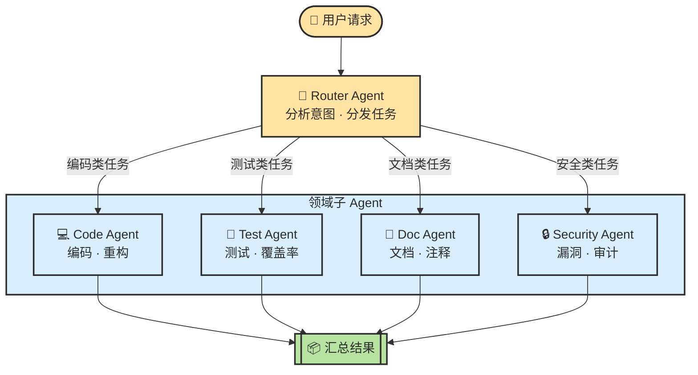

**适用场景**：
- 仓库包含多种语言或技术栈（前端 / 后端 / 基础设施）
- 任务类型差异大，一个 Agent 难以兼顾所有领域
- 需要并行处理多个独立子任务

**实战例子**：Cursor 的 Task 工具就是一个典型 Router——你发起一个任务，它根据任务性质选择 `generalPurpose`、`explore`、`shell` 等不同类型的子 Agent 来执行。Claude Code 的 `dispatching-parallel-agents` Skill 也遵循此模式：主 Agent 识别出多个独立问题域后，每个域分发一个子 Agent 并行调查。

> **💡 关键点**：Router 的质量取决于分类准确性。分类错了，后续全错——因此 Router Agent 通常使用最强模型。

---

### 🔄 Evaluator-Optimizer — 评估优化循环

**一句话**：生成 Agent 产出结果，评估 Agent 打分并反馈，循环迭代直到达标。

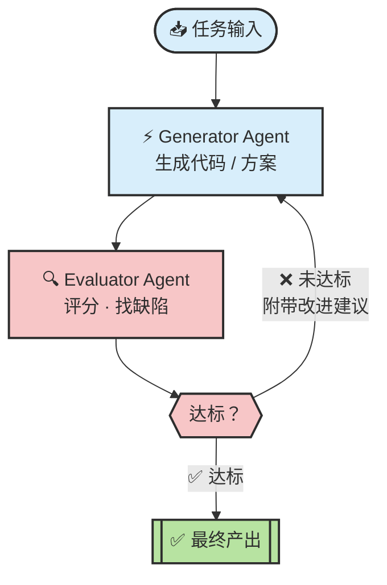

**适用场景**：
- 代码质量要求高，一次生成难以满足标准
- 有明确的评估标准（测试通过率、Lint 规则、性能基线）
- 需要迭代优化的创造性任务（架构设计、API 设计）

**实战例子**：Anthropic 官方推荐的 SWE-bench 解题流程就是这个模式——Agent 生成补丁后，运行测试套件作为 Evaluator，未通过则带着错误信息重新生成。LangChain 的编码 Agent 在竞赛中加入"自验证循环"后排名从 Top 30 跃升至 Top 5。

> **💡 关键点**：Evaluator 必须独立于 Generator——用同一个 Agent 既生成又评审，等于学生自己给自己批改作业。

---

### 📋 Planner-Worker — 规划执行分离

**一句话**：强模型做高层规划和任务拆解，快速模型执行具体编码。

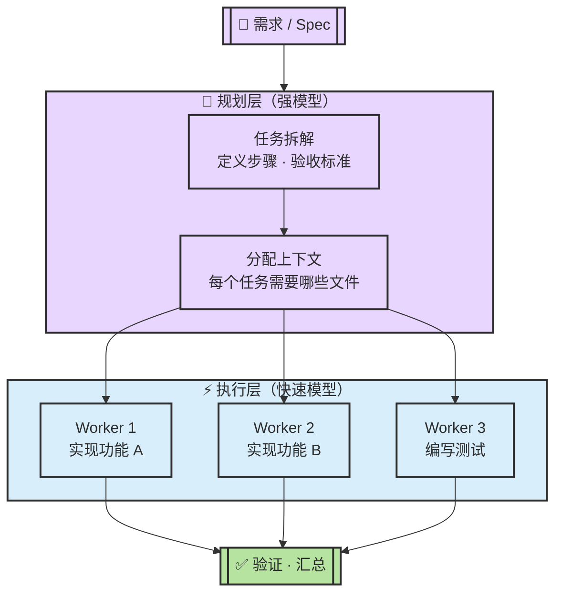

**适用场景**：
- 大型功能开发，需要先规划再动手
- 任务可以拆解为多个独立子任务并行执行
- 需要控制 Token 成本——规划用贵模型，执行用便宜模型

**实战例子**：superpowers 插件的 `writing-plans` + `subagent-driven-development` 就是标准的 Planner-Worker 模式。主 Agent（Planner）读取 Spec 并产出详细的实施计划（精确到每个文件的改动），然后为每个 Task 分发一个独立子 Agent（Worker）去执行。Cursor 中用 `model: "fast"` 参数指定 Worker 使用快速模型，正是此模式的直接体现。

> **💡 关键点**：规划的粒度决定执行质量。superpowers 要求每个步骤是 2~5 分钟的"bite-sized task"——粒度过粗会让 Worker 迷失，过细会产生过多协调开销。

---

### 🔍 RAG-Augmented Coding — 检索增强编程

**一句话**：编码前先检索代码库，用相关代码片段作为上下文指导生成。

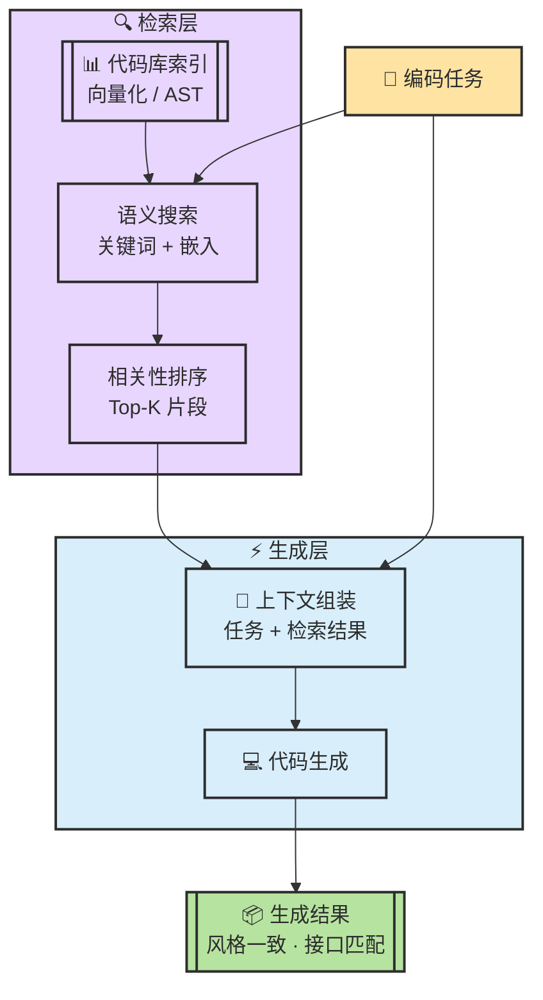

**适用场景**：
- 大型代码库（>10 万行），Agent 无法一次性加载全部代码
- 需要遵循项目现有的编码风格、命名约定和架构模式
- 任务涉及已有接口的调用或扩展

**实战例子**：Cursor 的 `@codebase` 语义搜索就是 RAG 的产品化形态——自然语言查询经代码嵌入向量检索出相关片段，注入上下文后生成代码。Claude Code 的 `SemanticSearch` 工具同理，先按语义定位相关代码块，再用于编码决策。

> **💡 关键点**：检索质量 > 生成质量。错误的上下文会让最强的模型写出错误的代码——"垃圾进，垃圾出"在 RAG 场景下格外致命。

---

### 👁️ Writer-Reviewer — 写审互纠

**一句话**：一个 Agent 写代码，另一个独立 Agent 审查，双方基于不同上下文工作。

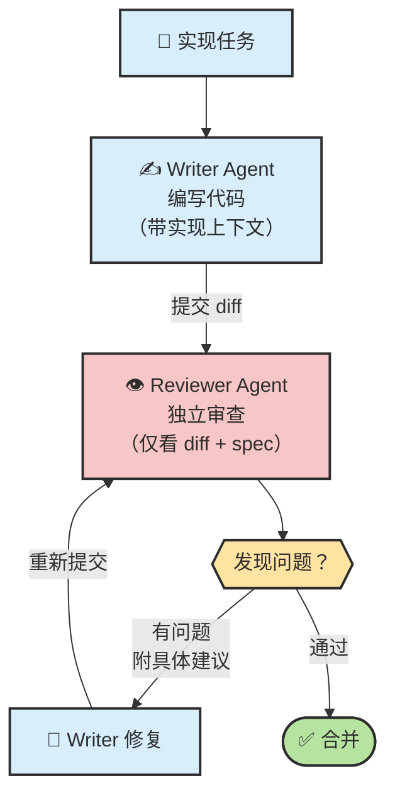

**适用场景**：
- 代码质量是硬性要求（安全敏感、金融系统、开源项目）
- 团队 Code Review 成为瓶颈，希望 Agent 预审
- 新人写的代码需要额外审查层

**实战例子**：superpowers 的 `requesting-code-review` Skill 是标准实现。核心原则是**上下文隔离**——Reviewer 绝不继承 Writer 的会话历史，只接收精心构造的 diff、Spec 和 SHA 范围，确保审查视角独立。

> **💡 关键点**：Reviewer 的上下文必须独立构造。让 Reviewer 继承 Writer 的会话历史，等于让审查员旁听了整个开发过程——会产生确认偏误。

---

### 🌿 Worktree Isolation — 并行隔离

**一句话**：用 Git Worktree 为每个 Agent 创建隔离的工作目录，避免互相干扰。

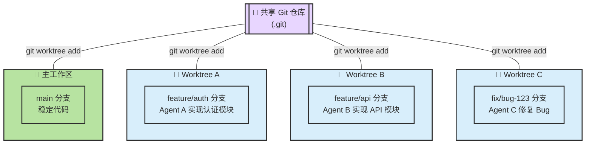

**适用场景**：
- 多个 Agent 需要同时修改同一个仓库的不同模块
- 需要"Best-of-N"策略——多个 Agent 独立尝试同一任务，选最优方案
- 实验性修改需要安全隔离，不影响主工作区

**实战例子**：superpowers 的 `using-git-worktrees` Skill 在每次启动功能开发前自动创建隔离 Worktree。Cursor 的 `best-of-n-runner` 子 Agent 也使用此模式——每个 Runner 在独立 Worktree 中工作，拥有自己的分支和目录，互不干扰。这使得"让三个 Agent 同时解同一道题，选最好的"成为可能。

> **💡 关键点**：Worktree Isolation 解决的是物理层面的冲突——文件锁、半成品代码、未提交的中间状态。它是多 Agent 并行执行的基础设施。

---

## 3. 📊 模式适用场景矩阵

不同任务适合不同模式。以下矩阵帮助你快速选择：

| 任务类型 | 🔀 Router | 🔄 Eval-Opt | 📋 Plan-Work | 🔍 RAG | 👁️ Write-Rev | 🌿 Worktree |
|:---|:---:|:---:|:---:|:---:|:---:|:---:|
| **新功能开发（大型）** | ⭐ | ⭐ | ⭐⭐⭐ | ⭐⭐ | ⭐⭐ | ⭐⭐⭐ |
| **新功能开发（小型）** | — | ⭐ | — | ⭐⭐ | ⭐ | — |
| **Bug 修复** | — | ⭐⭐⭐ | — | ⭐⭐⭐ | ⭐ | — |
| **大规模重构** | ⭐⭐ | ⭐ | ⭐⭐⭐ | ⭐⭐ | ⭐⭐ | ⭐⭐⭐ |
| **编写测试** | — | ⭐⭐ | ⭐ | ⭐⭐⭐ | ⭐⭐ | — |
| **代码审查** | — | — | — | ⭐⭐ | ⭐⭐⭐ | — |
| **跨模块并行开发** | ⭐⭐⭐ | — | ⭐⭐ | ⭐ | ⭐ | ⭐⭐⭐ |
| **探索性原型** | ⭐ | — | — | ⭐ | — | ⭐⭐⭐ |
| **文档生成** | ⭐ | ⭐⭐ | — | ⭐⭐⭐ | ⭐⭐ | — |
| **安全审计** | ⭐⭐ | ⭐⭐ | — | ⭐⭐ | ⭐⭐⭐ | — |

> ⭐ = 可用但非首选 · ⭐⭐ = 推荐 · ⭐⭐⭐ = 最佳匹配 · — = 不适用

**速查决策树**：

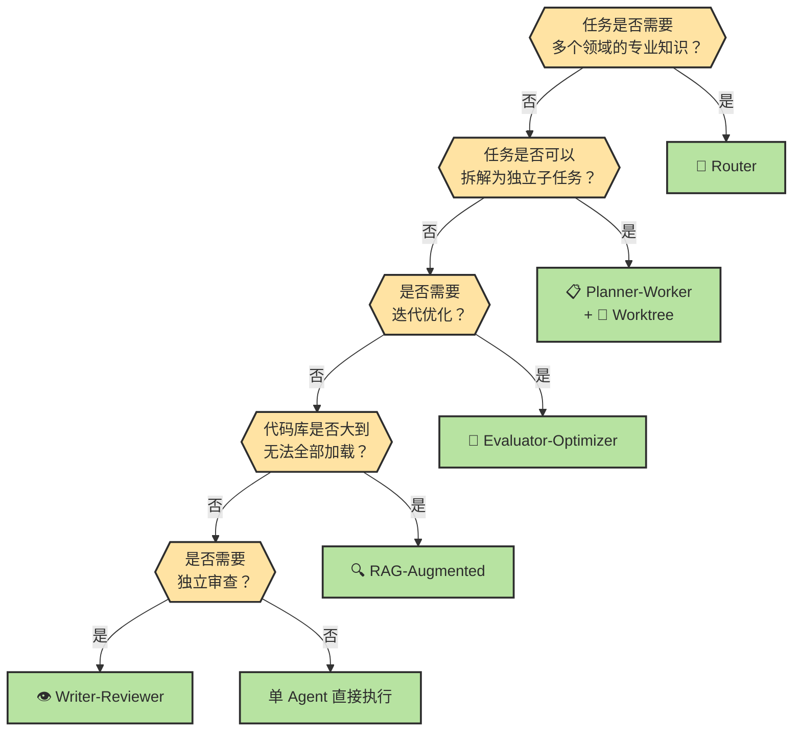

### 多 Agent 组织形态：Swarm vs Team

当你不再满足于“单 Agent 干到底”，下一个问题往往不是“要不要多 Agent”，而是“这些 Agent 之间到底怎么组织”。

| 组织方式 | 核心特征 | 优点 | 风险 | 更适合 |
|------|---------|------|------|---------|
| **Swarm** | 去中心化，多个 Agent 自主探索 | 发散性强，适合并行找思路 | 重复劳动、结论冲突、难验收 | Best-of-N、开放式探索、方案发散 |
| **Team** | 有明确角色和协调者 | 边界清楚，易于审查和收敛 | 规划成本更高 | 真实仓库改动、长任务交付、多人协作 |

对 Coding Agent 而言，默认更推荐 **Team**：先有规划者或协调者，再让执行者、审查者分工推进。`Swarm` 更适合拿来做“多路并发试错”，不适合直接承担主线交付。

一句话记忆：

- **Swarm** 追求的是“多想法同时冒出来”
- **Team** 追求的是“多角色朝同一个交付目标收束”

---

## 4. 🏢 大型项目中的模式组合与代码库策略

单个模式解决单个问题，但真正的老项目 / 大仓库问题，通常需要**模式组合 + 代码库策略**一起上。

### 接手旧仓库时，模式怎么落地

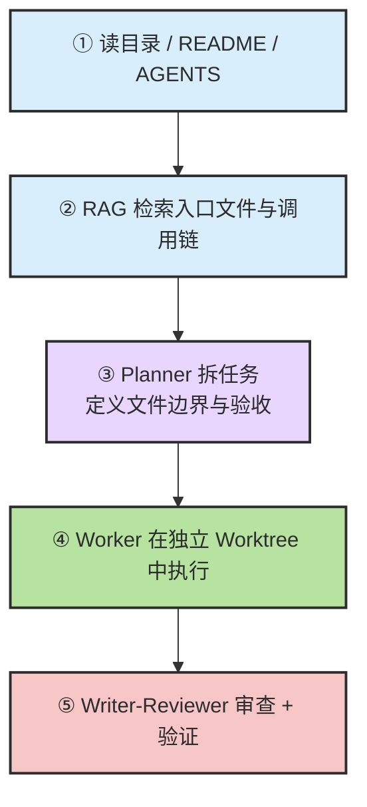

### 一个够用的组合范式

| 阶段 | 主要动作 | 对应模式 | 关键收益 |
|------|---------|---------|---------|
| **读仓库** | 看目录、入口、依赖图 | **RAG-Augmented** | 避免 Agent 在大仓库里盲搜 |
| **拆任务** | 按模块、按文件边界切任务 | **Planner-Worker** | 让任务变成可并行、可验证单元 |
| **执行** | 把不同任务交给不同 Agent | **Router** + **Worktree** | 降低互相覆盖和上下文污染 |
| **审查** | 用独立上下文审 diff 和 Spec | **Writer-Reviewer** | 降低确认偏误 |
| **回环** | 测试失败就带证据回写 | **Evaluator-Optimizer** | 把“修 bug”变成闭环而不是猜测 |

### 大代码库的固定策略

| 仓库规模 | 主要问题 | 推荐策略 |
|---------|---------|---------|
| **< 50 文件** | 全局理解成本低 | 单 Agent 即可 |
| **50-500 文件** | 需要控制读入范围 | RAG + 明确入口文件 |
| **500-5K 文件** | 模块边界复杂 | Planner-Worker + Writer-Reviewer |
| **5K+ 文件** | 上下文严重不足 | Worktree 隔离 + 多 Agent 分模块执行 |

### 入口文件与边界文件

大型项目里，不要让 Agent “自己想办法理解全仓库”。至少准备这些入口：

1. `README.md`：项目目标、模块概览、启动方式。
2. `AGENTS.md` / `CLAUDE.md`：规则、禁区、命令、常见坑。
3. 入口路由或主程序：例如 `main.ts`、`app.tsx`、`server.ts`。
4. 契约文件：OpenAPI、Schema、接口定义、测试夹具。

### 一个缩短版案例

社区里的 `superpowers` 工作流很适合作为“示意案例”，但它更像**组合范式的参考实现**，不是你必须完整照搬的七步法。真正该学的是三条原则：

| 原则 | 解释 |
|------|------|
| **上下文隔离** | 子 Agent 接收精心构造的上下文，不继承主会话历史 |
| **阶段门禁** | Plan 未确认不执行，Review 未通过不合并，测试未通过不宣称完成 |
| **物理隔离** | 多个 Agent 尽量在不同分支 / Worktree 工作，减少互踩 |

> 🔑 **核心洞察**：在大仓库里，模式不是“锦上添花”，而是让 Agent 不至于迷路的地图。

---

## 5. 🛡️ 安全护栏模式：风险分级执行

### 从 OpenAI 官方指南提炼的通用模式

当 Agent 拥有执行真实操作的能力（发邮件、改数据库、退款、部署服务）时，"能做"和"应该做"之间需要一道护栏。这是一种**正交于业务逻辑的横切关注点**，适合抽象为独立模式。

**Agent 的工具按影响范围可分三类**：

| 类型 | 用途 | 示例 | 风险级别 |
|------|------|------|:---:|
| **数据工具** | 只读，查询信息 | 订单查询、报表调取、日志搜索 | 🟢 低 |
| **行动工具** | 写入，执行操作 | 发邮件、改数据、触发退款 | 🟡 中 |
| **编排工具** | 调度，协调多 Agent | 客服 Agent → 财务 Agent 交接 | 🟡 中到高 |

**风险分级执行流程**：

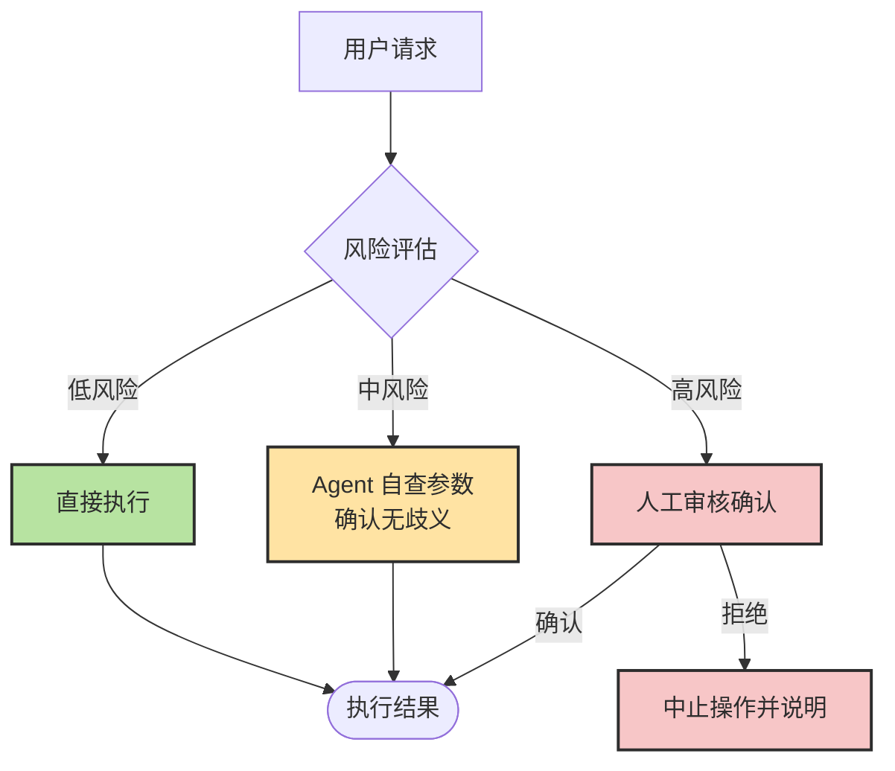

| 风险等级 | 触发条件 | Agent 行为 | 示例 |
|---------|---------|-----------|------|
| 🟢 **低风险** | 只读、无副作用 | 直接执行 | 天气查询、订单状态查询 |
| 🟡 **中风险** | 有写入但可回滚 | 自查参数后执行 | 数据字段修改、发送草稿 |
| 🔴 **高风险** | 不可逆或金额大 | 暂停并请求人工确认 | 资金操作、批量删除、生产部署 |

### 与 Evaluator-Optimizer 的区别

| 维度 | 评估优化循环（§2.2）| 安全护栏模式 |
|------|-------------------|------------|
| **目的** | 提升输出质量 | 控制操作风险 |
| **触发时机** | 生成后评估 | 执行前拦截 |
| **决策依据** | 质量标准（测试通过率等）| 风险等级（影响范围、可逆性）|
| **人工介入** | 通常不需要 | 高风险时必须介入 |

> 💡 **实践建议**：在多 Agent 系统中，把风险分级逻辑集中到一个"护栏 Agent"或"权限检查中间件"，而不是分散到每个 Worker Agent 里重复实现。这样护栏策略可以统一升级，且 Worker 只需关注业务逻辑。

---

## 6. ⚙️ Harness 演进原则：工具与模型共同进化

### 工具演进悖论

早期为弥补模型弱点而设计的 Harness 组件，随着模型能力提升，可能从"辅助轮"变成"枷锁"。这是多 Agent 系统设计中经常被忽视的长期问题：

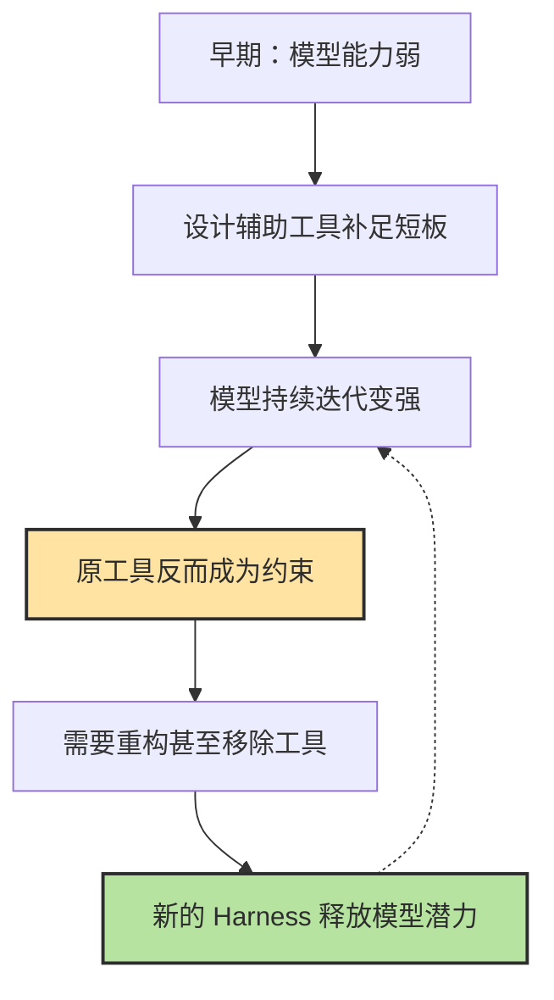

> 💡 **工具演进真实案例**：Claude Code 的 TodoWrite 工具随着 Agent 能力的持续提升，逐渐演进为功能更强的 Task 工具——这正是「Harness 与模型共同演进」的典型写照。（注：以此为设计原则的代表性参考，具体演进细节以官方文档为准。）

### Harness 的核心价值

模型正在快速"商品化"——API 访问门槛越来越低，性能差距越来越小。但 Harness 不会商品化：

| 维度 | 模型（LLM）| Harness（编排系统）|
|------|-----------|-----------------|
| **可替换性** | 高（换模型几行代码）| 低（深度定制，难以复制）|
| **护城河** | 低（竞争激烈，快速追平）| 高（积累时间长，体现业务理解）|
| **核心价值** | 推理能力 | 可靠性、上下文管理、业务适配 |
| **类比** | IaaS（基础算力）| PaaS/SaaS（应用价值）|

> 🎯 **设计原则**：构建 Harness 时，应预留"模型升级接口"——当你换用更强模型时，哪些辅助工具可以裁减？哪些约束需要放宽？好的 Harness 设计应该能随模型能力的提升而演进，而不是把团队绑死在某一代模型的能力边界上。

**Harness 演进的两个阶段**：

```
早期 Harness：能力补充
  → 给模型加文件系统访问、代码执行、搜索能力
  → 重点是"让模型能做到什么"

成熟 Harness：性能优化 + 可靠性保证
  → 上下文精准管理、验证闭环、错误恢复
  → 重点是"让模型稳定做对什么"
```

> 就像现代编程语言已有垃圾回收、类型系统，但仍需框架和库才能构建复杂应用——模型再强，仍需精心设计的 Harness 才能在生产环境中可靠运行。

---

## 📌 本章总结

| 模式 | 核心机制 | 一句话记忆 |
|:---|---|---|
| 🔀 **Router** | 意图分类 → 领域分发 | "让专业的人做专业的事" |
| 🔄 **Evaluator-Optimizer** | 生成 → 评估 → 迭代 | "写完再改，改到达标" |
| 📋 **Planner-Worker** | 强模型规划 + 快速模型执行 | "将军指挥，士兵冲锋" |
| 🔍 **RAG-Augmented** | 检索相关代码 → 注入上下文 | "先查再写，照着改" |
| 👁️ **Writer-Reviewer** | 独立写 + 独立审 | "自己的作业不能自己批" |
| 🌿 **Worktree Isolation** | Git Worktree 物理隔离 | "各干各的，互不打扰" |
| 🛡️ **安全护栏** | 操作前风险分级拦截 | "高风险操作必须人类点头" |
| ⚙️ **Harness 演进** | 工具随模型能力共同进化 | "辅助轮随能力提升适时拆除" |

**三条行动建议**：

1. **从单模式开始**：先在项目中尝试一种模式（推荐从 Writer-Reviewer 入手），感受到效果后再组合
2. **模式选择看任务**：参照第 3 节的矩阵和决策树，根据任务类型选择最匹配的模式
3. **组合模式看代码库规模**：仓库越大，越要依赖入口文件、Worktree 隔离和阶段门禁

> **🎯 本章核心认知**：Agent 设计模式是 Harness Engineering 的核心工具箱。掌握了这些模式，你不再是"调 Prompt 的人"，而是"设计 Agent 系统的架构师"。


---

<a id="ch2-sec-8"></a>
## 8. Multi-Agent：为什么单 Agent 不总够用

### 8.1 为什么会走向 Multi-Agent

多 Agent 不是为了“显得更高级”，而是为了解决单 Agent 经常同时遇到的三个瓶颈：

- 一个上下文里塞太多角色，容易冲突和污染
- 一个 Agent 同时做规划、检索、编码、验证，容易顾此失彼
- 有些任务天然可以并行，单 Agent 会被串行执行拖慢

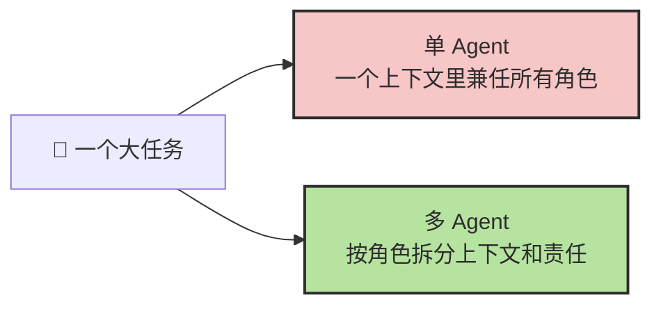

### 8.2 常见模式总览与最常见拓扑

先把最常见的模式记成一张总表：

| 模式 | 一句话定义 | 主要解决什么问题 |
| --- | --- | --- |
| `Planner-Worker` | 规划和执行分离 | 复杂任务拆分与顺序控制 |
| `Writer-Reviewer` | 生成和审查分离 | 降低确认偏误，补风险视角 |
| `Evaluator-Optimizer` | 先评估再优化 | 让系统靠证据迭代收敛 |
| `Router` | 把任务分流给更合适的代理 | 多领域、多能力入口 |
| `RAG-Augmented` | 先检索，再生成或执行 | 上下文不足、资料分散 |
| `Worktree Isolation` | 让不同任务在隔离环境执行 | 降低并发修改冲突 |

最常见的一种拓扑，仍然是 `Supervisor + Specialists`：

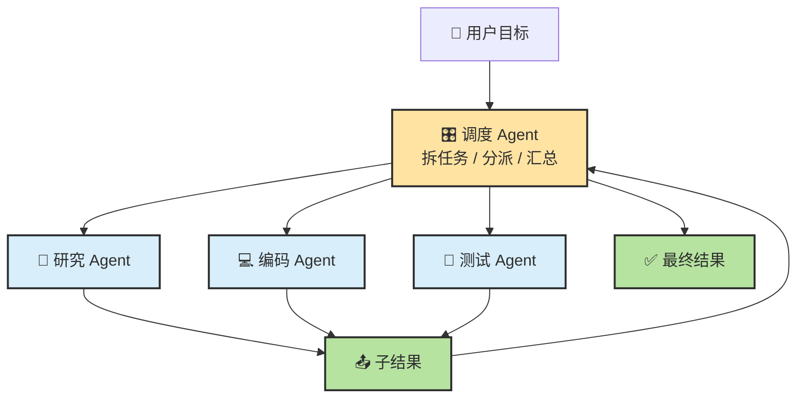

### 8.3 初始化与编排：难点不在“多开几个 Agent”

真正难的不是“启动多个 Agent”，而是它们如何协作。

一个 Multi-Agent 系统如果想跑稳，至少要回答四个问题：

1. 谁来拆任务
2. 每个 Agent 看到哪些上下文
3. 中间结果怎么回传和合并
4. 什么时候停止，谁负责最终验收

📌 **补充：几类常见框架各在强调什么？**

| 框架 | 更强调什么 | 你可以怎么理解 |
| --- | --- | --- |
| `CAMEL` | 角色扮演式对话协作 | 让不同角色在对话中逐步完成任务 |
| `AutoGen` | 多 Agent 对话 + 工具调用 | 强调会话式编排和工具集成 |
| `MetaGPT` | 类软件公司的角色流水线 | 把产品、架构、编码、测试做成分工流程 |
| `Generative Agents` | 记忆、检索、反思与行动的角色社会 | 更偏持续角色与长期状态 |

### 8.4 什么时候不该上 Multi-Agent

Multi-Agent 很强，但绝对不是默认答案。

| 场景 | 为什么先别上 |
| --- | --- |
| 任务很短、边界很清晰 | 单 Agent 就能完成，额外协调只会增加开销 |
| 单 Agent 流程都还没跑稳 | 多 Agent 会把问题放大，而不是自动修复 |
| 子任务强耦合、频繁共享同一上下文 | 拆开后同步成本可能比收益更高 |
| 验收责任必须高度集中 | 多角色分工会让“到底谁说了算”变模糊 |

---

---

<div align="center">

[📚 返回目录](../../README.md#tutorial-contents) | [⬅️ 上一章：Ch09 驾驭 Agent：控制面与会话管理](./ch11-memory-context-harness.md) | [➡️ 下一章：Ch11 质量保障与验收](./ch21-quality-assurance-review-eval.md)

</div>

</details>

<details>
<summary><span style="color: #e67e22; font-weight: bold;">🔀 进阶：多 Agent 协作模式详解</span></summary>

---
> 📚 **Part IV · 进阶专题** | [← 返回专题目录](../../README.md#tutorial-contents)
---

# 多 Agent 协作

> 目标：理解多 Agent 协作的架构模式、适用场景和实践经验——什么时候该用、怎么用、以及为什么不是越多越好。

---

## 一、核心问题：为什么需要多 Agent？

单 Agent 的天花板来自两个物理限制：

1. **上下文窗口有限**：一个 Agent 在单次会话中能"看到"的代码量是有上限的
2. **顺序执行**：单 Agent 按照一个线程顺序执行，无法并行处理独立任务

多 Agent 解决的就是这两个问题：**上下文隔离 + 并行执行**。

但代价是引入了**协调开销**——Agent 之间的通信、上下文同步、结果整合都需要成本。这就是为什么多 Agent 不是越多越好。

---

## 二、四种架构模式

### 2.1 Planner-Worker — 强弱分工

```
强模型（Planner）：分析问题、规划方案、分配任务
       ↓
快速模型（Worker × N）：执行具体代码修改
```

**适合**：任务结构清晰，执行步骤可以预先拆分的场景。

- Planner 使用 Opus/强模型，负责理解意图、设计方案
- Worker 使用 Sonnet/Haiku，负责按指令执行
- 优点：降低整体成本，强模型集中在高价值决策
- 缺点：规划质量决定一切，Planner 出错代价大

### 2.2 Writer-Reviewer — 互审纠错

```
Writer Agent：生成初稿
       ↓
Reviewer Agent：审查、发现问题、反馈
       ↓
Writer Agent：修改
```

**适合**：代码质量要求高、需要双重确认的场景（如关键 API、安全敏感代码）。

- 两个 Agent 使用不同的上下文，Reviewer 不受 Writer 的路径依赖影响
- 可以发现 Writer 在自我审查时看不到的盲点
- 缺点：成本翻倍，迭代轮次多

### 2.3 Fan-out 并行 — 多路竞争

```
同一任务 → Agent A、Agent B、Agent C 独立执行
       ↓
选择最优方案或合并结果
```

**适合**：需要多个方案对比，或高可靠性要求下的冗余执行。

- 典型用法：让多个 Agent 各自实现同一个功能，人工或自动选最好的
- 成本是单 Agent 的 N 倍，通常只用于关键功能

### 2.4 Orchestrator — 中央协调模式（推荐深度了解）

这是目前实战效果最好的多 Agent 模式，见下一节详解。

---

## 三、Orchestrator 模式详解

> 来源：Matt Shumer（@mattshumer_）实战总结，获得大量工程师验证。

### 3.1 核心设计思想

**一个代码库只维护一个长期主线程，这个主线程不写代码，只做三件事：**

1. **学习代码库** — 深入理解项目结构、模块边界、约定和脆弱点
2. **保持上下文** — 维护对代码库的持续认知，随时间积累加深
3. **调配和委托** — 将具体任务分配给子 Agent，提供明确的目标、范围、约束和验证方式

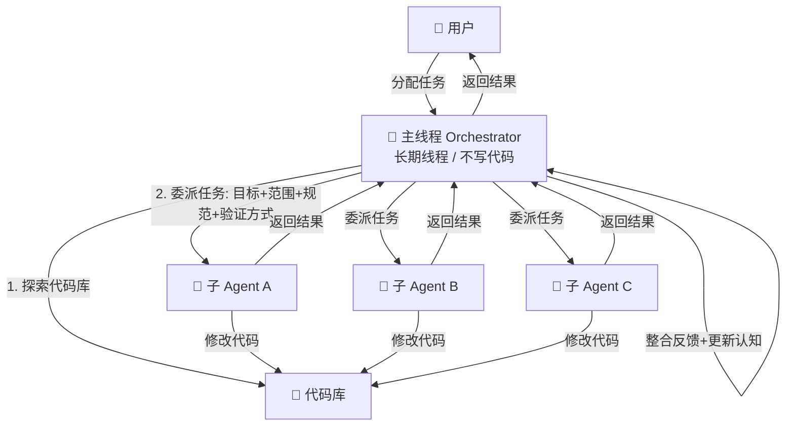

### 3.2 与传统方式的对比

| 维度 | 传统方式（多个独立会话） | Orchestrator 模式 |
|------|----------|-------------------|
| **记忆** | 每次重新探索代码库 | 持续积累，加深理解 |
| **效率** | 重复解释代码库结构 | 一次理解，持续复用 |
| **配合** | 每次生硬从零开始 | 越来越顺畅 |
| **质量** | 不稳定 | 持续改进 |
| **角色定位** | 执行者 | **管理者** |

> 关键洞察：主线程不会随着上下文变长而变笨，反而会越来越聪明——因为对代码库的理解在不断加深。

### 3.3 启动 Prompt 模板

**第一步：初始化阶段**

```
You are the orchestrator for this repo. Start by exploring the entire codebase.
Map the architecture, module boundaries, conventions, entry points, dependencies,
test patterns, and anything fragile or non-obvious. Do not make any changes.
Write a summary I can confirm.

From this point on, this thread is a living memory of the repo.
```

**第二步：任务处理**

```
When I give you a task, don't implement it yourself — spawn a subagent with a clear prompt:
the goal, the files it owns, the files it must not touch, the conventions to follow,
and how to verify the work. If I give you multiple tasks, spawn multiple subagents.

When subagents complete, review their output, incorporate what you learned,
and update your understanding of the repo.
```

**第三步：压缩保护（关键！）**

```
When context is compacted, preserve: the repo architecture summary,
all conventions and patterns, decisions we've made, known fragile areas,
and anything a future subagent would need to do good work.
Do not let compaction erase what we've built.

If the repo is complex enough, create and maintain ORCHESTRATOR.md in the repo —
a living summary of architecture, conventions, decisions, known risks, and current state.
```

### 3.4 给子 Agent 的任务委派模板

好的委派要包含四个要素：

```
目标：[具体要实现什么]
你负责的文件：[精确列出文件路径]
你不能碰的文件：[明确禁止修改的范围]
约定遵守：[代码风格、测试要求、命名规范等]
验证方式：[如何确认任务完成，比如运行什么测试]
```

---

## 四、上下文隔离策略

多 Agent 之间如何共享信息，直接影响质量和成本。

### 4.1 两种协作模式

| 维度 | 通信模式（推荐） | 共享上下文模式 |
|------|----------|----------------|
| **核心思想** | 上下文不共享，只传递结果 | 子 Agent 继承父 Agent 完整历史 |
| **子 Agent 视野** | 只看到自己的任务 | 拥有完整的历史 |
| **成本** | 低 | 极高（无法复用 KV 缓存） |
| **适用场景** | 指令清晰、只关心最终输出 | 需要大量中间过程和历史背景 |
| **典型例子** | 代码库中搜索特定模式 | 深度研究并撰写最终报告 |

> 💡 **选择建议**：默认优先通信模式——轻量、隔离、成本低。只有当子任务确实需要完整历史背景时，才谨慎使用共享上下文模式。

### 4.2 通信模式的最佳实践

主 Agent 委派时，给子 Agent 的 prompt 要足够自包含：

- 不依赖主 Agent 的对话历史
- 包含足够上下文让子 Agent 独立执行
- 明确指定输出格式，便于主 Agent 解析

### 4.3 上下文隔离的好处

子 Agent 在独立的上下文窗口中工作，具有三个关键优势：

1. **不受主线程"上下文腐烂"影响** — 子 Agent 总是从干净状态开始
2. **并行执行** — 多个子 Agent 同时工作，互不干扰
3. **失败隔离** — 一个子 Agent 出错不影响其他子 Agent

---

## 五、Claude Code 的多 Agent 功能

### 5.1 子 Agent 派遣（Subagent Spawn）

Claude Code 支持主 Agent 通过 Task 工具派遣子 Agent：

```
# 在与主 Agent 的对话中
请并行完成以下三个独立任务：
1. 给 UserService 添加单元测试
2. 重构 OrderController 中的错误处理
3. 更新 API 文档中的认证说明
```

Claude Code 会自动启动三个子 Agent 并行执行，并等待所有结果。

### 5.2 子 Agent 的工具限制

给子 Agent 限制工具访问是重要的安全实践：

- 只读任务的子 Agent：只给 Read、Grep、Glob 权限
- 写代码的子 Agent：给 Read、Write、Edit 权限，但禁止 Bash（避免意外执行命令）
- 高风险操作：保留在主线程，需要人工确认

### 5.3 Worktree 隔离

对于可能产生冲突的并行任务，使用 Git Worktree 为每个子 Agent 提供独立的工作目录：

```bash
# 为并行任务创建独立工作树
git worktree add ../feature-auth feature/auth
git worktree add ../feature-payment feature/payment
```

每个子 Agent 在自己的工作树中工作，完成后合并回主分支。

---

## 六、何时使用多 Agent

### 决策框架

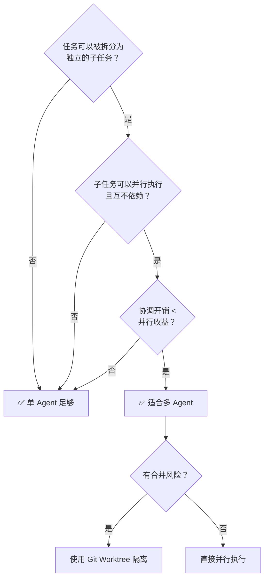

### 场景对应推荐

| 场景 | 推荐方案 | 原因 |
|------|---------|------|
| 单个 Bug | 单 Agent | 上下文需要连贯，多 Agent 没有优势 |
| 中等功能实现 | 单 Agent + 分阶段 | 通常不到单 Agent 上下文极限 |
| 大型重构 | 多 Agent 并行 + Worktree | 不同模块可独立重构，合并风险可控 |
| 代码审查 + 修复 | Writer-Reviewer | 双重上下文视角发现盲点 |
| 高风险变更 | 多 Agent 互审 + 人工确认 | 安全性要求高于效率 |
| 跨仓库任务 | 多 Agent 各管一个仓库 | 天然隔离，无合并冲突 |

---

## 七、多 Agent 的常见坑

### 7.1 合并冲突

多个子 Agent 并行修改同一文件是最常见的失败模式。研究数据显示，对同一文件并行修改的成功合并率约为 21%。

**避免方式**：
- 在委派任务前明确划分文件所有权，每个子 Agent 只负责各自的文件
- 使用 Git Worktree 为每个 Agent 创建独立工作空间
- 复杂任务在主线程串行协调，子 Agent 并行执行

### 7.2 上下文泄漏

子 Agent 意外修改了不该修改的文件，或暴露了敏感信息。

**避免方式**：
- 明确在委派 prompt 中列出禁止修改的文件
- 使用 settings.json 的 allow/deny 规则限制子 Agent 的工具权限

### 7.3 成本失控

多 Agent 的成本是单 Agent 的 N 倍，容易超出预期。

**避免方式**：
- 只有真正需要并行的任务才用多 Agent
- 子 Agent 使用 Low Effort 或便宜模型，主 Agent 用强模型
- 设置任务前估算 token 消耗

### 7.4 调试困难

子 Agent 出错时，定位问题比单 Agent 难。

**避免方式**：
- 主 Agent 要求子 Agent 在完成时提供执行摘要（做了什么、发现了什么、有没有异常）
- 子 Agent 的输出要结构化，便于主 Agent 解析和整合

---

## 八、实用建议

1. **从单 Agent 开始** — 除非任务明确需要并行，单 Agent 更简单、更可预测
2. **主线程保持稳定** — Orchestrator 主线程要长期存在，不要频繁 /clear
3. **子 Agent 一次性使用** — 完成任务后丢弃，不要复用同一个子 Agent 做不同任务
4. **建立 ORCHESTRATOR.md** — 复杂项目用文件持久化代码库认知，抵抗上下文压缩的信息丢失
5. **测试驱动委派** — 给子 Agent 的任务要带验证标准，不然无法判断是否成功

---

> 📖 相关内容：
> - 多 Agent 的设计模式细节 → [Ch10 · Agent 设计模式与代码库策略](../chapters/ch18-agent-patterns.md)
> - 多 Agent 的上下文管理 → [上下文工程](../topics/topic-context-engineering.md)
> - Swarm vs Team 的组织权衡 → [Ch10 · Agent 设计模式与代码库策略](../chapters/ch18-agent-patterns.md)

---

返回总览：[返回仓库 README](../../README.md)

返回目录：[README · 章节目录](../../README.md#tutorial-contents)

</details>

<details>
<summary><span style="color: #e67e22; font-weight: bold;">📐 进阶：大型项目 Agent 策略</span></summary>

---
> 📚 **Part IV · 进阶专题** | [← 返回专题目录](../../README.md#tutorial-contents)
---

# 🏗️ 大型项目策略

> 🎯 当项目规模超过 Agent 的上下文窗口时，如何拆分、编排和管理 Agent 的工作。

## 目录
- [1. 概述](#1-概述)
- [2. 核心内容](#2-核心内容)
- [3. 实战建议](#3-实战建议)

---

## 1. 概述

Agent 在小项目上游刃有余，但面对几十万行代码的大型项目时会遇到明显瓶颈：上下文不够用、容易迷失、跨模块修改容易出错。这篇专题讲的是：如何通过任务分解、上下文管理、多 Agent 协作等策略，让 Agent 在大型项目中也能高效工作。

---

## 2. 项目规模与策略对应

| 项目规模 | 文件数 | 主要挑战 | 推荐策略 |
|---------|-------|---------|---------|
| 小型 | <50 | 几乎没有 | Agent 可以直接全局理解 |
| 中型 | 50-500 | Agent 无法一次读完 | 维护入口文件 + 渐进探索 |
| 大型 | 500-5000 | 定位关键代码困难 | 模块化指引 + 聚焦单模块 |
| 超大型 | 5000+ | 上下文严重不足 | 多 Agent 分模块 + 严格边界 |

---

## 3. 入口文件策略

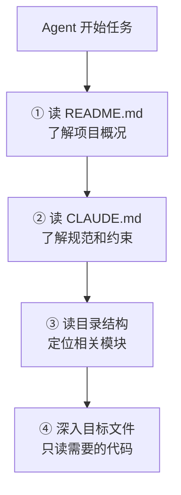

---

## 4. CLAUDE.md 的结构建议

```markdown
# 项目简介
[一句话说明这是什么项目]

# 技术栈
[列出主要技术和版本]

# 项目结构
src/
  auth/       # 认证模块
  api/        # API 路由
  models/     # 数据模型
  utils/      # 工具函数

# 常用命令
- 启动：`npm run dev`
- 测试：`npm test`
- 构建：`npm run build`
- Lint：`npm run lint`

# 编码规范
- [列出关键规范]

# 注意事项
- [列出 Agent 容易踩的坑]
```

---

## 5. 实战建议

- **中型项目**：在 CLAUDE.md 中说明项目关键入口文件，维护 README 中的模块说明
- **大型项目**：聚焦单模块工作，用目录结构引导 Agent 渐进探索
- **超大型项目**：采用多 Agent 分模块策略，每个 Agent 只负责自己的模块边界

---

> 📖 **相关章节**：[👥 多 Agent 组合专题](../topics/topic-multi-agent.md) · [🎯 任务适配度](../topics/topic-task-fit.md) · [🧩 上下文工程深入](../topics/topic-context-engineering.md)

---

返回目录：[README · 章节目录](../../README.md#tutorial-contents)

</details>
