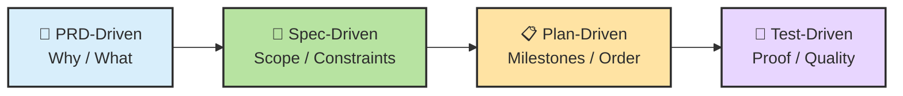
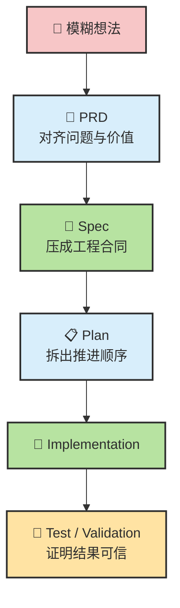
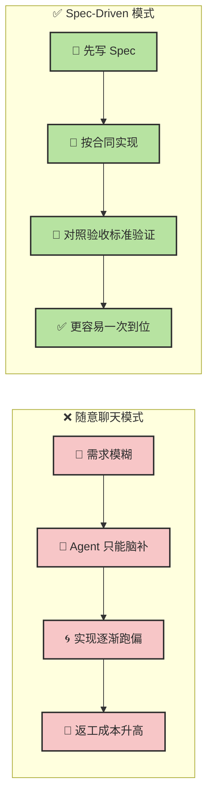
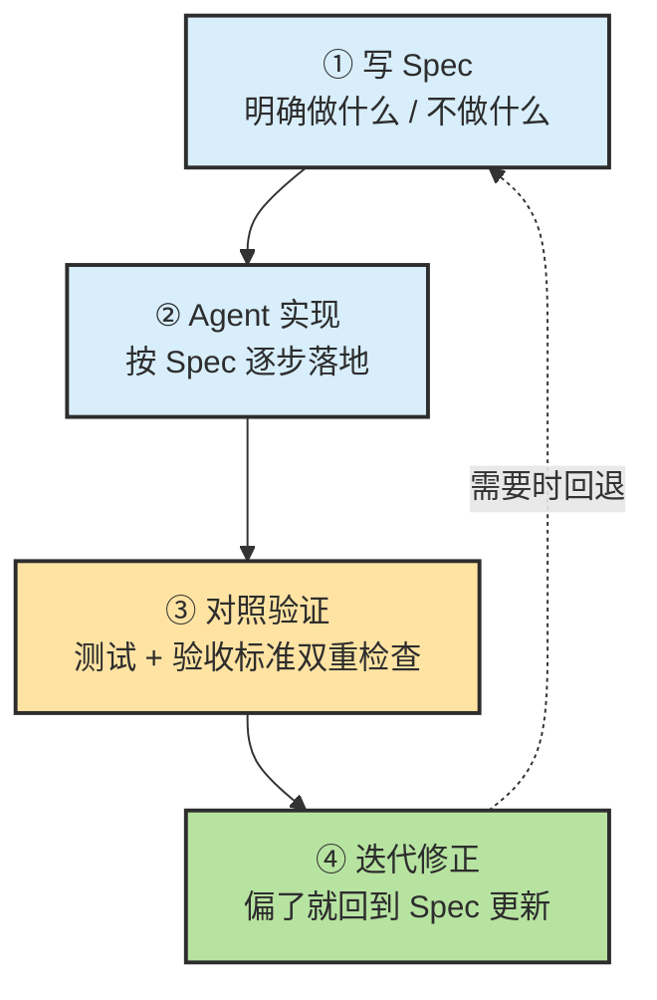
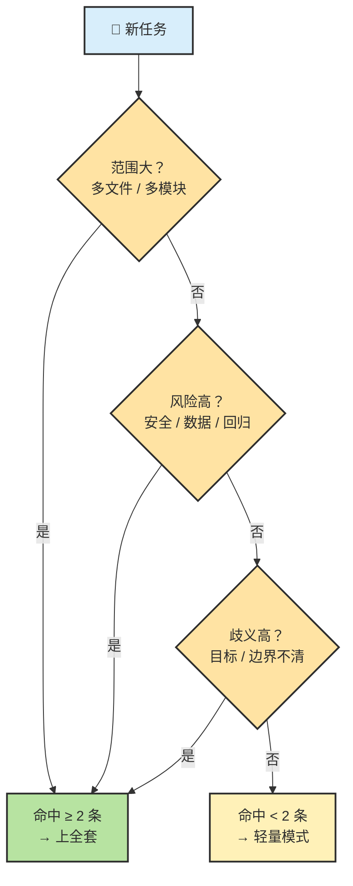
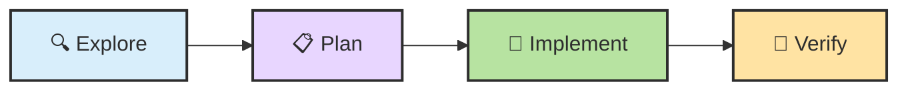

# Chapter 18 · 🧭 XDD 开发方法链

> 🎯 **目标**：理解 PRD-Driven / Spec-Driven / Plan-Driven / Test-Driven 这四种方法不是互斥流派，而是从产品意图到质量证明的连续链路。读完这一章，你应该知道每一层回答什么问题、什么任务值得上全套链路、以及怎样在 Claude Code / Codex 里落地。

> 📌 **和其他章节的分工**：本章讲方法论链条（PRD → Spec → Plan → Test 各层的边界和接力关系）；Ch10 讲 Planning 在 Agent 公式里的机制位置；Ch20 讲质量保障与验收的具体操作。

## 📑 目录

- [1. 先校准几个直觉](#1-先校准几个直觉)
- [2. 一张总图：四层方法链](#2-一张总图四层方法链)
- [3. PRD-Driven：先讲"为什么做"](#3-prd-driven先讲为什么做)
- [4. Spec-Driven：把需求压成工程合同](#4-spec-driven把需求压成工程合同)
- [5. Plan-Driven：把 Spec 变成里程碑](#5-plan-driven把-spec-变成里程碑)
- [6. Test / Validation-Driven：证明它做对了](#6-test--validation-driven证明它做对了)
- [7. 什么任务值得上全套 XDD](#7-什么任务值得上全套-xdd)
- [8. 在 Claude Code / Codex 里怎么落地](#8-在-claude-code--codex-里怎么落地)

---

## 1. 先校准几个直觉

在开始之前，先把最容易想错的事摆正。很多人不是不会用 Agent，而是一开始就把它用在了最容易失控的模式里。

| # | 常见直觉 | 更接近现实的说法 |
|---|---|---|
| 1 | "模型够强，一句话它就懂" | 模型会补全，但不会读心。需求一模糊，它就开始脑补 |
| 2 | "Spec 就是写文档，太重了" | 对 Agent 来说，Spec 更像持续引用的**执行合同**，不是摆设 |
| 3 | "Plan 和 Spec 差不多" | 只说对一半。Spec 偏**边界与目标**，Plan 偏**顺序与里程碑** |
| 4 | "只要有 Spec，就不用测试了" | Spec 解决"别跑偏"，Test 解决"别自欺" |
| 5 | "PRD / Spec / Plan / Test 都是一个东西" | 它们处在不同层级，分别回答不同问题 |
| 6 | "文档越长越好" | 关键信息清晰、可执行、可验证，比堆字数重要得多 |

先记住这一句，后面很多内容就不会学歪：

> 🎯 **Agent 时代最有价值的，不是"让 AI 直接开写"，而是"把任务逐层结构化，直到它能被稳定执行和验证"。**

---

## 2. 一张总图：四层方法链

如果你把这几种 XDD 当成互斥流派，很容易讲乱。它们不是"互相替代"，而是"互相接力"。



### 四层分别回答什么问题

| 层 | 核心问题 | 主要产物 |
|---|---|---|
| **PRD-Driven** | 为什么做？做什么？给谁用？ | PRD / Problem Statement / User Story |
| **Spec-Driven** | 范围是什么？做到什么算完成？ | spec.md / acceptance criteria / constraints |
| **Plan-Driven** | 先做哪部分？按什么顺序推进？ | plan.md / milestones / tasks |
| **Test / Validation-Driven** | 怎么证明它真的做对了？ | tests / checks / CI / eval |

### 从模糊想法到可信交付



> 🧠 **业界主流正在收敛到同一个方向：先结构化，再执行。** GitHub 把它产品化成 Spec Kit 的 `/specify → /plan → /tasks`；Anthropic 推荐复杂任务遵循 Explore → Plan → Implement → Commit；OpenAI 在 Codex 里强调 `plan.md + acceptance criteria + validation commands`。

---

## 3. PRD-Driven：先讲"为什么做"

### PRD 到底在解决什么问题

PRD（Product Requirements Document）更偏**产品层**。它不是告诉工程师"具体怎么实现"，而是帮团队先达成共识：

- 我们到底在解决什么问题
- 这个功能对谁有价值
- 什么叫成功
- 当前版本做什么、不做什么

> 📌 **先定义"问题"，再定义"方案"。** 很多 AI 生成代码失败，不是技术方案错，而是**做错了问题**。

### PRD 应该强调什么、不该强调什么

| PRD 应该强调 | PRD 不该过度强调 |
|---|---|
| 用户是谁 | 过早绑定具体类名 / 函数名 |
| 当前痛点是什么 | 每个函数怎么写 |
| 目标指标是什么 | 过早决定底层实现细节 |
| 核心用户流程 | 机械式技术清单 |

### 一个够用的 PRD 模板

```markdown
# PRD: [功能名]

## Problem
- 用户当前面临什么问题

## Users
- 目标用户画像

## Goal
- 核心指标与期望改善

## Success Metrics
- 可量化的成功标准

## Scope
- ✅ 本期做什么
- ❌ 本期不做什么

## User Flow
- 关键路径描述

## Risks
- 已知风险列表
```

### PRD 的局限

PRD 解决的是 Why / What，但通常还不够细，不能直接拿来让 Agent 稳定实现。Agent 拿到 PRD 后还会继续猜：旧 session 怎么办？错误态要不要提示？哪些文件允许改？

> 🧭 **PRD 是起点，但不是落地终点。它需要继续下沉成 Spec。**

---

## 4. Spec-Driven：把需求压成工程合同

### 核心不是"写文档"，而是"去歧义"

SDD（Spec-Driven Development）的本质是：**把模糊任务压缩成可执行、可验证、可追责的工程合同。** 不是写更多文档，而是让 Agent 少猜、少脑补、少跑偏。

> 🎯 **Spec-Driven Development = 把模糊任务，压缩成可执行、可验证的工程合同。**

### 为什么 SDD 对 Agent 特别有效

| 原因 | 说明 |
|---|---|
| **减少歧义** | 缩小 Agent 的猜测空间 |
| **提供锚点** | 让"做完了没"有客观标准 |
| **限制过度设计** | 避免 Agent 顺手扩 Scope |
| **方便拆分** | 天然适合继续生成 plan / tasks |

### SDD 与"随意聊天"的对比



| 维度 | ❌ 随意聊天 | ✅ SDD |
|---|---|---|
| 输入质量 | "帮我加个登录功能" | 明确的 Spec + 验收标准 |
| Agent 行为 | 猜测你的意图，容易偏离 | 按合同逐条实现 |
| 验证依据 | "看起来对不对" | 对照 Spec 逐条检查 |
| 返工率 | 40%+ | <10% |

### SDD 四步工作流



### Spec 模板

一份好的 Spec 至少应覆盖以下结构：

```markdown
# Feature Spec: [功能名]

## Objective
- 解决什么问题、为什么做

## Scope
- ✅ In Scope
- ❌ Out of Scope

## Constraints
- 技术栈、安全约束、性能边界、兼容性

## Design Notes
- 涉及模块、关键接口、数据流

## Acceptance Criteria
- [ ] 可验证条件 1
- [ ] 可验证条件 2
- [ ] 测试通过

## Validation Commands
- npm test / pytest / npm run build

## Boundaries
- ✅ Always — 默认就该做
- ⚠️ Ask First — 高影响改动先确认
- 🚫 Never — 明确禁区
```

### 三层边界：比"注意安全"有用得多

一个非常实用的技巧是把边界写成三层，而不是一句模糊的"注意别改错"：

| 边界层 | 含义 | 示例 |
|---|---|---|
| ✅ **Always** | 默认就该做 | 改完必须跑测试 |
| ⚠️ **Ask First** | 高影响改动先确认 | 改数据库 schema、加依赖 |
| 🚫 **Never** | 明确禁区 | 改 secrets、删生产配置 |

> 🧠 **如果你只说"注意别改错"，Agent 不知道什么叫"错"。但如果你给它三层边界，它就更接近在一个有制度的工程环境里工作。**

### SDD 的局限

Spec 不是万能的。Spec 过长、过碎、互相冲突时，反而会引入上下文噪音。大上下文不等于大可靠，instruction 太多反而消耗模型的注意力预算。

关键不是"把所有东西写进去"，而是**只把会提升稳定性的内容写进 Spec**。

---

## 5. Plan-Driven：把 Spec 变成里程碑

### Plan 为什么不是 Spec 的同义词

Spec 回答**做什么、不做什么、做到什么算完成**。Plan 回答**先做哪一部分、步骤之间怎么依赖、每个阶段在哪里验证**。

> 📌 **Spec 更像合同，Plan 更像施工图。**

### 为什么业界越来越强调"先 Plan 再写"

- Anthropic 官方推荐复杂任务遵循 **Explore → Plan → Implement → Commit**，Plan Mode 会先只读分析代码库并主动向用户追问
- OpenAI 在 Codex 长任务实践中把 `plan.md` 定位成把 open-ended work 变成可验证 checkpoint 的核心工件
- GitHub 的 Spec Kit 把 `/plan` 独立成正式步骤，而不是让 Spec 直接跳 Implementation

### Plan 的核心价值

1. **控制执行顺序**：防止 Agent 东一榔头西一棒
2. **减少振荡**：避免做着做着推翻自己
3. **利于 review**：计划错误比代码错误便宜修
4. **天然适合 milestone 验收**：每完成一段就验证一次

### 一个够用的 plan.md 模板

```markdown
# Plan: [功能名]

## Milestone 1: 理解现有代码
- 阅读现有相关模块
- 确认依赖和影响面
- 输出影响分析

Validation: 无代码改动，仅输出分析结果

## Milestone 2: 后端核心实现
- 接入核心逻辑
- 补充错误处理
- Acceptance Criteria:
  - 正常路径可通
  - 异常路径有明确错误

Validation: pytest tests/ && npm run lint

## Milestone 3: 前端入口
- 增加 UI 入口
- 处理 loading / error state

Validation: npm test && npm run build

## Stop-and-Fix Rule
- 任一 milestone 验证失败，先修复，再继续
```

### 任务粒度的黄金区间

| 标准 | 说明 |
|---|---|
| 🎯 **单一职责** | 一个任务只做一件事 |
| 🧪 **可独立验证** | 有明确的"做完了"判断标准 |
| 📏 **30 分钟法则** | Agent 应该在 30 分钟内完成（含验证），否则继续拆 |
| 📦 **一个 PR 可审查** | 改动范围在一次 Code Review 中可以理解 |

### 停点比清单重要

Plan 最重要的不是"列出很多 TODO"，而是告诉 Agent 什么时候该停下来检查。

> 🧭 **停点（stop-and-fix）才是 Plan 的灵魂。** 没有停点的 Plan 只是一张任务清单；有停点的 Plan 才是真正的执行控制。

### Plan 的局限

计划不是越细越好。过细会让 Agent 失去适应现实代码库的空间；过粗又起不到减少振荡的作用。最理想的 Plan 介于两者之间：**足够指导顺序，但不替代思考。**

---

## 6. Test / Validation-Driven：证明它做对了

### 为什么这一层不能省

没有验证时，Agent 最常见的失败不是"完全没做"，而是**看起来做对了**——局部能跑，边界没覆盖，回归没测，风格不一致。

> 🎯 **Spec 解决"目标正确"，Test / Validation 解决"结果可信"。**

### TDD 的经典定义

TDD 的原始含义是一种**代码级微循环**：先写失败的测试（Red），再写最简单能通过的实现（Green），然后重构（Refactor）。它不是产品定义层，也不是任务规划层。

### 在 Agent 时代，验证不只是单元测试

真正有用的验证层往往还包括：构建通过、Lint / type check、截图验证、集成测试、PR review checklist、Eval / rubric-based scoring。所以更准确地说：

> 🧠 **Agent 时代的 Test-Driven，更接近 Validation-Driven Development。**

### 四档验证层

| 档位 | 典型手段 | 解决什么问题 |
|---|---|---|
| **Unit / Component** | 单测、组件测试 | 局部逻辑行为 |
| **Integration / Build** | 集成测试、构建、lint | 系统能否协同运行 |
| **Acceptance** | 验收标准、手工检查 | 是否符合 spec / PRD |
| **Eval / Workflow** | rubric、trace 检查、score | Agent 是否按预期流程工作 |

### 验证清单模板

```markdown
## Validation Checklist

### Unit / Component
- [ ] 新增逻辑有单元测试
- [ ] 关键边界条件覆盖

### Integration
- [ ] build 通过
- [ ] lint / type check 通过
- [ ] 关键集成流程无回归

### Acceptance
- [ ] 对照 spec 的 acceptance criteria 逐条检查
- [ ] 用户路径走通
- [ ] 明确 error state

### Agent Workflow
- [ ] 是否按 plan 执行
- [ ] 是否运行了要求的验证命令
- [ ] 是否越界改动
```

### 测试的局限

测试不是银弹。你可以把错误的需求写成正确的测试，也可以把糟糕的用户体验做成一套全绿的自动化脚本。

> 🧠 **测试能证明"实现符合某组规则"，但不能替代对"问题是否值得解决"的判断。** 这也是为什么它必须在 PRD / Spec / Plan 的后面。

---

## 7. 什么任务值得上全套 XDD

不是所有任务都需要走完四层。写全套链路本身也有成本。

### 决策流程



### 三条判断法

如果一个任务同时满足下面三条中的**两条以上**，通常就值得上结构化方法：

| 条件 | 说明 |
|---|---|
| **范围大** | 多文件、多模块、多角色 |
| **风险高** | 安全、数据、兼容性、回归代价大 |
| **歧义高** | 目标、边界、成功标准不够清晰 |

### 两端的典型场景

| 很适合上全套 | 不值得重型化 |
|---|---|
| 新功能开发 | 改一行文案 |
| 跨前后端改动 | 修 typo |
| 鉴权、支付、数据库迁移 | 已知文件中的小型 rename |
| 多 agent / CI 协同任务 | 一次性 throwaway 脚本 |
| 团队协作、需要可审计 | 明确范围内的简单 lint fix |

---

## 8. 在 Claude Code / Codex 里怎么落地

### 四层方法链与 Agent 工具的对齐

| 方法链层 | Claude Code 里更像什么 | Codex 里更像什么 |
|---|---|---|
| **PRD-Driven** | 你与 Claude 的需求澄清阶段 | 任务描述 + context |
| **Spec-Driven** | 固化成 `spec.md` 的功能合同 | acceptance criteria |
| **Plan-Driven** | Plan Mode 产出的实施计划 | `plan.md` + milestones |
| **Test / Validation** | 测试、构建、hooks、review | validation commands |

### Claude Code 的自然落地方式

Claude Code 官方推荐复杂任务遵循：



- **Explore**：只读理解仓库与现状
- **Plan**：追问需求，形成计划
- **Implement**：按计划实现
- **Verify**：验证后再收尾

### 可复用的四个 Prompt

**Prompt 1：让 Agent 当需求采访者**

```text
我想做一个 [功能名]。先不要写代码。
请扮演资深产品经理 + 架构师，通过多轮提问帮我补齐：
1. 目标  2. 用户  3. 范围  4. 边界条件  5. 风险  6. 验收标准
每轮最多问 5 个问题。信息足够后，输出 PRD.md + spec.md。
```

**Prompt 2：从 Spec 生成 Plan**

```text
请基于 spec.md 生成 plan.md。要求：
1. 按 milestone 拆分
2. 每个 milestone 有 acceptance criteria
3. 每个 milestone 有 validation commands
4. 验证失败必须先修复再继续
5. 标注高风险改动和需要我确认的决策
```

**Prompt 3：按计划实现，禁止跳步**

```text
请严格按 spec.md 和 plan.md 实现。要求：
1. 一次只做一个 milestone
2. 完成后立即运行验证命令
3. 不要擅自扩展 Out of Scope
4. 发现 spec 与仓库现实冲突时暂停并提出修正建议
5. 完成后逐条对照 acceptance criteria 自检
```

**Prompt 4：Spec-Review Skill 思路**

```text
# Skill: spec-review
## When to use
- 需求模糊 / 将开始新功能 / Agent 多次跑偏

## Workflow
1. 阅读用户目标 → 2. 先问澄清问题 → 3. 补齐 scope / constraints / risks
→ 4. 生成 spec.md → 5. 输出 missing assumptions → 6. 提醒确认高风险决策

## Output
- spec.md / 风险列表 / 待确认问题
```

<details>
<summary><span style="color: #e67e22; font-weight: bold;">进阶：四种任务类型的 XDD 配置建议</span></summary>

不同类型的任务，四层方法链的"重量"应该不同：

| 任务类型 | PRD | Spec | Plan | Test | 说明 |
|---|:---:|:---:|:---:|:---:|---|
| **探索性任务**（spike / 技术调研） | 轻 | 轻 | 无 | 轻 | 目标是"搞清楚能不能做"，不需要完整链路 |
| **实现性任务**（新功能） | 完整 | 完整 | 完整 | 完整 | 四层全上，最大化稳定性 |
| **调试性任务**（bug fix） | 无 | 轻 | 轻 | 重 | 核心在于定位问题 + 验证修复 |
| **长周期任务**（重构 / 迁移） | 完整 | 完整 | 重 | 重 | Plan 需要特别细，milestone 要小 |

</details>

<details>
<summary><span style="color: #e67e22; font-weight: bold;">进阶：完整的 Prompt / Skill 模板集</span></summary>

### 需求采访者 Skill

```markdown
# Skill: requirement-interview

## Trigger
- 用户说"我想做一个..."但没有 spec
- 需求描述少于 3 句话

## Workflow
1. 确认问题域和目标用户
2. 追问 scope boundary（做什么 / 不做什么）
3. 追问约束条件（技术栈 / 安全 / 性能）
4. 追问验收标准（怎么算做完）
5. 追问风险（已知的坑）
6. 输出 PRD.md + spec.md

## Rules
- 每轮最多 5 个问题
- 发现需求冲突要明确指出
- 不要在澄清阶段就开始写代码
```

### Plan 生成器 Skill

```markdown
# Skill: plan-generator

## Input
- spec.md

## Output
- plan.md（milestone 结构）

## Rules
- 每个 milestone 必须有 acceptance criteria
- 每个 milestone 必须有 validation commands
- 标注依赖关系和并行可能性
- 高风险 milestone 必须标记 ⚠️
- 最后一个 milestone 必须是"全量回归验证"
```

### 实现执行器 Skill

```markdown
# Skill: plan-executor

## Input
- spec.md + plan.md

## Rules
- 一次只做一个 milestone
- 完成后立即跑 validation commands
- 验证失败 → 修复 → 重新验证，不跳步
- 不改 Out of Scope 的东西
- 遇到 spec 与现实冲突 → 暂停 → 提修正建议
- 完成后逐条自检 acceptance criteria
```

</details>

---

## 📌 本章总结

### 三条最值得带走的判断

1. **四种 XDD 不是同义词，而是一条方法链。** PRD 负责定义问题，Spec 负责定义边界，Plan 负责定义顺序，Test 负责证明结果。

2. **Spec-Driven 不等于"写更多文档"，而是"把模糊任务压成可执行合同"。** 这是 Agent 从聊天玩具变成工程协作者的关键一步。

3. **最成熟的做法不是只停在 Spec。** 它会继续长成：`PRD.md → spec.md → plan.md → tests / evals / hooks / repo rules`。

### 一句压缩版定义

> **PRD 决定值不值得做，Spec 决定到底做什么，Plan 决定先怎么做，Test 决定它是不是真的做对了。**

---

## 📚 继续阅读

- 想深入理解 Planning 在 Agent 公式里的机制位置：[Ch10 · Planning](./ch10-planning.md)
- 想了解质量保障与验收的具体操作：[Ch20 · 质量保障与验收](./ch20-quality-assurance-review-eval.md)
- 想看工程化工作流的完整落地：[Ch19 · Agent 设计模式](./ch19-agent-design-patterns.md)

---

<div align="center">

[📚 返回目录](../../README.md#tutorial-contents) | [⬅️ 上一章：Ch17 Agent 错误用法](./ch17-agent-anti-patterns.md) | [➡️ 下一章：Ch19 Agent 设计模式](./ch19-agent-design-patterns.md)

</div>
