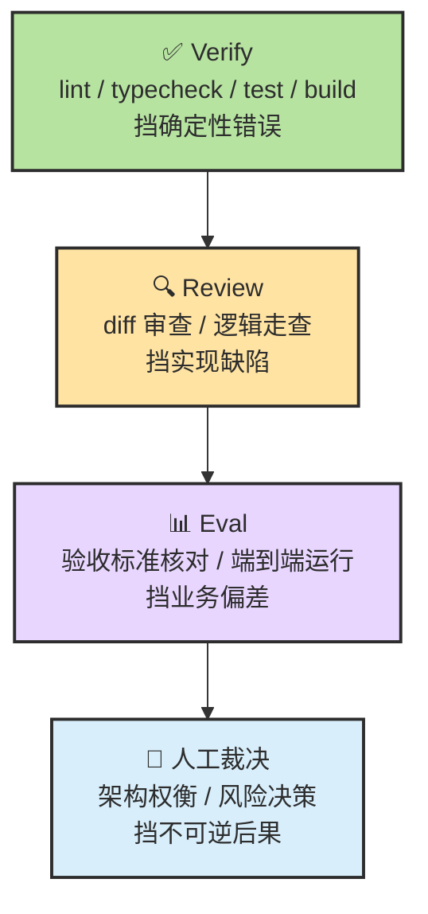
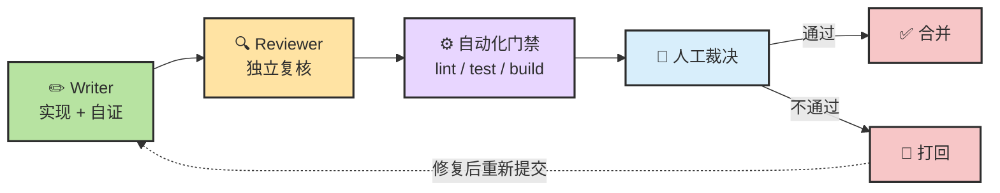
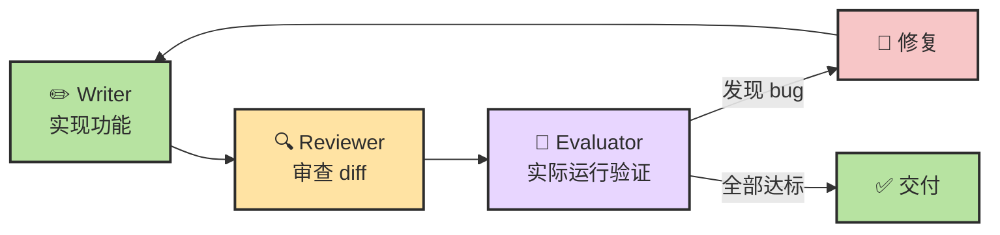
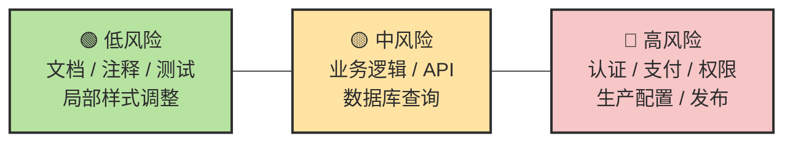
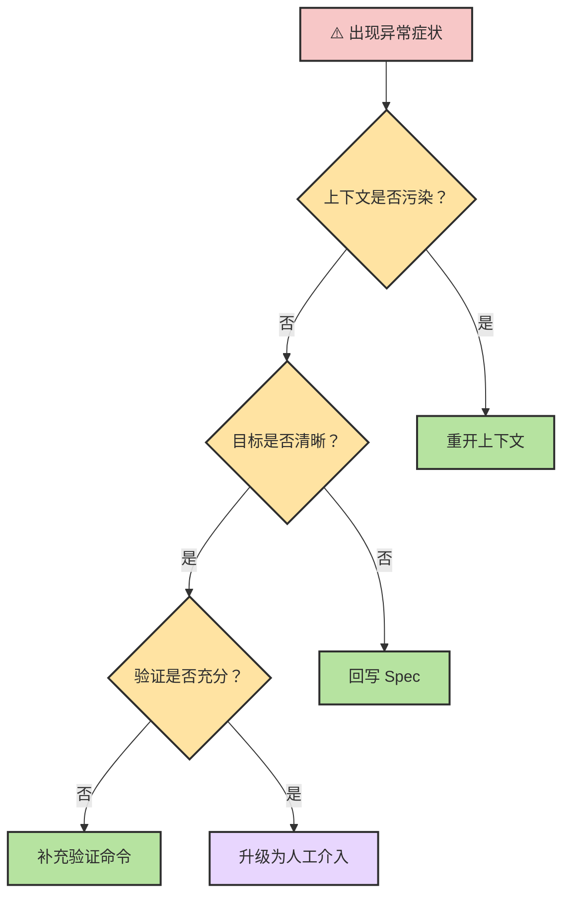

# Chapter 20 · ✅ 质量保障与验收

> 🎯 **目标**：把"写出来"升级成"能被接受地交付出来"。读完这一章，你应该知道 Verify / Review / Eval 分别解决什么问题，怎样组织最小交付链，以及什么样的证据才足够支撑合并与验收。

> 📌 **和其他章节的分工**：本章讲交付质量链（验证、审查、验收、评估的分层配合）；Ch18 讲方法论链条（PRD/Spec/Plan/Test）；Ch17 讲失效模式和恢复动作。

## 📑 目录

- [1. 先校准几个直觉](#1-先校准几个直觉)
- [2. Verify、Review、Eval 不是一回事](#2-verifyrevieweval-不是一回事)
- [3. 一条最小交付链](#3-一条最小交付链)
- [4. Writer-Reviewer 双 Agent 审查](#4-writer-reviewer-双-agent-审查)
- [5. Evaluator Agent：从抽查到自动化 QA](#5-evaluator-agent从抽查到自动化-qa)
- [6. 验收标准与 Eval 设计](#6-验收标准与-eval-设计)
- [7. AI 幻觉与常见陷阱](#7-ai-幻觉与常见陷阱)
- [8. 风险分级与人工裁决](#8-风险分级与人工裁决)
- [9. Merge 前清单](#9-merge-前清单)

---

## 1. 先校准几个直觉

质量保障最大的敌人不是技术，而是**错误的心理模型**。开始之前，先校准几个最常见的直觉偏差。

| 直觉 | 现实 |
|------|------|
| 测试通过 = 验收通过 | 测试只证明"在这些用例上没坏"，不能自动证明"满足了业务目的" |
| Agent 说"完成了" = 真完成了 | Agent 的自信度和正确性之间没有可靠关联 |
| Code Review 过了 = 可以合并 | Review 检查的是实现质量，不替代验收标准的逐条确认 |
| 多跑几轮对话就更可靠 | 同一个会话里的 Agent 带着确认偏误越聊越深，不是越聊越准 |
| 自动化能解决一切 | 自动化挡得住确定性错误，挡不住业务判断和架构权衡 |

> 🧠 **关键认知**：质量保障不是一个动作，而是一条分层协作的链。每一层解决不同性质的问题，跳过任何一层都会留下盲区。

---

## 2. Verify、Review、Eval 不是一回事

很多人把这三件事混成一句"你再检查一下"，于是层次消失、问题漏检。

### 三层定义

| 概念 | 主要回答什么问题 | 谁来做 | 典型手段 |
|------|-----------------|--------|---------|
| **Verify** | 这个改动在技术上有没有过基本检查？ | 自动化 + Writer | lint、typecheck、单测、构建 |
| **Review** | 这份实现有没有明显缺陷、风险或不必要复杂度？ | Reviewer Agent / 人 | diff 审查、逻辑走查、安全扫描 |
| **Eval** | 我们能否系统、可重复地判断它是否达到目标？ | Evaluator Agent / 人 | 验收标准逐条核对、端到端运行验证、业务确认 |

### 对比表：不是 X，而是 Y

| 容易混淆的说法 | 更准确的理解 |
|---------------|------------|
| "Verify 就够了" | Verify 只证明"没坏"，不证明"做对了" |
| "Review 就是 Eval" | Review 看实现质量，Eval 看业务达标 |
| "Eval 太重了，小项目不需要" | 哪怕一条验收标准 + 一个验证命令，也是 Eval |

### 分层关系图



> 🧭 **记忆锚点**：Verify 看"有没有坏"，Review 看"有没有问题"，Eval 看"有没有达标"，人看"能不能承受后果"。

---

## 3. 一条最小交付链

质量保障不需要复杂的流程——但需要**正确的分层**。

### 四步交付链

```text
Writer 自证 → Reviewer 复核 → 自动化门禁 → 人工裁决
```

每一步的分工：

| 步骤 | 谁做 | 做什么 | 产出 |
|------|------|--------|------|
| **Writer 自证** | 实现 Agent | 写代码 + 跑验证 + 输出证据 | 代码 + 测试结果 + 构建日志 |
| **Reviewer 复核** | 独立 Reviewer Agent | 只看 diff + spec + 验收标准 + 验证证据 | 结构化审查报告 |
| **自动化门禁** | CI/CD | lint / typecheck / test / build | 通过/阻塞 |
| **人工裁决** | 你 | 业务判断 + 风险评估 | 合并或打回 |

### 流程图



> 📌 **关键原则**：Agent 建议，人类裁决。自动化阻塞确定性错误，人工兜底高判断任务。

---

## 4. Writer-Reviewer 双 Agent 审查

### 为什么必须分离

同一个会话里的 Agent 很容易带着"我知道自己为什么这么写"的偏见继续看代码。这不是 Prompt 能解决的问题，而是**上下文污染的结构性缺陷**。

独立 Reviewer 的价值在于三件事：

1. **只看 diff + spec + 验收标准**，更容易发现遗漏
2. **不继承 Writer 的试错历史**，减少确认偏误
3. **更适合输出结构化问题单**，而不是复述实现思路

| 模式 | 优点 | 缺点 |
|------|------|------|
| Writer 自审 | 零成本、即时 | 确认偏误严重，容易放过自己的盲区 |
| Writer + 独立 Reviewer | 对抗偏误、结构化输出 | 多一轮 Agent 调用，需要组织输入 |
| Writer + Reviewer + Evaluator | 三层覆盖，可重复验证 | 成本最高，适合中高风险任务 |

### Reviewer 的输入最少要有什么

| 输入 | 作用 |
|------|------|
| **Spec / 需求摘要** | 判断是否做偏 |
| **Diff** | 聚焦本次改动 |
| **验收标准** | 判断"完成"而不是只判断"看起来没问题" |
| **验证结果** | 区分"已经跑过"与"只是声称跑过" |

> 🧠 **核心洞察**：Reviewer 不需要看全部代码，只需要看 diff + 目标 + 证据。信息越聚焦，审查质量越高。

### Reviewer 提示词模板

```text
请审查当前分支相对于 main 的改动。

审查依据：
1. spec.md 中的需求与验收标准
2. 当前 diff
3. 已运行的验证结果

请重点检查：
- 逻辑正确性和边界条件
- 错误处理是否完整
- 是否引入了不必要的复杂度
- 测试是否真正覆盖验收标准

输出格式：
- 🔴 阻塞合并
- 🟡 建议修复
- 🟢 可选优化

只报告真正的问题，不要为了凑数而报告风格偏好。
```

---

## 5. Evaluator Agent：从抽查到自动化 QA

Writer-Reviewer 模式已经比单 Agent 自检好很多，但两者都有一个共同局限：**它们在看代码，而不是在运行代码**。

### Evaluator 的工作方式

Evaluator Agent 展示了一种更彻底的验证思路——不是让 Agent 声称"我检查过了"，而是用**外部 Agent 实际运行应用**来验证。

| 步骤 | 动作 |
|------|------|
| 1. 启动 | 用 Playwright 真正启动应用 |
| 2. 交互 | 点击界面、调用 API、查询数据库 |
| 3. 评分 | 从功能性、设计质量、工艺等维度打分 |
| 4. 反馈 | 发现问题后提 bug，要求 Writer 重做 |
| 5. 循环 | 直到所有验证标准达标 |

### Self-Review vs Evaluator 对比

| 维度 | Self-Review | Evaluator |
|------|-----------|-----------|
| 验证方式 | 读代码 | 跑代码 |
| 发现深度 | 表面逻辑问题 | 运行时真实 bug |
| 偏见风险 | 高（同一上下文） | 低（独立上下文 + 实际执行） |
| 成本 | 低 | 中等（需要运行环境） |
| 适用场景 | 低风险快速迭代 | 中高风险交付验证 |

> 🎯 **关键区分**：Verify 层用自动化挡语法错误，Review 层用 Reviewer 挡逻辑缺陷，Eval 层用 Evaluator 挡业务偏差。三者不是替代关系，而是递进关系。

### Evaluator 的实际效果

实际数据显示：单次 sprint 中 Evaluator 平均抓出 27+ 个真实 bug，远超 Writer 自检能发现的数量。这说明"看代码"和"跑代码"之间存在巨大的信息差。



---

## 6. 验收标准与 Eval 设计

只做 Review 不够。**先定义"什么算通过"**，才是质量保障体系的骨架。

### "测试通过≠验收通过"

这是本章最重要的一句话。理解这个区分，就理解了为什么很多项目"绿了但没用"。

| 概念 | 回答的问题 | 例子 |
|------|-----------|------|
| **测试通过** | 这些用例没坏 | `auth.test.ts` 全绿 |
| **验收通过** | 业务目标达到了 | 过期 token 被拒、未过期 token 放行、错误格式符合规范 |

测试是验收的**证据之一**，但不是验收本身。验收标准必须独立于测试存在。

### 一个最小验收模板

```markdown
## 目标
用户可以在 token 过期后被正确拒绝访问

## 验收标准
- 过期 token 返回 401
- 未过期 token 正常通过
- 错误信息符合现有 API 响应格式

## 证据
- `npm test -- auth.test.ts`
- `npm run lint`
- Reviewer 审查结论
```

### 设计 Eval 的三个动作

| 动作 | 说明 | 反例 |
|------|------|------|
| **把需求写成可验证句子** | 每条验收都是一个能判真假的命题 | ❌ "体验更好" → ✅ "提交后出现成功提示，并刷新列表" |
| **每条关键验收都要有证据来源** | 测试、截图、日志、构建结果至少占一种 | ❌ "我看过了" → ✅ `npm test` 输出截图 |
| **把不可自动化的判断显式留给人** | 标记哪些需要人工裁决 | ❌ 全自动通过 → ✅ "架构权衡需人工确认" |

> 🧭 **设计原则**：好的验收标准是可判真假的、有证据支撑的、自动化与人工边界清晰的。

---

## 7. AI 幻觉与常见陷阱

Agent 生成的代码看起来"自信且完整"，但可能包含人眼难以察觉的幻觉。理解这些陷阱并建立防御策略，是质量保障的最后一道防线。

### 最常见的五类幻觉

| 类型 | 典型表现 | 为什么危险 | 对策 |
|------|---------|-----------|------|
| **API 虚构** | 调用了不存在的函数或参数 | 编译不报错但运行时崩溃 | 类型检查、编译验证 |
| **版本幻觉** | 使用当前版本不支持的语法或能力 | 本地能跑但 CI 环境崩溃 | 锁定运行时版本、锁定官方文档 |
| **依赖幻觉** | import 了仓库里根本没有的包 | 构建失败或引入未审计依赖 | 限制只能使用现有依赖 |
| **上下文遗忘** | 前面约定了接口，后面又改口 | 前后不一致导致集成失败 | 把契约写进文件，而不是只留在会话 |
| **测试幻觉** | 测试绿了，但根本没验证核心行为 | 假安全感，上线后暴雷 | 设计反例、边界用例和回归用例 |

### 三条最有效的防御动作

**1. 编译即验证**

不要等到 Review 才发现 API 不存在。让类型系统在第一时间挡住幻觉。

```text
TypeScript → tsc --noEmit
Python → mypy --strict
Go → go vet ./...
Rust → cargo check
```

**2. 锁定依赖来源**

把以下规则写进 CLAUDE.md 或 Spec：

```markdown
## 依赖管理规则
- 禁止新增依赖，除非我明确批准
- 只能使用 package.json / requirements.txt 中已有的包
- 如需新增依赖，先说明包名、版本、用途和替代方案
```

**3. 用"反例"测测试**

```text
写完测试后，故意把关键条件反转一次，
确认测试能失败，再恢复正确实现。
如果反转后测试仍然绿，说明测试没在验证你以为它验证的东西。
```

### "信任-验证"矩阵

不同风险级别对应不同的验证深度，不是所有改动都需要逐行审计。

| 风险级别 | 场景 | 验证深度 |
|---------|------|---------|
| **低风险** | 格式化、重命名、简单配置 | 快速浏览 + 自动化验证 |
| **中风险** | API、业务逻辑、算法实现 | 逐函数审查 + 边界测试 |
| **高风险** | 认证、支付、数据迁移、权限控制 | 逐行审计 + 手动验证 + 同事互审 |

> 🎯 **经验法则**：不可逆程度越高，验证越要深。按钮位置错了能热修；数据删错了可能回不来。

---

## 8. 风险分级与人工裁决

Agent 能不能放权，不是一个开关问题，而是一个**光谱问题**。

### 风险光谱



### 三级分工

| 级别 | 典型任务 | Agent 自治度 | 人的角色 |
|------|---------|-------------|---------|
| **低风险** | 文档、注释、测试、局部改动 | 高——可自动合并 | 抽检即可 |
| **中风险** | API 实现、业务逻辑、数据库操作 | 中——需要 Review 通过 | 审查 diff + 验收标准 |
| **高风险** | 发布与回滚、权限与凭据、生产配置、安全相关、架构级不可逆决策 | 低——必须人工审批 | 逐行审计 + 最终裁决 |

> 🧠 **判断公式**：`自治程度 ∝ 1 / (不可逆程度 × 影响范围 × 外部依赖强度)`

### 什么时候必须拉回人工

以下信号出现任意一个，就应该暂停自动化流程，等待人工介入：

- 涉及生产环境的任何写操作
- 涉及凭据、密钥、权限的任何变更
- 架构级别的不可逆决策（删库、迁移方案）
- Agent 连续两轮未能通过验证
- Reviewer 给出 🔴 阻塞合并标记

---

## 9. Merge 前清单

### 合并前的六个问题

在点下 Merge 之前，逐条过一遍：

1. 这次改动是否有明确的 Spec 或需求摘要？
2. 验收标准是否写出来了，而不是只靠口头理解？
3. 自动化验证是否真实跑过，并保留了结果？
4. Reviewer 是否在独立上下文下审过本次 diff？
5. 高风险点是否被人工看过，而不是只靠 Agent 通过？
6. 这次改动是否可回滚、可定位、可解释？

### Merge Checklist 模板

```markdown
## Merge Checklist

- [ ] 需求 / Spec 已确认
- [ ] 验收标准已列出
- [ ] lint / typecheck / test 全通过
- [ ] Reviewer 已输出审查结论
- [ ] 高风险改动已人工审阅
- [ ] 回滚路径已明确
```

> 📌 **使用建议**：把这个 checklist 放进 PR 模板。不需要每次都填满，但它的存在会强制你在合并前停下来想一想。

---

<details>
<summary><strong>进阶：GitHub Actions CI 集成模板</strong></summary>

### `agent-review.yml` 完整代码

将 Agent 审查集成到 CI/CD 流程中，让每个 PR 自动获得一份审查报告。

```yaml
name: Agent Quality Review

on:
  pull_request:
    types: [opened, synchronize, reopened]

permissions:
  contents: read
  pull-requests: write

jobs:
  agent-review:
    runs-on: ubuntu-latest
    timeout-minutes: 10

    steps:
      - name: Checkout code
        uses: actions/checkout@v4
        with:
          fetch-depth: 0

      - name: Get changed files
        id: changed
        run: |
          FILES=$(git diff --name-only origin/${{ github.base_ref }}...HEAD \
            | grep -E '\.(ts|tsx|js|jsx|py|go|rs)$' \
            | head -20)
          echo "files<<EOF" >> $GITHUB_OUTPUT
          echo "$FILES" >> $GITHUB_OUTPUT
          echo "EOF" >> $GITHUB_OUTPUT

      - name: Generate diff context
        id: diff
        run: |
          DIFF=$(git diff origin/${{ github.base_ref }}...HEAD \
            -- ${{ steps.changed.outputs.files }} \
            | head -3000)
          echo "content<<EOF" >> $GITHUB_OUTPUT
          echo "$DIFF" >> $GITHUB_OUTPUT
          echo "EOF" >> $GITHUB_OUTPUT

      - name: AI Quality Review
        uses: actions/github-script@v7
        env:
          ANTHROPIC_API_KEY: ${{ secrets.ANTHROPIC_API_KEY }}
        with:
          script: |
            const diff = `${{ steps.diff.outputs.content }}`;
            if (!diff.trim()) {
              console.log('No reviewable changes found.');
              return;
            }

            const response = await fetch('https://api.anthropic.com/v1/messages', {
              method: 'POST',
              headers: {
                'Content-Type': 'application/json',
                'x-api-key': process.env.ANTHROPIC_API_KEY,
                'anthropic-version': '2023-06-01'
              },
              body: JSON.stringify({
                model: 'claude-sonnet-4-20250514',
                max_tokens: 4096,
                messages: [{
                  role: 'user',
                  content: `你是一位严格的代码审查员。请审查以下 PR diff：

            ${diff}

            审查重点：安全漏洞、逻辑错误、错误处理缺失、性能问题。
            使用 🔴（必须修复）、🟡（建议修复）、🟢（可选优化）标记问题。
            只报告真正的问题。如果代码质量良好，直接给出正面评价。
            用中文回复。`
                }]
              })
            });

            const result = await response.json();
            const review = result.content[0].text;

            await github.rest.issues.createComment({
              owner: context.repo.owner,
              repo: context.repo.repo,
              issue_number: context.issue.number,
              body: `## 🤖 Agent Quality Review\n\n${review}\n\n---\n*由 AI 自动生成，仅供参考。最终决策请以人工审查为准。*`
            });
```

### CI 里的三层职责定位

| 层级 | 职责 | 建议 |
|------|------|------|
| **L1 自动化** | 阻塞不通过的 lint / typecheck / test | 硬性门禁，必须全绿才能合并 |
| **L2 Agent 审查** | 以 comment 形式给结论 | 辅助参考，不直接代替人工决策 |
| **L3 人工裁决** | 根据业务风险决定合并或打回 | 最终拍板，尤其是高风险改动 |

</details>

---

<details>
<summary><strong>进阶：症状-根因-恢复动作诊断表</strong></summary>

当 Agent 工作流出现问题时，不要急着重试。先用这张诊断表定位根因，再选择最短恢复路径。

| 症状 | 更可能的根因 | 第一恢复动作 |
|------|------------|-------------|
| Agent 开始重复读同样的文件 | 会话已污染或任务太大 | 压缩或重开上下文 |
| 改了几轮仍无实质进展 | 错误尝试进入了新上下文 | 回到最近可信检查点 |
| 输出很流畅但不对 | 缺少外部验证 | 强制补测试、日志、命令结果 |
| 方案越来越复杂 | 目标和范围不清 | 回写 Spec，重收 Scope |
| 测试通过但功能不对 | 测试没覆盖核心行为 | 用反例测试，确认测试能失败 |
| Reviewer 反复报同一类问题 | Writer 的系统提示缺少约束 | 把约束写进 CLAUDE.md 或 Spec |
| Agent 自信声称完成但证据不足 | 没有强制验证步骤 | 在任务指令中加验证命令后缀 |

### 恢复决策流程



</details>

---

## 📌 本章总结

| 核心概念 | 一句话总结 |
|----------|-----------|
| **Verify / Review / Eval** | 三层不同的质量动作，分别挡确定性错误、实现缺陷和业务偏差 |
| **最小交付链** | Writer 自证 → Reviewer 复核 → 自动化门禁 → 人工裁决 |
| **Writer-Reviewer 分离** | 对抗确认偏误的关键设计，Reviewer 只看 diff + 目标 + 证据 |
| **Evaluator Agent** | 从"看代码"升级到"跑代码"，发现运行时真实 bug |
| **测试通过≠验收通过** | 验收标准必须独立于测试存在 |
| **AI 幻觉防御** | 编译验证 + 依赖锁定 + 反例测试 |
| **风险分级** | 自治程度按风险光谱设计，不是全自动或全手动二选一 |
| **Merge 前清单** | 六个问题 + checklist，强制在合并前停下来想一想 |

---

## 📚 继续阅读

- 想了解 Agent 设计模式如何支撑交付链：回看 [Ch19 · Agent 设计模式](./ch19-agent-design-patterns.md)
- 想从成本角度理解质量投入的 ROI：继续看 [Ch21 · Token 经济学](./ch21-token-economics.md)
- 想看失效模式和恢复策略的完整清单：回看 [Ch17 · Agent 错误用法](./ch17-agent-failure-modes.md)

---

<div align="center">

[📚 返回目录](../../README.md#tutorial-contents) | [⬅️ 上一章：Ch19 Agent 设计模式](./ch19-agent-design-patterns.md) | [➡️ 下一章：Ch21 Token 经济学](./ch21-token-economics.md)

</div>
