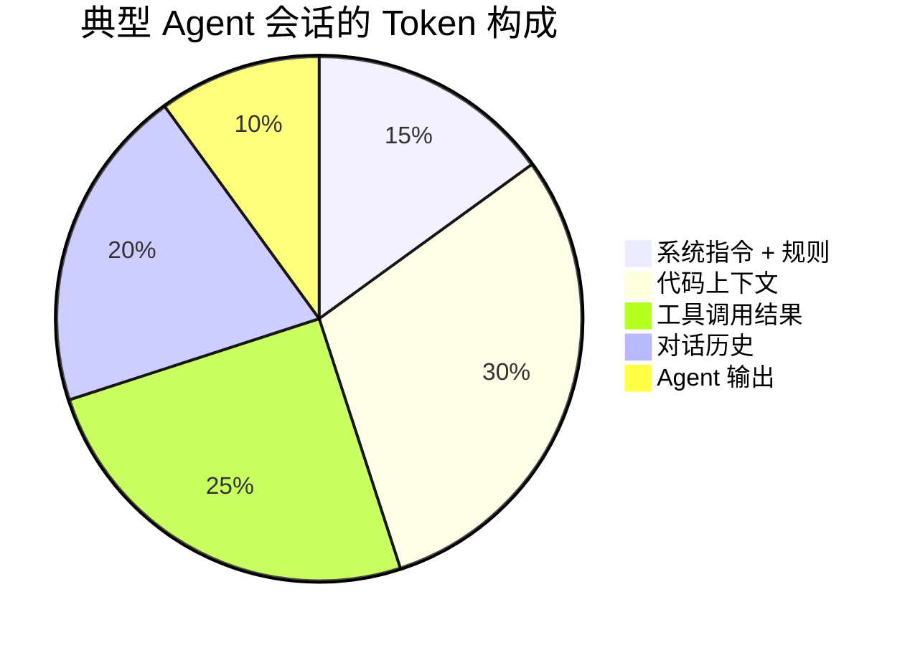

# Chapter 20 · 💰 Token 经济学

> 目标：把 Token 从“计费单位”重新理解成工作流资源。读完这一章，你应该知道为什么长会话会变贵、变慢、变糊，以及什么样的协作习惯最省钱也最稳。

## 目录

- [1. Token 不只是费用问题](#1-token-不只是费用问题)
- [2. Token 到底花在了哪里](#2-token-到底花在了哪里)
- [3. 为什么长会话会越来越贵](#3-为什么长会话会越来越贵)
- [4. 哪些习惯最浪费 Token](#4-哪些习惯最浪费-token)
- [5. 哪些习惯最省 Token 也最稳](#5-哪些习惯最省-token-也最稳)
- [6. 一个更实用的判断方法](#6-一个更实用的判断方法)
- [7. 几个高频问题](#7-几个高频问题)

## 1. Token 不只是费用问题

Token 同时影响三件事：

- 成本
- 延迟
- 上下文质量

所以 Token 管理不是抠门，而是系统设计的一部分。

## 2. Token 到底花在了哪里

真实 Agent 会话里，Token 往往主要花在这些地方：

| 来源 | 常见内容 |
|---|---|
| 📜 固定前缀 | 系统指令、规则文件、工具描述 |
| 📁 代码上下文 | 被读取的文件、片段、diff |
| 🔧 工具结果 | 测试输出、搜索结果、命令日志 |
| 💬 历史对话 | 之前几轮的讨论、摘要、失败尝试 |
| 📝 模型输出 | 计划、解释、代码、审查意见 |

所以真正昂贵的，通常不是“这一句 prompt 写长了”，而是：

- 前缀太重
- 上下文太脏
- 工具返回太长
- 历史拖得太久

## 3. 为什么长会话会越来越贵

因为每一轮都在把越来越长的历史重新带进去。

这会同时导致：

- 成本上升
- 响应变慢
- 噪音增加
- 早期错误更难清理

这里最容易混的一点是：

> 🧵 **Session 变长，不代表每一轮都必须把整段历史原样带进 Context；但如果 runtime 不做压缩和裁剪，你的成本和噪音都会继续膨胀。**

这也是为什么 Token 经济学和 [Ch11 · Memory、Context 与 Harness](./ch11-memory-context-harness.md) 是一回事的两面：

- 一面看成本
- 一面看上下文质量

## 4. 哪些习惯最浪费 Token

- 什么都塞进一个会话
- 把大段无关日志整段贴进去
- 不做摘要和分阶段回放
- 让 Agent反复读同一堆无关文件

最常见的高浪费场景还有两类：

- 明明只需要失败日志，却把整段构建输出都塞给模型
- 明明是新问题域，却舍不得开新会话，继续背着旧历史硬聊

## 5. 哪些习惯最省 Token 也最稳

- 只注入当前轮真正相关的上下文
- 阶段完成后做摘要
- 不相关任务及时新开会话
- 把稳定信息写进文件，而不是一直靠对话重复

> 📉 **省 Token 最有效的方法，不是抠提示词字数，而是减少脏上下文。**

## 6. 一个更实用的判断方法

很多人一提 Token，就只盯着“这段 prompt 能不能再短一点”。但在真实工作流里，更值钱的问题往往是：

- 这轮 context 里有没有不相关的大块噪音
- 这段历史还有没有必要继续带着
- 这个任务是不是已经应该阶段总结后开新会话
- 这条信息是应该继续塞在聊天里，还是该写回文件

所以更有效的节约方式通常是：

> 🎯 **减少脏上下文，而不是只压缩字数。**

## 7. 几个高频问题

**Q：是不是只要换便宜模型，就算做了 Token 优化？**  
不算。那只是换单价，不是优化消耗结构。真正的优化是减少无效上下文、控制工具输出、缩短脏会话寿命。

**Q：省 Token 会不会等于信息给少了，质量更差？**  
不一定。很多时候正相反。删掉噪音、保留高密度证据，通常既更省，也更稳。

**Q：最该先优化哪一块？**  
通常先看三件事：规则文件是否过重、工具返回是否过长、会话是否已经该压缩或重开。

## 📌 本章总结

- Token 同时影响成本、延迟和上下文质量，不只是计费问题。
- 长会话之所以越来越贵，不只是因为“字多了”，而是因为 session、context 和工具结果一起膨胀。
- 真正有效的优化通常发生在上下文治理、工具输出治理和阶段化会话管理上。
- 省 Token 最有用的方法，不是抠字数，而是减少脏上下文。

## 📚 继续阅读

- 想把 `Session / Context / Memory / KV Cache` 的边界讲透：回看 [Ch11 · Memory、Context 与 Harness](./ch11-memory-context-harness.md)
- 想把质量和成本放进同一条工程链看：继续看 [Ch21 · 质量保障与验收](./ch21-quality-assurance-review-eval.md)

---

[📚 返回目录](../../README.md#tutorial-contents) | [⬅️ 上一章：Ch19 工程化工作流](./ch19-engineering-workflow.md) | [➡️ 下一章：Ch21 质量保障与验收](./ch21-quality-assurance-review-eval.md)

## 📎 保留原文与延伸材料

📎 保留原文：人机协同附录中的 Token 节约深度指南

### Token 消耗的构成

### 各环节的优化策略

#### 系统指令优化

| 问题 | 优化方案 |
|------|---------|
| CLAUDE.md 太长（>5000 tokens） | 分层：核心规则 + 按需引用 |
| 每次对话重复加载相同规则 | 利用 Prompt Cache（自动生效） |
| 临时规则混入永久文件 | 分离：永久规则在文件，临时规则在会话中 |

#### 代码上下文优化

| 问题 | 优化方案 |
|------|---------|
| Agent 一次性读取整个大文件 | 引导 Agent 先读目录结构，按需深入 |
| 多次读取相同文件 | 在 CLAUDE.md 中说明项目关键入口文件 |
| 项目太大 Agent 找不到关键代码 | 维护 README 中的模块说明 |

#### 工具返回优化

| 问题 | 优化方案 |
|------|---------|
| 测试输出全量返回 | 指令中说明“只看失败用例的错误信息” |
| 构建日志动辄上千行 | 使用 `tail` 等方式控制输出 |
| 搜索结果太多 | 使用更精确的搜索条件 |

#### 对话历史优化

| 问题 | 优化方案 |
|------|---------|
| 单个会话持续太久 | 分阶段：每完成一个子任务，考虑新开会话 |
| 中间过程的详细讨论占大量 token | 让 Agent 做阶段总结后继续 |
| 错误尝试的历史堆积 | 重开会话，直接从正确方向开始 |

### 成本估算参考

| 使用模式 | 单次任务 Token | Opus 4.6 成本 | Sonnet 4.6 成本 |
|---------|--------------|-------------|----------------|
| 简单问答 | ~5K | ~$0.05 | ~$0.02 |
| 中等修改 | ~30K | ~$0.50 | ~$0.20 |
| 复杂功能 | ~100K | ~$2.00 | ~$0.80 |
| 大型重构 | ~500K | ~$10.00 | ~$4.00 |

