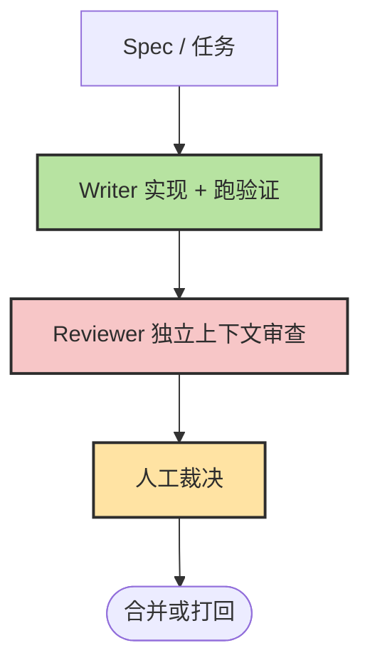

# Chapter 21 · ✅ 质量保障与验收

> 目标：把“写出来”升级成“能被接受地交付出来”。读完这一章，你应该知道 `Verify / Review / Eval` 分别解决什么问题，怎样组织最小交付链，以及什么样的证据才足够支撑合并与验收。

## 📑 目录

- [1. Verify、Review、Eval 不是一回事](#1-verifyrevieweval-不是一回事)
- [2. 一条最小交付链](#2-一条最小交付链)
- [2a. Writer-Reviewer：双 Agent 审查工作流](#2a-writer-reviewer双-agent-审查工作流)
- [3. 常见失败模式](#3-常见失败模式)
- [3a. 验收标准与 Eval 设计](#3a-验收标准与-eval-设计)
- [3b. GitHub Actions 集成模板](#3b-github-actions-集成模板)
- [3c. AI 幻觉与常见陷阱](#3c-ai-幻觉与常见陷阱)
- [4. 症状、根因与第一恢复动作](#4-症状根因与第一恢复动作)
- [5. 风险分级与人工裁决](#5-风险分级与人工裁决)
- [6. Merge 前清单](#6-merge-前清单)

---

## 1. Verify、Review、Eval 不是一回事

| 概念 | 主要回答什么问题 |
|---|---|
| Verify | 这个改动在技术上有没有过基本检查 |
| Review | 这份实现有没有明显缺陷、风险或不必要复杂度 |
| Eval | 我们能否系统、重复地判断它是否达到目标 |

把这三件事混成一句“你再检查一下”，通常就会失去层次。

---

## 2. 一条最小交付链

最推荐的最小交付链是：

```text
Writer 自证 -> Reviewer 复核 -> 自动化门禁 -> 人工裁决
```

它背后对应的分工是：

- Writer：实现并跑基本验证
- Reviewer：只看 diff、Spec、验收标准和验证证据
- 自动化：挡掉 lint、测试、构建等低级错误
- 人类：做最终业务和风险判断

---

## 2a. Writer-Reviewer：双 Agent 审查工作流

最实用的模式不是"一个 Agent 写完顺便自己 review"，而是**Writer 和 Reviewer 分离**。



### 为什么必须分离

同一个会话里的 Agent 很容易带着"我知道自己为什么这么写"的偏见继续看代码。独立 Reviewer 的价值在于：

1. 只看 `diff + spec + 验收标准`，更容易发现遗漏。
2. 不继承 Writer 的试错历史，减少确认偏误。
3. 更适合输出结构化问题单，而不是复述实现思路。

### Reviewer 的输入最少要有什么

| 输入 | 作用 |
|------|------|
| **Spec / 需求摘要** | 判断是否做偏 |
| **Diff** | 聚焦本次改动 |
| **验收标准** | 判断"完成"而不是只判断"看起来没问题" |
| **验证结果** | 区分"已经跑过"与"只是声称跑过" |

### 一份够用的 Reviewer 提示词

```text
请审查当前分支相对于 main 的改动。

审查依据：
1. spec.md 中的需求与验收标准
2. 当前 diff
3. 已运行的验证结果

请重点检查：
- 逻辑正确性和边界条件
- 错误处理是否完整
- 是否引入了不必要的复杂度
- 测试是否真正覆盖验收标准

输出格式：
- 🔴 阻塞合并
- 🟡 建议修复
- 🟢 可选优化

只报告真正的问题，不要为了凑数而报告风格偏好。
```

---

### 2b. Evaluator Agent：让验证从人工抽查升级到自动化 QA

Anthropic Harness 2.0 的 Evaluator Agent 展示了一种更彻底的验证思路：不是让 Agent 自己声称「我检查过了」，而是用**外部 Agent 实际运行应用**来验证。

**Evaluator 的工作方式**：

- 用 Playwright 真正启动应用、点击界面、测试 API 和数据库
- 从设计质量、原创性、工艺、功能性四个维度给出客观评分
- 发现问题后直接提 bug，要求 Generator 重做
- 循环直到所有验证标准达标

**为什么 Evaluator 比 Self-Review 更可靠**：

Writer-Reviewer 模式已经比单 Agent 自检好很多，但 Evaluator 更进一步——它不是在看代码，而是在**运行代码**。这和 Section 1 提到的 Verify/Review/Eval 三层对应：Evaluator 直接做的就是 Eval 层的工作。

实际效果：单次 sprint 中 Evaluator 平均抓出 27+ 个真实 bug，远超 Writer 自检能发现的数量。

---

## 3. 常见失败模式

这些问题在 Agent 工作流里最常见：

| 模式 | 典型表现 |
|---|---|
| 上下文污染 | 什么都塞进一个会话，越聊越乱 |
| 反复纠错循环 | 同一个问题修两三轮仍在原地 |
| 假设传播 | 早期误解一路带到最后 |
| 信任-验证缺口 | 看起来像对了就直接接受 |
| 盲目放权 | 把高风险动作交给自治执行 |

---

## 3a. 验收标准与 Eval 设计

只做 Review 不够，**还要先定义"什么算通过"**。这一步才是质量保障体系的骨架。

### 验收标准和 Review 的区别

| 概念 | 回答的问题 |
|------|-----------|
| **验收标准** | 结果达到业务目标了吗？ |
| **Code Review** | 这份实现有没有明显问题？ |
| **Eval** | 我们能否系统性、重复性地判断它做得对不对？ |

### 一个最小验收模板

```markdown
## 目标
用户可以在 token 过期后被正确拒绝访问

## 验收标准
- 过期 token 返回 401
- 未过期 token 正常通过
- 错误信息符合现有 API 响应格式

## 证据
- `npm test -- auth.test.ts`
- `npm run lint`
- Reviewer 审查结论
```

### 设计 eval 的三个动作

1. **先把需求写成可验证句子**：不要写"体验更好"，要写"提交后出现成功提示，并刷新列表"。
2. **每条关键验收都要有证据来源**：测试、截图、日志、构建结果至少占一种。
3. **把不可自动化的判断显式留给人**：比如架构权衡、性能取舍、业务可接受性。

### 一个常见误区

> 测试通过，不等于验收通过。

测试只能证明"在这些用例上没坏"，不能自动证明"满足了业务目的"。所以验收标准必须独立于测试存在。

---

## 3b. GitHub Actions 集成模板

将 Agent 审查集成到 CI/CD 流程中，可以让每个 PR 自动获得一份审查报告。以下是一个可直接使用的 GitHub Actions 模板：

### `agent-review.yml` 模板

```yaml
name: Agent Quality Review

on:
  pull_request:
    types: [opened, synchronize, reopened]

permissions:
  contents: read
  pull-requests: write

jobs:
  agent-review:
    runs-on: ubuntu-latest
    timeout-minutes: 10

    steps:
      - name: Checkout code
        uses: actions/checkout@v4
        with:
          fetch-depth: 0

      - name: Get changed files
        id: changed
        run: |
          FILES=$(git diff --name-only origin/${{ github.base_ref }}...HEAD \
            | grep -E '\.(ts|tsx|js|jsx|py|go|rs)$' \
            | head -20)
          echo "files<<EOF" >> $GITHUB_OUTPUT
          echo "$FILES" >> $GITHUB_OUTPUT
          echo "EOF" >> $GITHUB_OUTPUT

      - name: Generate diff context
        id: diff
        run: |
          DIFF=$(git diff origin/${{ github.base_ref }}...HEAD \
            -- ${{ steps.changed.outputs.files }} \
            | head -3000)
          echo "content<<EOF" >> $GITHUB_OUTPUT
          echo "$DIFF" >> $GITHUB_OUTPUT
          echo "EOF" >> $GITHUB_OUTPUT

      - name: AI Quality Review
        uses: actions/github-script@v7
        env:
          ANTHROPIC_API_KEY: ${{ secrets.ANTHROPIC_API_KEY }}
        with:
          script: |
            const diff = `${{ steps.diff.outputs.content }}`;
            if (!diff.trim()) {
              console.log('No reviewable changes found.');
              return;
            }

            const response = await fetch('https://api.anthropic.com/v1/messages', {
              method: 'POST',
              headers: {
                'Content-Type': 'application/json',
                'x-api-key': process.env.ANTHROPIC_API_KEY,
                'anthropic-version': '2023-06-01'
              },
              body: JSON.stringify({
                model: 'claude-sonnet-4-20250514',
                max_tokens: 4096,
                messages: [{
                  role: 'user',
                  content: `你是一位严格的代码审查员。请审查以下 PR diff：

            ${diff}

            审查重点：安全漏洞、逻辑错误、错误处理缺失、性能问题。
            使用 🔴（必须修复）、🟡（建议修复）、🟢（可选优化）标记问题。
            只报告真正的问题。如果代码质量良好，直接给出正面评价。
            用中文回复。`
                }]
              })
            });

            const result = await response.json();
            const review = result.content[0].text;

            await github.rest.issues.createComment({
              owner: context.repo.owner,
              repo: context.repo.repo,
              issue_number: context.issue.number,
              body: `## 🤖 Agent Quality Review\n\n${review}\n\n---\n*由 AI 自动生成，仅供参考。最终决策请以人工审查为准。*`
            });
```

### CI 里的三层职责定位

| 层级 | 职责 | 建议 |
|------|------|------|
| **L1 自动化** | 阻塞不通过的 lint / typecheck / test | 硬性门禁 |
| **L2 Agent 审查** | 以 comment 形式给结论 | 不直接代替人工决策 |
| **L3 人工裁决** | 根据业务风险决定合并或打回 | 最终拍板 |

> **原则**：Agent 建议，人类裁决；自动化阻塞确定性错误，人工兜底高判断任务。

---

## 3c. AI 幻觉与常见陷阱

Agent 生成的代码看起来"自信且完整"，但可能包含人眼难以察觉的幻觉。理解这些陷阱并建立防御策略，是质量保障的最后一道防线。

### 最常见的五类幻觉

| 类型 | 典型表现 | 对策 |
|------|---------|------|
| **API 虚构** | 调用了不存在的函数或参数 | 类型检查、编译验证 |
| **版本幻觉** | 使用当前版本不支持的语法或能力 | 锁定运行时版本、锁定官方文档 |
| **依赖幻觉** | import 了仓库里根本没有的包 | 限制只能使用现有依赖 |
| **上下文遗忘** | 前面约定了接口，后面又改口 | 把契约写进文件，而不是只留在会话 |
| **测试幻觉** | 测试绿了，但根本没验证核心行为 | 设计反例、边界用例和回归用例 |

### 三条最有效的防御动作

**1. 编译即验证**

```text
TypeScript 跑 `tsc --noEmit`
Python 跑 `mypy --strict`
```

**2. 锁定依赖来源**

```markdown
## 依赖管理规则
- 禁止新增依赖，除非我明确批准
- 只能使用 package.json / requirements.txt 中已有的包
- 如需新增依赖，先说明包名、版本、用途和替代方案
```

**3. 用"反例"测测试**

```text
写完测试后，故意把关键条件反转一次，
确认测试能失败，再恢复正确实现。
```

### "信任但验证"矩阵

| 风险级别 | 场景 | 验证深度 |
|---------|------|---------|
| **低风险** | 格式化、重命名、简单配置 | 快速浏览 + 自动化验证 |
| **中风险** | API、业务逻辑、算法实现 | 逐函数审查 + 边界测试 |
| **高风险** | 认证、支付、数据迁移、权限控制 | 逐行审计 + 手动验证 + 同事互审 |

> **经验法则**：不可逆程度越高，验证越要深。按钮位置错了能热修；数据删错了可能回不来。

---

## 4. 症状、根因与第一恢复动作

一个更实用的失败处理方式，是用诊断表思维：

| 症状 | 更可能的根因 | 第一恢复动作 |
|---|---|---|
| Agent 开始重复读同样的文件 | 会话已污染或任务太大 | 压缩或重开上下文 |
| 改了几轮仍无实质进展 | 错误尝试进入了新上下文 | 回到最近可信检查点 |
| 输出很流畅但不对 | 缺少外部验证 | 强制补测试、日志、命令结果 |
| 方案越来越复杂 | 目标和范围不清 | 回写 Spec，重收 Scope |

---

## 5. 风险分级与人工裁决

Agent 能不能放权，不是开关，而是风险分级问题。

低风险任务可以更自动化：

- 文档、注释、测试、局部改动

高风险任务必须拉回人工：

- 发布与回滚
- 权限与凭据
- 生产配置
- 安全相关改动
- 架构级不可逆决策

> 🛡️ **越是高风险、不可逆、外部依赖强的动作，越要保留人工裁决。**

---

## 6. Merge 前清单

### 合并前的六个问题

- 这次改动是否有明确的 Spec 或需求摘要？
- 验收标准是否写出来了，而不是只靠口头理解？
- 自动化验证是否真实跑过，并保留了结果？
- Reviewer 是否在独立上下文下审过本次 diff？
- 高风险点是否被人工看过，而不是只靠 Agent 通过？
- 这次改动是否可回滚、可定位、可解释？

### 一个最小 Merge Checklist

```markdown
- [ ] 需求 / Spec 已确认
- [ ] 验收标准已列出
- [ ] lint / typecheck / test 全通过
- [ ] Reviewer 已输出审查结论
- [ ] 高风险改动已人工审阅
- [ ] 回滚路径已明确
```

---

## 📌 本章总结

- `Verify / Review / Eval` 是三层不同的质量动作，不该混用。
- 更稳的交付链是 Writer 自证、Reviewer 复核、自动化门禁与人工裁决分层配合。
- Writer 和 Reviewer 分离是对抗确认偏误的关键设计。
- 验收标准必须独立于测试存在，测试通过不等于验收通过。
- CI 集成可以让 Agent 审查自动化，但不能替代人工裁决。
- AI 幻觉（API 虚构、版本幻觉、依赖幻觉等）需要编译验证和依赖锁定来防御。
- 失败模式最适合用”症状 -> 根因 -> 第一恢复动作”的诊断表来处理。
- 自治程度应按风险分级设计，而不是简单全自动或全手动二选一。
- 合并前用六个问题和 Merge Checklist 做最后把关。

## 📚 继续阅读

- 想从质量体系继续上探到演进脉络：继续看 [Ch22 · 技术简史、演进主线与时间线](./ch22-history-evolution-timeline.md)
- 想回看失效模式和成本约束怎样进入交付链：回看 [Ch17 · Agent 错误用法](./ch17-agent-failure-modes.md) 和 [Ch20 · Token 经济学](./ch20-token-economics.md)

---

<div align=”center”>

[📚 返回目录](../../README.md#tutorial-contents) | [⬅️ 上一章：Ch20 Token 经济学](./ch20-token-economics.md) | [➡️ 下一章：Ch22 技术简史、演进主线与时间线](./ch22-history-evolution-timeline.md)

</div>
