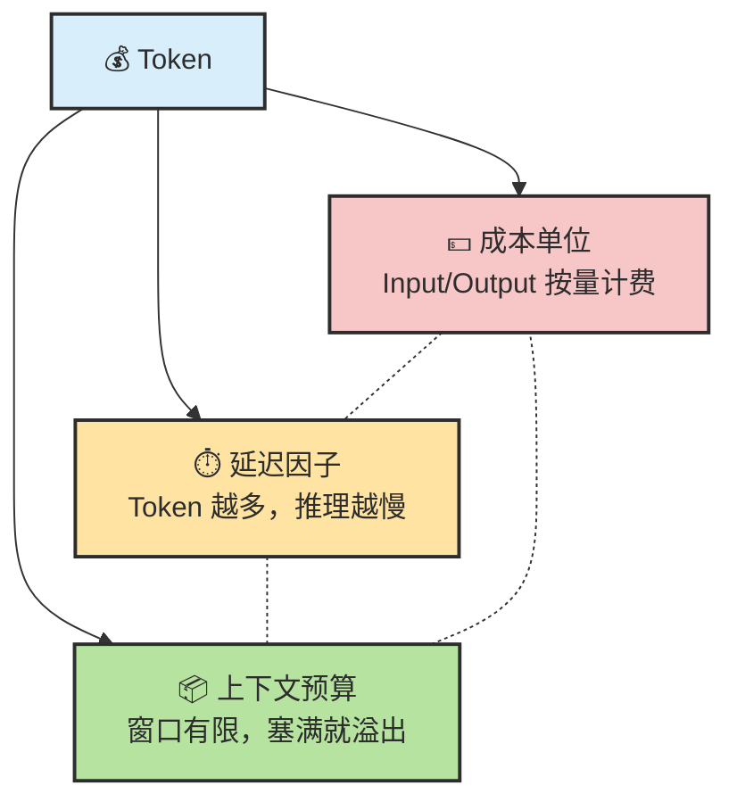
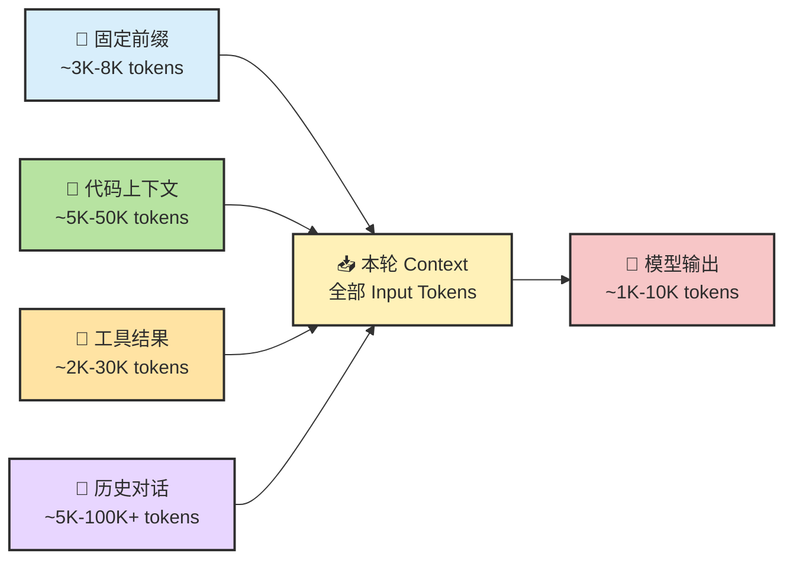
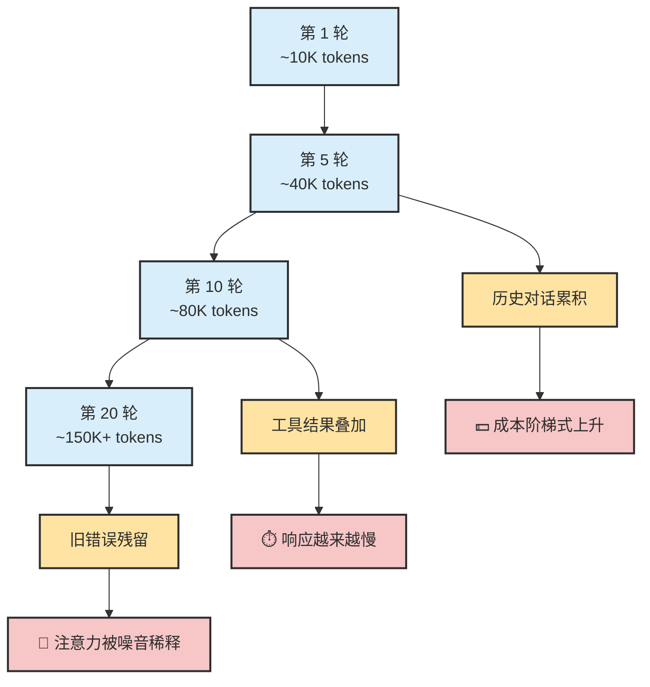
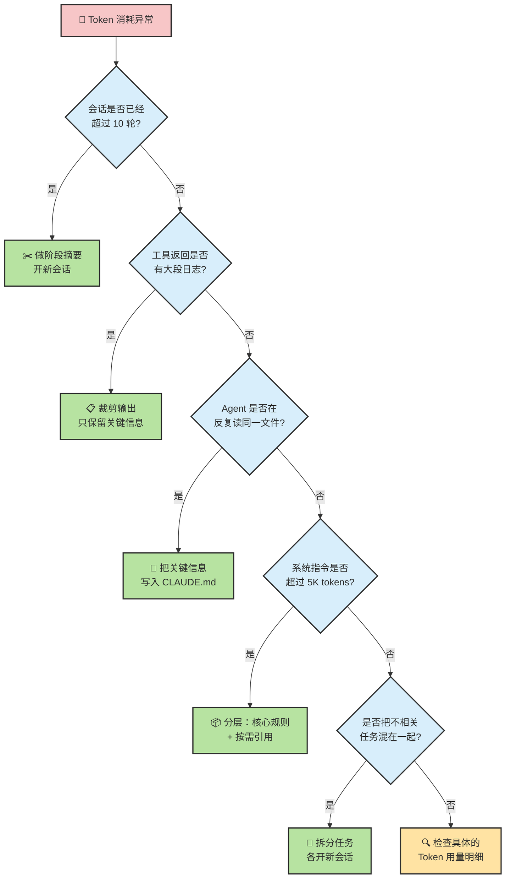

# Chapter 21 · 💰 Token 经济学

> 🎯 **目标**：把 Token 从"计费单位"重新理解成工作流的核心资源。读完这一章，你应该知道 Token 为什么同时影响成本、延迟和质量，长会话为什么会变贵变慢变糊，以及什么样的协作习惯最省钱也最稳。
>
> 📌 **和其他章节的分工**：本章讲 Token 作为工作流资源的经济学视角；Ch11 讲 Memory / Context 的机制层面；Ch20 讲质量保障与验收。

## 📑 目录

- [1. 先校准几个直觉](#1-先校准几个直觉)
- [2. Token 的三重身份](#2-token-的三重身份)
- [3. Token 到底花在了哪里](#3-token-到底花在了哪里)
- [4. 为什么长会话会越来越贵](#4-为什么长会话会越来越贵)
- [5. 六个最浪费 Token 的习惯](#5-六个最浪费-token-的习惯)
- [6. 六个最省 Token 也最稳的习惯](#6-六个最省-token-也最稳的习惯)
- [7. Token 优化的正确思路](#7-token-优化的正确思路)
- [8. 几个高频问题](#8-几个高频问题)

---

## 1. 先校准几个直觉

走到教程最后几章，你已经见过足够多的真实 Agent 工作流了。但一提到 Token，很多人的直觉仍然停留在"就是个计费单位"。先把几个最常见的误解摆出来：

| 常见直觉 | 更接近现实的说法 |
|---|---|
| Token 就是费用，省 Token = 省钱 | Token 同时是成本单位、延迟因子和上下文预算，三件事一起变 |
| 省 Token = 少给信息 | 真正该省的是噪音，不是信号。删掉无关内容通常既更省也更准 |
| 换便宜模型 = 做了优化 | 那只是换了单价，消耗结构没变。就像换加油站不等于省油 |
| Prompt 短一点就够了 | 你的 prompt 可能只占总 Token 的 5%，真正的大头在别处 |
| 长会话只是多花点钱而已 | 长会话同时让延迟飙升、上下文变脏、模型注意力被稀释 |
| 一次把所有信息都给全最好 | 信息过载反而让模型抓不住重点，不如分阶段按需注入 |

> 🧠 **Token 管理不是抠门，而是系统设计的一部分。你管理 Token 的方式，直接决定了 Agent 的运行效率和输出质量。**

---

## 2. Token 的三重身份

Token 不只是账单上的一个数字。它同时扮演三个角色，任何一个失衡都会拖垮整个工作流。

三者之间还存在联动效应：

| 身份 | 核心含义 | 失衡后果 |
|---|---|---|
| 💵 成本单位 | Input Token 和 Output Token 按量计费 | 不必要的上下文直接烧钱 |
| ⏱️ 延迟因子 | 模型处理时间与 Token 数量成正比 | 上下文膨胀后每轮响应明显变慢 |
| 📦 上下文预算 | Context Window 是硬上限，塞满就丢信息 | 关键信息被挤出窗口，模型开始"遗忘" |

> 🧭 **最关键的认知转变：Token 优化不是"怎样花更少的钱"，而是"怎样让每个 Token 都在干正事"。**

---

## 3. Token 到底花在了哪里

一次真实的 Agent 会话中，Token 的流向大致是这样的：

每个来源的细节：

| 来源 | 包含什么 | 典型占比 | 为什么容易失控 |
|---|---|---|---|
| 📜 固定前缀 | 系统指令、CLAUDE.md、工具描述 | 5-15% | 规则文件写太长、工具描述冗余 |
| 📁 代码上下文 | 被读取的文件、搜索结果、diff | 15-30% | Agent 一次读整个大文件、反复读相同内容 |
| 🔧 工具结果 | 测试输出、构建日志、命令返回 | 10-25% | 全量日志原样灌入、搜索结果太多 |
| 💬 历史对话 | 之前几轮的讨论、失败尝试、摘要 | 20-40% | 不做摘要、不开新会话、历史无限膨胀 |
| 📝 模型输出 | 计划、解释、代码、审查意见 | 10-20% | 输出过于冗长、重复解释已知内容 |

> 📌 **真正昂贵的，通常不是"这一句 prompt 写长了"。** 你的 prompt 可能只占 5% 的 Token，而一段被整段灌入的构建日志就吃掉了 30%。

---

## 4. 为什么长会话会越来越贵

长会话的问题不只是"字多了"。每一轮对话都在往 Context 里堆积更多内容，三个因素同时膨胀：

具体来看这三重膨胀：

| 膨胀来源 | 发生了什么 | 后果 |
|---|---|---|
| Session 历史 | 每一轮的完整对话都被带进下一轮 | Token 数线性甚至超线性增长 |
| 工具结果累积 | 之前十轮的测试输出、搜索结果都还在 | 大量过期信息占据上下文 |
| 错误残留 | 第 3 轮的失败尝试到第 15 轮还在 | 模型可能被旧错误误导 |

这也解释了一个常见现象：

> 🧠 **同一个任务，Agent 在第 3 轮做得好好的，到第 15 轮突然开始"犯糊涂"——不是模型变笨了，而是上下文太脏了。**

这里最容易混的一点：

> 📌 **Session 变长，不代表每一轮都必须把整段历史原样带进 Context；但如果 runtime 不做压缩和裁剪，你的成本和噪音都会继续膨胀。**

这也是为什么 Token 经济学和 [Ch11 · Memory、Context 与 Harness](./ch11-memory-context-harness.md) 是一回事的两面——一面看成本，一面看上下文质量。

---

## 5. 六个最浪费 Token 的习惯

### 习惯 1：一个会话从头聊到尾

| ❌ 错误做法 | ✅ 正确做法 |
|---|---|
| 一个 session 里做完需求分析、设计、编码、测试、部署 | 按阶段开新会话，每阶段带摘要进入下一段 |

会话越长，每一轮的 Input Token 就越大。不分段等于让每一步都背着前面所有步骤的包袱。

### 习惯 2：把大段日志原样灌给模型

| ❌ 错误做法 | ✅ 正确做法 |
|---|---|
| 把 2000 行构建日志整段贴进去 | 只贴失败部分：`npm test 2>&1 \| tail -50` |

模型并不需要看到第 47 行的 "Compiling module X... OK"。它需要的是失败信息和上下文线索。

### 习惯 3：让 Agent 反复读同一堆文件

| ❌ 错误做法 | ✅ 正确做法 |
|---|---|
| 每轮都让 Agent 重新读整个配置文件 | 在 CLAUDE.md 中写清关键入口文件位置 |

如果 Agent 每轮都要 `Read` 同一个 500 行的配置文件，10 轮下来就是 5000 行的无效重复消耗。

### 习惯 4：不做阶段摘要

| ❌ 错误做法 | ✅ 正确做法 |
|---|---|
| 完成一个子任务后直接继续下一个 | 让 Agent 生成阶段摘要，把结论写入文件 |

摘要可以把 50K Token 的历史压缩到 2K，同时保留关键决策和结论。

### 习惯 5：不相关任务硬挤进一个会话

| ❌ 错误做法 | ✅ 正确做法 |
|---|---|
| "顺便帮我看看那个 CSS bug" | 新问题新会话，用 `/clear` 或直接开新 session |

不相关的上下文不仅浪费 Token，还会干扰模型对当前任务的理解。

### 习惯 6：让模型重复解释已知内容

| ❌ 错误做法 | ✅ 正确做法 |
|---|---|
| 每次都问"先解释一下这段代码做什么" | 把理解写进注释或文档，后续直接引用 |

模型每次生成解释都消耗 Output Token。把稳定的理解固化到文件里，比每次重新生成更划算。

---

## 6. 六个最省 Token 也最稳的习惯

### 习惯 1：只注入当前轮真正相关的上下文

| 做法 | 效果 |
|---|---|
| 用精确的文件路径和行号引导 Agent | Agent 不需要大海捞针，Token 消耗可控 |
| 在 prompt 里说清"只看 src/auth/ 目录" | 避免 Agent 搜索整个项目 |

### 习惯 2：阶段完成后做摘要再继续

| 做法 | 效果 |
|---|---|
| "请把刚才的修改总结成 3 条要点" | 下一阶段只需带摘要，不需带完整历史 |
| 把摘要写入 `PROGRESS.md` 等文件 | 新会话可以直接读取，不需要口头复述 |

### 习惯 3：不相关任务及时开新会话

| 做法 | 效果 |
|---|---|
| 一个任务完成后 `/clear` 或开新 session | 上下文干净，模型注意力集中 |
| 用 `--resume` 只在需要延续时恢复 | 避免默认背着旧历史 |

### 习惯 4：把稳定信息写进文件

| 做法 | 效果 |
|---|---|
| 项目约定写在 CLAUDE.md 里 | 不需要每次在对话中重复 |
| 关键决策写进 ADR 或 README | Agent 需要时自己去读，不用你反复口述 |

### 习惯 5：控制工具输出长度

| 做法 | 效果 |
|---|---|
| 指令中说明"只看失败用例" | 避免 Agent 把 passing tests 也读一遍 |
| 搜索时用更精确的条件 | 减少返回结果数量 |

### 习惯 6：善用 Prompt Cache

| 做法 | 效果 |
|---|---|
| 把稳定不变的指令放在 prompt 最前面 | 自动触发 Prompt Cache，Input 成本降低 90% |
| 频繁变化的信息放在后面 | 不影响缓存命中率 |

> 📌 **省 Token 最有效的方法，不是抠提示词字数，而是减少脏上下文。**

---

## 7. Token 优化的正确思路

遇到 Token 问题时，不要急着删字。先按这个流程排查：

核心原则只有一条：

> 🎯 **减少脏上下文，而不是抠字数。**

什么叫"脏上下文"？就是那些还留在 Context 里，但对当前这一轮已经没有用的信息——过期的讨论、成功的测试输出、已经修完的 bug 记录、无关任务的残留。

把这些清掉，Token 自然就省了，模型也自然更准。

---

## 8. 几个高频问题

**Q：是不是只要换便宜模型，就算做了 Token 优化？**
不算。那只是换单价，不是优化消耗结构。就像你开一辆油耗 20L/百公里的车，换个便宜加油站并不等于省油。真正的优化是减少无效上下文、控制工具输出、缩短脏会话寿命。

**Q：省 Token 会不会等于信息给少了，质量更差？**
不一定。很多时候正相反。删掉噪音、保留高密度证据，通常既更省也更稳。信噪比比信息总量更重要。

**Q：最该先优化哪一块？**
通常先看三件事：会话是否已经该压缩或重开、工具返回是否过长、规则文件是否过重。这三项往往占了 80% 的浪费。

**Q：Prompt Cache 是什么？我需要手动设置吗？**
Prompt Cache 是运行时对 prompt 前缀的自动缓存。对于 Claude Code 这类工具，只要你的系统指令和 CLAUDE.md 放在 prompt 前部且内容稳定，Cache 就会自动生效，重复调用的 Input 成本最多降低 90%。你不需要手动设置。

**Q：怎么知道我的 Token 花在了哪里？**
在 Claude Code 中，用 `/cost` 可以看到当前 session 的 Token 用量概况。如果发现某一轮消耗异常，通常是工具返回或历史累积导致的。

**Q：Context Window 满了会怎样？**
Runtime 通常会做截断——砍掉最早的对话历史。这意味着你精心提供的早期上下文可能被悄悄丢掉。与其等系统强制截断，不如主动做摘要和分段。

---

## 📌 本章总结

- Token 同时是成本单位、延迟因子和上下文预算，不只是计费问题。
- 真正的 Token 大户是代码上下文、工具返回和历史对话——你的 prompt 只占一小部分。
- 长会话之所以越来越贵，是因为 session 历史、工具结果和旧错误三者同时膨胀。
- 六个最浪费的习惯都指向同一个根因：脏上下文。
- 真正有效的优化是减少脏上下文，不是抠字数。
- 善用阶段摘要、任务分段、工具输出裁剪和 Prompt Cache，可以在不牺牲质量的前提下大幅降低消耗。

## 📚 继续阅读

- 想把 `Session / Context / Memory / KV Cache` 的边界讲透：回看 [Ch11 · Memory、Context 与 Harness](./ch11-memory-context-harness.md)
- 想把质量和成本放进同一条工程链看：回看 [Ch20 · 质量保障与验收](./ch20-quality-assurance.md)
- 准备进入最后的实战案例：继续看 [Ch22 · 复杂场景实战案例](./ch22-complex-scenarios.md)

---

💡 进阶：成本估算参考表

### 不同任务类型的 Token 消耗与成本

| 使用模式 | 单次任务 Token | Opus 估算成本 | Sonnet 估算成本 |
|---------|--------------|-------------|----------------|
| 简单问答 | ~5K | ~$0.05 | ~$0.02 |
| 中等修改 | ~30K | ~$0.50 | ~$0.20 |
| 复杂功能 | ~100K | ~$2.00 | ~$0.80 |
| 大型重构 | ~500K | ~$10.00 | ~$4.00 |

> 注意：以上为单次任务估算。如果一个复杂功能在脏会话里反复重试，实际消耗可能是表中数字的 3-5 倍。

💡 进阶：系统指令优化技巧

### 系统指令（CLAUDE.md）优化

| 问题 | 优化方案 |
|------|---------|
| CLAUDE.md 太长（>5000 tokens） | 分层：核心规则 + 按需引用的子文件 |
| 每次对话重复加载相同规则 | 利用 Prompt Cache（对稳定前缀自动生效） |
| 临时规则混入永久文件 | 分离：永久规则在文件，临时规则在会话中 |
| 工具描述太冗余 | 只保留最常用的工具描述，其余按需加载 |

💡 进阶：代码上下文优化技巧

### 代码上下文优化

| 问题 | 优化方案 |
|------|---------|
| Agent 一次性读取整个大文件 | 引导 Agent 先读目录结构，按需深入 |
| 多次读取相同文件 | 在 CLAUDE.md 中说明项目关键入口文件 |
| 项目太大 Agent 找不到关键代码 | 维护 README 中的模块说明和文件索引 |
| diff 太大一次看不完 | 拆成多次 review，每次只看一个模块 |

💡 进阶：工具返回优化技巧

### 工具返回优化

| 问题 | 优化方案 |
|------|---------|
| 测试输出全量返回 | 指令中说明"只看失败用例的错误信息" |
| 构建日志动辄上千行 | 使用 `tail -50` 等方式控制输出长度 |
| 搜索结果太多 | 使用更精确的搜索条件、限制返回数量 |
| 命令输出包含大量进度信息 | 用 `--quiet` 或重定向过滤无关输出 |

---

[📚 返回目录](../../README.md#tutorial-contents) | [⬅️ 上一章：Ch20 质量保障与验收](./ch20-quality-assurance.md) | [➡️ 下一章：Ch22 复杂场景实战案例](./ch22-complex-scenarios.md)

