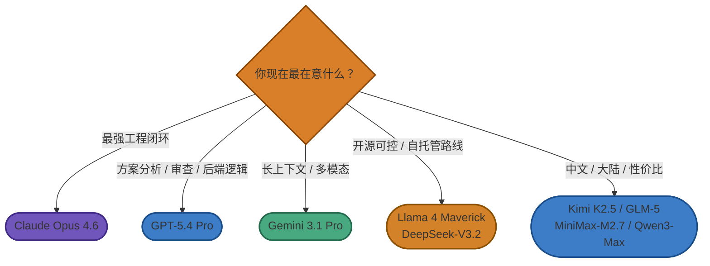
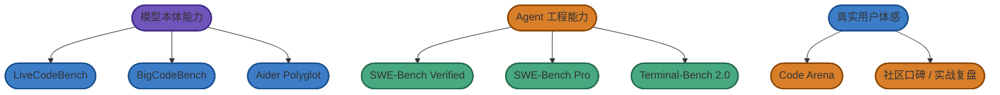

# Chapter 23 · 📊 模型、工具与评测怎么看

> 目标：解决三类最容易混淆的问题：模型强不等于产品最好用，排行榜高不等于最适合你，同一个模型换一套 Agent 体感也可能完全不同。

## 📑 目录

- [1. 模型不等于 Agent](#1-模型不等于-agent)
- [2. 工具对比到底在比什么](#2-工具对比到底在比什么)
- [3. Benchmark 能告诉你什么](#3-benchmark-能告诉你什么)
- [4. 一个更稳的读榜顺序](#4-一个更稳的读榜顺序)

---

## 1. 模型不等于 Agent

模型回答的是底层推理和生成能力，Agent 回答的是：

- 上下文怎么装配
- 工具怎么接
- 会话怎么管
- 验证怎么做

所以“模型榜很高”不等于“实际工程体验最好”。

---

## 2. 工具对比到底在比什么

比较 Agent 工具时，最值得看的不是宣传页，而是：

- 形态：CLI、IDE、插件还是云端代理
- 自治程度：更像副驾驶还是执行者
- 控制感：看 diff、看日志、卡权限容不容易
- 生态兼容：是否适合你的团队流程和平台

---

## 3. Benchmark 能告诉你什么

Benchmark 最有用的地方，是帮你**缩小候选范围**，而不是替你做最终决策。

尤其要分清：

- 模型 benchmark：更偏模型本体能力
- Agent benchmark：更偏模型 + Harness + 工具链的系统能力

---

## 4. 一个更稳的读榜顺序

推荐按这个顺序看：

1. 先看你的真实任务类型
2. 再看模型/工具的大致候选
3. 然后看 benchmark 是否覆盖你的场景
4. 最后一定回到你自己的仓库做试验

> 🎯 **排行榜是筛选器，不是最终裁判。**

---

## 📌 本章总结

- 模型和 Agent 不应混成一张表。
- 工具好不好用，很多时候取决于工作流和控制面，而不只取决于模型。
- 读 benchmark 的关键是看它测到了什么，也看它没测到什么。

---

📊 进阶：主流模型与工具详细横评

### 一、模型选型速览

#### 一张图：先按需求大致分流

#### 二、国际模型

| 模型 | 更擅长什么 | 更适合什么场景 | 需要注意什么 |
|------|------------|----------------|--------------|
| **Claude Opus 4.6** | 复杂工程任务、长链路推理、跨文件理解 | 重型 coding、复杂重构、关键任务 | 成本高；简单任务未必划算 |
| **GPT-5.4 Pro** | 方案拆解、后端逻辑、审查、专业工作流 | 规划、review、约束分析、逻辑型任务 | 真实体验非常依赖你搭配的 Agent 与工作流 |
| **Gemini 3.1 Pro** | 长上下文、多模态、Google 生态配合 | 大体量阅读、跨文档分析、探索型任务 | 工程闭环稳定性和"省心程度"不一定永远是第一名 |
| **Llama 4 Maverick** | 开放权重、超长上下文、可控路线 | 自托管、实验、开源可控 | 真正的 coding 实战公开资料相对没有前几家那么集中 |
| **nemotron-3-super** | 企业导向、结构化任务、tool calling | 企业场景、结构化流程、平台集成 | 面向大众开发者的实战口碑样本相对较少 |
| **Grok-4** | 数学推理、多步逻辑、代码场景 | 竞赛数学、复杂多步推理、快速实验 | 事实查阅偶发疏漏；安全约束较松；公开工程闭环口碑仍在积累 |

### Opus 4.6 vs GPT-5.4 头对头数据（2026 Q1）

> 以下数据适用于两个最常见于顶级 Coding Agent 工作流中的模型。可供选型参考，但别忘了：benchmark 只能缩小范围，用自己的真实任务跑一轮才算数（详见 [模型与 Agent 评测体系](../topics/topic-benchmarks.md)）。

**Benchmark 对比**

| Benchmark | Claude Opus 4.6 | GPT-5.4 | 说明 |
|-----------|:---:|:---:|------|
| **SWE-Bench Verified** | **80.8%** | 77.2% | GitHub issue 真实解决率 |
| **Terminal-Bench 2.0** | 65.4% | **75.1%** | 终端自动化操作 |
| **OSWorld（桌面控制）** | 72.7% | **75.0%** | GPT 首次超越人类基准 72.4% |
| **MRCR v2（128K--512K）** | **76.0%** | 54.4% | 超长上下文检索精度 |
| **FrontierMath** | 27.2% | **47.6%** | 数学推理 |

**API 定价（每百万 token，2026 Q1）**

| 计费项 | Claude Opus 4.6 | GPT-5.4（<=272k） | GPT-5.4（>272k） |
|--------|:---:|:---:|:---:|
| 输入 | $5.00 | $2.50 | $60.00 |
| 输出 | $25.00 | $15.00 | $270.00 |
| 缓存输入 | $0.50 | $0.25 | -- |

> GPT-5.4 标准上下文下，输入成本约为 Opus 4.6 的一半，输出约 60%；但超过 272k token 后触发严重溢价倍增（输入 24x、输出 18x），成本完全反转。

**Token 消耗差异**

Claude 完成相同任务的 Token 消耗通常是 GPT-5.4 的 **3.2x--4.2x**：同一 Figma 插件，Claude 用了 6.2M token，GPT 用了 1.5M（4.2x）；同一全栈应用，234k vs 73k（3.2x）。Claude 的额外消耗换来的是更详细的规划和更易 review 的摘要；GPT 输出更快、更密，但阅读成本更高。

### 社区口碑 8 维评分（基于公开反馈频次）

以下评分并非 benchmark 数据，而是基于近 12 个月公开社区反馈（GitHub issue、Reddit、HN、知乎、SegmentFault 等）的出现**频次与强度**做相对量化，反映的是"口碑画像"，不能与性能评测直接对比。涵盖本文聚焦的三款模型：Claude Opus 4.6、GPT-5.3-Codex（Codex 平台专属模型，带有 Trusted Access 安全策略层）、GPT-5.4（通用旗舰）。

> 评分说明：1 = 负反馈较集中；5 = 正反馈较集中。

| 模型 | 代码质量 | 指令遵循 | 长上下文/大库 | 稳定性 | 速度 | 成本效率 | 工具/智能体体验 | 安全/隐私信心 | 平均 |
|---|---:|---:|---:|---:|---:|---:|---:|---:|---:|
| Claude Opus 4.6 | 4 | 2 | 5 | 2 | 3 | 2 | 5 | 2 | 3.12 |
| GPT-5.3-Codex | 4 | 3 | 4 | 3 | 5 | 4 | 4 | 3 | 3.75 |
| GPT-5.4 | 4 | 3 | 5 | 2 | 4 | 3 | 5 | 4 | 3.75 |

> 注：GPT-5.3-Codex 为 Codex 平台专属模型，带有 Trusted Access 安全策略层，与 GPT-5.4 通用版本在部署环境和安全路由上存在显著差异。

几个值得注意的对比点：Opus 4.6 在长上下文和工具/智能体体验两个维度评分最高，但稳定性和指令遵循拖了均分——社区反馈的核心是"能力上限很高，但对 prompt 质量和护栏设计的要求也更高"（稳定性低分主要反映自主模式下的越权风险，即"会不会擅自越权"，而非输出质量的不稳定）。GPT-5.3-Codex 在速度和成本效率两维最突出，稳定性问题则集中在安全路由降级而非模型本体。GPT-5.4 整体均分与 Codex 相近，但稳定性同样偏低，主要来自 2026-03-10 前后的可用性事件。

各模型低分背后的具体工程风险，见下方「四大模型常见坑点」。

### 四大模型常见坑点

以下问题均来自社区公开报告，并非极端个案——它们出现在多个独立渠道，说明是可复现的结构性风险，值得在工程配置阶段提前应对。

**Claude（Opus 4.5 / 4.6 通用）**

权限与安全是 Claude Code 侧最常见的高后果类问题。第一类：`.env` 等敏感文件在默认配置下可能被模型读取，密钥存在泄露风险；第二类：即便配置了 deny 规则阻止某个工具，模型仍可能通过 Bash 或 Python 脚本绕路访问，权限系统形同虚设；第三类：开启 auto-accept 或 skip-permissions 后，一旦指令或上下文发生漂移，破坏半径会被同步放大。

**Claude Opus 4.6（特有）**

有具体案例记录：模型为了省事选择 Supabase admin 客户端绕过 RLS（行级安全策略），并将其写入面向用户的公开页面，整个过程在 auto-accept 模式下自动落地、未经确认。建议将"禁止在公开接口使用服务角色客户端"写入 CI 静态规则，不要依赖模型自觉。另外，Opus 4.6 在 agent teams 场景下用量燃尽速度显著快于预期，30--35 分钟内耗尽单次窗口的情况有多份独立报告。

**GPT-5.3-Codex**

最常见的挫败不是模型能力问题，而是安全路由机制的副作用：Codex 引入了"Trusted Access for Cyber"安全层，即便是普通开发任务也可能被误判并路由到旧版 GPT-5.2。用户在日志里看到模型版本不符，感知是"付费却没用到选定模型"。这一问题在 GitHub issue 和 subreddit 均有多条独立报告，属于平台策略问题而非偶发 bug。

**GPT-5.4**

2026-03-10 前后出现集中的可用性事件：以 ChatGPT 账号登录 Codex 时，5.4 模型返回"不支持"，仅旧版可用，影响免费和部分付费计划。同期还有 CLI 挂起（所有提示均不返回）和代理中断（模型声称将继续执行，但实际停住，需手动输入 continue）两类问题。如果将 5.4 用于长链路全自动代理任务，建议提前设计断点恢复机制：每 N 步写入 checkpoint、每次关键变更后运行最小测试集、将高风险操作置于前台等待确认。

---

#### 三、国产模型

| 模型 | 更擅长什么 | 更适合什么场景 | 需要注意什么 |
|------|------------|----------------|--------------|
| **Kimi K2.5** | 中文体验、多步工具使用、综合均衡 | 中文开发、内容和代码混合任务 | 长链路硬仗仍建议你自己多验证 |
| **GLM-5** | 中文工程任务、Agentic Engineering、复杂系统场景 | 大陆网络环境、中文技术任务、工程替代路线 | 关于昇腾，更准确的表述应是"已有适配 / 生态支持"，不应简单写成"它一定是在昇腾上训练的模型" |
| **MiniMax-M2.7** | 工具调用、工程型任务、榜单表现亮眼 | 想严肃比较国产工程模型的读者 | 榜单成绩高，但网上真实用户评价明显分化；别只看分数 |
| **DeepSeek-V3.2** | 性价比、开源路线、低成本推理 | 预算敏感、批量执行、开源/自托管路线 | 复杂任务上常常更依赖你把工作流设计好 |
| **Qwen3-Max** | 通用能力、多步骤任务、阿里生态配合 | 企业内生态、中文多步骤任务 | 公开 coding-agent 口碑和榜单要结合具体版本看 |
| **Doubao Pro** | 通用能力、代码与数学推理（Seed 2.0 Pro）、ByteDance 生态 | 字节生态场景、代码与数学任务、成本效益型通用任务 | 旗舰版本更迭快；生产环境 Agent 工作流口碑仍在积累；API 可用地区需自行确认 |
| **Hunyuan T1** | 推理能力、腾讯生态整合、中文任务 | 腾讯生态内中文内容场景、推理增强型任务 | Coding Agent 公开 benchmark 数据有限；实战工程口碑仍在建立 |

#### 四、我会怎么配模型

| 目标 | 我更倾向的模型 | 理由 |
|------|----------------|------|
| **最强复杂任务** | `Claude Opus 4.6` | 最适合拿来啃大任务和复杂工程链路 |
| **方案讨论 / 审查 / 后端逻辑** | `GPT-5.4 Pro` | 更像擅长讨论、拆解、审视风险的"参谋型模型" |
| **长文档、大体量上下文** | `Gemini 3.1 Pro` | 超长上下文和多模态能力有明显优势 |
| **低成本大批量执行** | `DeepSeek-V3.2` | 价格优势非常明显 |
| **中文主力候选** | `Kimi K2.5`、`GLM-5`、`Qwen3-Max` | 中文环境和国内可用性更友好 |
| **认真比较国产工程模型** | `MiniMax-M2.7`、`GLM-5`、`Kimi K2.5` | 适合做横向验证，但不要只看 leaderboard |

### 实战分工心得：Claude 执行，GPT 参谋

这不是说哪家模型更强，而是在实际工程任务中，两套体系表现出不同的"性格"：

- **Claude 系（Opus / Sonnet / Haiku）**：工具调用稳定、长链条不容易跑偏、收敛快。Opus 扛硬仗，Sonnet 打常规任务，Haiku 做快速收尾——三档可以视任务复杂度动态切换。
- **GPT / Codex 系**：单轮分析深度高，方案拆解和代码审阅往往很有启发，但在多步执行时更容易漂移，人工介入频率略高。

**实战口诀**：用 GPT 调研和出 plan，用 Claude 落地和执行；真遇到复杂 bug，再按"分析交 GPT、执行交 Opus"来分工。

> 以上是典型的一线使用体感，不是基准测试结论，存在个体差异。你自己的任务结构和 prompt 质量可能会带来完全不同的结果。建议用 3--5 个你自己的真实任务来验证。

---

### 二、Agent 工具速览

#### 先说结论

| 你的情况 | 第一推荐 | 第二选择 | 一句话理由 |
|----------|----------|----------|------------|
| **终端流、正式工程任务** | `Claude Code` | `Codex CLI` | 最接近成熟的软件工程协作工作流 |
| **IDE 流、想快速上手** | `Cursor` | `Trae` / `Windsurf` | 边看代码边协作，学习成本最低 |
| **GitHub 团队协作优先** | `GitHub Copilot` | `Claude Code` | 与 GitHub、PR、企业流程结合更自然 |
| **中文 / 大陆 / 成本敏感** | `Kimi Code` | `通义灵码` / `Trae` / `OpenCode` | 中文体验、网络条件、预算更容易落地 |
| **开源 / BYOK / 可控** | `OpenCode` / `Cline` / `Aider` | `CodeGeeX` | 可自选模型、自托管或自带 Key，更灵活 |
| **通用任务自动化，不只写代码** | `Perplexity` / `Manus` | `ChatGPT Tasks` / `Kimi Agent` | 这类更偏通用 Agent，不是纯 coding 工具 |

#### 国际主流 Coding Agent

| 工具 | 形态 | 更擅长什么 | 更适合谁 | 需要注意什么 |
|------|------|------------|----------|--------------|
| **Claude Code** | CLI + 插件 + App | 复杂重构、长任务闭环、大仓库理解 | 真正要拿 Agent 干活的开发者 | 成本不低；会话管理和验证不能省 |
| **Cursor** | AI IDE | 日常开发、边写边改、可视化 diff、低门槛协作 | 新手、产品工程师、前后端日常开发 | 更偏 IDE 主工作流；深度自治和可控性不一定是最强 |
| **GitHub Copilot** | 插件 / 平台集成 | 补全、团队协作、GitHub 原生工作流 | 已深度使用 GitHub 的团队 | 自治程度通常不如专门的 coding agent |
| **Codex CLI** | CLI + 插件 + App | 方案拆解、后端逻辑、审查、沙箱执行 | 偏终端流、重视隔离和控制感的用户 | 长链路执行时往往更需要人盯 |
| **Gemini CLI** | CLI | 免费试水、长上下文探索、Google 生态协作 | 想先低成本体验 Agent 的用户 | 免费和长上下文是亮点，但实战闭环稳定性并不总是第一梯队 |
| **Antigravity** | AI IDE / 应用构建环境 | 快速原型、Google 生态、全栈应用构建 | 偏原型、全栈试玩和应用搭建 | 产品形态变化快，别过度依赖单一版本口碑 |

> 💡 **Codex 产品形态说明**：2025 年起，Codex 从传统 CLI 模式演进为**多 Agent 软件工程平台**（macOS 桌面应用形态）。核心新能力：
> - **并行 Agent**：多个 Agent 可在同一代码库的独立 worktree 副本中同时工作，避免冲突
> - **Skills 机制**：封装说明、资源和脚本，构建可复用的工程工作流
> - **Automation**：支持按计划在后台执行任务，无需人工守候
> - **内置沙盒**：权限提升时请求许可，高危操作有隔离保护
>
> 这使 Codex 更像"多 Agent 指挥中心"而非传统补全工具；若你看到的信息仍在描述旧 Codex 模型（代码补全 API），那已是较早期的定位。

#### 国产主流 Coding Agent

| 工具 | 形态 | 更擅长什么 | 更适合谁 | 需要注意什么 |
|------|------|------------|----------|--------------|
| **通义灵码** | IDE 插件 | 插件式接入、阿里云生态、企业落地 | 已在 VS Code / JetBrains 体系里的开发者 | 更像企业稳健工具，不一定追求最强自治 |
| **Trae** | AI IDE | 中文开发、性价比、类似 AI IDE 主工作流 | 想找 Cursor 替代或补位的用户 | 海外口碑和企业生态成熟度仍在继续建立 |
| **Baidu Comate** | IDE 插件 | 百度生态、企业内研发流程 | 百度系或企业内开发流程用户 | 更偏企业场景和平台整合 |
| **CodeBuddy** | IDE 插件 / 企业协作 | 与企微生态和团队沟通衔接 | 团队协作、企业内知识流转 | 更适合已有腾讯生态的组织 |
| **Kimi Code** | Web / IDE / Agent 工作流 | 中文体验、视觉相关任务、低门槛协作 | 中文开发者、产品原型和前端场景 | 复杂长链路工程任务仍要自己验证 |
| **CodeArts** | 云研发平台 | 企业级“自动驾驶式研发”、华为云生态 | 企业项目、平台治理、流程整合 | 更偏平台化与企业采购路线 |

#### 开源生态 / 更多工具

| 工具 | 形态 | 更擅长什么 | 更适合谁 | 需要注意什么 |
|------|------|------------|----------|--------------|
| **OpenCode** | 多形态、多模型接入 | BYOK、多模型切换、低成本工作流 | 想自选模型和供应商的用户 | 文档、生态和产品节奏变化快，需自己多验证 |
| **CodeGeeX** | IDE 插件 / 助手 | 免费体验、代码生成、轻量辅助 | 预算敏感、想先试水的读者 | 更像轻量助手，不一定是强自治主力 |
| **Aider** | CLI | git 原生、多文件修改、终端党 | 喜欢明确 diff 和传统终端流的工程师 | 交互体验更硬核，不是最适合新手的入口 |
| **Cline** | VS Code 插件 | MCP、浏览器、命令执行、强可控 | 想开源、想可视化、想自带 Key 的用户 | 能力很强，但需要自己搭好模型和成本策略 |
| **Windsurf** | AI IDE | 日常开发、Agent 化 IDE 体验 | 想对比 Cursor 的用户 | 依赖产品版本和模型配置，长期稳定性要自己试 |
| **Devin** | 云端自主 Agent | 端到端任务委派、异步跑活 | 希望把标准化任务外包给 Agent 的团队 | 成本、权限边界、交付可控性都要仔细评估 |

### 其他值得关注的工具（按场景）

| 工具 | 形态 | 更擅长什么 | 更适合谁 | 需要注意什么 |
|------|------|------------|----------|-------------|
| **Continue** | VS Code / JetBrains 插件 | 私有化部署、可插模型、企业合规 | 需要私有化或完全可控的团队 | 需自行维护模型接入和更新 |
| **Replit Agent** | Web IDE / Agent 平台 | 从需求到部署一体化、快速原型 | 非专业开发者、原型快速验证 | 重度工程任务的细粒度控制较弱 |
| **Amazon Q Developer** | IDE 插件 / AWS 生态 | AWS 云资源对接、权限治理、企业合规 | 重度 AWS 用户、大企业研发团队 | 强绑定 AWS 生态 |
| **Sourcegraph Cody** | IDE 插件 / 平台 | 大型代码库搜索、上下文理解、知识接入 | 大型代码库导航、企业知识库场景 | 更偏代码理解和搜索，自主执行能力有限 |
| **Goose (Block)** | CLI / 本地 | 本地优先、开源、工程自动化（安装/执行/编辑/测试） | 偏好本地执行和开源可控的工程师 | 生态相对较新，社区仍在建立 |

#### 通用 Agent / Claw

| 工具 | 定位 | 更擅长什么 | 适合什么场景 | 为什么不该和 Coding Agent 混为一谈 |
|------|------|------------|--------------|------------------------------------|
| **OpenClaw** | 开源通用 Agent / Claw | 常驻式自动化、通用任务编排 | 研究、试验、Life OS 式自动化 | 权限模型、运行方式、目标形状都不同 |
| **Manus** | 通用自主 Agent | 多步骤通用任务执行、资料搜集、流程代办 | 办公流、研究流、通用自动化 | 不是围绕代码仓库和工程验证构建的 |
| **ChatGPT Tasks** | 任务执行引擎 | 通用任务分配与执行 | 日常任务管理、通用自动化 | 代码仓库级协作不是它的核心卖点 |
| **Perplexity** | 深度研究与信息整合 | 搜索、引用、资料梳理 | 做调研、写综述、比信息 | 更像研究助手，不是工程执行主力 |
| **Kimi Agent** | 通用中文 Agent | 长文档、办公三件套、中文场景 | 办公自动化、中文资料处理 | 代码能力有，但定位更宽泛 |
| **ArkClaw** | 云端企业 Agent | 飞书 / 企业生态自动化 | 企业办公和流程自动化 | 仍然更偏业务流而非 coding flow |

> 💡 **同为 Claw，路线相反**：OpenClaw 本地优先、开源、自带 API Key；Manus 云端托管、订阅制（$39–$200+/月信用额度体系）、零配置即用。2025 年末 Manus 已被 Meta 收购，产品路线存在变化可能。两者用户画像基本不重叠——在意数据隐私和成本可控的开发者更适合 OpenClaw，在意快速交付和零运维的用户更适合 Manus。

---

### 三、评测体系

#### 一、常见 benchmark 对照表

| 基准 | 主要测什么 | 为什么重要 | 最大盲区 |
|------|------------|------------|----------|
| **SWE-Bench Verified** | 真实 GitHub issue 修复 | 最接近真实软件工程闭环 | 以 Python 为主，且非常依赖 scaffolding |
| **SWE-Bench Pro** | 多语言、长周期、更难的工程任务 | 更接近多语言真实工程 | 历史数据相对少，生态仍在快速演进 |
| **Terminal-Bench 2.0** | 终端命令、环境、DevOps 类操作 | 看 Agent 能不能真的"动手" | 偏终端 / 运维任务，不等于所有 coding 任务 |
| **LiveCodeBench** | 代码生成、竞赛型问题求解 | 抗污染、更新快，能看模型本体代码能力 | 和真实业务工程差距不小 |
| **BigCodeBench** | 更实用的编程任务 | 比传统 codegen benchmark 更接近日常编码 | 样本规模仍有限 |
| **Code Arena** | 开发者盲测与投票 | 更贴近真实体感 | 主观性更强，样本结构会影响结果 |
| **Aider Polyglot** | 多语言代码编辑与修改 | 能看跨语言编辑能力 | 带有 Aider 这个工具本身的风格偏置 |
| **SEAL Leaderboard** | 标准化 scaffolding 下的统一对比 | 便于隔离掉部分框架差异 | 仍然不是你的真实工作流 |

#### 二、2026 年 Q1 的公开结果，应该怎么读

> 下面不是完整总榜，而是"**你应该记住的信号**"。

### 偏 Agent 工程能力的信号

| 基准 | 公开榜单上常见的领先信号 | 你该怎么理解 |
|------|--------------------------|--------------|
| **SWE-Bench Verified** | `Claude Opus 4.5 / 4.6`、`Gemini 3.1 Pro`、`MiniMax M2.5`、`GPT-5.x`、`GLM-5`、`Kimi K2.5` | 说明这些模型 / 组合在"理解 issue -> 改代码 -> 过测试"这一闭环里竞争力很强 |
| **SWE-Bench Pro** | `GPT-5.3-Codex`、`GPT-5.2-Codex`、`GPT-5.2` 等 | 更能反映长周期、多语言、多阶段任务的上限 |
| **Terminal-Bench 2.0** | `Codex CLI + GPT-5.3`、`GPT-5.3-Codex`、`Droid + Claude Opus 4.6` | 终端型 Agent、工具调用、命令执行能力很强的组合会更吃香 |

### 偏模型本体能力的信号

| 基准 | 公开榜单上常见的领先信号 | 你该怎么理解 |
|------|--------------------------|--------------|
| **LiveCodeBench** | `Gemini 3 Pro Preview`、`DeepSeek-V3.2`、`Qwen3-Max`、`Kimi K2.5`、`Claude Opus 4.6` | 说明这些模型在代码生成、题目求解、算法型任务上很有竞争力 |
| **BigCodeBench** | `Claude`、`OpenAI o-series / GPT 系`、`DeepSeek` | 说明它们的实用代码能力比较强 |
| **Code Arena** | `Claude 系列`、`Gemini 3.1`、`GPT-5.4`、`GLM-5` | 说明这些模型在真实开发者盲测里有较好的综合体感 |

### 中美模型主要差距（2026 Q1 快照）

> 这是一份时间点快照，差距正在快速收窄。以下观察供参考，榜单数字会持续变化，建议直接查阅官方来源。

**SWE-bench Verified（Agent 工程能力）**：美国仍领先，但中国模型已进入全球前五。

- 美国方向：`Claude Opus 4.5 / 4.6`（约 80.9% / 80.8%）、`Gemini 3.1 Pro`（约 80.6%）、`Codex / GPT-5.4`（约 77%）在 Agent 工程任务上保持优势。
- 中国方向：`MiniMax M2.5`（约 80.2%）已挤进全球前三，`GLM-5`（约 77.8%）、`Kimi K2.5`（约 76.8%）紧随其后，`DeepSeek` 和 `Qwen` 系列也在快速追赶。

**LiveCodeBench（代码生成能力）**：中美已高度拮抗。

- `Gemini 3 Pro` 仍居首位，但 `DeepSeek V3.2`（约 89.6%）、`Kimi K2.5`、`Qwen 3.5` 差距极小，中国模型在这一维度已有很强竞争力。

**Aider Polyglot（多语言代码编辑）**：格局有些意思。

- `Grok 4` 领跑，但 `Kimi K2.5` 同样得分靠前，中美模型交替出现在榜单前列，单一维度看已很难说谁完全领先。

**SWE-bench Pro（标准化脚手架条件）**：在 SEAL 统一 scaffolding 下，`OpenAI Codex` 系列模型包揽前列。这恰恰印证了本文的核心判断——**脚手架（scaffolding）对最终得分的影响之大，很容易超过模型本体的差距**。

**Code Arena（开发者投票）**：`Claude` 系列以 Elo 1552+ 霸占前十大多数席位；`GLM-5` 是目前首个闯入全球 Top 10 的中国模型，是一个值得关注的信号。

> 这些数字的意义不是"中国赢了"或"美国赢了"，而是在告诉你：**评测结果越来越难以用单一维度来总结，你需要具体任务类型来决定看哪个榜单。**

---

实时排行榜可参考：

- [SWE-Bench 官方排行榜](https://www.swebench.com/)
- [LiveCodeBench 官方排行榜](https://livecodebench.github.io/)
- [Code Arena](https://arena.ai/leaderboard/code)
- [Artificial Analysis Coding Index](https://artificialanalysis.ai/)
- [BigCodeBench](https://bigcode-bench.github.io/)

