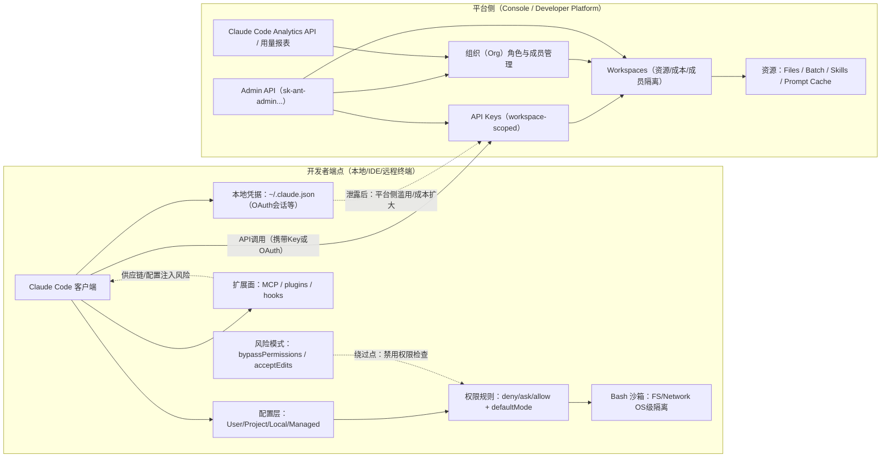

# Chapter 25 · 🔒 安全、权限与信任边界

> 目标：理解 Agent 为什么既强大又危险。读完这一章，你应该知道最小权限、沙箱、审批点和供应链边界为什么是 Agent 工程里不能省掉的护栏。

## 📑 目录

- [1. 权限为什么是第一道边界](#1-权限为什么是第一道边界)
- [2. 五类最常见风险面](#2-五类最常见风险面)
- [3. 最小权限与沙箱思路](#3-最小权限与沙箱思路)
- [4. 高风险动作为什么必须人工裁决](#4-高风险动作为什么必须人工裁决)

---

## 1. 权限为什么是第一道边界

Agent 一旦能读文件、跑命令、调外部服务，它面对的就不再只是“回答是否正确”，而是“动作是否越权”。

所以安全问题不是附加话题，而是控制面的组成部分。

---

## 2. 五类最常见风险面

- 源码与敏感配置泄露
- 任意命令执行
- Prompt 注入与工具误用
- 供应链依赖风险
- 生产环境误操作

这些风险不要求 Agent “有恶意” 才会发生，只要边界设计得不清楚，就可能触发。

---

## 3. 最小权限与沙箱思路

最推荐的默认原则是：

- 先给最小必要权限
- 先在隔离环境中实验
- 先验证，再逐步放开

比起一开始追求全自动，更稳的思路是：

> 🛡️ **先让 Agent 在小边界里证明自己，再逐步增加自治空间。**

---

## 4. 高风险动作为什么必须人工裁决

凡是同时具备以下特征的动作，都应强制保留人工裁决：

- 高风险
- 不可逆
- 影响外部系统
- 验证不容易即时完成

典型例子：

- 发布与回滚
- 删除或迁移关键数据
- 改生产权限
- 处理密钥和凭据

---

## 📌 本章总结

- Agent 安全的核心不是“禁止使用”，而是把权限边界设计清楚。
- 最小权限、沙箱、审批点和回滚能力，是最值得优先搭建的护栏。
- 高风险动作越接近真实世界，越应该收回到人工裁决。

---

## 📎 保留原文与延伸材料

安全章节先保留完整原专题，后续如果要精简，再从权限模型、漏洞案例、护栏设计、合规四条线慢慢拆。

<details>
<summary>📎 保留原文：原专题：信任边界 -- Agent 安全、权限与合规</summary>

---
> **Part IV - 进阶专题** | [<- 返回专题目录](../../README.md#tutorial-contents)
---

# 信任边界 -- Agent 安全、权限与合规

> 目标：理解 Agent 的安全风险面，学会设计权限模型和安全护栏——让 Agent 强大但可控。

---

## 1. 权限模型解析

Claude Code 的安全模型由两套相互独立但互补的权限边界构成：**端点侧（Endpoint）** 权限和**平台侧（Platform / Workspace）** 权限。理解二者的关系，是设计可靠安全护栏的前提。

### 1.1 Allow / Ask / Deny 评估顺序

端点侧权限规则由 `allow / ask / deny` 三类组成，评估顺序为：

```
deny → ask → allow
```

**第一个匹配的规则生效**，`deny` 永远优先。这是"显式拒绝优先"策略的标准实现——适合封堵高危工具（如 `Bash(curl *)` 或敏感文件读取），同时抵御误配置造成的权限扩散。

### 1.2 五种权限模式（Mode）

权限模式决定"默认提示行为"，官方定义如下：

| 模式 | 行为 | 适用场景 |
|---|---|---|
| `default` | 首次使用工具时提示权限 | 通用交互开发 |
| `acceptEdits` | 自动接受会话内的文件编辑权限 | 需要频繁文件编辑但仍要控制命令 |
| `plan` | 只分析，禁止修改文件或执行命令 | 外部仓库审查、安全评估 |
| `dontAsk` | 自动拒绝工具（除非预先批准） | 减少批准疲劳、防止误点 |
| `bypassPermissions` | 跳过所有权限提示，禁用所有权限检查 | **仅限容器/VM 等隔离环境** |

`bypassPermissions` 是最危险的模式。官方明确：启用后等于把 Claude Code 从"人机协作工具"变成"高权限自动化执行器"。一旦在真实开发机、真实网络、真实凭据环境中启用，主要风险包括：

- 源码与敏感配置（`.env`、CI 机密）泄露
- 任意命令执行（RCE）与持久化后门
- 横向移动到开发者常用系统（GitHub/云控制台/CI/CD）
- 合规审计不可追溯

官方提供托管设置 `disableBypassPermissionsMode: "disable"`，在托管层禁用该模式。

### 1.3 配置作用域分层（User / Project / Local / Managed）

Claude Code 的配置可落在四个作用域：

| 作用域 | 路径 | 可被覆盖 |
|---|---|---|
| User | `~/.claude/settings.json` | 可被项目/本地覆盖 |
| Project | `.claude/settings.json`（共享，进入 git） | 可被本地覆盖 |
| Local | `.claude/settings.local.json`（默认 git ignore） | 可被用户覆盖 |
| Managed | 系统目录 `managed-settings.json`、MDM/OS 策略 | **不可被用户/项目覆盖** |

关键结论："最小权限原则"能否真正落地，取决于**组织是否把安全基线放到 Managed 层**，而不是依赖用户自觉或项目约定。

### 1.4 Workspace 隔离 vs Endpoint 隔离



两套边界**不互相替代**：即使 workspace 把云端资源隔离得很好，只要本地端点被绕过或被执行恶意命令，仍可能导致 API 密钥/代码/凭据泄露，从而间接跨 workspace 造成更大影响。

### 1.5 沙箱（Sandboxing）机制

官方将沙箱与权限定位为"互补安全层"，使用 OS 级原语实现：

- **macOS**：Seatbelt（`sandbox-exec`）
- **Linux / WSL2**：bubblewrap（`bwrap`）
- 子进程继承相同安全边界

网络隔离通过沙箱外代理控制，限制只访问批准域名；新域名请求会触发权限提示；`allowManagedDomainsOnly` 策略可自动阻止非允许域。

**逃生舱风险**：当命令因沙箱限制失败时，系统可能提示使用 `dangerouslyDisableSandbox` 重试。这是典型的"从强制隔离回退到人为批准"路径——攻击者不一定需要破解沙箱，只要诱导用户批准"看似合理"的回退即可。可通过 `allowUnsandboxedCommands: false` 禁用该回退。

---

## 2. 真实漏洞案例剖析

2025-2026 年间，Claude Code 公开披露了 7 个 CVE/GHSA 漏洞，覆盖信任提示绕过、命令解析缺陷、路径限制绕过、域名验证缺陷等多类攻击向量。

### 2.0 AI 生成代码的系统性安全风险

在具体漏洞案例之前，有必要理解 AI 辅助编程引入的系统性安全风险。Veracode 2025 年分析报告对 LLM 生成代码的安全性进行了大规模扫描，结果表明 AI 生成代码的安全通过率令人担忧。

**LLM 生成代码安全扫描通过率（Veracode, 2025年分析报告）**

| 漏洞类型 | CWE 编号 | 安全通过率 | 风险等级 |
|---|---|---|---|
| SQL 注入 | CWE-89 | 80% | 中等 |
| 加密失败 | CWE-327 | 86% | 中等 |
| 跨站脚本 XSS | CWE-80 | 14% | 极高 |
| 日志注入 | CWE-117 | 12% | 极高 |
| **整体安全通过率** | -- | **55%\*** | **高风险** |

> \*整体通过率基于 Veracode 2025 年对 100+ LLM 全量扫描样本（含多种漏洞类型），非上表四项均值。

关键发现：
- 45% 的 AI 生成代码包含安全缺陷
- XSS 漏洞失败率高达 86%
- 2025 年 6 月，单月内发现超过 10,000 个 AI 引入的安全问题（较 2024 年 12 月增长 10 倍）

**AI 代码质量的悖论：修小问题，造大隐患**

| 指标 | 变化方向 | 变化幅度 |
|---|---|---|
| 语法错误 | 改善 | -76% |
| 逻辑错误 | 改善 | -60% |
| 架构缺陷 | 恶化 | +153% |
| 权限升级路径 | 恶化 | +322% |

> 数据来源：Snyk 2025 年 AI 代码质量研究报告。

> **AI 在修复小问题的同时，正在制造定时炸弹**——表层代码质量提升，但深层架构缺陷和权限滥用路径在 AI 辅助下显著恶化。

### 2.1 CVE-2025-66032 - Shell 解析绕过（CVSS 9.8 Critical）

**修复版本**：v1.0.93

- **攻击路径**：利用 shell 命令解析中与 `$IFS`、短 flag 相关的缺陷，绕过"只读验证"，触发任意代码执行。
- **先决条件**：攻击者需将不受信任内容注入到 Claude Code 的上下文窗口（如通过提示注入或恶意内容进入上下文）。
- **影响**：CVSS 3.1 基础分 9.8（Critical）；端点 RCE。

### 2.2 CVE-2025-59536 - 信任提示前的命令执行（GHSA 8.7 High）

**修复版本**：v1.0.111

- **攻击路径**：用户在不受信任目录或恶意仓库启动 Claude Code，因信任提示实现缺陷，工具在用户接受"信任"前就执行了项目中包含的代码/命令。
- **先决条件**：用户在攻击者控制的目录启动（典型场景：开发者克隆并打开未知仓库/分支）。
- **影响**：RCE，影响高。

### 2.3 CVE-2026-24887 - Find 命令执行绕过（CVSS 8.8 High）

**修复版本**：v2.0.72

- **攻击路径**：命令解析错误，绕过 Claude Code 的确认提示，通过 `find` 触发不受信任命令执行。
- **先决条件**：不受信任内容进入上下文窗口。
- **影响**：CVSS 3.1 基础分 8.8（High）。

### 2.4 CVE-2026-24053 - ZSH clobber 目录绕过（CVSS 7.7 High）

**修复版本**：v2.0.74

- **攻击路径**：Bash 命令校验在解析 ZSH clobber 语法时存在缺陷，绕过目录限制，在无权限提示情况下写出当前工作目录之外的文件。
- **先决条件**：用户使用 ZSH；不受信任内容进入上下文窗口。
- **影响**：CNA CVSS-B 7.7（High）；可写入 shell 配置、git hooks、CI 配置等，形成持久化后门。

### 2.5 CVE-2026-21852 - 环境变量 API Key 泄漏（CNA 5.3 Medium）

**修复版本**：v2.0.65

- **攻击路径**：恶意仓库包含设置文件，设置 `ANTHROPIC_BASE_URL` 指向攻击者端点，Claude Code 在展示信任提示前就发起 API 请求，API Key 泄露给攻击者。
- **先决条件**：用户启动于攻击者控制仓库；使用受影响版本。
- **影响**：CNA CVSS-B 5.3（Medium），但凭据外泄性质常在企业环境引发二次事故（成本滥用、数据访问扩散）。

### 2.6 CVE-2026-24052 - WebFetch 域名验证缺陷（CWE-601）

**修复版本**：v1.0.111

- **攻击路径**：受信任域名校验使用 `startsWith()` 等不充分验证，攻击者注册相似前缀域名，在无用户同意下发生自动请求，造成数据外泄。
- **影响**：CWE-601（Open Redirect 类）；对数据外泄敏感场景影响高。
- **额外风险**：组织误认为"域名白名单=绝对安全"，忽略了"校验实现缺陷"的可能性。

### 2.7 CVE-2025-59829 - Deny 规则符号链接绕过（CVSS 6.5 Medium）

**修复版本**：v1.0.120

- **攻击路径**：用户显式 deny 访问某文件，但允许访问指向该文件的 symlink，deny 校验未考虑 symlink，仍可访问被 deny 的文件。
- **先决条件**：存在可控/可访问的 symlink 路径；受害者依赖 deny 规则保护敏感文件。
- **影响**：NVD CVSS 3.1 基础分 6.5（Medium）；损害 deny 的安全假设。

### 2.8 社区报告的回归问题

> 以下条目来自社区报告，尚未经官方或第三方独立验证。版本号仅供参考，请以官方安全公告为准。

除正式 CVE 外，社区还报告了若干"策略未生效"的回归问题，应纳入企业自测清单：

- **disableBypassPermissionsMode 回归**：用户报告在 v2.1.69 后，即使组织设置了 `disableBypassPermissionsMode: "disable"`，仍可进入 bypass 模式。
- **managed-settings.json deny 规则被忽略**：用户称托管 deny 规则未阻止读取工作目录外文件。
- **Plan Mode / ExitPlanMode 行为型绕过**：声称可在未修改设置的情况下达成类似 bypass 的效果，更难检测。

核心教训：**不能把"策略存在"当成"策略生效"**。关键策略必须纳入版本升级后的自动化验收测试。

---

## 3. Prompt 注入与供应链攻击

### 3.1 扩展面：MCP、hooks、插件

MCP（Model Context Protocol）将 Claude Code 连接到外部工具与数据源，官方明确提示：

> 第三方 MCP 服务器需自担风险，Anthropic 未验证其正确性或安全性，并可能面临提示注入风险。

Snyk 的研究数据显示，**36% 的 MCP Skills 存在安全漏洞**，涵盖过度权限暴露、不安全的工具描述、缺乏输入验证等问题。这意味着"接入 MCP = 接入外部系统的攻击面"——恶意仓库、插件、MCP 服务器都可能成为权限绕过与供应链攻击入口。

**Rules File Backdoor 攻击**

2025 年 3 月，Pillar Security 披露了一种影响 GitHub Copilot 和 Cursor 的新型攻击向量：攻击者通过在 AI 工具的配置规则文件（如 `.cursor/rules/`、`.cursorrules`、`CLAUDE.md`、`SKILL.md` 等）中插入隐藏 Unicode 控制字符，可操纵 AI 助手生成恶意输出，且该过程能绕过常规代码审查流程（隐藏字符在编辑器中不可见）。防御措施：在 CI 流水线中对所有规则文件进行 Unicode 控制字符扫描，拒绝合并包含非预期控制字符的规则文件变更。

Hooks 允许在生命周期事件执行 shell 命令；托管策略配置的 hooks 不能被用户设置的 `disableAllHooks` 禁用；hooks 在启动时快照，会话中途的外部修改会触发警告并需审查。

### 3.2 RAG 语言污染与间接注入

当 Claude Code 处理外部文档、代码评论、issue 内容或数据库结果时，攻击者可以在这些内容中嵌入提示注入指令。典型场景：

- **恶意 README/注释**：仓库中包含伪装成文档的指令，诱导 Agent 执行额外操作
- **RAG 语言污染**：在检索增强生成的知识库中植入指令，影响 Agent 的决策
- **上下文窗口污染**：大段不受信任内容进入上下文后，利用解析边界漏洞（参见 CVE-2025-66032、CVE-2026-24887）

### 3.3 恶意 MCP Server 风险

攻击向量链路：

```
恶意 MCP Server
  -> 返回包含提示注入的工具响应
    -> Claude Code 将响应内容放入上下文
      -> 注入指令影响后续工具调用决策
        -> 数据外泄 / 越权写文件 / 横向移动
```

缓解措施：
1. 对 MCP 实施严格 allowlist/denylist
2. 要求对第三方 MCP server 进行安全评审
3. 通过托管策略限制可添加的 marketplace 来源
4. 对 hooks 采用托管策略与变更审计

> **供应链投毒案例**：恶意 npm 包 `@chatgptclaude_club/claude-code` 以与官方 Anthropic CLI 工具高度相似的命名冒充官方包。这类攻击随着工具知名度提升而增加，提示工程师安装时必须核实包名的官方来源（Claude Code 官方包名为 `@anthropic-ai/claude-code`）。

---

## 4. 风险评估矩阵

结合 CVE 证据与实际业务场景，可以从两个维度构建风险矩阵：**任务类型**（信息性 vs 变更性）和**环境类型**（隔离 vs 生产）。

### 4.1 任务风险分级

| 风险等级 | 任务类型 | 典型操作 | 推荐默认模式 |
|---|---|---|---|
| 低 | 信息性任务 | 代码阅读、文档查询、测试生成、代码审查建议 | `plan` 或 `default` |
| 中 | 有限变更任务 | 重构已有代码、编写新功能、修复 bug | `default` + deny 高危规则 |
| 高 | 扩展影响任务 | CI/CD 流程修改、依赖更新、配置变更 | `dontAsk` + 显式 allow 白名单 |
| 极高 | 生产环境操作 | 数据迁移、生产部署、密钥管理、基础设施变更 | 禁止 / 人工审批 + 严格隔离 |

### 4.2 环境风险评估

| 风险维度 | 资产/后果类型 | 典型触发场景 |
|---|---|---|
| 数据泄露 | 源码、私钥、`.env`、CI 机密、业务数据 | MCP 连接数据库/工单系统；WebFetch 验证缺陷 |
| RCE 与端点沦陷 | 任意命令执行 | 信任提示前执行；命令解析绕过类 CVE |
| 持久化后门 | shell 配置、git hooks、CI 配置 | 目录限制绕过（CVE-2026-24053）|
| 横向移动 | 开发机 token -> 平台侧资源 | API Key 泄露后 workspace 内资源滥用 |
| 成本与可用性 | API 费用爆炸、速率限制、生产调用影响 | API Key 被盗后大规模调用 |
| 合规与审计 | 无法证明越权访问是否发生 | 缺少 OTel 审计日志 |

### 4.3 组织态势调节因子

以下因子会显著影响风险概率：

- 是否允许/使用 `bypassPermissions`（若允许，概率显著上升）
- 是否经常对外部仓库/PR 直接启动 Claude Code 而不做隔离
- 是否广泛启用 MCP 连接高敏系统（数据库、工单、邮件、云平台）
- 是否部署托管策略并**验证其强制生效**（否则"看似有政策，实际可绕过"）

---

## 5. 安全护栏设计

### 5.1 Deny Rules 最佳实践

`deny` 规则应放到组织 Managed 层，作为不可覆盖的"硬红线"：

```json
{
  "permissions": {
    "deny": [
      "Bash(curl *)",
      "Bash(wget *)",
      "Bash(nc *)",
      "Read(**/.env)",
      "Read(**/secrets/**)",
      "Read(**/.ssh/**)",
      "WebFetch(*)"
    ]
  }
}
```

**关键注意事项**：
- `Bash(ls *)` 与 `Bash(ls*)` 的匹配语义不同，空格影响单词边界；务必彻底测试权限规则
- deny 规则在符号链接场景下曾存在绕过（CVE-2025-59829），需确保客户端版本 >= v1.0.120
- 不能把"deny 规则存在"等同于"deny 规则生效"——需配合版本管理和自动化验收测试

### 5.2 Sandbox 配置

推荐在生产和 CI/CD 场景启用完整沙箱：

```json
{
  "sandbox": {
    "allowUnsandboxedCommands": false,
    "allowManagedDomainsOnly": true,
    "approvedDomains": [
      "api.anthropic.com",
      "your-internal-registry.example.com"
    ]
  }
}
```

对 `dangerouslyDisableSandbox` 参数，应通过 `allowUnsandboxedCommands: false` 全局禁用，消除逃生舱回退路径。

### 5.3 审计日志（OpenTelemetry）

Claude Code 原生支持通过 OpenTelemetry 输出指标与事件。关键字段：

**`claude_code.tool_result` 事件**：
- `tool_name`：被调用的工具
- `decision`：权限决策（allow/deny/ask）
- `source`：决策来源（`config` / `user_permanent` / `user_temporary`）
- `bash_command` / `full_command`：完整命令内容
- `sandbox`：是否在沙箱内执行

**`claude_code.api_request` 事件**：
- 模型、成本、token 消耗、缓存读取

**注意**：用户提示内容默认被编辑，只有显式开启 `OTEL_LOG_USER_PROMPTS=1` 才记录 prompt 明文（需注意日志中可能包含敏感信息）。

高优先级告警规则建议：

| 告警类型 | 触发条件 |
|---|---|
| 沙箱外执行 | `tool_result.source=config` 且 `sandbox=false` |
| bypass 模式启用 | 检测到 `bypassPermissions` 模式激活事件 |
| WebFetch 异常域名 | 请求域名不在 approved list 且频繁新增 |
| 非工作时间高频编辑 | 深夜/周末 `code_edit_tool.decision(accept)` 计数突增 |
| 平台侧成本异常 | workspace 成本突增、速率告警触发 |

### 5.4 最小权限原则的工程落地

**权限设计三原则**：

1. **在敏感仓库默认使用 `plan` 或 `dontAsk`**，而不是依赖临时点击确认
2. **把 deny 作为"硬红线"，把 allow 作为"最小白名单"**，避免过宽的 `Bash(*)`、`Read(*)`、`WebFetch(*)`
3. **明确在 Managed 层封锁 `bypassPermissions`**，并配合监控告警

**Workspace 边界管理**：

| 策略 | 说明 |
|---|---|
| 按环境/团队拆分 workspace | 利用 workspace 作用域隔离 API Key 与资源，限制爆炸半径 |
| 设置支出与速率限制 | 密钥泄露后的成本损失控制在 workspace 范围内 |
| 最小化 Admin API Key 暴露 | Admin Key 能管理成员/workspace/API Key，属组织级超权密钥，需专用保管与定期轮换 |
| 视 `~/.claude.json` 为高敏文件 | 包含 OAuth 会话、MCP 配置与项目状态，等同长期会话凭据 |

---

## 6. 事件响应工作流

当发现 Agent 越权行为或安全事件时，按"先止血、再查因、后修复"顺序处置：

### 6.1 第一阶段：隔离与止血（立即）

```
1. 对疑似受影响的开发机/CI Runner 隔离网络与凭据读取路径
2. 若怀疑 workspace API Key 泄露：立刻停用/轮换 Key
   - 可将相关 workspace 归档（归档会立即撤销该工作区所有 API Key，不可撤销）
3. 若担心组织级误操作：立即冻结/轮换 Admin API Key（sk-ant-admin...）
   并审计最近的成员与 Key 变更记录
```

### 6.2 第二阶段：证据保全与取证（尽快）

**收集 OTel 日志**，重点字段：
- `tool_result` 的 `full_command`、`source`、`sandbox`
- `api_request` 的模型、成本、token 消耗

**检查配置文件**：
- `~/.claude/settings.json`（用户级）
- `.claude/settings.json`（项目级）
- `.claude/settings.local.json`（本地级）
- 系统目录 `managed-settings.json`（托管级）
- `~/.claude.json`（OAuth 会话与 MCP 配置）

**检查仓库内容**：是否存在异常配置/脚本（不符合基线的 hooks、MCP 配置、环境变量注入），与"信任前执行/环境重定向"漏洞链条对照。

### 6.3 第三阶段：根因修复与复盘（24-72 小时内）

**版本升级基线**（确保所有客户端满足）：

| CVE | 修复版本阈值 |
|---|---|
| CVE-2025-59536 | >= v1.0.111 |
| CVE-2026-24052 | >= v1.0.111 |
| CVE-2025-59829 | >= v1.0.120 |
| CVE-2025-66032 | >= v1.0.93 |
| CVE-2026-21852 | >= v2.0.65 |
| CVE-2026-24887 | >= v2.0.72 |
| CVE-2026-24053 | >= v2.0.74 |

推荐做法：直接升级到最新版本，并对关键托管策略进行自动化验收测试。

**复盘要素**：
- 托管策略是否对所有客户端形态生效（CLI/IDE/桌面/远程会话）
- 策略生效性是否纳入持续控制（不依赖人工检查）
- 是否需要更新开发者安全培训材料

---

## 7. 合规考量

### 7.1 数据驻留与隐私

Claude Code 在工作中会接触源码、凭据、业务数据等敏感内容。合规要点：

- **提示缓存隔离**：自 2026-02-05 起，提示缓存切换为 workspace 级隔离（Claude API 与 Azure），多 workspace 组织需按 workspace 重新设计缓存策略
- **会话分享风险**：Pro/Max 计划的"公开"会话可被任何登录 claude.ai 的用户查看，且可能包含私有仓库代码与凭据；企业应强制使用 Team/Enterprise 计划并启用"存储库访问验证"
- **OTel 日志中的敏感信息**：`full_command`、bash 参数可能包含凭据；日志存储和访问控制需满足合规要求

### 7.2 代码审计追溯

启用 OpenTelemetry 后，以下字段支持构建可审计的操作链：

- `session.id`、`user.account_uuid`：操作归因
- `tool_name` + `full_command`：操作内容
- `decision` + `source`：权限决策依据
- `organization.id` + `app.version`：组织与版本信息

Claude Code Analytics API 可按用户/日期返回会话、代码行数、提交/PR、工具使用统计与费用数据，支持合规审计与异常检测。

### 7.3 企业环境下的 Agent 治理

**组织角色与工作区角色对照**：

| 维度 | 组织层（Console） | 工作区层 | 安全要点 |
|---|---|---|---|
| 角色示例 | user / developer / billing / admin | workspace_user / workspace_developer / workspace_admin / workspace_billing | 组织 admin 自动获得所有 workspace 的 admin 权限 |
| 跨 workspace 传播 | 组织 admin 继承所有 workspace_admin 权限 | 需显式添加 | 组织管理员账户/SSO 组映射是跨 workspace 的单点高风险 |
| API Key 管理 | developer 可管理 API Key | workspace_developer 可管理该 workspace 的 Key | 管理员/开发者密钥泄露会导致平台侧权限升级 |

**优先级修复清单**：

| 优先级 | 目标 | 具体动作 |
|---|---|---|
| 高 | 关闭最危险绕过能力 | 托管设置禁用 bypassPermissions；`allowUnsandboxedCommands=false` |
| 高 | 消除已知漏洞窗口 | 统一升级到各 CVE 对应 patched 版本阈值，建立版本基线扫描 |
| 高 | 建立可观测性与审计闭环 | 启用 OTel；采集 tool_result（source、full_command、sandbox）；建立异常告警 |
| 中 | 降低供应链风险 | MCP/插件 allowlist；限制 marketplace；hooks 采用托管策略与变更审计 |
| 中 | 强化 workspace 爆炸半径控制 | 按环境/团队拆分 workspace；设置支出/速率限制；演练"归档撤销 Key"的应急流程 |
| 低 | 用户培训与流程优化 | 训练开发者识别外部仓库风险；明确公开分享风险；敏感项目强制 plan/dontAsk 基线 |

> 漏洞披露渠道：发现 Claude Code 安全问题时，可通过 HackerOne 进行负责任披露。定期使用 `/permissions` 命令审计当前会话的权限设置。

---

相关阅读：[多 Agent 组合专题](../topics/topic-multi-agent.md)
相关阅读：[Chapter 11 - 质量保障与验收](../chapters/ch21-quality-assurance-review-eval.md)

---

返回目录：[README · 章节目录](../../README.md#tutorial-contents)

</details>
