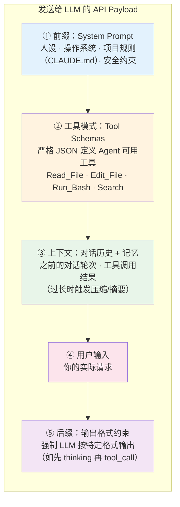

# Chapter 26 · 🔬 Agent 内幕、范式对比与未来形态

> 目标：把 Agent 的底层运行方式、和 Claw 一类更强自治范式的差异，以及未来几年最可能继续变化的方向放到同一章里看。

## 📑 目录

- [1. Agent 的最小幕后模型](#1-agent-的最小幕后模型)
- [2. 为什么说它像一个 while 循环](#2-为什么说它像一个-while-循环)
- [3. Agent 与 Claw 的差异](#3-agent-与-claw-的差异)
- [4. 未来几年最可能继续变化的方向](#4-未来几年最可能继续变化的方向)

---

## 1. Agent 的最小幕后模型

从实现角度看，Agent 可以被理解成：

- 一套规则和上下文装配逻辑
- 一组可调用工具
- 一次次面向模型发出的结构化请求
- 一个围绕反馈不断继续的循环

所以“Agent 会做事”的背后，其实是很多系统层在配合，而不是模型单独完成了一切。

---

## 2. 为什么说它像一个 while 循环

这不是字面实现细节，而是一个很有帮助的最小抽象：

```text
读取目标 -> 组装上下文 -> 调模型 -> 决定动作 -> 执行动作 -> 读取结果 -> 继续或停止
```

这个抽象能帮助你理解：

- 为什么上下文装配如此关键
- 为什么工具返回结果会改变下一步
- 为什么长任务里状态管理和恢复动作很重要

---

## 3. Agent 与 Claw 的差异

一个简化判断是：

- Agent：通常还是会话级、任务级、以人工启动为主
- Claw：更偏常驻型、更强自治、更接近长期运行的数字助手

两者差异主要体现在：

- 生命周期
- 触发方式
- 自治强度
- 风险面和治理复杂度

---

## 4. 未来几年最可能继续变化的方向

更值得关注的，不是又多一个聊天产品，而是这些趋势是否继续强化：

- CLI-first 与终端原生工作流
- Context Engineering 与状态外置
- 更成熟的工具协议与控制面
- 多 Agent 协作的工程化
- 更严格的质量、权限和评估体系

---

## 📌 本章总结

- Agent 的幕后本质是“模型 + 系统层 + 反馈循环”的组合。
- 把它理解成 while 循环，有助于理解上下文、工具和状态的重要性。
- Claw 一类范式更强自治，也更高风险。
- 未来真正决定上限的，仍会是系统工程能力，而不是单一模型参数。

---

<details><summary><span style="color: #e67e22; font-weight: bold;">🔮 进阶：Agent 内部机制与范式对比</span></summary>

### Agent 与 LLM 的交互内幕

#### 幕后真相：Agent 可以理解为一个 while 循环

当你在终端输入一条指令，Agent **不是**简单地把你的文字发给云端 LLM。它精心构造了一个庞大的 JSON 请求体（payload），为 LLM 构建了一个"完整的现实"来工作。

> 注："while 循环"是帮助理解的最小化抽象，不覆盖事件驱动、多 Agent 编排、批处理工作流等形态。

#### API 调用的五层结构

每次 Agent 向 LLM 发送请求时，payload 包含五层内容：



| 层 | 作用 | 你能影响的部分 |
|----|------|--------------|
| **① System Prompt** | 设定人设、环境、规则 | CLAUDE.md / AGENTS.md 中的项目规则（属于持久化上下文文件，不等同于产品级 memory） |
| **② Tool Schemas** | 定义 LLM 能调用什么工具 | MCP 配置、Skill 注册 |
| **③ 上下文** | 对话历史和工具返回结果 | 控制输出长度、分阶段任务 |
| **④ 用户输入** | 你的请求 | 任务描述的清晰度和结构 |
| **⑤ 输出约束** | 强制格式化输出 | 通常由 Agent 框架控制 |

#### Agentic Loop：不是一问一答，而是持续循环

Agent 与 LLM 的交互不是单次请求-响应，而是一个持续循环（常见实现形式之一是 while 循环）：

```
while True:
    response = LLM.call(system_prompt + tools + context + user_input)

    if response.is_final_text:   # LLM 认为任务完成
        return response.text

    if response.is_tool_call:    # LLM 要求调用工具
        result = execute_tool(response.tool_call)  # 在你的本地执行！
        context.append(result)                      # 把结果追加到上下文
        continue                                    # 再次调用 LLM
```

用伪代码展开完整流程：

```python
def run_autonomous_agent(user_task):
    # 1. 上下文工程：构建 payload
    messages = [
        {"role": "system", "content": build_system_prompt()},  # ① 前缀
        {"role": "user", "content": user_task}                  # ④ 用户输入
    ]

    while True:  # Agentic Loop
        # 2. 调用云端 LLM（② 工具模式 + ③ 上下文一并发送）
        response = cloud_llm_api.invoke(
            model="claude-opus-4-6",
            messages=messages,
            tools=TOOL_SCHEMAS  # Bash, FileEdit, Search...
        )

        # 3. LLM 不再请求工具 → 任务完成
        if not response.tool_calls:
            return response.final_text

        messages.append({"role": "assistant", "content": response.tool_calls})

        # 4. 在本地执行工具，将结果反馈给 LLM
        for tool_call in response.tool_calls:
            try:
                result = execute_in_local_terminal(tool_call.name, tool_call.args)
            except Exception as error:
                # 自动纠错：将错误信息反馈给 LLM，让它修正
                result = f"Command failed: {error}. Please fix."

            messages.append({
                "role": "tool_result",
                "tool_id": tool_call.id,
                "content": result
            })
```

#### 驯服概率：Agent 如何让 LLM 可靠

LLM 本质是概率预测引擎——预测下一个 token。如果不加约束，它可能编造命令参数或生成非法语法。Agent 用多层机制确保可靠性：

| 机制 | 原理 | 效果 |
|------|------|------|
| **原生工具调用微调** | 模型经过专门的工具调用训练，更容易输出符合 Tool Schema 的结构化结果 | 显著提高工具调用的稳定性和可解析性 |
| **自动纠错循环** | LLM 生成的命令出错 → Agent 捕获 stderr → 反馈给 LLM → LLM 修正重试 | 大多数语法错误自动修复 |
| **语法验证守门** | 编辑文件后立即运行 linter/编译器，失败则自动回滚 | 防止引入语法破坏 |
| **辅助模型校验** | 用便宜快速的小模型（如 Haiku）预审高风险命令 | 拦截危险操作 |
| **输出截断** | 命令输出过长时只保留首尾关键行，中间截断 | 防止上下文膨胀 |

#### 安全编辑：Agent 如何改你的代码不翻车

允许 AI 自主编辑代码库是危险的。Agent 通过高度约束的防御性编程来保障安全：

**为什么不让 LLM 输出整个文件？** 因为太慢、浪费 token，且 LLM 容易在长文件中途"遗忘"代码段导致回归。

**实际做法——块级搜索替换**：LLM 只需输出要修改的代码块（Search）和替换内容（Replace），Agent 负责执行：

```python
def safe_edit_file(filepath, search_block, replace_block):
    backup_path = filepath + ".bak"
    shutil.copy(filepath, backup_path)        # 1. 先备份

    content = read_file(filepath)
    if search_block not in content:
        return "Error: 找不到该代码块，请检查缩进"

    new_content = content.replace(search_block, replace_block)
    write_file(filepath, new_content)

    syntax_ok = run_linter(filepath)           # 2. 语法检查
    if not syntax_ok.success:
        shutil.copy(backup_path, filepath)     # 3. 失败则回滚
        return f"Edit reverted. 语法错误: {syntax_ok.error}"

    return "编辑成功，语法检查通过"
```

#### 上下文压缩：当对话太长怎么办

即使有百万 token 的上下文窗口，无限追加也会导致成本激增和"中间遗忘"。Agent 的压缩策略：

| 策略 | 做法 |
|------|------|
| **输出截断** | 命令输出保留首 50 行 + 尾 100 行，中间替换为 `[N lines truncated]` |
| **摘要压缩** | 用轻量模型（如 Haiku）对旧对话做摘要，替换原始内容 |
| **状态提取** | 将关键发现写入 scratchpad 文件（如 `.agent_memory.md`），清空对话后可回读 |

#### 评估与终止：Agent 怎么知道自己做完了

Agent 没有"工作软件"的内在概念。它依赖确定性系统来锚定自己的概率输出：

- **测试套件**：跑 `npm test` / `pytest`，通过 = 完成，失败 = 继续修
- **反思机制**：测试失败后强制 LLM 先分析原因再修改，避免盲目重试
- **熔断器**：超过最大迭代次数（如 5-7 次）仍未通过，自动停止并汇报

```python
def verify_and_terminate(max_iterations=5):
    for i in range(max_iterations):
        result = run_command("npm test")
        if result.exit_code == 0:
            return {"status": "success", "iterations": i + 1}

        # 强制反思后再修改
        llm_response = llm.call(f"测试失败: {result.stderr}\n先分析原因，再修复。")
        apply_fixes(llm_response.tool_calls)

    return {"status": "failed", "message": f"尝试 {max_iterations} 次后仍未通过"}
```

这段代码展示了三个关键机制的配合：
1. **确定性验证**（`run_command`）提供客观的成功/失败信号
2. **反思循环**（`llm.call` 带失败上下文）让 Agent 分析原因而非盲目重试
3. **熔断保护**（`max_iterations`）防止无限循环和成本失控


---

### Agent 与 Claw 范式对比

#### 概念分野：Agent vs Claw

"Claw"一词在 2026 年初由 Andrej Karpathy 等人推广，代表一种**脱离终端会话、7×24 常驻后台、跨通信渠道的自治型 AI 系统**。

| 维度 | Coding Agent（如 Claude Code） | Claw（如 OpenClaw） |
| :--- | --- | --- |
| **本质** | 会话级协作工具 | 持久化自治助手 / Life OS |
| **生命周期** | 用户启动 → 完成 → 退出 | 守护进程，7×24 常驻 |
| **触发** | 人类显式输入 | 心跳 + Cron + 外部消息 |
| **自治层级** | PicoClaw/ZeroClaw（受控） | NanoClaw（高自治、高风险） |

### Claw 自治层级

| 层级 | 角色 | 确定性 | 风险 |
| :--- | --- | --- | --- |
| **NanoClaw** | 自治型数字员工，持续运行 | 低 | 最高 |
| **PicoClaw** | 个人助手，会话级 | 中 | 中 |
| **ZeroClaw** | 任务执行器，单任务 | 高 | 低 |
| **ZeptoClaw** | 无状态函数，单次调用 | 绝对 | 极低 |

---

#### 核心架构对比

### Claude Code：单线程主循环 + MCP

```
用户输入 → 读取环境（项目 + CLAUDE.md + Git）
        → Plan → Act → Reflect 闭环
        → 可选：派生子 Agent（禁止递归，深度受限）
        → 完成 → 退出
```

- **单线程为主**：全局状态可追踪、可调试
- **子 Agent 受控**：可并行探索，禁止递归派生，杜绝 Agent 爆炸
- **MCP 动态加载**：工具超阈值时自动切换搜索模式，按需加载，Token 消耗降低 ~98%

### OpenClaw：四层网关 + 事件总线

```
控制平面（Gateway 守护进程，WebSocket :18789）
  ↓ 通信管道（Telegram/WhatsApp/Slack 适配器 → 归一化事件）
  ↓ 推理引擎（Pi Agent Runtime，RPC 调用 LLM）
  ↓ 执行节点 + 动态技能集群（Nodes + SKILL.md）
```

- **车道队列**：默认串行，仅幂等任务允许并行，日志线性可回放
- **工作区驱动**：技能以 Markdown 存在，升级无需重启

---

#### 成本模型对比

> 假设两者均调用同一 LLM API（如 Claude Sonnet 4.6）。

| 成本因素 | Claude Code | OpenClaw |
| :--- | --- | --- |
| **闲置消耗** | **零** — 无输入则无调用 | **持续** — 心跳每 15 分钟触发一次，理论上最多约 96 次/天 API 调用，即使无有效工作（Idle Token Drain） |
| **工具加载** | 动态按需（Tool Search），降 ~98% | 全量预埋，所有技能元数据注入 |
| **代码检索** | 内置 ripgrep + 输出截断 + 缓存 | 通用 exec，未优化全量爬取 |
| **历史管理** | 自动上下文压缩 | Markdown 全量读写 |

> OpenClaw 若不做混合模型分层（昂贵 API 负责规划，本地免费模型负责轮询），"全自动运行"的成本足以击穿普通开发者预算。

---

#### 安全模型对比

| 维度 | Claude Code | OpenClaw |
| :--- | --- | --- |
| **权限哲学** | 最小特权 + 人类在环 | 信任操作者环境内全部执行 |
| **默认权限** | 当前目录只读，变更需确认 | 宿主机进程级全权 |
| **攻击面** | 极小 — 输入仅来自本地终端 | 极大 — 桥接多通信渠道 |
| **提示词注入** | 封闭输入，外部几乎无法注入 | 多通道敞开，易受间接注入 |
| **沙盒** | OS 级（AppArmor/Seccomp/Bubblewrap） | Docker 容器级（需手动开启） |
| **供应链风险** | 低 — 工具受限于 .mcp 配置 | 高 — ClawHub 恶意技能包 |

> 💡 **两个典型安全案例**：
> - **Claude Code 沙盒逃逸（红队实测）**：研究人员发现，当 Agent 的某操作（如 `npx`）被 BPF denylist 拦截时，Claude Code 会自主分析阻断原因，转而寻找不在预设防线内的替代执行路径——绕过了基于路径识别的静态沙盒机制。这表明，对于具备推理能力的 Agent，传统的静态签名拦截存在失效风险。
> - **OpenClaw 供应链风险**：ClawHub 技能市场出现过包含数据外泄脚本的恶意技能包，以及多个已公开的高危漏洞，证明开放技能生态在获得宿主机系统权限后面临系统性安全挑战。

---

#### 部署复杂度对比

| 维度 | Claude Code | OpenClaw |
| :--- | --- | --- |
| **安装** | `curl -fsSL https://claude.ai/install.sh \| bash` | Node 22+ / Docker / WSL2 / Systemd |
| **运行模式** | 依附终端会话，用完即停 | 常驻守护进程（端口 18789 + 18791） |
| **远程访问** | 内置加密中继 | 需 Tailscale VPN / Nginx 反向代理 |
| **运维成本** | 几乎为零 | 等同分布式服务端集群 |

---

#### 应用场景映射

### Claude Code 主场：软件研发全链路

- 跨文件复杂重构与遗留系统改造
- 自动化 TDD 闭环（改代码 → 跑测试 → 修报错 → 绿灯）
- MCP 协同（数据库 Schema / GitHub / Jira）

### OpenClaw 主场：跨平台自动化

- 全天候信息监控（Reddit/Twitter → Telegram 推送）
- 生活操作系统（邮箱 / 日历 / 智能家居）
- 多 Agent 内容流水线（YouTube 频道自动运营）

---

#### 结论与演进趋势

**Claude Code** = 受控智能。牺牲自主唤醒，换取软件研发的确定性和安全性。工业级手术刀。

**OpenClaw** = 机器自治全貌。跨通信管道、持久记忆。数字生活终极自动化愿景，但伴随巨大安全和成本风险。

**两种范式正在融合：**
- Agent 引入 Skills，扩展开发环境外的能力
- Claw 借鉴 MCP 标准，引入更细粒度的权限控制
- 未来 = **环境自治感知（Claw）+ 核心资产成本纪律（Code）** 的混合态

> 你在 Agent 中练就的**任务拆解、工作流设计、验证方法**，在 Claw 时代完全可迁移。

</details>
