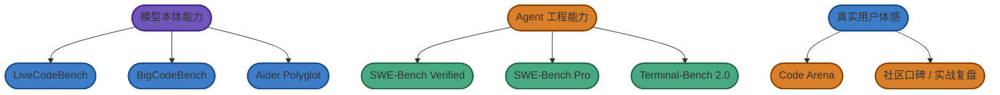

# 模型与 Agent 评测体系

> 这篇不是单纯"贴榜单"，而是想回答两个更重要的问题：
>
> 1. 为什么同一个模型在不同榜单表现差很多？
> 2. 为什么榜单第一不一定就是你最该用的那个？

---

## 先记住三件事

### 1. `模型 benchmark` 和 `Agent benchmark` 不是一回事

- 看 `LiveCodeBench`、`BigCodeBench`，更像是在看模型本体的代码生成与推理能力。
- 看 `SWE-Bench`、`Terminal-Bench`，更像是在看模型和 scaffolding 结合后的工程执行能力。

### 2. 同一个模型，换个 Agent，分数可能差很多

这是因为 `Agent` 不只是一层 UI，它还包含：

- 文件检索方式
- 工具系统
- 会话管理
- 规划策略
- 失败后如何重试

所以 `Claude Opus 4.6` 放进不同 Agent 里，`SWE-Bench` 分数完全可能差出好几个点。

### 3. 排行榜是筛选器，不是最终裁判

我建议把 leaderboard 当成"先缩小候选范围"的工具，而不是最终结论。最终你还是要回到自己的真实任务里做验证。

## Benchmark 地图：它们到底在测什么

## 一、常见 benchmark 对照表

| 基准 | 主要测什么 | 为什么重要 | 最大盲区 |
|------|------------|------------|----------|
| **SWE-Bench Verified** | 真实 GitHub issue 修复 | 最接近真实软件工程闭环 | 以 Python 为主，且非常依赖 scaffolding |
| **SWE-Bench Pro** | 多语言、长周期、更难的工程任务 | 更接近多语言真实工程 | 历史数据相对少，生态仍在快速演进 |
| **Terminal-Bench 2.0** | 终端命令、环境、DevOps 类操作 | 看 Agent 能不能真的"动手" | 偏终端 / 运维任务，不等于所有 coding 任务 |
| **LiveCodeBench** | 代码生成、竞赛型问题求解 | 抗污染、更新快，能看模型本体代码能力 | 和真实业务工程差距不小 |
| **BigCodeBench** | 更实用的编程任务 | 比传统 codegen benchmark 更接近日常编码 | 样本规模仍有限 |
| **Code Arena** | 开发者盲测与投票 | 更贴近真实体感 | 主观性更强，样本结构会影响结果 |
| **Aider Polyglot** | 多语言代码编辑与修改 | 能看跨语言编辑能力 | 带有 Aider 这个工具本身的风格偏置 |
| **SEAL Leaderboard** | 标准化 scaffolding 下的统一对比 | 便于隔离掉部分框架差异 | 仍然不是你的真实工作流 |

## 二、2026 年 Q1 的公开结果，应该怎么读

> 下面不是完整总榜，而是"**你应该记住的信号**"。

### 偏 Agent 工程能力的信号

| 基准 | 公开榜单上常见的领先信号 | 你该怎么理解 |
|------|--------------------------|--------------|
| **SWE-Bench Verified** | `Claude Opus 4.5 / 4.6`、`Gemini 3.1 Pro`、`MiniMax M2.5`、`GPT-5.x`、`GLM-5`、`Kimi K2.5` | 说明这些模型 / 组合在"理解 issue -> 改代码 -> 过测试"这一闭环里竞争力很强 |
| **SWE-Bench Pro** | `GPT-5.3-Codex`、`GPT-5.2-Codex`、`GPT-5.2` 等 | 更能反映长周期、多语言、多阶段任务的上限 |
| **Terminal-Bench 2.0** | `Codex CLI + GPT-5.3`、`GPT-5.3-Codex`、`Droid + Claude Opus 4.6` | 终端型 Agent、工具调用、命令执行能力很强的组合会更吃香 |

### 偏模型本体能力的信号

| 基准 | 公开榜单上常见的领先信号 | 你该怎么理解 |
|------|--------------------------|--------------|
| **LiveCodeBench** | `Gemini 3 Pro Preview`、`DeepSeek-V3.2`、`Qwen3-Max`、`Kimi K2.5`、`Claude Opus 4.6` | 说明这些模型在代码生成、题目求解、算法型任务上很有竞争力 |
| **BigCodeBench** | `Claude`、`OpenAI o-series / GPT 系`、`DeepSeek` | 说明它们的实用代码能力比较强 |
| **Code Arena** | `Claude 系列`、`Gemini 3.1`、`GPT-5.4`、`GLM-5` | 说明这些模型在真实开发者盲测里有较好的综合体感 |

### 中美模型主要差距（2026 Q1 快照）

> 这是一份时间点快照，差距正在快速收窄。以下观察供参考，榜单数字会持续变化，建议直接查阅官方来源。

**SWE-bench Verified（Agent 工程能力）**：美国仍领先，但中国模型已进入全球前五。

- 美国方向：`Claude Opus 4.5 / 4.6`（约 80.9% / 80.8%）、`Gemini 3.1 Pro`（约 80.6%）、`Codex / GPT-5.4`（约 77%）在 Agent 工程任务上保持优势。
- 中国方向：`MiniMax M2.5`（约 80.2%）已挤进全球前三，`GLM-5`（约 77.8%）、`Kimi K2.5`（约 76.8%）紧随其后，`DeepSeek` 和 `Qwen` 系列也在快速追赶。

**LiveCodeBench（代码生成能力）**：中美已高度拮抗。

- `Gemini 3 Pro` 仍居首位，但 `DeepSeek V3.2`（约 89.6%）、`Kimi K2.5`、`Qwen 3.5` 差距极小，中国模型在这一维度已有很强竞争力。

**Aider Polyglot（多语言代码编辑）**：格局有些意思。

- `Grok 4` 领跑，但 `Kimi K2.5` 同样得分靠前，中美模型交替出现在榜单前列，单一维度看已很难说谁完全领先。

**SWE-bench Pro（标准化脚手架条件）**：在 SEAL 统一 scaffolding 下，`OpenAI Codex` 系列模型包揽前列。这恰恰印证了本文的核心判断——**脚手架（scaffolding）对最终得分的影响之大，很容易超过模型本体的差距**。

**Code Arena（开发者投票）**：`Claude` 系列以 Elo 1552+ 霸占前十大多数席位；`GLM-5` 是目前首个闯入全球 Top 10 的中国模型，是一个值得关注的信号。

> 这些数字的意义不是"中国赢了"或"美国赢了"，而是在告诉你：**评测结果越来越难以用单一维度来总结，你需要具体任务类型来决定看哪个榜单。**

## 三、为什么你会看到"名字对不上"

这是很多人第一次看榜单时最困惑的地方。

### 常见情况

- 产品页写的是 `GPT-5.4 Pro`，榜单里写 `GPT-5.4`
- 产品页写的是 `Gemini 3.1 Pro`，榜单里写 `Gemini 3 Pro Preview`
- 产品页写的是 `MiniMax-M2.7`，榜单里常见的是 `MiniMax M2.5`

### 这意味着什么

- 产品命名、API 命名、benchmark 命名并不总同步。
- 榜单往往反映的是**某个时间点的公开评测版本**。
- 你应该看"系列趋势"和"能力方向"，不要机械地逐字比对型号名。

## 四、这些榜单测不到什么

这部分恰恰是很多人真正踩坑的来源。

benchmark 往往测不到：

- **输出是不是容易 review**
- **长会话会不会越来越飘**
- **对你自家项目规则的遵守是否稳定**
- **工具调用是否和你的本地 / 企业环境兼容**
- **价格、延迟、排队、订阅限制**
- **你自己看完结果的认知负担**

也正因为这样，`Code Arena` 这种"体感榜"和社区实战复盘，在 2026 年的重要性明显提高了。

## 五、为什么我一直强调"不要只看榜单"

### 原因一：厂商普遍会针对 benchmark 优化

这不是某一家独有现象，而是整个行业的常态。公开 benchmark 一旦成为营销战场，针对性优化几乎不可避免。

### 原因二：你的工作流不是 benchmark

公开榜单测的是一类任务，你的工作流可能是另一类任务：

- 你也许更看重前端页面生成
- 你也许更看重后端审查
- 你也许更看重低成本批量执行
- 你也许更在意中国大陆网络与中文资料处理

### 原因三：真实口碑是另一套维度

以 `MiniMax` 为例，近期榜单表现很亮眼，这一点值得重视；但如果你真的要把它放进主力清单，请不要只看分数。

原因在于：

- 网上真实用户评价明显是**褒贬不一**的。
- 你会看到"榜单很好看，但长期体验未必同样稳定"的反馈。
- 这类现象在 2026 年并不罕见。

所以请一定把下面这些渠道一起看：

- `Google`
- `Reddit`
- `小红书`
- `知乎`
- `B 站`

## 六、一个更稳的读榜方法

我建议按这个顺序来：

1. **先看 benchmark**：把候选缩小到 2 到 4 个系列。
2. **再看 Agent 形态**：这些模型是要配 `Claude Code`、`Cursor`、`Codex CLI`、`OpenCode`，还是别的工具。
3. **用真实任务做小样本验证**：至少用 3 到 5 个真实任务试一轮。
4. **最后比较长期成本**：不仅看 API 价格，也看 review 成本、延迟、失败重试和认知负担。

## 七、补充说明：关于国产模型和昇腾口径

`GLM-5` 这类模型在公开传播里，常被和华为昇腾生态放在一起讨论。更准确的说法应当是：

- **已经有昇腾适配 / 生态支持**
- **不应直接简化成"它一定是在昇腾上训练出来的模型"**

这种口径区分看起来细，但对读者理解技术事实很重要。

---

实时排行榜可参考：

- [SWE-Bench 官方排行榜](https://www.swebench.com/)
- [LiveCodeBench 官方排行榜](https://livecodebench.github.io/)
- [Code Arena](https://arena.ai/leaderboard/code)
- [Artificial Analysis Coding Index](https://artificialanalysis.ai/)
- [BigCodeBench](https://bigcode-bench.github.io/)

---

返回目录：[README · 章节目录](../../README.md#tutorial-contents)
