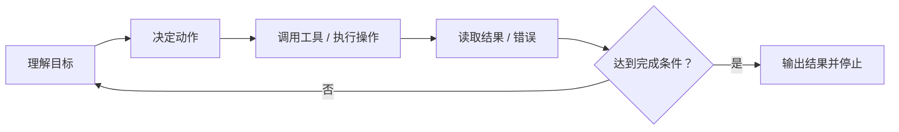

---
> 📚 **Part IV · 进阶专题** | [← 返回专题目录](../../README.md#part-iv-topics)
---

# 💾 为什么接上 Memory、Tool Use 和 Harness，模型才真正开始“能干活”？

> 🧭 很多时候，模型给你的回答已经“像那么回事”了。
>
> 🗣️ 它能解释方案，能分析 bug，能把步骤讲得头头是道。
>
> ⚠️ 但只要任务真的进入执行阶段，你很快就会发现另一件事：
>
> 🎯 **会回答，不等于会做事。**
>
> 🧰 真正把“会说”变成“能干活”的，不只是更强的模型，而是三样东西：
>
> - 💾 **Memory**：管理状态
> - 🛠️ **Tool Use**：把能力接到外部世界
> - 🔁 **Harness**：把整个系统收进闭环

## 目录

- [🚧 1. 为什么普通对话模型离“做事系统”还差很远](#1-为什么普通对话模型离做事系统还差很远)
- [💾 2. 先分清：什么才叫 Memory](#2-先分清什么才叫-memory)
- [⚠️ 3. 为什么很多 Agent 会越聊越笨](#3-为什么很多-agent-会越聊越笨)
- [🛠️ 4. Tool Use 稳不稳，往往先看接口设计而不是温度参数](#4-tool-use-稳不稳往往先看接口设计而不是温度参数)
- [✅ 5. `strict`、validation、retry 在真正改变什么](#5-strictvalidationretry-在真正改变什么)
- [🧰 6. Harness 到底是什么](#6-harness-到底是什么)
- [🔁 7. 为什么 loop 如此关键](#7-为什么-loop-如此关键)
- [👥 8. 为什么子代理经常比“一个总代理”更稳](#8-为什么子代理经常比一个总代理更稳)
- [📋 9. 一个更稳的 Agent 检查清单](#9-一个更稳的-agent-检查清单)
- [📝 极简记忆版](#极简记忆版)

---

## 1. 为什么普通对话模型离“做事系统”还差很远

普通聊天模型更像“一次性生成回答”。

它可以：

- 告诉你该怎么修 bug
- 猜测某个命令应该怎么写
- 分析一段代码可能哪里有问题

但如果没有外部世界反馈，它依然只能停留在脑内推演。

真正的 Agent 不一样。它不只是“回答你”，而是在尝试代表你完成目标：

- 读取文件
- 运行命令
- 调用外部工具
- 观察结果
- 继续修正下一步

这两者之间最大的差别，不是模型会不会说话，而是：

> 🎯 **谁在控制 workflow。**

只有当系统开始让模型决定“下一步做什么、是否调工具、何时停止、失败后怎么恢复”时，它才真正进入 agentic 模式。

---

## 2. 先分清：什么才叫 Memory

日常讨论里，大家喜欢把很多东西都叫“记忆”，但工程上最好把它们拆开。

| 🧩 名称 | ✅ 它是什么 | 🚫 它不是什么 |
|------|----------|------------|
| KV Cache | 推理阶段的注意力缓存 | 不是长期记忆 |
| 会话历史 | 这次对话里发生过的消息和工具结果 | 不是自动整理好的知识 |
| 工具输出 | 外部世界返回的一次结果 | 不是稳定可复用的状态 |
| 长期 Memory | 跨轮次、跨会话仍值得保留的信息 | 不是所有历史原文 |

一个很重要的纠偏是：

> ⚠️ **KV Cache 不是“模型记住了这件事”，它只是当前推理引擎的高速缓存。**

如果你想让 Agent 在未来还记得某个偏好、某条约定、某个关键事实，这件事通常需要系统显式保存和回注，而不是期待模型“自己一直记得”。

### 一个更实用的三层分法

把 Agent 的状态管理拆成三层，通常最清楚：

| 🪜 层级 | 📦 典型内容 | 🧰 该怎么处理 |
|------|----------|------------|
| 短期态 | 最近几轮消息、当前工具结果、当前局部状态 | 原文保留，但窗口要受控 |
| 中期态 | 阶段总结、已完成步骤、当前计划进度 | 做摘要和压缩 |
| 长期态 | 用户偏好、项目约定、已确认事实、可复用经验 | 显式持久化，按需注入 |

这比“把所有历史一路往后堆”稳得多。

---

## 3. 为什么很多 Agent 会越聊越笨

因为它们没有真正管理上下文，只是在无脑累加历史。

如果系统一直把所有旧内容原封不动塞回去，最后会出现几类典型问题：

- 🗑️ 已作废的计划还留在上下文里
- 🔁 重复说明越来越多
- ⚔️ 失败分支和成功分支一起竞争注意力
- 🕰️ 过时工具结果仍在影响当前判断

这时模型看到的不是“更多记忆”，而是“更多噪声”。

所以，好的 Memory 管理不是“永远不删”，而是：

- ✂️ 短期态适时 trimming
- 🗜️ 中期态及时 compression
- 📌 长期态只保存高信号结论

真正优秀的 Agent 更像一个会整理工作笔记的人，而不是一个什么都不丢的录音机。

---

## 4. Tool Use 稳不稳，往往先看接口设计而不是温度参数

工具调用一旦不稳定，很多人的第一反应是去调 `temperature`。

这通常不是最优先的修法。

更常见的根因是：**工具接口定义得太差。**

比如下面这些设计都会直接拉低稳定性：

- 🏷️ 字段名含糊
- 🔀 工具职责重叠
- ❓ 什么时候该调用没有写清楚
- 🌫️ 参数边界模糊
- 📄 缺少合法示例和失败说明

模型面对这种接口时，不是“随机坏了”，而是它根本没有拿到足够清楚的动作边界。

所以，稳定 Tool Use 的优先级通常应该是：

1. 🧰 先修工具描述和 schema
2. 📏 再修工具职责边界
3. 🎛️ 再考虑采样参数

这比直接把温度调低有效得多。

---

## 5. `strict`、validation、retry 在真正改变什么

如果只靠自然语言要求模型“按格式来”，它仍然有很大的自由度。

而一旦你把输出空间收窄到 schema，再叠加严格校验，事情就变了。

### 5.1 `strict` 在做什么

无论是函数调用参数，还是结构化输出，只要系统支持严格 schema 约束，模型很多“格式层面的自由度”都会被提前掐掉。

这会大幅减少这些错误：

- 🕳️ 漏字段
- 🔤 字段类型错
- 🔡 枚举值拼错
- 🧱 结构层级错乱

本质上，它不是让模型“更听话”这么简单，而是在真实缩小它能乱来的合法空间。

### 5.2 validation 在做什么

validation 把“看起来合理”变成“被系统判定为有效”。

例如：

- 🖥️ 命令参数是否合法
- 🧾 生成的 JSON 能不能解析
- 🧪 代码改完是否通过测试
- 🚦 调用高风险工具前是否满足前置条件

### 5.3 retry 在做什么

retry 不是让模型机械重来一遍，而是把失败反馈重新送回上下文，让下一轮决策能基于真实错误修正。

所以这三样东西分别在控制三层问题：

- `strict`：控制输出空间
- validation：控制结果合法性
- retry：控制失败恢复

---

## 6. Harness 到底是什么

如果把 Agent 写成一句最工程化的话，可以这样理解：

> 🧰 **Harness = 用状态管理、工具接口、约束规则、验证和重试，把一个概率生成模型封装成一个可执行任务的系统。**

很多人一说 Harness，就只想到“加规则”“防乱来”。

这只抓住了一半。

Harness 当然在做收束：

- 📐 限制输出格式
- 🚧 限制工具边界
- 🎯 限制动作空间
- 🛑 定义停止条件

但它也在做放大：

- 🔎 给模型接入搜索
- 📁 接入文件系统
- 🖥️ 接入终端
- 🗃️ 接入数据库和浏览器

没有这部分，模型只会变成一个被约束得很紧、但依旧只能说不能做的聊天机器人。

---

## 7. 为什么 loop 如此关键

Agent 真正的跨越，不是“能调工具”这件事本身，而是**它能把工具结果重新接回下一轮判断**。

这就是 loop 的价值。

没有 loop，模型只能想象自己已经完成任务。

有了 loop，它才可以：

- 📂 读目录后修正路径判断
- ❌ 看到报错后修正命令参数
- 🧪 发现测试失败后调整实现
- 🔄 根据外部反馈更新计划

从控制论视角看，这就是从开环走向闭环。

---

## 8. 为什么子代理经常比“一个总代理”更稳

很多人一开始做 Agent，容易把所有工具、所有记忆、所有目标都交给一个总代理。

这样做的问题是：

- 📦 上下文越来越胖
- 🔀 动作空间越来越大
- 💥 错误影响半径越来越大

子代理真正的价值，不是“多智能体听起来更高级”，而是它在帮你做三件很实在的事：

- 📦 隔离上下文
- 🔐 隔离权限
- 🎯 隔离目标

比如：

- 🔎 一个代理只负责搜索信息
- 🗺️ 一个代理只负责规划
- 💻 一个代理只负责改代码
- ✅ 一个代理只负责审查和验证

这样每一轮需要处理的上下文更小、可选动作更少、错误更容易局部化。

所以，Subagents 更像复杂度管理工具，而不是炫技架构。

---

## 9. 一个更稳的 Agent 检查清单

如果你要判断一个 Agent 设计得稳不稳，不要先问“模型是不是最大”，先问下面这些问题：

- 📍 当前状态存在哪里
- 🗜️ 旧状态何时被压缩
- 💾 哪些信息会进入长期记忆
- 🚧 工具调用边界是否清楚
- 🧩 参数是否有 schema 和校验
- 🔁 失败后是否有恢复路径
- ✅ 高风险动作前是否有验证
- 🛑 循环何时停止
- 👥 是否需要把复杂任务拆成子代理

这些问题的答案组合起来，才是真正决定系统上限的 Harness。

如果要把这篇压缩成一句话，那就是：

> 🔁 **模型负责生成候选，Harness 负责把候选收进一个能感知现实、能修正错误、能持续推进的闭环。**

---

## 极简记忆版

- 💾 **Memory 不是一团东西，KV Cache、会话历史、工具输出、长期记忆必须分层看。**
- ⚠️ **Agent 变笨，常常不是因为模型不行，而是因为上下文和状态没有被整理。**
- 🛠️ **稳定 Tool Use 的优先级，通常是 schema 和工具定义先于 temperature。**
- ✅ **`strict`、validation、retry 是在收窄错误空间、校验结果、修复失败。**
- 🔁 **Harness 的本质，是把概率模型包进一个带 loop、状态、工具和验证的闭环系统。**

---

> 📖 **相关专题**：[🔄 Prompt → Harness 演进案例](../topics/topic-prompt-to-harness.md) · [🧠 Agent 与 LLM 的交互内幕](../topics/topic-agent-llm-internals.md) · [👥 多 Agent 组合专题](../topics/topic-multi-agent.md)

---

🔙 返回目录：[README · 章节目录](../../README.md#tutorial-contents)
