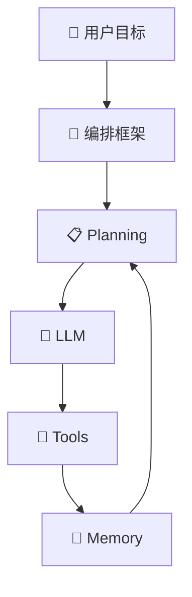
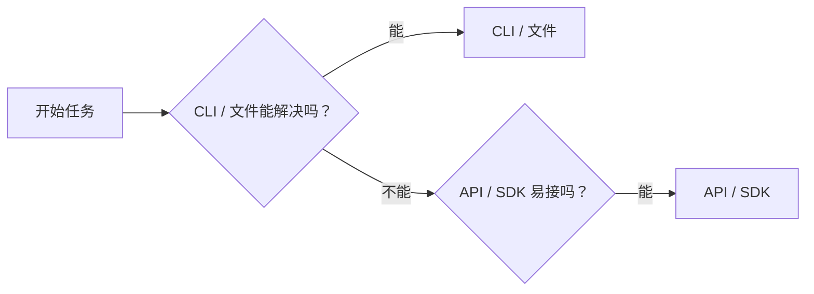

# Chapter 2 Flow Refinement Implementation Plan

> **For agentic workers:** REQUIRED SUB-SKILL: Use superpowers:subagent-driven-development (recommended) or superpowers:executing-plans to implement this plan task-by-task. Steps use checkbox (`- [ ]`) syntax for tracking.

**Goal:** Refine Chapter 2 so the four-part Agent model is explained in the reader's preferred order, merge duplicated Planning explanation, and resize the most visually awkward diagrams.

**Architecture:** Keep the existing chapter outline, but rewrite Section 2 so it moves directly from the four-part formula into a narrower closed-loop diagram and four short component explanations in the order `LLM -> Planning -> Tools -> Memory`. Then trim Section 5 so it focuses on planning behavior rather than re-explaining the core definition, and redraw the oversized Mermaid diagrams with more compact layouts.

**Tech Stack:** Markdown, Mermaid, existing Chapter 2 content

---

### Task 1: Reshape Section 2 Narrative

**Files:**
- Modify: `docs/chapters/ch02-concepts.md`

- [ ] **Step 1: Change the four-part formula order to match the new reading flow**

```md
> **Agent = LLM + Planning + Tools + Memory**
```

- [ ] **Step 2: Rewrite the lead-in after the formula so the chapter immediately promises a four-part walkthrough**

```md
下面不急着把四个词拆得很深，而是先按系统真正运转的顺序看一遍：

1. `LLM` 负责理解、推理、生成
2. `Planning` 决定下一步做什么
3. `Tools` 把动作施加到真实环境
4. `Memory` 把结果和状态写回系统
```

- [ ] **Step 3: Add compact subsections for `LLM`, `Planning`, `Tools`, and `Memory` directly under Section 2**

```md
### 2.x 先看 LLM：它负责理解、推理、生成
### 2.x 再看 Planning：它决定下一步做什么
### 2.x 再看 Tools：它让 Agent 真正动手
### 2.x 最后看 Memory：它让系统不会每走一步都失忆
```

### Task 2: Merge Planning Overview And Remove Redundancy

**Files:**
- Modify: `docs/chapters/ch02-concepts.md`

- [ ] **Step 1: Move the “fixed harness + LLM dynamic planning” explanation into the new Planning subsection**

```md
很多产品里的 `Planning` 都不是单一来源，而是“固定编排 + LLM 动态规划”的混合体。
```

- [ ] **Step 2: Keep Section 5 focused on decomposition, verification, stop conditions, and multi-agent coordination**

```md
## 5. Planning：Agent 怎么把目标一步步做完
```

- [ ] **Step 3: Remove repeated introductory sentences that re-define Planning without adding new information**

```md
删去与第 2 节重复解释的段落，只保留“怎么拆、怎么验、什么时候停”的实战内容。
```

### Task 3: Redraw Compact Diagrams

**Files:**
- Modify: `docs/chapters/ch02-concepts.md`

- [ ] **Step 1: Redraw Section 2.2 as a top-down loop so it is narrower and shows `Planning` reading `Memory`**



- [ ] **Step 2: Redraw Section 4.6 as a flatter left-to-right decision flow**



- [ ] **Step 3: Shorten node labels where possible to reduce visual bulk without changing meaning**

```md
把“需要标准化、多工具治理、统一鉴权吗？”压成同义但更短的版本。
```

### Task 4: Verify Reading Flow

**Files:**
- Modify: `docs/chapters/ch02-concepts.md`

- [ ] **Step 1: Read Section 2 through Section 5 in order and check for transitions that now feel duplicated or out of sequence**

Run: `nl -ba docs/chapters/ch02-concepts.md | sed -n '260,760p'`
Expected: Section 2 gives formula -> loop -> four-part walkthrough, and Section 5 starts from planning practice rather than definition

- [ ] **Step 2: Inspect the diff to confirm only the intended chapter file and new plan file changed for this refinement**

Run: `git diff -- docs/chapters/ch02-concepts.md docs/superpowers/plans/2026-03-27-ch02-chapter-flow-refinement.md`
Expected: Diff shows Section 2/4.6/5 adjustments plus the new plan document
