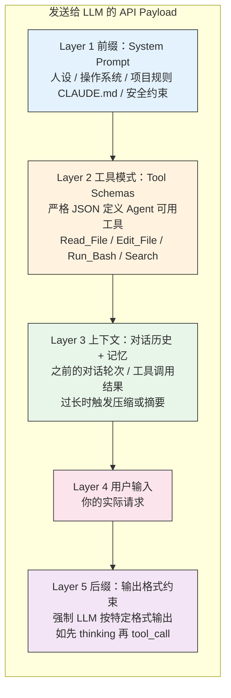

# 🔬 Agent 与 LLM 交互的代码解剖

> 🎯 **目标**：用可运行的伪代码，把 Agent 的"黑箱"拆成你能看懂的白箱。读完本文，你应该能回答：每次你输入一条指令，Agent 到底向 LLM 发送了什么？LLM 回复后又发生了什么？工具调用、自动纠错、上下文压缩和终止判断的代码逻辑各是什么样的？

## 📑 目录

- [0. 为什么要看代码级内幕](#0-为什么要看代码级内幕)
- [1. API Payload 的五层结构](#1-api-payload-的五层结构)
- [2. Agentic Loop：核心 while 循环](#2-agentic-loop核心-while-循环)
- [3. 一次真实请求的内部轨迹](#3-一次真实请求的内部轨迹)
- [4. 驯服概率：Agent 如何让 LLM 可靠](#4-驯服概率agent-如何让-llm-可靠)
- [5. 安全编辑：块级搜索替换](#5-安全编辑块级搜索替换)
- [6. 上下文压缩：当对话太长怎么办](#6-上下文压缩当对话太长怎么办)
- [7. 评估与终止：Agent 怎么知道自己做完了](#7-评估与终止agent-怎么知道自己做完了)
- [8. 从代码回看原理](#8-从代码回看原理)

---

> 📌 **前置知识**：本文假设你已经理解 Agent 的基本原理（[Ch07 · 从 LLM 到 Agent](../chapters/ch07-llm-to-agent.md)）和四件套公式（[Ch08 · Agent = Model + Harness](../chapters/ch08-agent-formula.md)）。如果你对 `Planning / Tools / Memory / Harness` 还不熟，建议先读完 Part II 的前几章。

## 0. 为什么要看代码级内幕

很多人用了几个月 Agent，仍然觉得它是一个"魔法黑箱"——输入一句话，过几秒就给你改了代码。这种感觉会带来两个问题：

1. **出了问题不知道排查哪一层**：是模型理解错了？上下文装配有问题？工具执行失败了？还是停止条件没设对？
2. **优化时没有抓手**：不知道 CLAUDE.md 影响的是哪一层，不知道 `/compact` 压缩的是什么，不知道 MCP 工具定义为什么会影响 Token 消耗。

把 Agent 的内部循环用代码拆开看一遍，这两个问题就自然解开了。

---

## 1. API Payload 的五层结构

当你在终端输入一条指令，Agent **不是**简单地把你的文字发给云端 LLM。它精心构造了一个庞大的 JSON 请求体（payload），为 LLM 构建了一个"完整的现实"来工作。

> 注："while 循环"是帮助理解的最小化抽象，不覆盖事件驱动、多 Agent 编排、批处理工作流等形态。

每次 Agent 向 LLM 发送请求时，payload 包含五层内容：



### 五层各自的角色与你的影响面

| 层 | 作用 | 你能影响的部分 |
|----|------|--------------|
| **Layer 1 System Prompt** | 设定人设、环境、规则 | CLAUDE.md / AGENTS.md 中的项目规则 |
| **Layer 2 Tool Schemas** | 定义 LLM 能调用什么工具 | MCP 配置、Skill 注册 |
| **Layer 3 上下文** | 对话历史和工具返回结果 | 控制输出长度、分阶段任务、`/compact` |
| **Layer 4 用户输入** | 你的请求 | 任务描述的清晰度和结构 |
| **Layer 5 输出约束** | 强制格式化输出 | 通常由 Agent 框架控制 |

> 💡 **关键认知**：你写的 CLAUDE.md 规则会被注入 Layer 1，MCP 工具定义会膨胀 Layer 2，历史对话和工具输出会不断积累在 Layer 3。理解了这个结构，你就知道为什么"工具太多 = Layer 2 膨胀 = 挤压 Layer 3 空间 = Agent 变蠢"。

---

## 2. Agentic Loop：核心 while 循环

Agent 与 LLM 的交互不是单次请求-响应，而是一个持续循环。用最简代码表示：

```python
# 最简 Agentic Loop
while True:
    response = LLM.call(system_prompt + tools + context + user_input)

    if response.is_final_text:   # LLM 认为任务完成
        return response.text

    if response.is_tool_call:    # LLM 要求调用工具
        result = execute_tool(response.tool_call)  # 在你的本地执行！
        context.append(result)                      # 把结果追加到上下文
        continue                                    # 再次调用 LLM
```

### 展开完整流程

```python
def run_autonomous_agent(user_task):
    """一个完整的 Agent 执行循环"""

    # ── Step 1: 上下文工程：构建初始 payload ──
    messages = [
        {"role": "system", "content": build_system_prompt()},  # Layer 1 前缀
        {"role": "user", "content": user_task}                  # Layer 4 用户输入
    ]

    while True:  # ── Agentic Loop 开始 ──

        # ── Step 2: 调用云端 LLM ──
        # Layer 2 (Tool Schemas) + Layer 3 (上下文) 一并发送
        response = cloud_llm_api.invoke(
            model="claude-opus-4-6",
            messages=messages,
            tools=TOOL_SCHEMAS  # Bash, FileEdit, Search...
        )

        # ── Step 3: 判断是否完成 ──
        # LLM 不再请求工具 → 任务完成，退出循环
        if not response.tool_calls:
            return response.final_text

        # 记录 LLM 的工具调用决策
        messages.append({"role": "assistant", "content": response.tool_calls})

        # ── Step 4: 在本地执行工具，将结果反馈给 LLM ──
        for tool_call in response.tool_calls:
            try:
                result = execute_in_local_terminal(tool_call.name, tool_call.args)
            except Exception as error:
                # 自动纠错：将错误信息反馈给 LLM，让它修正
                result = f"Command failed: {error}. Please fix."

            messages.append({
                "role": "tool_result",
                "tool_id": tool_call.id,
                "content": result      # 工具结果进入 Layer 3 上下文
            })
        # ── 回到 while True 开头，再次调用 LLM ──
```

### 代码中的四个关键洞察

| 代码位置 | 洞察 |
|---------|------|
| `build_system_prompt()` | 你的 CLAUDE.md 规则在这里被注入。规则写得好不好，直接决定 LLM 的行为边界 |
| `tools=TOOL_SCHEMAS` | 每个 MCP Server 的工具定义都在这里。工具越多，这个 payload 越大，Token 越贵 |
| `execute_in_local_terminal()` | 工具在**你的本地**执行，不是在云端。这就是为什么 Agent 能改你的文件、跑你的测试 |
| `messages.append(result)` | 每次工具执行结果都追加到上下文。这就是为什么长任务会越来越慢——Layer 3 在不断膨胀 |

---

## 3. 一次真实请求的内部轨迹

用上面的代码框架，我们可以追踪一次真实请求在 Agent 内部经历了什么。

**你输入**：

> "帮我找到项目里所有未使用的依赖并清理掉。"

**Agent 内部的 while 循环轨迹**：

| 轮次 | LLM 判断（Step 2 输出） | 工具调用（Step 4） | 工具返回（进入 Layer 3） |
|:---:|---|---|---|
| 1 | 先确认项目类型 | `Read("package.json")` | 发现 Node.js 项目，npm |
| 2 | 看哪些包被声明了 | `Read("package.json")` → 解析 dependencies | 列出 15 个依赖 |
| 3 | 在代码里搜索引用 | `Grep("lodash", "src/")` | 发现 lodash 没被引用 |
| 4 | 排除配置文件间接使用 | `Grep("lodash", "*.config.*")` | 确认也没在配置里用 |
| 5 | 重复 3-4 检查其他依赖 | `Grep(...)` × 多次 | 发现 3 个包确实未使用 |
| 6 | 确认后删除 | `Bash("npm uninstall lodash ...")` | 删除成功 |
| 7 | 验证没破坏项目 | `Bash("npm test")` | 测试全部通过 |
| 8 | `response.tool_calls` 为空 | — | 退出循环，输出最终结果 |

> 💡 **关键认知**：你看到的是"一条完成回复"，Agent 内部经历的却是 **8 轮 LLM 调用 + 多次工具执行**。每一轮都在消耗 Token，都在向 Layer 3 追加数据。这就是为什么一个看似简单的任务也可能消耗几万 Token。

---

## 4. 驯服概率：Agent 如何让 LLM 可靠

LLM 本质是概率预测引擎——预测下一个 token。如果不加约束，它可能编造命令参数或生成非法语法。Agent 用多层机制确保可靠性：

| 机制 | 原理 | 效果 |
|------|------|------|
| **原生工具调用微调** | 模型经过专门的工具调用训练，更容易输出符合 Tool Schema 的结构化结果 | 显著提高工具调用的稳定性和可解析性 |
| **自动纠错循环** | LLM 生成的命令出错 -> Agent 捕获 stderr -> 反馈给 LLM -> LLM 修正重试 | 大多数语法错误自动修复 |
| **语法验证守门** | 编辑文件后立即运行 linter/编译器，失败则自动回滚 | 防止引入语法破坏 |
| **辅助模型校验** | 用便宜快速的小模型（如 Haiku）预审高风险命令 | 拦截危险操作 |
| **输出截断** | 命令输出过长时只保留首尾关键行，中间截断 | 防止上下文膨胀 |

### 对应到代码中的位置

```python
# 自动纠错循环（对应 run_autonomous_agent Step 4 中的 except 分支）
try:
    result = execute_in_local_terminal(tool_call.name, tool_call.args)
except Exception as error:
    # 不是直接失败，而是把错误信息反馈给 LLM
    result = f"Command failed: {error}. Please fix."
    # LLM 在下一轮会看到这个错误，并尝试修正
```

这就是为什么你经常看到 Agent "先报错、再修复"的行为——它不是 Bug，而是设计好的纠错循环。

---

## 5. 安全编辑：块级搜索替换

允许 AI 自主编辑代码库是危险的。Agent 通过高度约束的防御性编程来保障安全。

**为什么不让 LLM 输出整个文件？** 因为太慢、浪费 token，且 LLM 容易在长文件中途"遗忘"代码段导致回归。

**实际做法——块级搜索替换**：LLM 只需输出要修改的代码块（Search）和替换内容（Replace），Agent 负责执行：

```python
def safe_edit_file(filepath, search_block, replace_block):
    """安全编辑：备份 -> 替换 -> 验证 -> 失败回滚"""

    backup_path = filepath + ".bak"
    shutil.copy(filepath, backup_path)        # 1. 先备份

    content = read_file(filepath)
    if search_block not in content:
        return "Error: 找不到该代码块，请检查缩进"

    new_content = content.replace(search_block, replace_block)
    write_file(filepath, new_content)

    syntax_ok = run_linter(filepath)           # 2. 语法检查
    if not syntax_ok.success:
        shutil.copy(backup_path, filepath)     # 3. 失败则回滚
        return f"Edit reverted. 语法错误: {syntax_ok.error}"

    return "编辑成功，语法检查通过"
```

### 三层防护机制

| 步骤 | 做什么 | 为什么 |
|------|--------|-------|
| **备份** | 修改前先复制原文件 | 随时可回滚 |
| **块级替换** | 只改 LLM 指定的代码块 | 避免整文件重写导致的遗漏 |
| **语法守门** | 修改后立即跑 linter | 语法不过就自动回滚，不会引入语法破坏 |

> 💡 这也是为什么你在用 Claude Code 时，偶尔会看到 Agent 说"Edit reverted"——不是 Agent 出了 Bug，而是它的安全机制在生效。

---

## 6. 上下文压缩：当对话太长怎么办

即使有百万 token 的上下文窗口，无限追加也会导致成本激增和"中间遗忘"。Agent 的压缩策略：

| 策略 | 做法 | 对应你的操作 |
|------|------|------------|
| **输出截断** | 命令输出保留首 50 行 + 尾 100 行，中间替换为 `[N lines truncated]` | 自动发生，你不需要干预 |
| **摘要压缩** | 用轻量模型（如 Haiku）对旧对话做摘要，替换原始内容 | `/compact` 手动触发或自动触发 |
| **状态提取** | 将关键发现写入 scratchpad 文件，清空对话后可回读 | 任务检查点、交接摘要 |

### 压缩在代码中的位置

压缩发生在 `messages` 列表上。当 `messages` 的 token 总量接近窗口上限时：

```python
# 伪代码：上下文压缩逻辑
if estimate_tokens(messages) > CONTEXT_WINDOW * 0.8:
    # 方式 1：用小模型生成摘要
    summary = haiku.summarize(messages[:-recent_count])
    messages = [
        messages[0],                    # 保留 System Prompt
        {"role": "system", "content": summary},  # 摘要替换历史
        *messages[-recent_count:]       # 保留最近几轮
    ]
```

> 💡 **这就是 `/compact` 在做的事**：把 Layer 3 中的旧历史压缩成摘要，释放空间给后续操作。手动带摘要的 `/compact "要点..."` 比自动压缩更可靠，因为你比 Agent 更清楚哪些信息对下一步最重要。

---

## 7. 评估与终止：Agent 怎么知道自己做完了

Agent 没有"工作软件"的内在概念。它依赖**确定性系统**来锚定自己的概率输出：

- **测试套件**：跑 `npm test` / `pytest`，通过 = 完成，失败 = 继续修
- **反思机制**：测试失败后强制 LLM 先分析原因再修改，避免盲目重试
- **熔断器**：超过最大迭代次数（如 5-7 次）仍未通过，自动停止并汇报

```python
def verify_and_terminate(max_iterations=5):
    """验证与终止：测试驱动 + 反思 + 熔断"""
    for i in range(max_iterations):
        result = run_command("npm test")
        if result.exit_code == 0:
            return {"status": "success", "iterations": i + 1}

        # 强制反思后再修改（不是盲目重试！）
        llm_response = llm.call(
            f"测试失败: {result.stderr}\n先分析原因，再修复。"
        )
        apply_fixes(llm_response.tool_calls)

    # 熔断：超过最大次数，停止并汇报
    return {"status": "failed", "message": f"尝试 {max_iterations} 次后仍未通过"}
```

### 三个机制的配合

| 机制 | 代码对应 | 作用 |
|------|---------|------|
| **确定性验证** | `run_command("npm test")` | 提供客观的成功/失败信号 |
| **反思循环** | `llm.call(f"测试失败: ...")` | 让 Agent 分析原因而非盲目重试 |
| **熔断保护** | `range(max_iterations)` | 防止无限循环和成本失控 |

> 💡 这也解释了为什么"给 Agent 可运行的验证命令"如此重要（参见 [代码探索与验证驱动](./topic-explore-verify-workflow.md)）：没有测试套件，Agent 就失去了 `verify_and_terminate` 中的确定性锚点，只能靠"看起来对"来判断完成——这正是幻觉和过度自信的温床。

---

## 8. 从代码回看原理

把上面的代码逻辑和教程前面的概念做一次对照：

| 概念（Part II 章节） | 代码中的位置 | 一句话连接 |
|---|---|---|
| **Agent = Model + Harness**（Ch08） | `run_autonomous_agent` 整体结构 | Model 是 `cloud_llm_api.invoke()`，其余全是 Harness |
| **Agentic Loop**（Ch10） | `while True` 循环 | Planning 在每轮的 `response.tool_calls` 决策中发生 |
| **Tools**（Ch12） | `execute_in_local_terminal()` | 工具在本地执行，结果回写上下文 |
| **Memory / Context**（Ch11） | `messages` 列表的增长与压缩 | Layer 3 的膨胀与 `/compact` |
| **失效模式**（Ch17） | `except` 分支 + `max_iterations` | 纠错循环防假设传播，熔断防无限打转 |
| **验证驱动**（专题） | `verify_and_terminate()` | 没有确定性验证信号，Agent 就只能猜 |

### 一个最值得带走的判断

> 🔬 **Agent 的"智能"不在某一行代码里，而在这些部件如何组合成闭环。** 模型负责判断，工具负责执行，上下文负责记忆，验证负责纠偏，熔断负责兜底。拆开看每一层都朴素，组合起来才是 Agent。

---

## 📌 本文总结

| 机制 | 一句话 |
|------|--------|
| **Payload 五层结构** | 你写的 CLAUDE.md 是 Layer 1，MCP 工具定义是 Layer 2，对话历史是 Layer 3 |
| **Agentic Loop** | 不是一问一答，而是 while 循环 × N 轮 LLM 调用 |
| **自动纠错** | 工具执行失败后，错误信息反馈给 LLM 重试，不是直接崩溃 |
| **安全编辑** | 块级替换 + 语法守门 + 自动回滚 |
| **上下文压缩** | `/compact` 的本质是用摘要替换 Layer 3 旧历史 |
| **验证与终止** | 确定性验证（测试）+ 反思循环 + 熔断保护 |

## 📚 继续阅读

- 想理解原理概念：[Ch07 · 从 LLM 到 Agent](../chapters/ch07-llm-to-agent.md) / [Ch08 · Agent = Model + Harness](../chapters/ch08-agent-formula.md)
- 想看失效模式和恢复：[Ch17 · Agent 错误用法](../chapters/ch17-agent-failure-modes.md)
- 想看 Agent 与 Claw 范式的完整对比：[Ch26 · Agent 内幕、范式对比与未来形态](../chapters/ch26-internals-paradigms-futures.md)
- 想动手实践验证驱动：[代码探索与验证驱动](./topic-explore-verify-workflow.md)

---

<div align="center">

[📚 返回目录](../../README.md#tutorial-contents)

</div>
