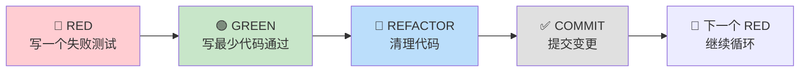
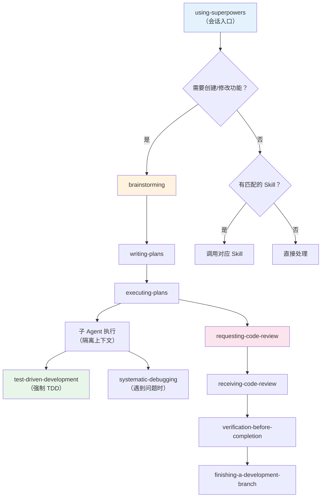
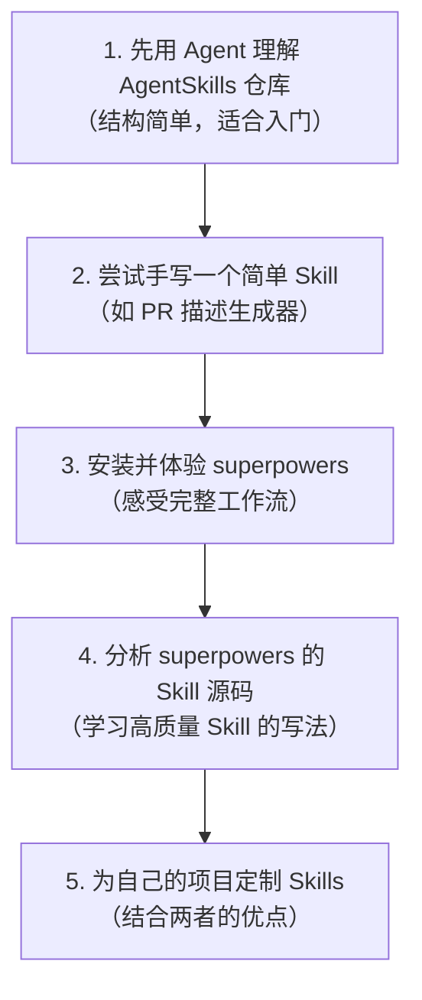
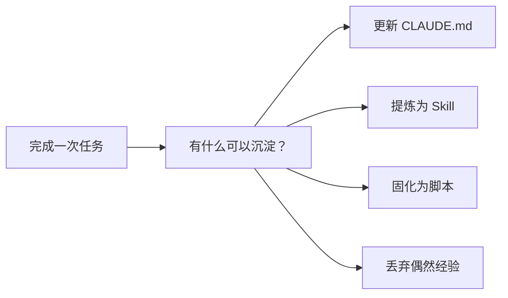

# Chapter 6 · Agent 基础实战案例

> 目标：通过一系列真实场景案例，掌握 Agent 在日常开发中的基础用法。本章以 [zht043/AgentSkills](https://github.com/zht043/AgentSkills) 和 [obra/superpowers](https://github.com/obra/superpowers) 两个开源项目为实战案例，边学边练。

---

## 为什么选这两个项目

本章不会用虚构的 Todo App 做示范，而是选择两个**真实的 Agent 生态项目**作为贯穿案例：

| 项目 | 定位 | 为什么选它 |
|------|------|-----------|
| **[zht043/AgentSkills](https://github.com/zht043/AgentSkills)** | 笔者维护的 Agent Skills 集合 | 结构简洁、适合入门，天然体现 Skill 体系的递归价值 |
| **[obra/superpowers](https://github.com/obra/superpowers)** | 最知名的 Agent Skills 框架（75K+ Stars） | 完整的 7 阶段工作流、入选 Anthropic 官方 Marketplace，代表行业最佳实践 |

用 Agent 生态项目来学 Agent，本身就是一种「meta」式学习——**你在用 Agent 学习如何给 Agent 写工具**。

---

## 案例一：用 Agent 快速理解一个陌生仓库

> 🎯 场景：你刚 clone 了 `obra/superpowers`，想在 30 分钟内建立结构感。

### 为什么这是高 ROI 场景

接手陌生仓库是 Agent 最擅长的事之一。传统做法：打开 README → 翻目录 → 搜关键词 → 逐文件阅读 → 心里拼出全貌。这个过程对人类来说至少需要数小时。Agent 可以帮你大幅压缩这个周期。

### 实战步骤

**第一步：Clone 并启动 Agent**

```bash
git clone https://github.com/obra/superpowers
cd superpowers
claude  # 启动 Claude Code
```

**第二步：用结构化 prompt 让 Agent 产出项目导览**

```
请帮我理解这个仓库：

1. 项目定位和核心功能
2. 目录结构（只列到第二级，标注每个目录的作用）
3. 核心文件（哪些文件最重要，为什么）
4. 依赖关系和技术栈
5. 启动/安装/测试命令

先不要修改任何文件，只做分析。
```

**第三步：深入理解核心机制**

在 Agent 给出概览后，你可以针对性地追问：

```
superpowers 的 Skill 是如何被发现和加载的？
从用户输入 /superpowers:brainstorm 到 Skill 实际执行，中间经历了哪些步骤？
请追踪代码给出调用链。
```

### 你会发现什么

通过 Agent 分析 superpowers 仓库，你会发现它包含以下核心 Skills：

| Skill | 功能 | 工作流阶段 |
|-------|------|-----------|
| `brainstorming` | 苏格拉底式需求澄清，探索用户真正意图 | 🧠 第 1 阶段：需求理解 |
| `writing-plans` | 基于 spec 生成分步实现计划 | 📋 第 2 阶段：计划 |
| `executing-plans` | 在子 Agent 中执行计划，带审查检查点 | ⚙️ 第 3 阶段：执行 |
| `test-driven-development` | 强制 RED→GREEN→REFACTOR 循环 | 🧪 贯穿执行阶段 |
| `systematic-debugging` | 四阶段根因分析流程 | 🔍 问题定位 |
| `requesting-code-review` | 对照计划审查代码，按严重性报告问题 | ✅ 第 4 阶段：审查 |
| `receiving-code-review` | 收到审查反馈后的处理流程 | 🔄 第 5 阶段：修正 |
| `verification-before-completion` | 完成前必须运行验证命令 | ✔️ 第 6 阶段：验证 |
| `finishing-a-development-branch` | 引导合并、PR 或清理 | 🏁 第 7 阶段：收尾 |
| `dispatching-parallel-agents` | 子 Agent 驱动的并行开发 | ⚡ 可选加速 |
| `using-git-worktrees` | 用 Git worktree 隔离特性开发 | 🌿 隔离开发 |

这就是 superpowers 最核心的设计理念：**把软件开发的完整生命周期拆成离散的、可复用的 Skill，让 Agent 在每个阶段都有明确的方法论指导。**

### 经验沉淀

完成这个案例后，你可以把以下内容沉淀到自己的 `CLAUDE.md`：

```markdown
## 探索陌生仓库的标准流程
1. 先让 Agent 产出项目概览（目录 + 核心文件 + 技术栈）
2. 再针对核心机制追问调用链
3. 不要一上来就让 Agent 改代码
```

---

## 案例二：用 Agent 修复一个真实 Bug

> 🎯 场景：在 AgentSkills 仓库中，某个 Skill 的触发条件写得不准确，导致不该触发时被误触发。

### 实战步骤

**第一步：描述问题，让 Agent 先定位**

```
这个项目的某个 Skill 存在一个问题：描述（description）写得过于宽泛，
导致在不相关的场景下也会被 Agent 隐式触发。

请帮我：
1. 检查所有 SKILL.md 文件的 description 字段
2. 找出描述过于宽泛、可能导致误触发的 Skill
3. 给出修改建议，但先不要改
```

**第二步：确认分析结果后再执行**

Agent 会列出它认为有问题的 Skill 及原因。你确认后再说：

```
同意你对 X 和 Y 的分析。请修改这两个 Skill 的 description，
让触发条件更精确。修改后请说明改了什么、为什么。
```

**第三步：验证修改**

```
请说明如何验证这些修改确实解决了误触发问题。
有没有办法在不实际触发的情况下测试 description 的匹配行为？
```

### 为什么这个案例重要

这个案例展示了 Agent 修 bug 的正确姿势：

1. **先定位，再修改** — 不要一上来就说"帮我修这个 bug"
2. **给出分析，等你确认** — 让 Agent 先展示理解，你做决策
3. **要求验证路径** — 修完后怎么知道真的修好了

> 📌 这也是 superpowers 中 `systematic-debugging` Skill 的核心理念：**四阶段根因分析**——观察 → 假设 → 验证 → 修复，而不是靠直觉乱猜。

### 经验沉淀

```markdown
## Bug 修复的标准 prompt 结构
1. 描述现象（而非你猜测的原因）
2. 要求 Agent 先分析可能原因并排优先级
3. 确认后再动手
4. 要求给出验证方案
```

---

## 案例三：用 Agent 补测试

> 🎯 场景：AgentSkills 仓库中的某些工具脚本缺少测试，你想补上最有价值的测试。

### 实战步骤

**第一步：让 Agent 识别测试缺口**

```
请分析这个仓库的测试覆盖情况：
1. 哪些模块/脚本有测试？
2. 哪些模块/脚本没有测试但应该有？
3. 按"业务重要性 × 缺失严重度"排序，推荐最该先补的 3 个

先给分析，不要写测试代码。
```

**第二步：用 TDD 方式补测试**

如果你安装了 superpowers，这里可以直接体验它的 TDD Skill：

```
请使用 TDD 方式为 [模块名] 补充测试。

要求：
1. 先写一个会失败的测试（RED）
2. 让我看到测试失败
3. 再写最少代码让测试通过（GREEN）
4. 最后看看有没有需要重构的地方（REFACTOR）
```

这就是 superpowers 的 `test-driven-development` Skill 的核心流程——**如果 Agent 试图在测试之前写实现代码，这个 Skill 会让它删掉代码重新来过。**

### Superpowers TDD Skill 深度解析

让我们仔细看看 superpowers 是怎么强制 TDD 的：



关键约束：
- **不允许跳过 RED**：必须先看到测试失败，证明测试是有意义的
- **GREEN 阶段只写最少代码**：遵循 YAGNI（You Aren't Gonna Need It）
- **每个 RED→GREEN→REFACTOR 循环都提交一次**：保持原子性

这种严格的约束对人类开发者可能显得繁琐，但对 Agent 来说恰恰是防止它「过度发挥」的最佳护栏。

### 经验沉淀

```markdown
## 补测试的优先级判断
- 先补业务核心路径的测试，而不是工具函数
- 先补"出错成本高"的模块，再补"出错容易发现"的模块
- 用 TDD 循环而非"一口气写完所有测试"
```

---

## 案例四：用 Agent 生成文档

> 🎯 场景：为 AgentSkills 仓库中新增的 Skill 补充使用文档。

### 实战步骤

**第一步：让 Agent 读代码后生成文档草稿**

```
请阅读 [skill-name]/SKILL.md 和相关脚本文件，然后生成这个 Skill 的用户文档。

要求格式：
1. 一句话说明这个 Skill 干什么
2. 使用场景（什么时候该用）
3. 前置条件
4. 使用方法（含示例命令）
5. 常见问题

请输出 Markdown 格式。
```

**第二步：审查并调整**

Agent 生成的文档通常需要你做以下调整：
- **补充「不适用场景」** — Agent 倾向于只写好的方面
- **校验示例命令** — 确保示例在真实环境中可运行
- **添加你的个人经验** — Agent 不知道你在实际使用中踩过的坑

**第三步：让 Agent 检查一致性**

```
请检查新文档和 SKILL.md 中的描述是否一致。
如果有矛盾，指出来让我决定以哪个为准。
```

### 经验沉淀

```markdown
## Agent 生成文档的审查清单
- [ ] 示例命令是否可运行
- [ ] 是否说明了"不适用场景"
- [ ] 是否和代码中的行为一致
- [ ] 语气和风格是否和项目其他文档一致
```

---

## 案例五：用 Agent 开发一个小功能

> 🎯 场景：为 AgentSkills 仓库添加一个新的 Skill，用于自动化生成 Changelog。

### 这个案例的特殊之处

这是一个「meta 案例」——**用 Agent 来给 Agent 写 Skill**。这正好体现了 Skill 体系的递归价值：

1. 先用 Agent 澄清目标（brainstorming）
2. 再用 Agent 设计方案（planning）
3. 然后用 Agent 实现代码（executing）
4. 最后用 Agent 审查结果（reviewing）

如果你安装了 superpowers，可以完整体验这套 7 阶段工作流。

### 实战步骤：用 Superpowers 完整工作流

**第 1 阶段：Brainstorming（需求澄清）**

```
/superpowers:brainstorm

我想为 AgentSkills 仓库添加一个"changelog 生成器" Skill。
```

superpowers 的 brainstorming Skill 会用苏格拉底式提问来帮你厘清需求：

- Changelog 覆盖哪些类型的变更？（feature / fix / breaking change / …）
- 输入来源是什么？（Git log? Conventional Commits?）
- 输出格式？（Markdown? 按版本分组?）
- 是否需要自动分类？
- 目标受众是开发者还是最终用户？

> 💡 很多人会跳过这一步直接让 Agent 写代码。但 superpowers 的设计哲学是：**写代码前先把需求想清楚，比写出来再改要便宜得多。**

**第 2 阶段：Writing Plans（计划）**

```
/superpowers:writing-plans
```

Agent 会基于 brainstorming 阶段的输出，生成分步实现计划。一个好的计划应该具体到：

- 会创建哪些文件
- 每个文件的作用
- 实现的先后顺序
- 验证标准

**第 3 阶段：Executing Plans（执行）**

```
/superpowers:executing-plans
```

这一步 superpowers 会在**子 Agent** 中执行计划，带有审查检查点。执行过程中遵循 TDD：先写测试，再写实现。

**第 4-5 阶段：Code Review（审查与修正）**

执行完成后，superpowers 的 `requesting-code-review` Skill 自动激活：

- 对照计划审查实现
- 按严重性分级报告问题（Critical / Major / Minor）
- Critical 问题会阻塞进度直到修复

**第 6 阶段：Verification（验证）**

`verification-before-completion` Skill 确保：
- 所有测试通过
- 构建成功
- 没有遗留的 TODO 或 FIXME

**第 7 阶段：Finishing（收尾）**

`finishing-a-development-branch` Skill 引导你选择：
- 合并到主分支
- 创建 PR
- 或继续迭代

### 最终产物

一个完整的 Changelog 生成器 Skill：

```
.claude/skills/changelog-generator/
├── SKILL.md              # Skill 定义和工作流
├── scripts/
│   └── parse-commits.sh  # 解析 Git log 的脚本
└── templates/
    └── changelog.md      # Changelog 输出模板
```

### 经验沉淀

```markdown
## 用 Superpowers 7 阶段工作流开发功能
1. Brainstorm → 不要跳过，需求澄清比写代码重要
2. Plan → 计划要具体到文件和步骤
3. Execute → 用 TDD，先测试后实现
4. Review → 让 Agent 对照计划审查
5. Verify → 必须运行验证命令，不能只"看起来对"
6. Finish → 明确收尾方式（merge / PR / 继续迭代）
```

---

## Superpowers 深度解析：为什么它值得学习

上面的案例中我们多次提到 superpowers，这里做一个系统性的深度解析。

### 核心设计哲学

superpowers 不是「一堆快捷命令的集合」，而是一套**完整的软件开发方法论**被编码成了 Skill。它的核心信念：

1. **Agent 不应该一看到任务就开始写代码** — 先 brainstorm，再 plan，最后才 execute
2. **TDD 不是可选的** — RED→GREEN→REFACTOR 是强制流程
3. **审查内建于流程中** — 不是做完才审查，而是每个微任务完成后都审查
4. **验证必须有证据** — 不允许 Agent 声称"已完成"而没有运行验证命令

### Skill 间的协作机制

superpowers 的 Skills 不是孤立的，它们通过一个 `using-superpowers` 入口 Skill 来协调：



### 为什么它有 75K+ Stars

1. **解决了真实痛点**：Agent 在没有方法论指导下容易「过度发挥」——随意重构、跳过测试、扩大任务范围。superpowers 用严格的阶段化流程来约束这种倾向
2. **降低了 Agent 的使用门槛**：新手不需要知道「怎么写好的 Agent prompt」，安装 superpowers 后按流程走就行
3. **入选 Anthropic 官方 Marketplace**：2026 年 1 月被官方收录，获得了巨大的曝光

### 实际使用技巧

```bash
# 安装
/plugin marketplace add obra/superpowers
/plugin install superpowers

# 常用的调用方式
/superpowers:brainstorm      # 需求澄清
/superpowers:writing-plans    # 生成计划
/superpowers:executing-plans  # 执行计划

# 也可以自然语言调用
# "用 superpowers 帮我分析这个任务"
# "brainstorm 一下这个功能的设计"
```

### 适合什么项目

| 适合 | 不太适合 |
|------|---------|
| 需要多步骤实现的功能开发 | 一行代码的快速修复 |
| 团队希望统一开发流程 | 个人随意探索和原型 |
| 代码质量要求高的项目 | 一次性脚本和 demo |
| 想要学习工程最佳实践 | 已有成熟流程的团队（可能冲突） |

---

## AgentSkills 仓库深度解析

[zht043/AgentSkills](https://github.com/zht043/AgentSkills) 是笔者个人维护的 Agent Skills 集合，相比 superpowers 的「完整方法论框架」，AgentSkills 更偏向「实用工具箱」。

### 设计理念

AgentSkills 的定位：

- **轻量**：每个 Skill 独立可用，不要求安装完整框架
- **实战驱动**：每个 Skill 都来自真实项目中的需求
- **可组合**：Skills 之间没有强依赖，可以自由组合

### Meta Skill：用 Skill 写 Skill

AgentSkills 中有一个特别有意思的设计——**Meta Skill**，它能帮你从零创建新的 Skill：

1. 先用 Meta Skill 帮你澄清「你想让 Agent 在什么场景下做什么」
2. 再帮你拆出 SKILL.md 的结构（触发条件、步骤、模板、输出格式）
3. 最后产出可直接使用的 Skill 目录

这完美体现了 Skill 体系的递归价值：**最好的 Skill 之一，是帮你写出更多 Skill 的 Skill。**

### 学习路径建议

如果你想通过这两个仓库系统学习 Agent Skills：



---

## 每个案例都要做的一件事：经验沉淀

贯穿本章所有案例的一个核心习惯：**每次任务结束后，问自己三个问题。**

| 问题 | 沉淀方向 |
|------|---------|
| 这次任务对 `CLAUDE.md` 有什么补充？ | 长期项目规则 |
| 有哪些步骤值得提炼成 Skill 或脚本？ | 可复用工作流 |
| 有哪些错误经验需要避免写进长期记忆？ | 防止固化错误 |

这就是 [Chapter 2](../chapters/ch02-concepts.md) 中提到的「上下文演化」在实践中的样子：



> 📌 **核心理念**：Agent 不是一次性工具。每次使用后的经验沉淀，才是让你的 Agent 工作流越来越强的关键。superpowers 和 AgentSkills 本身就是这种沉淀的产物。

---

## 本章小结

| 案例 | 核心技能 | 对应 Superpowers Skill |
|------|---------|----------------------|
| 理解陌生仓库 | 结构化提问、阶段性深入 | — |
| 修复 Bug | 先定位再修改、证据链 | `systematic-debugging` |
| 补测试 | TDD 循环、优先级判断 | `test-driven-development` |
| 生成文档 | 人机协作审查 | — |
| 开发小功能 | 完整 7 阶段工作流 | 全流程 |

关键 takeaway：

1. **Agent 最强的不是写代码，而是理解代码** — 探索仓库是最高 ROI 的起点
2. **先分析再执行** — 让 Agent 展示理解后再动手，是最稳的工作方式
3. **工作流比单次 prompt 更重要** — superpowers 证明了系统化流程的价值
4. **经验沉淀是复利** — 每次任务后的 CLAUDE.md / Skill 更新，让系统越来越强
5. **Meta 思维** — 用 Agent 学 Agent、用 Skill 写 Skill，是这个时代的核心能力

---

返回总览：[返回仓库 README](../../README.md)
