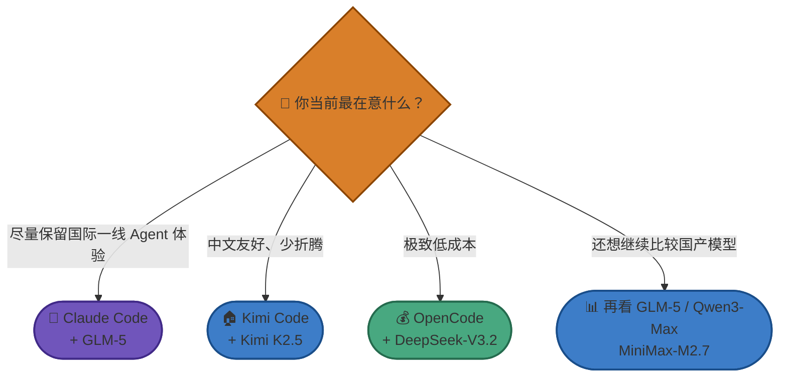

---
> 📚 **Part IV · 进阶专题** | [← 返回专题目录](../../README.md#part-iv-topics)
---

# 附录：中国大陆用户推荐配置

> 这篇是给中国大陆用户的落地版参考：不讲抽象选型学，重点讲**什么路线最容易跑通、什么坑最容易踩、什么组合更现实**。
>
> 如果你只记一句话：**先跑通一条稳定主线，再谈横向对比，不要一开始就同时折腾账号、网络、模型和 5 个工具。**

---

## TL;DR：我给中国大陆用户的三条主推路线

| 你的情况 | 推荐组合 | 为什么 |
|----------|----------|--------|
| **想要尽量保留国际一线 Agent 体验，但网络 / 合规有限制** | `Claude Code + GLM-5` | `Claude Code` 工作流成熟，`GLM-5` 中文和工程任务都比较稳，而且与昇腾生态已有适配 / 支持 |
| **想要中文体验友好、尽量少折腾** | `Kimi Code + Kimi K2.5` | 中文环境自然，整体上手门槛低 |
| **预算敏感、想把成本压到最低** | `OpenCode + DeepSeek-V3.2` | 多模型、低成本、适合做自己的工作流 |

> 如果你还没决定，默认建议优先级是：
>
> 1. **先看你能否稳定使用一条主线**
> 2. **再看成本**
> 3. **最后再看榜单**

## 一张图：大陆用户怎么选

## 一、先讲现实：大陆用户常见的三类限制

### 1. 网络访问限制

很多海外官方 API 或订阅服务，在中国大陆环境下会遇到：

- 访问不稳定
- 延迟高
- 登录与支付链路麻烦
- 不同产品对区域策略不同

所以**“官网最强”并不自动等于“你最容易用好”**。

### 2. 账号与支付风险

这点在 `Claude` 路线上尤其要谨慎。  
对中国大陆用户来说，我不建议把“直接充值官方订阅并长期当主力”当成默认路径，原因不是模型能力，而是**账号稳定性、风控策略和支付链路的不确定性**。

相比之下：

- `ChatGPT Plus` 的民用订阅体感上通常更稳一些
- 但如果你要做正式开发工作流，**API 路线通常比纯订阅路线更可控**

### 3. 合规与隐私约束

如果你是公司环境、客户代码、商业仓库，最需要先想清楚的是：

- 代码会不会被记录
- 日志会不会被保留
- 数据会不会跨境
- 工具调用和审批链是否合规

这些问题的重要性，通常高于“排行榜谁高 2 个点”。

## 二、访问方案的优先级，我建议这样排

### 路线 1：官方直连

如果你有稳定、合规、长期可用的访问条件，官方直连通常仍然是最干净的方案。

优点：

- 文档最完整
- 能力口径最透明
- 兼容性通常最好

缺点：

- 对中国大陆用户来说，现实门槛并不总是最低

### 路线 2：企业网络 / 合规出口

如果你在企业环境里，能走组织级合规网络方案，通常会比个人折腾各种绕路方式更稳。

### 路线 3：合规、透明的 API 供应商

这是我认为很多中国大陆开发者更现实的路线，尤其是在 `Claude` 工作流里。

但要注意：**“能转发请求”不等于“适合拿来做正式主力”**。

### 路线 4：直接使用国产模型 / 国产 Agent

如果你的核心目标是：

- 快速开始
- 中文体验友好
- 降低访问不确定性
- 压低长期成本

那么直接走 `Kimi`、`GLM`、`DeepSeek`、`Qwen` 这条路线，很多时候反而更实用。

## 三、如果必须走 API 供应商，先检查这 7 件事

| 检查项 | 为什么重要 | 更稳的标准 |
|--------|------------|------------|
| **模型映射是否透明** | 你买的是不是你以为的模型 | 名称、上下文、价格、限流都写清楚 |
| **工具调用是否兼容** | 很多 Coding Agent 依赖 tool use / 流式输出 / 长连接 | 明确支持工具调用和流式响应 |
| **日志和留存策略** | 代码是否会被记录是核心问题 | 有清晰隐私说明，最好可控留存 |
| **SLA 与故障责任** | 出问题时谁负责 | 有文档、有工单、有服务说明 |
| **账单与额度规则** | 很多便宜方案最后卡在限流 | 有清晰计费、速率和封顶规则 |
| **公司主体与可信度** | 关系到长期可用性 | 不要只看营销页，先看背景与口碑 |
| **配置文档是否完整** | 配置越模糊，越容易踩坑 | 至少能给出多工具的清晰接入方式 |

> ⚠️ **不建议把“逆向方案”或来源不明的便宜服务当长期主力**。短期看似省钱，长期最容易在稳定性、风控或隐私上翻车。

## 四、三条推荐路线，分别适合谁

### 方案 A：`Claude Code + GLM-5`

这是给“**想保留成熟 Agent 工作流，但现实条件不适合直接走 Claude 官方订阅**”的人。

适合：

- 你已经认可 `Claude Code` 的工作流
- 你想尽量保持强工程执行体验
- 你在意中文能力与大陆可用性

注意两点：

- `GLM-5` 更准确的口径是**与昇腾生态已有适配 / 支持**，而不是简单写成“它一定是在昇腾上训练出来的模型”。
- 实际体验仍取决于你接入的 API 供应商是否真的把工具调用、上下文和流式链路做好了。

### 方案 B：`Kimi Code + Kimi K2.5`

这是给“**想先低门槛进入 Agent 工作流**”的人。

适合：

- 中文环境优先
- 不想一开始就折腾太多底层配置
- 更希望先跑通而不是先最强

优点是顺滑、自然、友好。  
但如果你后面要做很复杂、很长链路的正式工程任务，仍然建议你拿真实任务再对比一次 `Claude Code` / `Codex CLI` 主线。

### 方案 C：`OpenCode + DeepSeek-V3.2`

这是给“**把成本和灵活度放在第一位**”的人。

适合：

- 预算敏感
- 想自建或自己选模型供应商
- 能接受自己搭工作流

优点：

- 便宜
- 灵活
- 容易做自己的模型组合

缺点：

- 更依赖你自己的配置能力
- 默认体验和“开箱即用感”不一定比官方产品强

## 五、国产模型怎么取舍

| 模型 | 适合什么情况 | 我会怎么提醒你 |
|------|--------------|----------------|
| **GLM-5** | 中文工程任务、需要和 `Claude Code` 这类强 Agent 工作流结合时 | 重点看真实接入体验，不要把“昇腾支持”误写成“昇腾训练” |
| **Kimi K2.5** | 中文友好、内容与代码混合任务、低门槛开始 | 是很实用的大陆路线之一 |
| **DeepSeek-V3.2** | 低成本、大批量执行、自建工作流 | 价格优势巨大，但复杂任务仍更依赖你的流程设计 |
| **Qwen3-Max** | 中文多步骤任务、企业生态配合 | 适合纳入候选，但要结合真实任务试 |
| **MiniMax-M2.7** | 认真比较国产工程模型时 | 榜单成绩很亮眼，但网上用户反馈褒贬不一，且厂商普遍存在 benchmark 定向优化；请务必同时去 `Google`、`Reddit`、`小红书`、`知乎`、`B 站` 看真实口碑 |

## 六、最容易踩的坑

| 坑 | 为什么危险 | 更稳的做法 |
|----|------------|------------|
| **一开始就直接充官方订阅当长期主力** | 对部分大陆用户来说账号与支付链路不稳定 | 先评估官方直连是否长期可用，再决定是否长期押注 |
| **把便宜中转直接当正式生产入口** | 便宜不等于稳定，更不等于合规 | 先验证工具调用、隐私、限流、SLA |
| **同时装很多工具和模型** | 很快进入“谁都懂一点，谁都用不好” | 先跑通一条主线 |
| **只看榜单不看口碑** | 你会把“排名高”误以为“长期省心” | 用排行榜缩小范围，用真实任务做决定 |
| **忽略隐私与日志留存** | 对公司代码和商业仓库尤其危险 | 先搞清楚数据流向，再决定是否接入 |

## 七、配置时从哪里下手

如果你已经决定了工具路线，具体配置方法直接看：

- [`附录：各工具 API 配置详解`](../ch01-quickstart/reference-api-config.md)
- [`附录：CLI、VS Code 插件、桌面应用——什么关系？`](../ch01-quickstart/reference-cli-ide-app.md)

建议顺序是：

1. 先定 `Agent`
2. 再定 `模型`
3. 再定 `Base URL / API Key`
4. 最后才开始横向比较别的路线

## 八、我给大陆用户的最终建议

- **想尽快跑通**：先从 `Kimi Code + Kimi K2.5` 或 `Cursor` 这样的低门槛入口开始。
- **想认真做正式工程任务**：优先试 `Claude Code + GLM-5` 这一类“强工作流 + 本地更容易落地”的路线。
- **想控制预算**：看 `OpenCode + DeepSeek-V3.2`。
- **想认真比较国产模型**：把 `GLM-5`、`Kimi K2.5`、`Qwen3-Max`、`MiniMax-M2.7` 放到同一轮真实任务里测，不要只看榜单。

> 继续读：如果你已经确定了大陆侧的访问方式，下一步建议看 [`附录：作者使用体验与心得`](../ch01-quickstart/reference-author-experience.md) 和 [`附录：主流 Coding 模型对比`](../ch01-quickstart/reference-model-comparison.md)。

---

返回：[Chapter 1 · 快速上手部署 Agent](../ch01-quickstart/part-1-quickstart.md)
