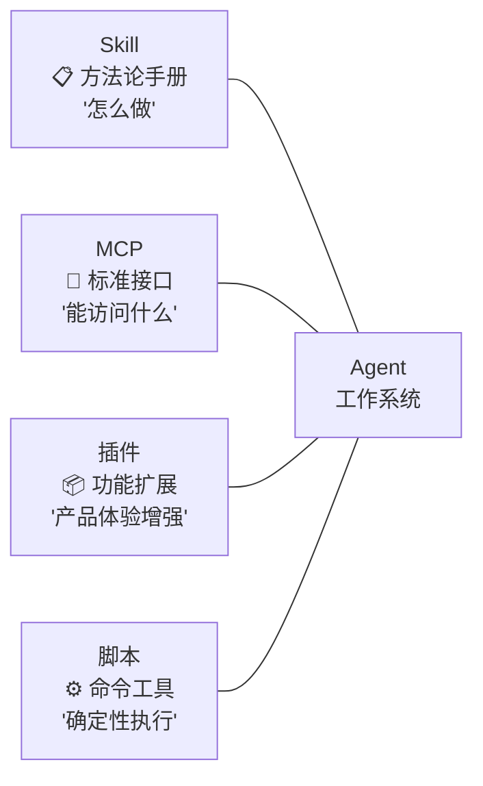
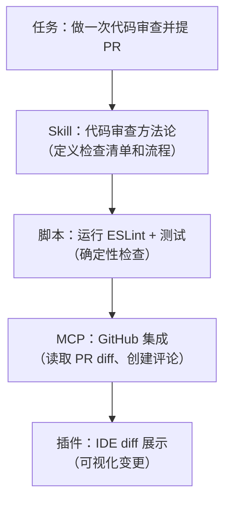

---
> 📚 **Part IV · 进阶专题** | [← 返回专题目录](../../README.md#part-iv-topics)
---

# ⚖️ CLI vs MCP 选择

> 🎯 什么时候让 Agent 直接调 CLI 命令，什么时候通过 MCP 接入？理清两种工具接入模式的边界。

## 目录
- [1. 概述](#1-概述)
- [2. 核心内容](#2-核心内容)
- [3. 实战建议](#3-实战建议)

---

## 1. 概述

Agent 扩展能力有两条主要路径：直接执行 CLI 命令（Bash tool），或通过 MCP 协议接入外部服务。两者各有优劣——CLI 简单直接但缺乏结构化，MCP 规范优雅但增加了复杂度。选择哪种取决于你的场景、团队规模和可维护性要求。

---

## 2. Skills vs MCP vs CLI/API：核心对比

### 核心比喻

- **Skills** = 方法论（教 Agent 怎么做）
- **CLI / 脚本 / 直接 API** = 轻量执行层（让 Agent 或脚本把事做掉）
- **MCP** = 标准化连接层（把外部能力标准化暴露给 Agent）

### 详细维度对比

| 维度 | Skills | CLI / 脚本 / 直接 API | MCP |
|------|--------|-------------------------|-----|
| **本质** | 教 Agent 怎么做 | 让 Agent 或脚本把事做掉 | 把外部能力标准化暴露给 Agent |
| **载体** | Markdown / 规则文件 | Shell、脚本、SDK、HTTP 请求 | JSON-RPC Server |
| **部署** | 最轻 | 通常也很轻，很多项目现成就有 | 相对更重，需要本地或远程 Server |
| **维护成本** | 低 | 低到中 | 中到高 |
| **上下文开销** | 低（按需加载） | 最低或接近最低 | 受工具数量、描述长度、发现策略影响 |
| **人类可编辑** | 强 | 强 | 中 |
| **确定性** | 中，需靠验证兜底 | 高 | 中到高 |
| **适合场景** | 工作流 SOP、代码审查清单、调试方法论 | 已有命令行工具、已有 SDK、稳定 HTTP 接口 | GitHub/Jira/数据库/浏览器等标准化集成 |
| **跨 Agent 通用性** | 高 | 中到高 | 中 |

### 2026 年的趋势

1. **Skills 继续增长，但更多是沉淀方法论，不是替代协议层。**
2. **很多团队优先走 CLI / 脚本 / 直接 API。** 这条路线通常更轻量，也更容易复用现有工程资产。
3. **MCP 仍然活跃，而且没有消失。** 例如 Perplexity 在 2026 年 3 月的帮助中心仍在持续提供本地和远程 MCP 支持说明。
4. **真正变化的是"默认选型顺序"**：不是一上来就把所有外部能力包装成 MCP，而是先问"现有 CLI/API 能不能解决"，不行再引入 MCP。
5. **大规模 API 场景会更在意上下文成本。** Cloudflare 在 2026 年 2 月公开写到，如果把其 2,500+ API 端点逐个暴露为 MCP 工具，会消耗超过 200 万 tokens，于是他们转向更紧凑的 Code Mode / 渐进发现方案。

### 为什么 CLI / API + Skills 组合在上升？

1. **复用现有资产**：很多团队本来就有 `gh`、`kubectl`、`terraform`、内部脚本和稳定 HTTP API。
2. **更低的上下文和样板开销**：不是所有能力都值得包装成独立的 MCP 工具。
3. **更直接的可控性**：脚本、CLI 和 SDK 调用的执行路径更短，更容易调试和审计。
4. **Skills 恰好补足"方法论"缺口**：CLI/API 解决"怎么执行"，Skills 解决"按什么流程执行"。
5. **MCP 仍然是企业级整合的重要选项**：尤其在统一鉴权、远程连接、工具治理、跨产品复用时仍然很有价值。

---

## 3. Skill / MCP / 插件 / 脚本：四者完整对比

### 本质定义

### 详细对比表

| 维度 | Skill | MCP | 插件 | 脚本 |
|------|-------|-----|------|------|
| **核心价值** | 复用经验和流程 | 标准化外部连接 | 产品集成和体验 | 确定性自动化 |
| **类比** | 应用程序 | USB-C 接口 | 应用商店扩展 | 命令行工具 |
| **技术门槛** | 低（Markdown） | 高（需编码+部署） | 中等 | 低-中 |
| **Token 消耗** | 低（渐进加载） | 中等 | 取决于实现 | 无（不占上下文） |
| **跨平台** | 强 | 中等 | 弱（通常绑平台） | 强 |
| **网络需求** | 无 | 可能需要 | 取决于实现 | 无 |
| **维护成本** | 低 | 高 | 中 | 低 |

### 组合使用示例

一个完整的 Agent 工作流通常会**组合使用**这四种能力：

### 最佳实践：Skills + CLI/API + MCP 组合

| 场景 | Skills 负责 | CLI / API 负责 | MCP 负责 |
|------|-----------|------------------|---------|
| 代码审查 + PR | 定义审查清单、评分标准、流程 | 跑 lint/test，调用 `gh` 查看 PR | 需要标准化 GitHub 集成时再接入 |
| 数据库迁移 | 定义迁移流程、回滚策略、检查点 | 跑迁移脚本、直连 SQL/SDK | 多环境统一治理时接数据库 MCP |
| Bug 调试 | 定义系统化诊断流程（日志→复现→定位→修复） | 调日志命令、调监控 API | 需要把观测系统能力统一暴露给 Agent 时使用 |
| 项目初始化 | 定义技术栈选择、目录结构、配置模板 | 调脚手架命令、调用 GitHub API | 团队化复用时再做成 MCP |

### 常见误区

| 误区 | 现实 |
|------|------|
| "Skills 要取代 MCP" | 不会。Skills 无法给 Agent 新的外部访问能力 |
| "现在流行 CLI / API，就不用 MCP 了" | 也不对。MCP 在标准化集成、统一鉴权、远程连接场景依然很重要 |
| "有了 MCP 就不需要 Skills" | MCP 只解决"能不能做"，不解决"怎么做好" |
| "Skills 不可靠，因为是自然语言" | 配合确定性脚本（lint、test）做验证，可靠性不亚于硬编码工作流 |

---

> 📖 **相关章节**：[🔌 MCP 协议专题](./topic-mcp.md) · [📝 Skill 系统专题](./topic-skills.md) · [🪝 Hooks 专题](./topic-hooks.md)

---

返回目录：[README · 章节目录](../../README.md#tutorial-contents)
