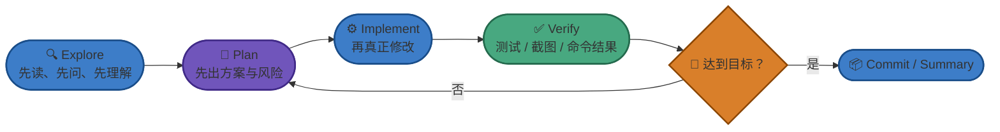
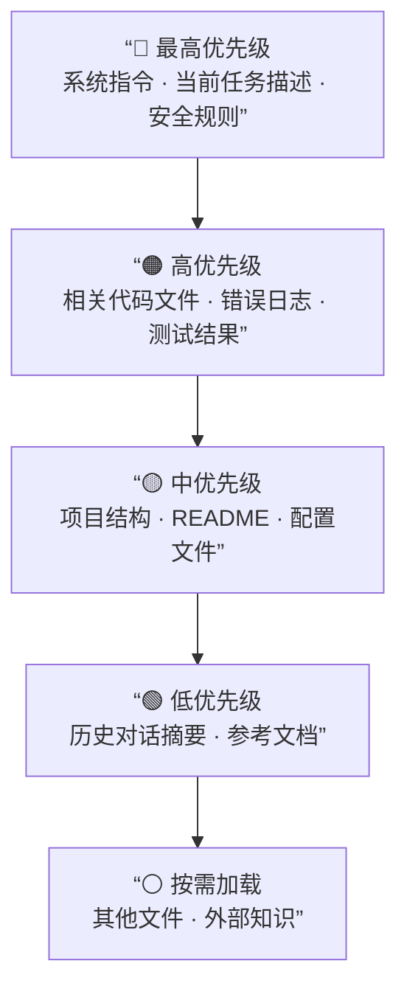

---
> 📚 **Part IV · 进阶专题** | [← 返回专题目录](../../README.md#part-iv-topics)
---

# 附录：上下文工程、验证闭环与常见失败模式

> 2026 年真正稀缺的，不是“会不会问模型”，而是“能不能让 Agent 在长任务里持续不跑偏”。
>
> 这篇讲的就是：**为什么同一个工具，别人用起来像神器，你用起来却总翻车。**

---

## 一张图先看工作流



## 一、上下文工程最核心的 7 条原则

### 1. 一次只做一类事

最容易把会话搞废的方式，就是一个任务还没做完，就开始插入另一个不相关任务。  
上下文一旦被无关信息污染，再强的模型也会掉智。

### 2. 复杂任务先探索，不要上来就改

先让 Agent：

- 读代码
- 总结结构
- 列风险
- 给实施方案

等你确认方向后，再执行修改，成功率会高很多。

### 3. 让 plan 可 review

如果 Agent 直接跳进执行阶段，你失去的是“最便宜的纠偏时机”。  
复杂任务里，plan 往往比最终代码更重要。

### 4. 让成功标准可验证

不要只说“帮我把它做好一点”，要尽量变成：

- 补什么测试
- 跑什么命令
- 对比什么截图
- 满足什么输出

验证标准越具体，翻车概率越低。

### 5. 会话脏了就清，不要恋战

当你发现 Agent 开始：

- 重复读同样的文件
- 修同样的错
- 忘了早先的约束
- 把不相关信息反复带入

这通常不是“再解释一次就会变好”，而是**应该清上下文或新开会话了**。

### 6. 贵模型用在难点，便宜模型用在执行

真正省钱的不是死抠单价，而是把模型用在合适的位置：

- 强模型：难分析、难决策、关键重构
- 快模型 / 便宜模型：批量执行、补齐、收尾、标准化任务

### 7. 规则文件要短、准、能改变行为

无论你用的是 `CLAUDE.md`、`AGENTS.md`、规则系统还是别的提示配置，核心都一样：

- 别太长
- 别什么都写
- 只留下真正会改变行为的规则

## 二、最常见的失败模式

| 失败模式 | 典型表现 | 本质问题 | 更稳的处理方式 |
|----------|----------|----------|----------------|
| **厨房水槽会话** | 什么都往一个会话里塞 | 上下文被无关信息污染 | 不相关任务及时新开会话 |
| **反复纠错循环** | 同一个问题改三次还在原地打转 | 错误尝试本身进入了上下文 | 清会话，重新描述任务与约束 |
| **假设传播** | 早期误解一路扩散到后面所有改动 | 没有及时在 plan 阶段纠偏 | 复杂任务先确认理解，再执行 |
| **抽象膨胀** | 100 行能做完的事写成 1000 行 | Agent 倾向于过度设计 | 明确要求“最小实现”“不要过度抽象” |
| **理解债务** | 代码越来越多，但你越来越看不懂 | 生成速度超过 review 速度 | 控制单次改动范围，强制做摘要和验证 |
| **信任-验证缺口** | 看起来像对了，于是直接合并 | 没有外部验证护栏 | 测试、截图、命令结果必须跟上 |
| **盲目放权** | 没看 diff 就让 Agent 连续执行高风险动作 | 把自治当成无需监督 | 高风险任务默认保留人工审批 |

## 三、我建议默认带上的三句话

这是我觉得最值得长期保留的通用指令：

- **先分析再执行**
- **修改后必须验证**
- **如果不确定，就停下来说明**

它们不华丽，但非常有效。

## 四、什么时候该切模型

你可以把切模型理解为“换一种工作模式”，而不只是换名字。

### 更适合切到强模型的时候

- 任务开始跨多个文件和模块
- 你怀疑现在的实现方向有问题
- 需要做方案比较和风险识别
- 失败重试已经明显变多

### 更适合切到快模型 / 便宜模型的时候

- 任务已经拆清楚了
- 剩下的是标准执行
- 需要批量修改或补齐
- 需要大量重复性的验证或收尾

## 五、什么时候该新开会话

下面这些信号一出现，我会优先考虑新开会话：

- 当前任务和上一个任务已经不是同一件事
- Agent 开始忘记你前面反复强调的约束
- 你已经纠正它两次以上
- 日志、diff、讨论内容明显变得过长

## 六、一个更稳的日常模板

如果你不想每次都现想，我建议默认按下面这套来：

1. **先让 Agent 理解上下文**
2. **再让它给 plan**
3. **你确认后才执行**
4. **执行后必须要求验证**
5. **最后让它总结改动、风险和后续建议**

这一套比“上来直接开改”慢一点，但整体翻车率会低很多。

## 七、不要把”Agent 很强”理解成”你可以不管”

2026 年最常见的误区之一，就是把”看起来很强”误解成”可以不用管”。

更准确的理解是：

- Agent 让你从”亲自敲每一行代码”升级到”设计任务、审查结果、把关质量”
- 你的角色从纯执行者，更像是在变成**技术负责人 + 审查者 + 编排者**

这不是工作消失了，而是工作重心变了。

---

## 八、深度原理：从提示工程到上下文工程

> 以下内容来自 LangChain、Manus、Anthropic 等团队在 2025-2026 年发布的工程实践总结，适合想深入理解 Agent 性能背后原理的读者。

### 8.1 范式转移

| 维度 | 提示工程 | 上下文工程 |
|------|----------|------------|
| **关注点** | 单次交互的指令优化 | 系统性管理模型决策所需的所有信息 |
| **任务类型** | 一次性任务 | 持续性项目 |
| **开发者角色** | 语言大师 | 系统架构师 |
| **信息范围** | 单次提示词 | 指令 + 知识 + 工具反馈 + 历史记录 |

核心类比：
- **LLM 是无状态的 CPU**
- **上下文窗口是易失性内存（RAM）**
- **开发者需扮演操作系统的角色**

### 8.2 上下文腐烂（Context Rot）

**上下文腐烂是 Agent 性能下降的根本原因。**

尽管模型上下文窗口越来越大，但信息量增加会导致精确回忆与长距离推理能力平滑下降。模型不会报错，而是逐渐：

- 答非所问
- 遗漏重点
- 逻辑漂移

底层原因在于 Transformer 架构的注意力机制：token 间的关注关系呈平方级增长，信息越多注意力越分散。这解释了为什么**单纯堆砌信息无法提升可靠性**，必须通过工程方法主动管理上下文质量。

**上下文债务的四种病症：**

| 病症 | 描述 | 症状 |
|------|------|------|
| **上下文污染** | 错误信息渗入 | 幻觉、错误推理 |
| **上下文干扰** | 噪声淹没预训练知识 | 注意力分散 |
| **上下文混淆** | 无关信息分散注意力 | 决策困难 |
| **上下文冲突** | 信息矛盾导致决策困境 | 行为不一致 |

### 8.3 LangChain 的四大动作框架（WSCI）

LangChain 将上下文管理浓缩为四个核心动作：

#### 写入（Write）

分为两种记忆系统：

- **短期记忆（草稿纸）**：服务于当前任务，任务结束即清空。详细记录中间过程，对抗上下文腐烂。
- **长期记忆（档案柜）**：永久存储，服务于未来任务。只记录提炼后的结论，不保留原始过程。

长期记忆的写入机制：
- **Reflection（反思）**：基于错误学习，通过复盘失败生成规则
- **Generative Agents（生成式代理）**：通过周期性摘要提炼高级洞察

#### 选择（Select）

从数据源中精准筛选相关信息，核心进化是从”加载数据”到”**注意力调度**”。

三种长期记忆的加载策略：

| 记忆类型 | 类比 | 加载策略 |
|----------|------|----------|
| 程序性记忆 | 技能肌肉 | 动态加载到系统提示 |
| 情景性记忆 | 经历案例 | 动态检索作为 Few-shot 示例 |
| 语义性记忆 | 世界知识 | 谨慎选择，强调意图适配性 |

> ⚠️ **关键原则**：错误记忆注入比无记忆更危险，需同时兼顾语义相关性与任务意图适配性。

#### 压缩（Compress）

对进入上下文的信息流进行**降噪减负**。

两种机制：

| 机制 | 原理 | 优点 | 缺点 |
|------|------|------|------|
| **总结（Summarization）** | 利用 LLM 智能提炼 | 保留核心语义 | 成本高、有损 |
| **裁剪（Trimming）** | 基于规则过滤 | 快速保真 | 可能丢失早期信息 |

Manus 团队的关键区分——**可逆 vs 不可逆压缩**：

- **可逆压缩（优先）**：用轻量级指针（文件路径、URL）替代完整内容。原始信息可 100% 无损恢复，风险极低。
- **不可逆摘要（最后手段）**：LLM 生成精简版本，有损，一旦执行无法还原。

自动化压缩阈值建议：**128k-200k tokens**（超过此范围性能开始明显下降）。

#### 隔离（Isolate）

通过创建独立上下文空间防止信息干扰，核心是**分而治之**。

三种隔离模式：

| 模式 | 描述 | 适用场景 |
|------|------|----------|
| 多智能体架构 | 每个 Agent 独立上下文窗口 | 并行任务处理 |
| 环境沙箱 | 分离思考与执行的状态化环境 | 需要安全边界 |
| 运行时状态隔离 | 结构化对象隔离内部状态 | 状态管理复杂场景 |

### 8.4 长任务的 Todo.md 复述循环（Manus 实践）

**问题背景**：处理需要几十次工具调用的长任务时，Agent 容易出现目标漂移——做着做着忘了最初目标。Transformer 对上下文开头和结尾最敏感，中间信息的注意力信号会在极长上下文中变得极其微弱。

**解决方案：todo.md 复述循环**

```
初始规划时  →  分解任务，首次写入 todo.md
             ↓
完成子任务后 →  用包含最新进度的完整清单**重写覆盖** todo.md
             ↓
每个新决策前 →  基于刚刚置于上下文末尾的 todo.md 思考：
               “第一项完成了 → 下一个未完成任务是什么 → 下一步行动”
```

**为什么有效**：每次重写将完整动态计划置于上下文序列最末端，最重要的导航信息（”现在在哪？下一步去哪？”）始终处于模型注意力最强的近期范围。

三大收益：
1. 高效解决长任务链的目标漂移问题
2. 实现简单优雅，无需修改架构
3. 让 Agent 从指令执行者进化为”会做计划、会回顾、会自我纠偏的项目经理”

### 8.5 工具集设计原则

工具数量控制在 **20 个以内**，这是生产级 Agent 经过大量实践得出的上限。原因：

- 工具定义本身占用注意力预算
- 工具太多导致 Agent 决策混乱（这也是”工具/插件越多越好”是新手误区的底层原因）
- 复杂动作可以卸载到文件系统脚本，而不是直接作为工具暴露

> **RAG for Tools 的陷阱**：动态修改提示前半部分会使 KV 缓存失效，每次必须从头计算。推荐做法是一开始加载好所有工具，形成稳定前缀。

---

## 九、KV 缓存优化：上下文工程的性能维度

> 来源：Manus 团队工程实践总结

KV 缓存命中率直接决定延迟与成本：

- **速度**：复用缓存可跳过耗时的预填充阶段
- **成本**：缓存 token 价格更低，优化后输入成本可降低 **81%**

**最大化命中率的五大法则：**

| 法则 | 说明 |
|------|------|
| 选用支持缓存的推理框架 | 确保基础设施支持 |
| 会话亲和性 | 分布式环境确保请求路由到同一进程 |
| **保持 Prompt 前缀稳定** | 严格管理模板，避免随机变化 |
| **上下文只追加策略** | 避免修改中间内容，只在末尾添加新内容 |
| 手动标记缓存断点 | 特定框架下的优化手段 |

最重要的是第三和第四条：**一旦在中间修改了上下文，之后的所有 token 都无法命中缓存**，相当于每次都从头计算。这是为什么”只追加、不修改”是上下文管理的基础原则。

---

## 十、上下文工程实战

### 上下文组装的原则

Agent 不可能把整个仓库永远完整放进上下文，它必须动态组装。好的上下文组装遵循以下优先级：



### RAG vs Markdown：知识存储的选择

| 方面 | Markdown 文件 | RAG（向量检索） |
|------|-------------|----------------|
| **适合场景** | 本地 Agent、项目规则、行为引导 | 大规模知识库、外部文档 |
| **上下文消耗** | 可控（直接读取） | 不确定（检索结果数量波动） |
| **调试性** | 高（直接看文件） | 低（向量检索是黑盒） |
| **LLM 理解** | 天然理解 Markdown 结构 | 依赖检索质量 |
| **维护成本** | 低 | 高（需要索引、更新、清理） |

**实用建议**：
- **行为逻辑 / 规则 / 工作流** → 用 Markdown（CLAUDE.md、Skill）
- **大量文档 / 外部知识 / 历史数据** → 用 RAG
- **混合最佳**：Markdown 存行为逻辑，RAG 存长文档

### Contextual Retrieval：让 RAG 真正好用

**问题根源**：传统 RAG 把文档切成 chunk 后，每段文字往往丢失了原始语境，导致向量检索时「明明应该找到，却没找到」。

**示例**：一份 API 文档中有这样一个 chunk：

> “The default timeout is 30 seconds.”

单独看这句话，没有人（也没有向量模型）知道它讲的是哪个模块的超时。

**Contextual Retrieval 的解法**（Anthropic 提出）：在每个 chunk 存入向量库**之前**，先让模型为它生成一段「解释性上下文」并拼接在前面：

```
[自动生成的上下文]
本段来自 Payments SDK 的 API 参考文档，描述的是 charge() 方法的超时配置。

[原始 chunk]
The default timeout is 30 seconds.
```

这样检索时，语义更完整，相关性更准确，Anthropic 的测试显示检索失败率可降低 **49%**。

| 方式 | 检索失败率降低幅度（相对基准） | 说明 |
|------|-------------------------------|------|
| 传统向量 RAG | 基准 | chunk 缺乏上下文 |
| + BM25 混合检索 | 约降低 ~30% | 补充关键词匹配 |
| + Contextual Retrieval | 降低 ~49% | chunk 前加入上下文描述 |
| + 两者结合 | 降低 ~67% | 效果最佳 |

> 数据来源：Anthropic 官方博客；BM25 单独使用的降低幅度因数据集而异，此处为近似值。

⚠️ **适用场景**：Contextual Retrieval 适合文档量大、chunk 语境依赖强的知识库（如大型 API 文档、技术手册）。对于结构化的代码仓库，直接用文件系统 + ripgrep 通常更简单有效。

### 上下文生命周期管理


---

## 十一、上下文问题的诊断与修复

### 诊断清单

当 Agent 表现异常时，先检查上下文相关问题：

| 症状 | 可能的上下文问题 | 修复方案 |
|------|----------------|---------|
| Agent 无视你的指令 | 指令被大量其他信息淹没 | 把关键指令放在 Prompt 开头或 CLAUDE.md |
| Agent 行为前后矛盾 | 多处规则相互矛盾 | 审查并统一 CLAUDE.md 和会话指令 |
| Agent 重复已完成的步骤 | 压缩后丢失了进度信息 | 让 Agent 先总结当前进度再继续 |
| Agent 给出过时建议 | 依赖训练数据而非实际代码 | 明确要求读取实际文件而非”凭记忆” |
| Agent 生成已删除的代码 | 上下文中有旧版本代码残留 | 重开会话，只提供当前版本 |
| 成本异常高 | 上下文中有大量无关日志/输出 | 控制命令输出长度，清理冗余 |

### 预防策略

1. **规则分层**：全局规则放 `~/.claude/settings.json`，项目规则放 `CLAUDE.md`，任务规则在会话中说
2. **定期清理**：长会话每完成一个子任务就做总结，保持上下文精简
3. **关键信息前置**：最重要的指令放在 Prompt 最开头
4. **显式声明**：不要假设 Agent 知道你的环境，用 CLAUDE.md 显式写出项目信息

---

> 📖 **相关章节**：[🚨 失败模式与恢复术](./topic-failure-modes.md) · [⚡ Prompt Cache 机制与优化](./topic-prompt-cache.md) · [🤝 人机协同详解](./topic-human-agent-collab.md)
