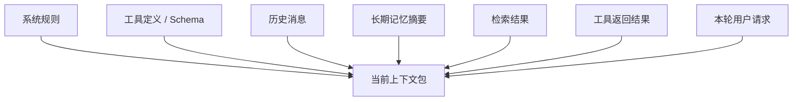

---
> 📚 **Part IV · 进阶专题** | [← 返回专题目录](../../README.md#part-iv-topics)
---

# 为什么一句话意思差不多，Prompt 和 Context 一变，效果上限就变了？

> 很多人第一次认真做 Agent，都会有一种挫败感：
>
> - 明明任务没变
> - 明明意思差不多
> - 只是换了个写法、换了个顺序、换了点上下文材料
>
> 结果模型表现就像换了一个人。
>
> 这不是玄学。更接近现实的解释是：
>
> **Prompt 在塑造分布，Context 在组织证据。**

## 目录

- [1. Prompt 不是“把话说漂亮”，而是在改输入接口](#1-prompt-不是把话说漂亮而是在改输入接口)
- [2. 为什么顺序、格式、重复都会影响效果](#2-为什么顺序格式重复都会影响效果)
- [3. Context 不是“用户这句话”，而是模型此刻看到的全部 token](#3-context-不是用户这句话而是模型此刻看到的全部-token)
- [4. 为什么上下文越长，不一定越好](#4-为什么上下文越长不一定越好)
- [5. 长上下文为什么会从认知问题变成系统问题](#5-长上下文为什么会从认知问题变成系统问题)
- [6. 为什么缓存机制会反过来影响 Prompt 设计](#6-为什么缓存机制会反过来影响-prompt-设计)
- [7. 一个更稳的 Context 组装方式](#7-一个更稳的-context-组装方式)
- [极简记忆版](#极简记忆版)

---

## 1. Prompt 不是“把话说漂亮”，而是在改输入接口

很多人把 Prompt Engineering 理解成“会不会说话”。

这是最常见、也最容易把人带偏的误解之一。

更准确的理解是：

> **Prompt 是你给概率模型设计的运行时输入接口。**

一个好的 Prompt，通常不是文笔更华丽，而是把这些东西说清楚了：

- 你现在到底要它做什么
- 它可以使用哪些输入和哪些工具
- 输出必须长什么样
- 什么算完成
- 什么情况下应该停止、重试或报告不确定

所以 Prompt 真正的价值，在于缩小歧义空间、压缩错误自由度，而不是“把语气写得更像人类沟通”。

---

## 2. 为什么顺序、格式、重复都会影响效果

模型处理的是**有顺序的 token 序列**，不是一个无结构的语义包。

于是这些变化都会带来真实差异：

- 把规则放在最前面，还是埋在中间
- 先给例子，再给任务；还是先给任务，再给例子
- 用列表把约束拆开，还是混在一大段散文里
- 关键信息是否被分隔符包起来

这些差异的本质，不只是阅读体验变化，而是：

> **模型内部的注意力可达性和竞争关系变了。**

也就是说，某条规则是不是更容易被“看到”，某个格式要求是不是更容易在生成时被优先遵守，都取决于它如何出现在序列里。

有些研究甚至发现，在某些非 reasoning 场景里，简单地重复 prompt 都可能带来增益。正确理解这个现象的方式，不是把“重复”当成新咒语，而是意识到：

> **输入结构本身，就是模型计算的一部分。**

所以，稳定的 Prompt 往往更像接口设计，而不是文案比赛。

---

## 3. Context 不是“用户这句话”，而是模型此刻看到的全部 token

做 Agent 时，真正进入模型上下文窗口的，通常远不止你眼前这一句用户输入。

更完整的 Context 往往长这样：

所以，很多人以为自己在调 Prompt，实际问题却出在 Context：

- 规则互相打架
- 旧计划没有清掉
- 无关检索片段塞太多
- 工具输出冗长且低信号
- 过期假设还挂在上下文里

这时模型面对的不是“更多帮助”，而是“更多互相竞争的 token”。

Context Engineering 的本质，不是往窗口里塞更多内容，而是：

> **为当前这一次决策，摆出最值得模型看到的证据集。**

---

## 4. 为什么上下文越长，不一定越好

长上下文只代表容量更大，不代表利用效率也同步提升。

一个很实用的直觉是：上下文窗口不是一块平整的无限白板，而更像一张会发生注意力竞争的工作台。

当你不断往里面加材料时，会同时发生三件事：

- 关键信息更容易被噪声淹没
- 过期信息会和当前任务争夺注意力
- 中间位置的内容更容易被利用不足

这也是为什么长任务里经常出现一种错觉：

> “我明明把信息都给它了，为什么它还是没用上？”

很多时候不是因为模型“没看见”，而是因为它在太多 token 之间分不清什么该优先使用。

所以，好的 Context Engineering 从来不是最大化 token 用量，而是最大化**有效信息密度**。

---

## 5. 长上下文为什么会从认知问题变成系统问题

一旦你真的做 Agent，长上下文不只会影响回答质量，还会直接影响系统性能。

### 5.1 KV Cache 不是“记住了”，而是运行时缓存

KV Cache 更像注意力机制的中间状态缓存，用来避免每生成一个新 token 都把全部前文重新完整计算一遍。

这和人类理解里的“记忆”不是一回事。它只是让当前推理更快的运行态数据。

一个常见误解是：“长上下文导致 KV Cache 爆炸，所以成本是非线性的。”

更准确的说法是：

- **KV Cache 大小通常随上下文长度线性增长**
- 但系统总成本和吞吐退化，常常会让人主观上感到像“爆炸”

因为真正恶化的不只是一项指标，还包括：

- prefill 计算变重
- decode 每步要访问更大的缓存
- 并发服务里的显存和带宽压力上升

### 5.2 Prefill 和 Decode 是两种完全不同的负载

可以把一次推理拆成两个阶段：

| 阶段 | 在干什么 | 更像什么瓶颈 |
|------|----------|--------------|
| Prefill | 先把整包输入吃进去，建立初始状态和 KV Cache | 偏算力密集 |
| Decode | 基于已有状态，一个 token 一个 token 往后生成 | 偏内存带宽密集 |

这对 Agent 特别重要，因为 Agent 很容易变成一种“长输入、短输出、多轮循环”的工作负载。

也就是说，很多时候真正拖慢系统的，不是它输出慢，而是它每一轮都在反复处理一大包长输入。

---

## 6. 为什么缓存机制会反过来影响 Prompt 设计

当你理解了 prefill 的成本，很多系统优化就好懂了：

- Prefix Caching
- Prompt Caching
- Chunked Prefill

它们本质都在做同一类事：

> **不要重复计算不该重复计算的前缀。**

这会直接倒逼出一个非常实用的 Prompt / Context 设计原则：

> **稳定前缀前置，动态内容后置。**

具体来说：

- 系统规则放前面
- 工具定义放前面
- 固定 few-shot 放前面
- 项目长期约定放前面
- 本轮用户请求、最新检索、临时工具结果放后面

这样做有三个直接收益：

- 更利于缓存命中
- 更利于模型先锁定规则边界
- 更利于每轮只替换高变化部分

所以，Context Engineering 不只是语义管理，也是**前缀复用工程**。

---

## 7. 一个更稳的 Context 组装方式

如果你想把上面的原则直接落成可操作方法，一个很稳的结构是三层组装。

### 第一层：最稳定的前缀

放这些内容：

- 系统规则
- 输出契约
- 工具定义
- 固定 few-shot

这一层的目标是给模型画边界，也给缓存机制稳定前缀。

### 第二层：中度稳定的信息

放这些内容：

- 项目约定
- 用户稳定偏好
- 长期记忆摘要
- 阶段性计划和里程碑

这一层不必每轮大改，但要允许随着任务推进被压缩和更新。

### 第三层：高变化的本轮证据

放这些内容：

- 当前用户请求
- 最新检索结果
- 最近一次工具输出
- 当前局部状态

这一层变化最快，也最需要控制信号密度。

如果把它写成一句最值得记住的话，就是：

> **Prompt 在告诉模型“该怎么做”，Context 在决定模型“凭什么这么做”。**

---

## 极简记忆版

- **Prompt 不是措辞优化，而是输入接口设计。**
- **顺序、格式、分隔、重复会影响效果，因为模型真正看到的是 token 序列。**
- **Context 不是最新一句用户输入，而是本轮进入上下文窗口的全部 token。**
- **长上下文不是越长越好，关键在于有效信息密度。**
- **稳定前缀前置、动态内容后置，不只更利于理解，也更利于缓存与性能。**

---

> 📖 **相关专题**：[⚡ Prompt Cache](./topic-prompt-cache.md) · [🧠 LLM 推理与 Agent](./topic-llm-reasoning-and-agent.md) · [🔄 Prompt → Harness 演进案例](./topic-prompt-to-harness.md)

---

返回目录：[README · 章节目录](../../README.md#tutorial-contents)
