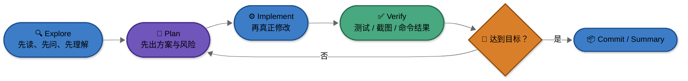

---
> 📚 **Part IV · 进阶专题** | [← 返回专题目录](../README.md#part-iv--进阶专题--深度参考资料库27-篇)
---

# 附录：上下文工程、验证闭环与常见失败模式

> 2026 年真正稀缺的，不是“会不会问模型”，而是“能不能让 Agent 在长任务里持续不跑偏”。
>
> 这篇讲的就是：**为什么同一个工具，别人用起来像神器，你用起来却总翻车。**

---

## 一张图先看工作流

## 一、上下文工程最核心的 7 条原则

### 1. 一次只做一类事

最容易把会话搞废的方式，就是一个任务还没做完，就开始插入另一个不相关任务。  
上下文一旦被无关信息污染，再强的模型也会掉智。

### 2. 复杂任务先探索，不要上来就改

先让 Agent：

- 读代码
- 总结结构
- 列风险
- 给实施方案

等你确认方向后，再执行修改，成功率会高很多。

### 3. 让 plan 可 review

如果 Agent 直接跳进执行阶段，你失去的是“最便宜的纠偏时机”。  
复杂任务里，plan 往往比最终代码更重要。

### 4. 让成功标准可验证

不要只说“帮我把它做好一点”，要尽量变成：

- 补什么测试
- 跑什么命令
- 对比什么截图
- 满足什么输出

验证标准越具体，翻车概率越低。

### 5. 会话脏了就清，不要恋战

当你发现 Agent 开始：

- 重复读同样的文件
- 修同样的错
- 忘了早先的约束
- 把不相关信息反复带入

这通常不是“再解释一次就会变好”，而是**应该清上下文或新开会话了**。

### 6. 贵模型用在难点，便宜模型用在执行

真正省钱的不是死抠单价，而是把模型用在合适的位置：

- 强模型：难分析、难决策、关键重构
- 快模型 / 便宜模型：批量执行、补齐、收尾、标准化任务

### 7. 规则文件要短、准、能改变行为

无论你用的是 `CLAUDE.md`、`AGENTS.md`、规则系统还是别的提示配置，核心都一样：

- 别太长
- 别什么都写
- 只留下真正会改变行为的规则

## 二、最常见的失败模式

| 失败模式 | 典型表现 | 本质问题 | 更稳的处理方式 |
|----------|----------|----------|----------------|
| **厨房水槽会话** | 什么都往一个会话里塞 | 上下文被无关信息污染 | 不相关任务及时新开会话 |
| **反复纠错循环** | 同一个问题改三次还在原地打转 | 错误尝试本身进入了上下文 | 清会话，重新描述任务与约束 |
| **假设传播** | 早期误解一路扩散到后面所有改动 | 没有及时在 plan 阶段纠偏 | 复杂任务先确认理解，再执行 |
| **抽象膨胀** | 100 行能做完的事写成 1000 行 | Agent 倾向于过度设计 | 明确要求“最小实现”“不要过度抽象” |
| **理解债务** | 代码越来越多，但你越来越看不懂 | 生成速度超过 review 速度 | 控制单次改动范围，强制做摘要和验证 |
| **信任-验证缺口** | 看起来像对了，于是直接合并 | 没有外部验证护栏 | 测试、截图、命令结果必须跟上 |
| **盲目放权** | 没看 diff 就让 Agent 连续执行高风险动作 | 把自治当成无需监督 | 高风险任务默认保留人工审批 |

## 三、我建议默认带上的三句话

这是我觉得最值得长期保留的通用指令：

- **先分析再执行**
- **修改后必须验证**
- **如果不确定，就停下来说明**

它们不华丽，但非常有效。

## 四、什么时候该切模型

你可以把切模型理解为“换一种工作模式”，而不只是换名字。

### 更适合切到强模型的时候

- 任务开始跨多个文件和模块
- 你怀疑现在的实现方向有问题
- 需要做方案比较和风险识别
- 失败重试已经明显变多

### 更适合切到快模型 / 便宜模型的时候

- 任务已经拆清楚了
- 剩下的是标准执行
- 需要批量修改或补齐
- 需要大量重复性的验证或收尾

## 五、什么时候该新开会话

下面这些信号一出现，我会优先考虑新开会话：

- 当前任务和上一个任务已经不是同一件事
- Agent 开始忘记你前面反复强调的约束
- 你已经纠正它两次以上
- 日志、diff、讨论内容明显变得过长

## 六、一个更稳的日常模板

如果你不想每次都现想，我建议默认按下面这套来：

1. **先让 Agent 理解上下文**
2. **再让它给 plan**
3. **你确认后才执行**
4. **执行后必须要求验证**
5. **最后让它总结改动、风险和后续建议**

这一套比“上来直接开改”慢一点，但整体翻车率会低很多。

## 七、不要把“Agent 很强”理解成“你可以不管”

2026 年最常见的误区之一，就是把“看起来很强”误解成“可以不用管”。

更准确的理解是：

- Agent 让你从“亲自敲每一行代码”升级到“设计任务、审查结果、把关质量”
- 你的角色从纯执行者，更像是在变成**技术负责人 + 审查者 + 编排者**

这不是工作消失了，而是工作重心变了。

> 继续读：如果你现在想把这些原则映射回具体产品选择，回到 [`附录：作者使用体验与心得`](./reference-author-experience.md) 或 [`附录：主流 Agent 工具对比`](./reference-agent-comparison.md)。

---

返回：[附录：Agent 工具与模型详细对比](./reference-tools-comparison.md)
