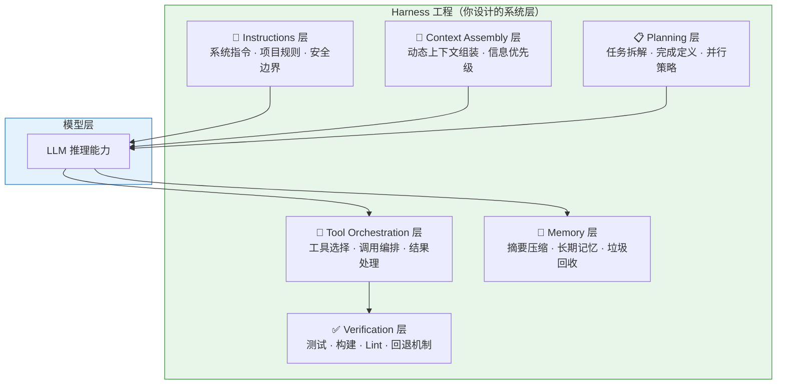
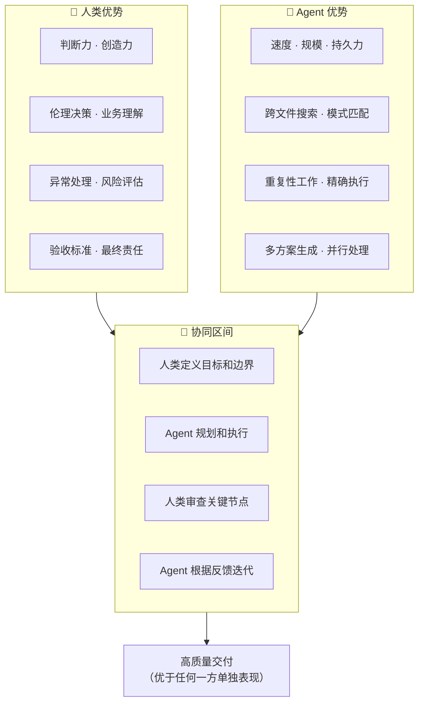
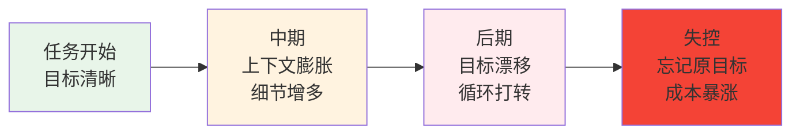
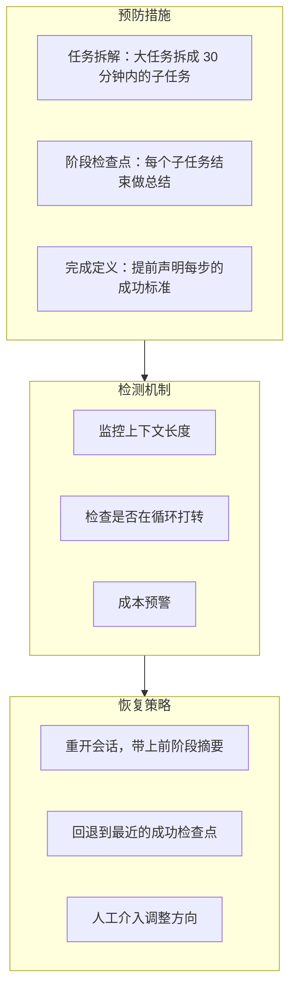
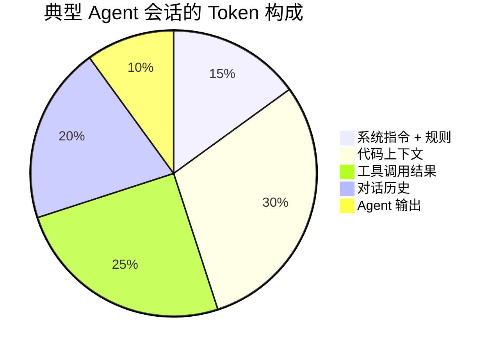
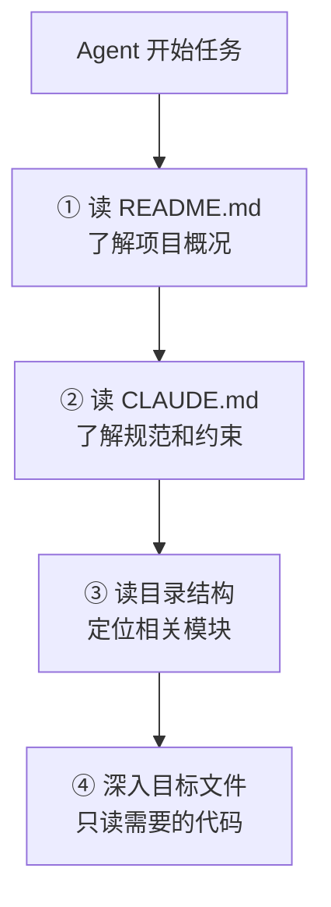
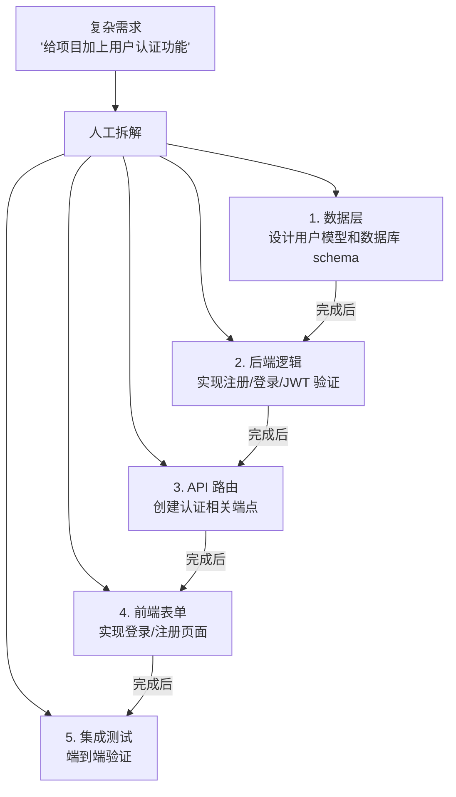
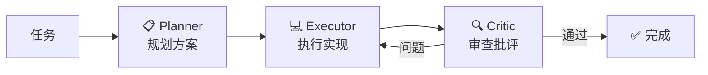

---
> 📚 **Part IV · 进阶专题** | [← 返回专题目录](../../README.md#part-iv-topics)
---

# 附录：人机协同与 Agent 优化指南

> 本文是 [Chapter 2 · Agent 运作原理与核心概念](../chapters/ch02-concepts.md) 的扩展附录，深入讲解人机协同方法论、Harness 工程和 Agent 使用优化策略。

---

## 1. Harness 工程：围绕模型的系统层设计

### 什么是 Harness 工程

Harness（马具）工程是 2025-2026 年兴起的新概念：**不是优化模型本身，而是设计围绕模型的系统层**——包括提示设计、工具编排、验证循环、状态追踪、故障检测和恢复。



### 真实案例：Harness 比换模型更有效

LangChain 团队的编码 Agent 优化实验：

| 变量 | 改动 | 效果 |
|------|------|------|
| 换更强模型 | 从 Sonnet 升级到 Opus | 排名提升 ~5 位 |
| 改 Harness | 自验证 + 上下文注入 + 故障检测 | 排名从 Top 30 → Top 5 |

**结论**：模型能力是基线，但 Harness 是放大器。在模型能力已经足够强的前提下（2026 年的旗舰模型都够强），Harness 的质量决定了 Agent 效果的上限。

### Harness 工程师的职责

这是一个正在形成的新角色——不是优化模型，而是：

- 设计上下文组装策略
- 编排工具调用流程
- 建立验证和恢复机制
- 引入人类在环（Human-in-the-Loop）检查点
- 追踪和分析 Agent 行为
- 控制成本和延迟

> 未来，软件工程师将越来越多地承担"Agent Workflow Designer + Harness Engineer"的角色。

---

## 2. 人机协同的哲学与方法论

### 核心哲学：增强而非替代

人机协同的核心不是"用 AI 替代人"，而是**发挥各自的优势，形成互补**：



### 协同模式光谱

| 模式 | 人类角色 | Agent 角色 | 适用场景 |
|------|---------|-----------|---------|
| **人主导** | 逐步指令 | 执行单步命令 | 学习期、高风险操作 |
| **人监督** | 审批计划和关键节点 | 规划+执行 | 日常开发（推荐） |
| **人巡查** | 定期检查成果 | 大部分自主完成 | 低风险、成熟工作流 |
| **Agent 自治** | 只看最终结果 | 完全自主 | 简单重复任务 |

**推荐**：大多数场景下使用"人监督"模式——让 Agent 自己规划执行，但在关键节点（如写入文件、推送代码、重大架构决策）请求人工确认。

---

## 3. Agent 长流程失控：原因与对策

### 为什么长任务容易失控

Agent 运行的时间越长，失控的风险越高：



### 失控的六大根源

| 根源 | 表现 |
|------|------|
| **上下文漂移** | 越聊越偏离原始目标 |
| **记忆丢失** | 压缩后忘记关键约束 |
| **推理循环** | 在同一个错误上反复尝试同样的修复 |
| **幻觉级联** | 一个错误假设导致连串错误决策 |
| **成本失控** | 不断重试导致 token 消耗飙升 |
| **状态不持久** | 跨会话时丢失进度和上下文 |

### 对策体系



### 实用的分阶段模板

给 Agent 下达长任务时，推荐使用这个结构：

```
## 总目标
[一句话描述最终目标]

## 当前阶段
[只描述这个阶段要完成的事]

## 完成条件
- [ ] 条件 1
- [ ] 条件 2
- [ ] 运行 `xxx` 验证通过

## 约束
- 不要修改 [xxx] 目录
- 如果遇到 [xxx] 情况，先停下来告诉我

## 上阶段摘要
[如果是接续任务，附上上阶段的简要总结]
```

---

## 4. Token 节约深度指南

### Token 消耗的构成



### 各环节的优化策略

#### 系统指令优化

| 问题 | 优化方案 |
|------|---------|
| CLAUDE.md 太长（>5000 tokens） | 分层：核心规则 + 按需引用 |
| 每次对话重复加载相同规则 | 利用 Prompt Cache（自动生效） |
| 临时规则混入永久文件 | 分离：永久规则在文件，临时规则在会话中 |

#### 代码上下文优化

| 问题 | 优化方案 |
|------|---------|
| Agent 一次性读取整个大文件 | 引导 Agent 先读目录结构，按需深入 |
| 多次读取相同文件 | 在 CLAUDE.md 中说明项目关键入口文件 |
| 项目太大 Agent 找不到关键代码 | 维护 README 中的模块说明 |

#### 工具返回优化

| 问题 | 优化方案 |
|------|---------|
| 测试输出全量返回 | 指令中说明"只看失败用例的错误信息" |
| 构建日志动辄上千行 | 使用 `| tail -50` 等管道控制输出 |
| 搜索结果太多 | 使用更精确的搜索条件 |

#### 对话历史优化

| 问题 | 优化方案 |
|------|---------|
| 单个会话持续太久 | 分阶段：每完成一个子任务，考虑新开会话 |
| 中间过程的详细讨论占大量 token | 让 Agent 做阶段总结后继续 |
| 错误尝试的历史堆积 | 重开会话，直接从正确方向开始 |

### 成本估算参考

| 使用模式 | 单次任务 Token | Opus 4.6 成本 | Sonnet 4.6 成本 |
|---------|--------------|-------------|----------------|
| 简单问答 | ~5K | ~$0.05 | ~$0.02 |
| 中等修改 | ~30K | ~$0.50 | ~$0.20 |
| 复杂功能 | ~100K | ~$2.00 | ~$0.80 |
| 大型重构 | ~500K | ~$10.00 | ~$4.00 |

---

## 5. 大型项目中的 Agent 使用策略

### 项目规模与策略对应

| 项目规模 | 文件数 | 主要挑战 | 推荐策略 |
|---------|-------|---------|---------|
| 小型 | <50 | 几乎没有 | Agent 可以直接全局理解 |
| 中型 | 50-500 | Agent 无法一次读完 | 维护入口文件 + 渐进探索 |
| 大型 | 500-5000 | 定位关键代码困难 | 模块化指引 + 聚焦单模块 |
| 超大型 | 5000+ | 上下文严重不足 | 多 Agent 分模块 + 严格边界 |

### 入口文件策略



### CLAUDE.md 的结构建议

```markdown
# 项目简介
[一句话说明这是什么项目]

# 技术栈
[列出主要技术和版本]

# 项目结构
src/
  auth/       # 认证模块
  api/        # API 路由
  models/     # 数据模型
  utils/      # 工具函数

# 常用命令
- 启动：`npm run dev`
- 测试：`npm test`
- 构建：`npm run build`
- Lint：`npm run lint`

# 编码规范
- [列出关键规范]

# 注意事项
- [列出 Agent 容易踩的坑]
```

---

## 6. 人工引导 Agent 的实战技巧

### 任务拆解方法论

复杂需求直接丢给 Agent 往往效果不好。人工预先拆解可以大幅提升成功率：



### 拆解的原则

| 原则 | 说明 |
|------|------|
| **单一关注点** | 每个子任务只涉及一个模块或关注点 |
| **可验证** | 每个子任务有明确的完成条件 |
| **30 分钟规则** | 每个子任务应在 ~30 分钟内完成 |
| **依赖清晰** | 明确哪些子任务有先后依赖 |
| **变更范围小** | 每个子任务修改的文件数尽量少（<5 个） |

### 引导 Agent 的沟通模板

#### 探索性任务

```
先阅读这个仓库的 README 和目录结构。
然后告诉我：
1. 项目的技术栈是什么
2. 核心模块有哪些
3. 要实现 [我的需求]，你建议从哪里入手
不要修改任何代码，先给出你的分析。
```

#### 实现性任务

```
## 目标
[清晰的一句话目标]

## 约束
- 只修改 src/auth/ 目录下的文件
- 使用项目已有的 [xxx] 库
- 遵循项目现有的代码风格

## 步骤
1. 先给出实现方案，等我确认
2. 实现后运行 `npm test`
3. 如果测试失败，修复后再次运行
4. 全部通过后输出变更摘要
```

#### 调试性任务

```
这个测试 `[test name]` 失败了，错误信息如下：
[粘贴关键错误信息，不要全部日志]

请先分析可能的原因（列出 2-3 个），
然后从最可能的原因开始排查。
每次修改后运行测试验证。
```

---

## 7. Agent Team 互审：多 Agent 协作的质量保障

### 为什么需要互审

单 Agent 容易陷入"自己给自己打高分"的盲区。多 Agent 互审通过引入不同视角来提升可靠性：



### 互审的实践形式

| 形式 | 说明 | 适用场景 |
|------|------|---------|
| **Plan → Review → Execute** | 先出计划，审查通过再执行 | 大型功能开发 |
| **Write → Review → Refine** | 写完代码，另一个 Agent 审查 | 代码质量保障 |
| **Parallel + Merge** | 多个 Agent 独立实现，合并最优解 | 探索性任务 |

### Claude Code 中的 Agent Teams

Claude Code 支持启动多个子 Agent 并行工作，每个 Agent 在独立的工作目录中操作：

- **Orchestrator**：主 Agent，负责任务分配和结果整合
- **Sub-Agents**：子 Agent，各自处理独立的子任务
- **Review Agent**：审查 Agent，对其他 Agent 的产出进行质量检查

---

## 8. Agentic Coding 的成熟度模型

可以用一个五级成熟度模型来评估自己的 Agent 使用水平：

| 级别 | 描述 | 特征 |
|------|------|------|
| **L1 初学** | 把 Agent 当聊天机器人用 | 一问一答，不给上下文 |
| **L2 基础** | 能让 Agent 完成单步任务 | 会给代码上下文，会验证结果 |
| **L3 熟练** | 能让 Agent 完成多步任务 | 会拆任务、会写规则文件、会分阶段 |
| **L4 高级** | 能设计高效的 Agent 工作流 | 会写 Skill、会用 MCP、会多 Agent 协作 |
| **L5 专家** | 能进行 Harness 工程 | 系统化地设计和优化整个 Agent 系统 |

大多数开发者在使用 1-2 周后可以达到 L2-L3，但从 L3 到 L4 需要有意识地学习和实践本章介绍的概念。

---

## 总结：三个核心原则

1. **Harness 比模型更重要**：选对模型是及格线，设计好 Harness 是优秀线
2. **人在环里**：Agent 是高效协作者，不是自动驾驶；你负责判断和验收
3. **Less is More**：精简的上下文、聚焦的任务、适量的工具，比堆砌一切更有效

---

> 📖 **相关章节**：[🧩 上下文工程深入](./topic-context-engineering.md) · [🔄 Prompt → Harness 演进案例](./topic-prompt-to-harness.md) · [💬 Prompt 模板库](./topic-prompt-templates.md)
