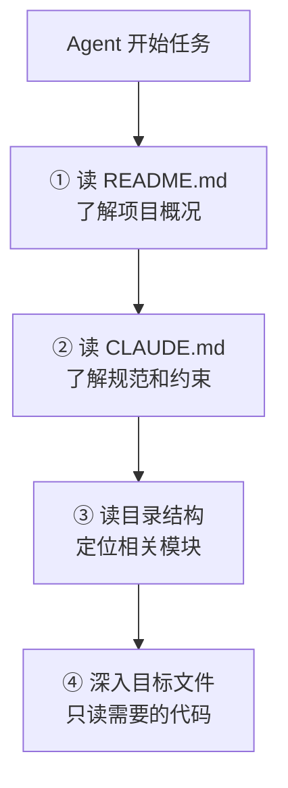

---
> 📚 **Part IV · 进阶专题** | [← 返回专题目录](../../README.md#part-iv-topics)
---

# 🏗️ 大型项目策略

> 🎯 当项目规模超过 Agent 的上下文窗口时，如何拆分、编排和管理 Agent 的工作。

## 目录
- [1. 概述](#1-概述)
- [2. 核心内容](#2-核心内容)
- [3. 实战建议](#3-实战建议)

---

## 1. 概述

Agent 在小项目上游刃有余，但面对几十万行代码的大型项目时会遇到明显瓶颈：上下文不够用、容易迷失、跨模块修改容易出错。这篇专题讲的是：如何通过任务分解、上下文管理、多 Agent 协作等策略，让 Agent 在大型项目中也能高效工作。

---

## 2. 项目规模与策略对应

| 项目规模 | 文件数 | 主要挑战 | 推荐策略 |
|---------|-------|---------|---------|
| 小型 | <50 | 几乎没有 | Agent 可以直接全局理解 |
| 中型 | 50-500 | Agent 无法一次读完 | 维护入口文件 + 渐进探索 |
| 大型 | 500-5000 | 定位关键代码困难 | 模块化指引 + 聚焦单模块 |
| 超大型 | 5000+ | 上下文严重不足 | 多 Agent 分模块 + 严格边界 |

---

## 3. 入口文件策略



---

## 4. CLAUDE.md 的结构建议

```markdown
# 项目简介
[一句话说明这是什么项目]

# 技术栈
[列出主要技术和版本]

# 项目结构
src/
  auth/       # 认证模块
  api/        # API 路由
  models/     # 数据模型
  utils/      # 工具函数

# 常用命令
- 启动：`npm run dev`
- 测试：`npm test`
- 构建：`npm run build`
- Lint：`npm run lint`

# 编码规范
- [列出关键规范]

# 注意事项
- [列出 Agent 容易踩的坑]
```

---

## 5. 实战建议

- **中型项目**：在 CLAUDE.md 中说明项目关键入口文件，维护 README 中的模块说明
- **大型项目**：聚焦单模块工作，用目录结构引导 Agent 渐进探索
- **超大型项目**：采用多 Agent 分模块策略，每个 Agent 只负责自己的模块边界

---

> 📖 **相关章节**：[👥 多 Agent 组合专题](./topic-multi-agent.md) · [🎯 任务适配度](./topic-task-fit.md) · [🧩 上下文工程深入](./topic-context-engineering.md)

---

返回目录：[README · 章节目录](../../README.md#tutorial-contents)
