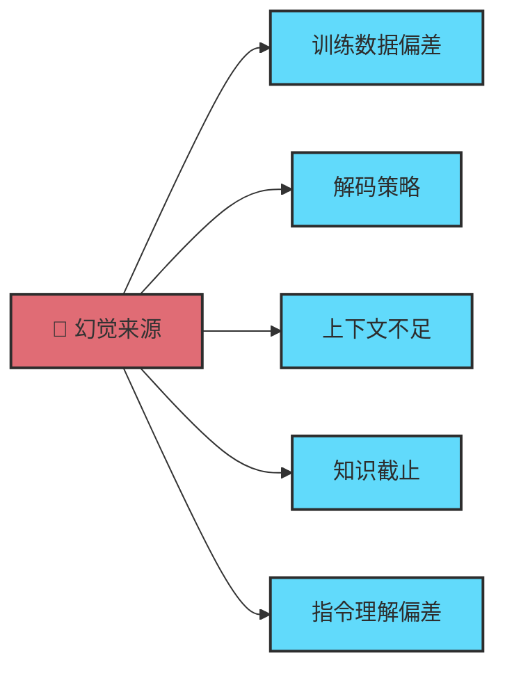

---
> 📚 **Part IV · 进阶专题** | [← 返回专题目录](../../README.md#part-iv-topics)
---

# 🧠 大模型幻觉问题（LLM Hallucination）

> 🎯 深入理解大语言模型为什么会"编造事实"——幻觉的成因、分类、检测方法与缓解策略。

## 📑 目录

- [1. 什么是大模型幻觉](#1-什么是大模型幻觉)
- [2. 幻觉的分类](#2-幻觉的分类)
- [3. 幻觉的技术成因](#3-幻觉的技术成因)
- [4. 在 Coding Agent 中的典型表现](#4-在-coding-agent-中的典型表现)
- [5. 检测与缓解策略](#5-检测与缓解策略)
- [6. 与 AI 幻觉避坑指南的区别](#6-与-ai-幻觉避坑指南的区别)

---

## 1. 什么是大模型幻觉

**幻觉（Hallucination）** 是指大语言模型生成的内容看起来流畅合理，但实际上与事实不符或完全虚构的现象。

| 类型 | 描述 | 举例 |
|------|------|------|
| **事实性幻觉** | 生成与已知事实矛盾的信息 | "Python 3.12 移除了 async/await 语法" |
| **忠实性幻觉** | 生成与给定上下文/指令不一致的内容 | 你要求修改文件 A，Agent 却修改了文件 B |
| **虚构性幻觉** | 凭空编造不存在的实体 | 引用一个不存在的 npm 包 `@util/magic-parser` |

> ⚠️ 幻觉不是 Bug——它是生成式模型的**固有特性**。模型的工作原理是预测下一个 token，而非查询事实数据库。

---

## 2. 幻觉的分类

### 按来源分



| 来源 | 说明 | Coding 场景举例 |
|------|------|---------------|
| **训练数据偏差** | 训练语料中的错误或过时信息 | 推荐已废弃的 API 用法 |
| **解码策略** | 温度/采样参数导致的随机性 | 相同 Prompt 每次生成不同的（有时错误的）代码 |
| **上下文不足** | 缺乏足够信息做出正确判断 | 不了解项目架构，猜测错误的文件路径 |
| **知识截止** | 训练数据有截止日期 | 不知道新版本框架的 breaking changes |
| **指令理解偏差** | 模型对指令的理解与人类意图不一致 | 你说"优化"，它理解为"重写" |

### 按严重程度分

| 级别 | 表现 | 危害 | 频率 |
|------|------|------|------|
| 🟢 **轻微** | 注释不准确、变量命名略奇怪 | 低 | 高 |
| 🟡 **中等** | 使用了不存在的 API 参数、import 路径错误 | 编译失败 | 中 |
| 🔴 **严重** | 编造安全漏洞修复方案、虚构依赖包 | 安全风险 | 低 |
| ⚫ **致命** | 生成看似正确但逻辑错误的代码（运行不报错但结果错误） | 极高 | 低 |

---

## 3. 幻觉的技术成因

### 3.1 Next-Token Prediction 的本质

LLM 的核心机制是**预测下一个 token 的概率分布**，而非"理解事实"：

```
输入: "Python 的创建者是"
输出概率: { "Guido": 0.85, "Linus": 0.05, "James": 0.03, ... }
```

模型选择最高概率的 token 继续生成。当关于某个主题的训练数据不足时，概率分布会趋于平坦，模型就可能"猜错"。

### 3.2 Softmax Bottleneck

Transformer 的 softmax 输出层在表示某些复杂知识时存在信息瓶颈，导致模型无法精确区分相似但不同的事实。

### 3.3 训练目标与忠实性的矛盾

- **训练目标**：生成人类偏好的流畅文本（RLHF）
- **副作用**：模型学会了"自信地胡说八道"——因为在训练中，自信的回答通常获得更高评分

> 🔑 **核心矛盾**：模型被奖励"听起来正确"，而非"实际正确"。

### 3.4 上下文窗口的衰减效应

随着对话变长，模型对早期上下文的注意力逐步衰减。在长会话中：

| 上下文位置 | 注意力 | 幻觉风险 |
|-----------|--------|---------|
| 最近 10% | ⬆️ 高 | 低 |
| 中间 50% | ➡️ 中 | 中 |
| 最早 40% | ⬇️ 低 | 高 |

这就是为什么 Agent 在长对话后期容易"忘记"你之前强调的约束。

---

## 4. 在 Coding Agent 中的典型表现

| 幻觉类型 | 表现 | 检测方法 |
|---------|------|---------|
| **API 虚构** | 调用不存在的函数/参数 | 跑测试、查官方文档 |
| **依赖幻觉** | `import` 不存在的包 | `pip install` / `npm install` 失败 |
| **路径虚构** | 引用不存在的文件路径 | `ls` 验证 |
| **逻辑幻觉** | 代码能运行但结果错误 | 单元测试覆盖边界条件 |
| **版本混淆** | 混用不同版本的 API | 锁定版本号 + 查 changelog |
| **配置编造** | 生成看似合理但无效的配置项 | 对照官方配置文档 |
| **过度自信** | 声称"已修复"但实际未修复 | 必须跑验证命令 |

### 真实案例：依赖幻觉

```
你：帮我解析 YAML 文件
Agent：安装 @yaml/fast-parser 包...

问题：@yaml/fast-parser 这个包根本不存在。
      真正的包是 js-yaml 或 yaml。
```

**防御**：让 Agent 在推荐依赖前先 `npm search` 或 `pip search` 验证。

---

## 5. 检测与缓解策略

### 5.1 事前预防

| 策略 | 做法 | 效果 |
|------|------|------|
| **提供充足上下文** | 附上相关代码文件、文档链接 | 减少 Agent 猜测的必要性 |
| **指定版本** | "使用 React 18 的 API" | 减少版本混淆 |
| **约束范围** | "只修改这个文件" | 减少无关改动 |
| **要求引用** | "引用你参考的文件和行号" | 让幻觉可追溯 |

### 5.2 事中检测

| 信号 | 含义 | 行动 |
|------|------|------|
| Agent 的回答过于流畅、没有犹豫 | 可能在编造 | 追问细节 |
| 提到你从未见过的 API/包/配置项 | 可能是虚构 | 搜索验证 |
| 修改了你没要求修改的文件 | 忠实性幻觉 | `git diff` 审查 |
| 声称"已测试通过"但没有运行测试 | 过度自信 | 要求实际执行 |

### 5.3 事后验证

- ✅ **运行测试** — 最有效的验证手段
- ✅ **`git diff` 审查** — 检查所有实际改动
- ✅ **依赖验证** — `npm ls` / `pip list` 确认安装
- ✅ **文档交叉检查** — 用 Agent 的 WebSearch 验证其声称

### 5.4 架构级缓解

| 架构 | 说明 |
|------|------|
| **Writer-Reviewer 双 Agent** | 一个 Agent 写，另一个 Agent 审，互相校验 |
| **RAG 增强** | 让 Agent 先检索项目代码再生成，减少猜测 |
| **验证驱动循环** | Agent 每次修改后必须跑测试、看输出（详见 Ch06） |
| **Spec 驱动** | 用明确的 Spec 约束 Agent 行为范围（详见 Ch11） |

---

## 6. 与 AI 幻觉避坑指南的区别

| 维度 | 本专题（大模型幻觉问题） | [AI 幻觉避坑指南](./topic-ai-hallucination.md) |
|------|----------------------|-------------------------------------------|
| **侧重** | 技术原理和分类体系 | 实操避坑清单 |
| **深度** | 探讨为什么会产生幻觉 | 聚焦怎么避免和检测 |
| **读者** | 想深入理解机制的读者 | 想快速获得行动指南的读者 |
| **关联** | 互补 | 互补 |

---

> 📖 **相关章节**：
> - [Ch05 · Agent 内部机制与工具体系](../chapters/ch05-agent-mechanics.md) — 理解 Agent 的工作循环
> - [Ch13 · AI Code Review](../chapters/ch12-code-review.md) — 实战中的幻觉检测
> - [AI 幻觉避坑指南](./topic-ai-hallucination.md) — 实操避坑清单
> - [Ch12 · 人机协同方法论](../chapters/ch10-collaboration.md) — 验证闭环
