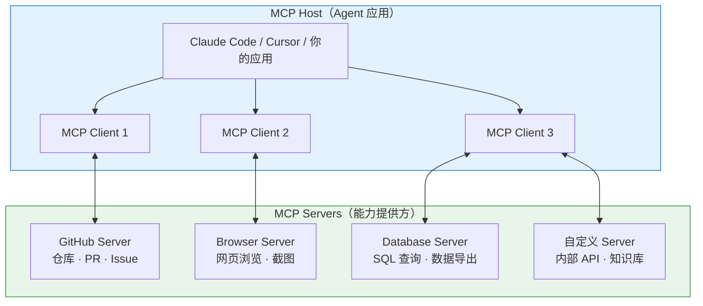
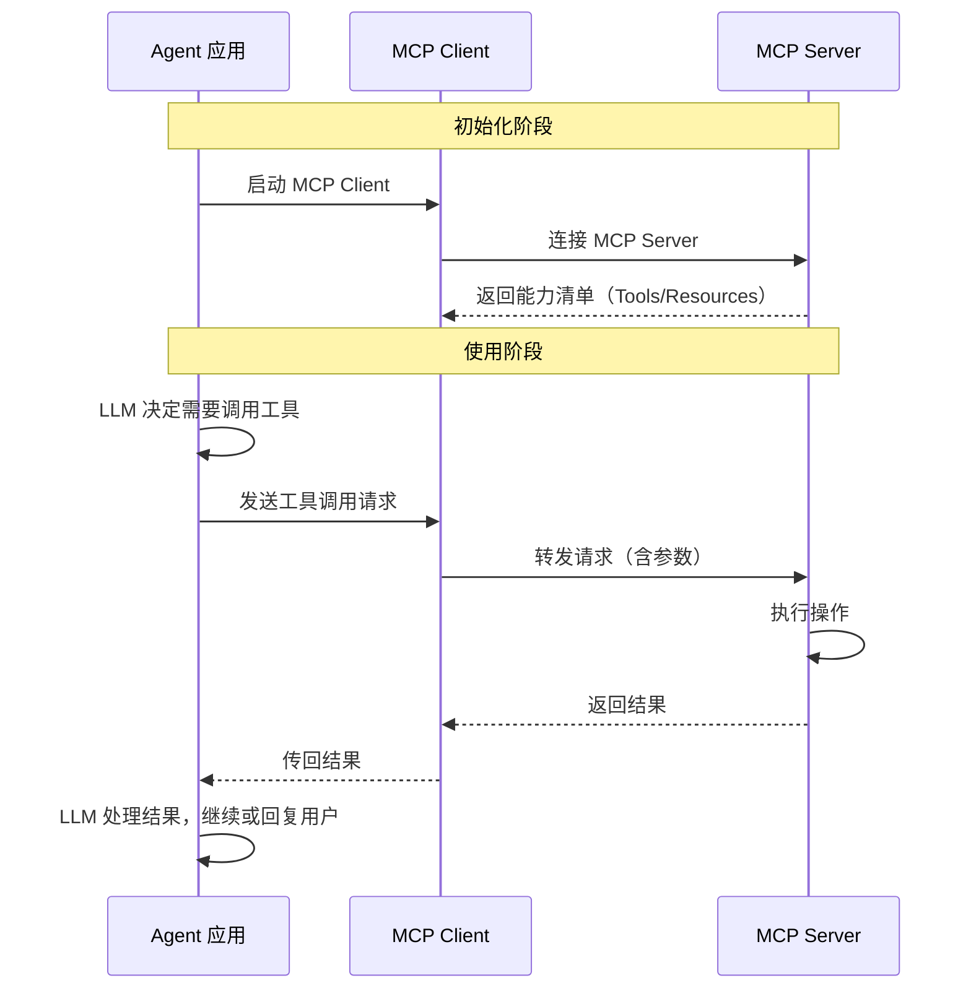
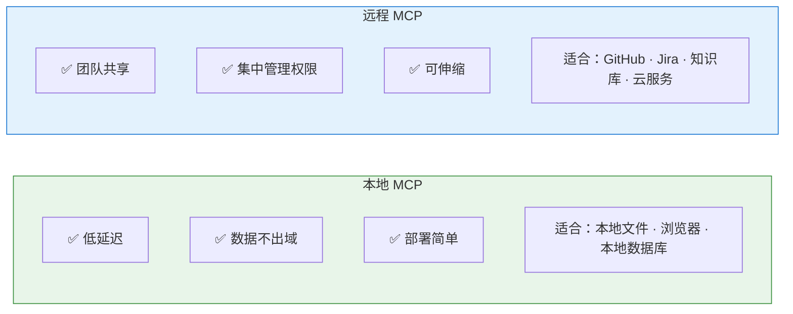
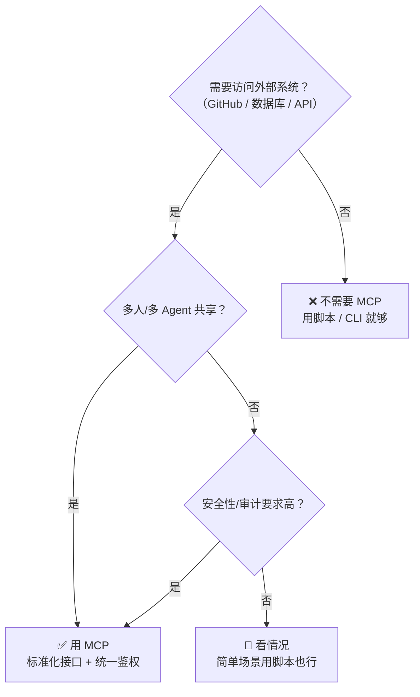
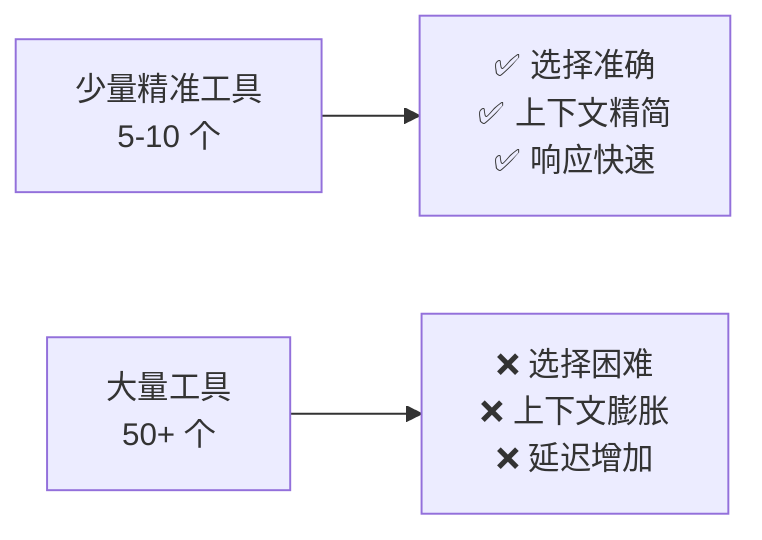
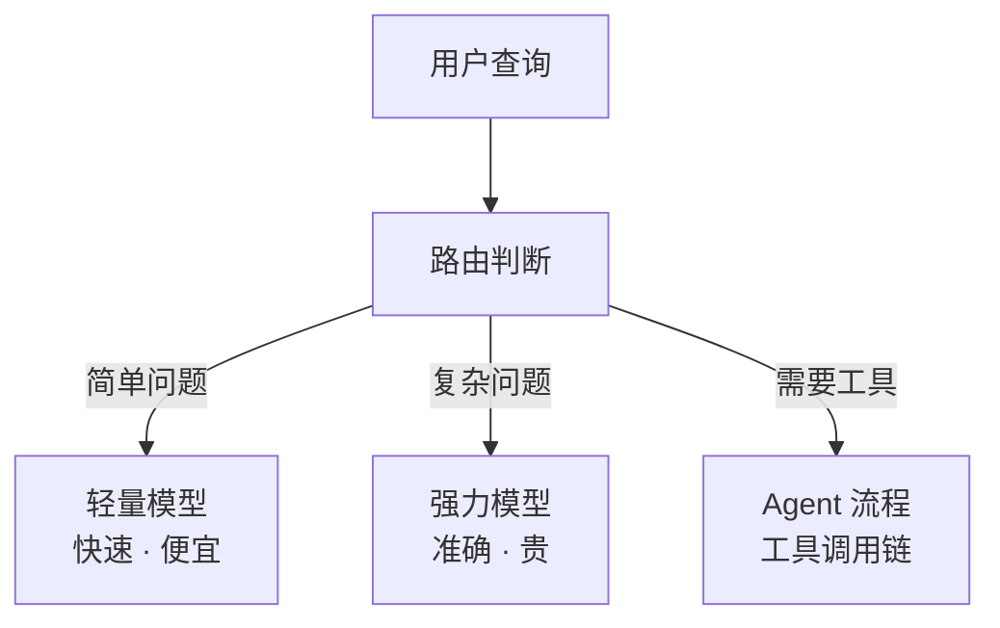

---
> 📚 **Part IV · 进阶专题** | [← 返回专题目录](../../README.md#part-iv-topics)
---

# 🔌 MCP 协议

> 目标：深入理解 MCP 的定位、用法和局限——以及为什么 2026 年的趋势是"MCP 回归合理位置"而非"万物皆 MCP"。

---

## 一、MCP 基础

### MCP 是什么

MCP 最初由 Anthropic 于 2024 年 11 月提出，是一个**开放标准协议**，旨在标准化 AI 应用与外部数据源/工具之间的连接方式。

**重要进展**：2025 年 12 月，Anthropic 将 MCP 捐赠给 **Linux Foundation 旗下的 Agentic AI Foundation（AAIF）**，OpenAI 和 Block 作为联合创始成员加入，Google、Microsoft、AWS、Cloudflare 等提供支持。MCP 已从 Anthropic 的单一项目演变为**行业中立的开放标准**。当前最新规范版本为 **2025-11-25**。

一个类比：**MCP 之于 AI 工具集成，就像 USB-C 之于硬件设备连接。** 在 MCP 出现之前，每接一个外部能力（GitHub、数据库、浏览器等）都需要一套私有集成方案；MCP 把这个过程标准化了。

### MCP 不是什么

| MCP 不是 | MCP 是 |
|---------|--------|
| 一个模型 | Agent 与外部能力之间的连接协议 |
| Agent 框架 | 工具暴露和调用的标准接口 |
| 某家公司的专属标准 | 开放协议（Linux Foundation 治理），行业共建 |
| Function Calling 的替代品 | Function Calling 的标准化和扩展 |

### MCP 架构



### MCP 提供的三种能力

| 能力类型 | 说明 | 示例 |
|---------|------|------|
| **Tools（工具）** | Agent 可以调用的操作 | 创建 PR、执行 SQL、发送消息 |
| **Resources（资源）** | Agent 可以读取的数据 | 文件内容、数据库记录、API 响应 |
| **Prompts（提示模板）** | 预定义的交互模板 | 代码审查模板、Bug 报告模板 |

### MCP 工作流详解



---

## 二、本地 MCP vs 远程 MCP



---

## 三、MCP 与 A2A：互补的两大协议

除了 MCP，Google 于 2025 年 4 月推出了 **A2A（Agent-to-Agent Protocol）**，同样于 2025 年捐赠给 Linux Foundation。两者是互补关系：

| 协议 | 方向 | 解决什么 |
|------|------|---------|
| **MCP** | 纵向（Agent ↔ 工具） | Agent 如何连接和使用外部工具和数据 |
| **A2A** | 横向（Agent ↔ Agent） | 多个 Agent 如何发现、通信和协作 |

---

## 四、谁支持 MCP？

截至 2026 年 3 月，MCP 已被广泛支持：

| 工具/平台 | MCP 支持情况 |
|----------|------------|
| Claude Code | 原生支持（Anthropic 自家协议） |
| Cursor | 支持 |
| Cline | 支持（社区 MCP 生态活跃） |
| Codex CLI | 部分支持 |
| VS Code Copilot | 支持 |
| OpenCode | 支持 |

### 常见 MCP Server 举例

| MCP Server | 提供的能力 |
|-----------|-----------|
| **@anthropic/mcp-server-github** | 仓库浏览、PR/Issue 操作 |
| **@anthropic/mcp-server-filesystem** | 受控的文件系统访问 |
| **@anthropic/mcp-server-puppeteer** | 浏览器自动化、网页截图 |
| **@anthropic/mcp-server-sqlite** | SQLite 数据库查询 |
| **社区贡献** | Notion、Slack、Google Drive、PostgreSQL 等 |

---

## 五、什么时候需要 MCP，什么时候不需要



---

## 六、工具调用的"四大魔咒"

在生产环境中使用 Agent 工具调用，会遇到四个核心挑战：

### 1. 执行幻觉（Execution Hallucination）

Agent 选错 API、编造参数、甚至"以为"自己已经执行成功。最糟糕的是**静默失败**——Agent 报告"已完成"但实际什么都没做。

**应对**：始终要求 Agent 展示工具调用的实际输出，而不是只接受它的"自我报告"。

### 2. 上下文衰退（Context Rot）

工具返回的结果、日志、历史对话不断堆积，token 越用越多，模型越来越难"记住"早期的重要信息。

**应对**：控制工具输出长度，定期做摘要，分阶段执行任务。

### 3. 延迟与成本爆炸（Delay and Cost Explosion）

每个小请求都要经过"意图判断→选工具→填参数→执行→处理结果"的完整链路，延迟和费用迅速上升。

**应对**：简单操作用脚本直接执行，不经过 LLM 决策；利用 Prompt Cache 减少重复上下文的费用。

### 4. 安全边界崩塌（Prompt Injection）

用户输入和系统指令共用一条文本流，攻击者可能通过精心构造的输入劫持工具调用。

**应对**：对高风险操作设置人工确认；MCP Server 实现最小权限原则；审计工具调用日志。

---

## 七、工具数量的"Less is More"原则

### 为什么工具多了反而效果差



### 实证数据

多项研究和实践表明：

- 工具描述占据的上下文空间随数量线性增长
- 工具选择准确率在工具数量超过 ~20 个后明显下降
- LangChain 团队通过精简工具栈，将 Agent 性能显著提升

### 工具管理的最佳实践

| 策略 | 说明 |
|------|------|
| **动态加载** | 不要一次性加载所有工具，根据任务按需加载 |
| **分层组织** | 核心工具始终可用，专业工具按需启用 |
| **优先 CLI** | 能用脚本/CLI 解决的不要做成 MCP |
| **定期清理** | 删除不再使用的 MCP 配置 |
| **文档清晰** | 每个工具的描述要精准，帮助模型正确选择 |

---

## 八、工业界的三大护栏

面对工具调用的挑战，工业界发展出三层防护机制：

### 1. 路由层



### 2. 缓存体系

- **Prompt Cache**：重复的系统指令前缀自动缓存，减少计费
- **KV Cache**：模型推理中的中间计算结果缓存
- **语义缓存**：相似问题命中历史回答，避免重复推理

### 3. MCP 标准化连接

把 N 种 Agent × M 种工具的集成复杂度，从 O(N×M) 降低到 O(N+M)——每种 Agent 只需对接 MCP 协议，每种工具只需实现 MCP Server。

---

## 九、实战配置速查

> MCP 是专为 AI 设计的"通用 USB-C 接口"——让 Claude 直接连数据库、拉 GitHub PR、查 Notion/Slack。
>
> MCP 概念的深度解析（协议架构、与 Skill 的区别、决策框架等）请参阅：[MCP 与 Skills 完整参考](./topic-mcp-and-skills-ref.md)

### PostgreSQL 集成

**挂载命令：**

```bash
claude mcp add postgres npx -y @modelcontextprotocol/server-postgres postgresql://<用户名>:<密码>@localhost:5432/<数据库名>
```

**使用示例：**

- "帮我查一下 users 表的结构，然后看下最新注册的 5 个用户的 status 字段是什么。"
- "我在跑这段登录逻辑时报错了，请对比一下本地代码里的 SQL 查询和数据库当前的实际表结构。"

### GitHub 集成

**挂载命令：**

```bash
claude mcp add github npx -y @modelcontextprotocol/server-github --env GITHUB_PERSONAL_ACCESS_TOKEN=<你的专属Token>
```

**使用示例：**

- "请帮我 Review 一下 PR #123，指出潜在的内存泄漏风险。"
- "查看 Issue #45，然后基于它提到的报错日志，在当前项目里找到对应的代码文件并修复它。"

### 管理命令

```bash
claude mcp list              # 查看当前挂载的 MCP 服务器
claude mcp remove <name>     # 卸载指定 MCP 服务器
```

### 安全提示

数据通过本地 MCP Server 抓取后再喂给云端 LLM，建议数据库使用 Read-Only 账号，避免 Claude 意外执行写操作。MCP 本地中转的设计让你始终拥有数据阻断权。

---

> 📖 **相关章节**：[Skill 系统专题](./topic-skills.md) · [CLI vs MCP 选择](./topic-cli-vs-mcp.md) · [MCP 与 Skills 完整参考](./topic-mcp-and-skills-ref.md)
