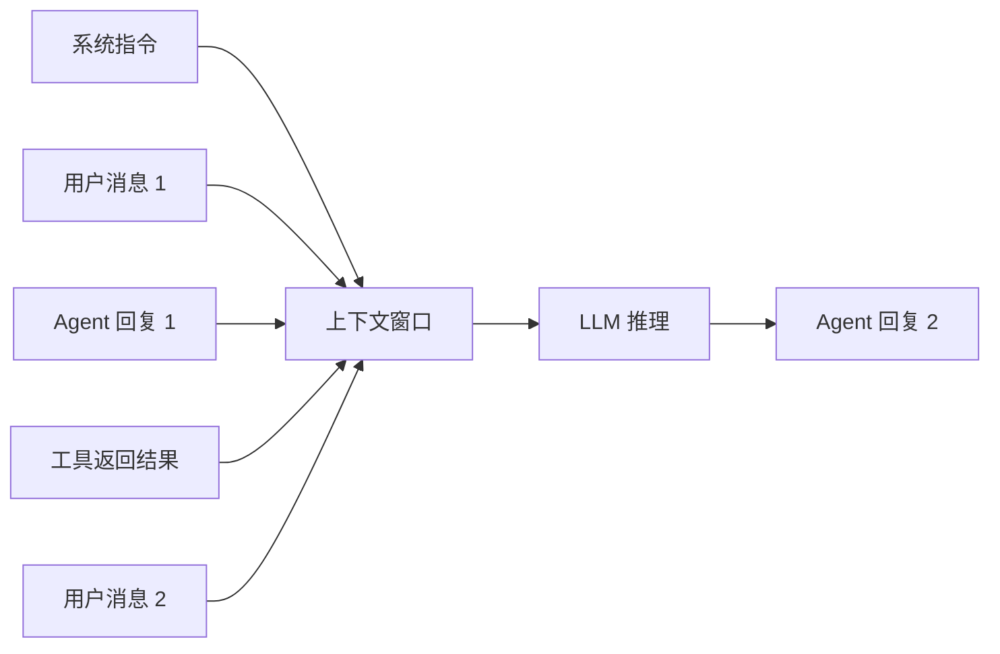
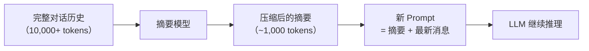
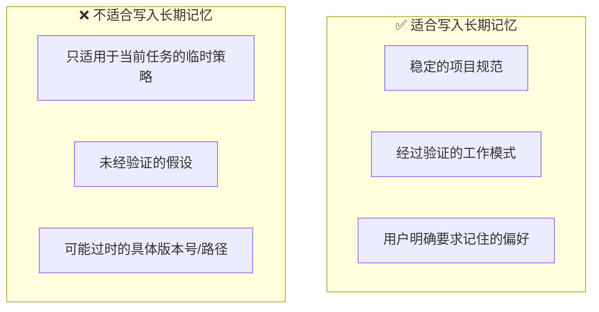
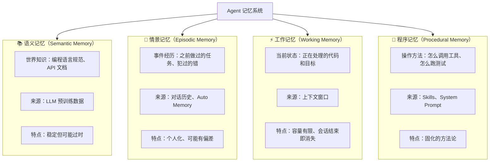
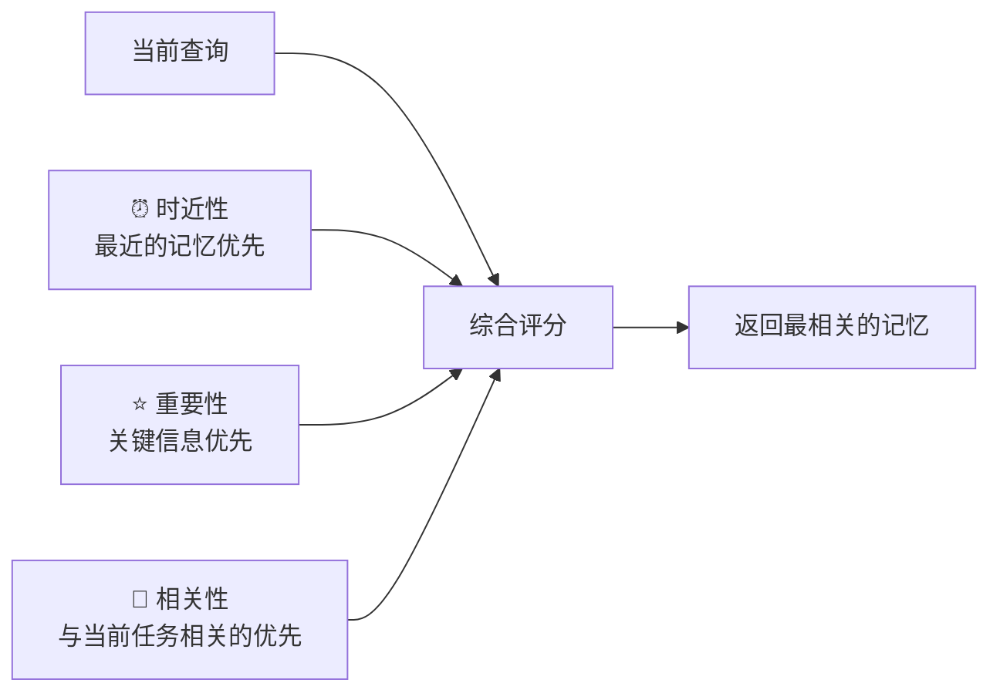
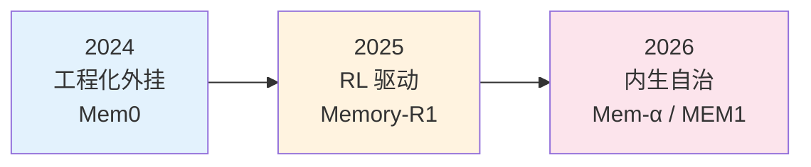
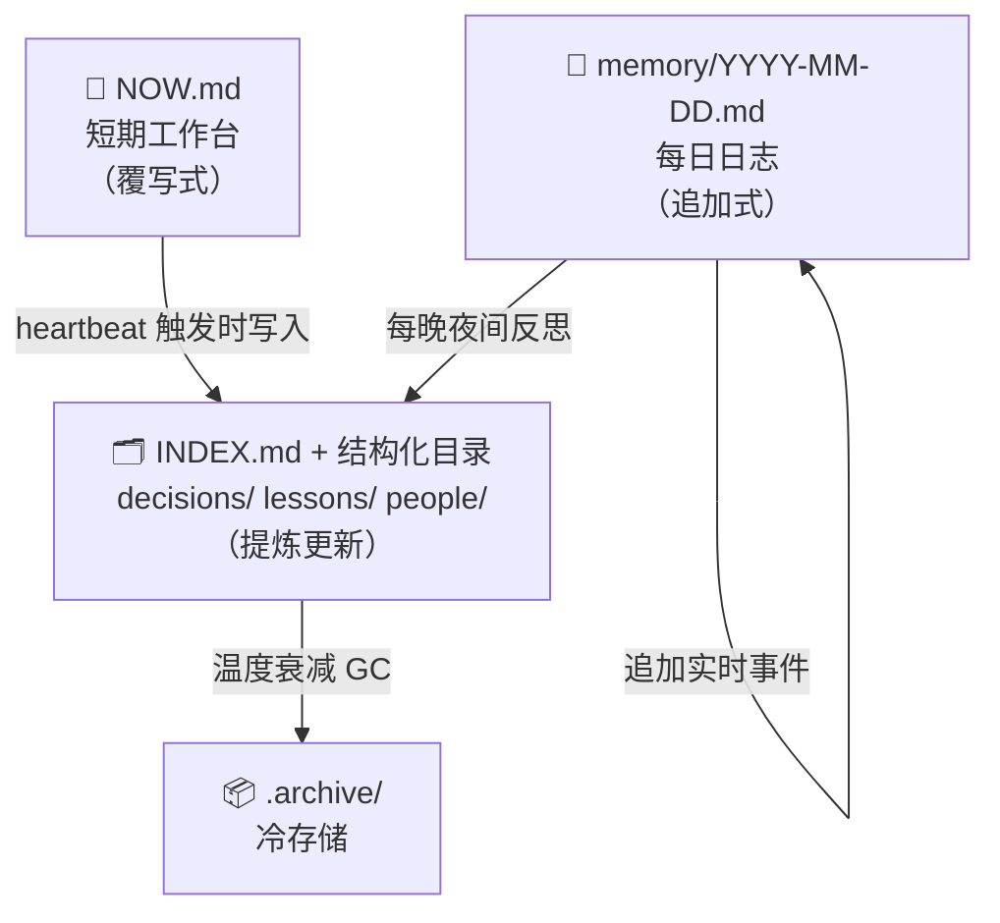

# Agent 记忆系统详解


---

## 1. 为什么 Memory 是 Agent 的核心能力

Agent 和普通 LLM 对话的最大区别之一就是**记忆**。没有记忆的 LLM 每次对话都从零开始；有记忆的 Agent 能积累经验、保持任务状态、跨会话复用知识。

Memory 直接决定了三个关键指标：

| 指标 | Memory 好的表现 | Memory 差的表现 |
|------|----------------|----------------|
| **任务连贯性** | 记住任务进度，不重复已完成的步骤 | 反复做同样的事，忘记上下文 |
| **个性化** | 记住你的偏好和项目规范 | 每次都要重新告诉它你的习惯 |
| **长任务稳定性** | 在长对话中保持目标不漂移 | 越聊越偏题，忘记原始目标 |

---

## 2. 短期记忆：上下文窗口

### 工作原理

LLM 的短期记忆就是**上下文窗口（Context Window）**——把所有对话历史、系统指令、工具返回结果拼接成一个序列，送给模型处理。



### 上下文窗口大小对比（2026 年 3 月）

| 模型 | 上下文窗口 | 约等于 |
|------|-----------|--------|
| Claude Opus 4.6 | 200K tokens（1M Beta） | ~500 页文档 / ~15 万行代码 |
| GPT-5.4 | 128K tokens | ~320 页文档 |
| Gemini 3 Pro | 1M tokens | ~2500 页文档 |
| DeepSeek V3.2 | 128K tokens | ~320 页文档 |

### 上下文窗口的局限

即使窗口很大，也不意味着"塞越多越好"：

1. **注意力衰减**：窗口中间的信息比头部和尾部更容易被"遗忘"（"Lost in the Middle"现象）
2. **成本线性增长**：输入 token 越多，API 费用越高
3. **质量稀释**：无关信息越多，模型对关键信息的关注度越低

---

## 3. 对话摘要：压缩记忆

当对话太长，快要超出上下文窗口时，Agent 会自动触发**对话摘要**——把之前的详细对话压缩成精炼摘要，保留关键信息，丢弃细节。



### Claude Code 的 Context Compaction

Claude Code 内置了自动上下文压缩机制（Context Compaction）：当上下文接近窗口极限时，自动对已完成阶段进行摘要，释放空间给新任务。这使得 Agent 可以处理远超单次窗口容量的长任务。

**你需要知道的**：
- 摘要是有损的——细节会丢失
- 如果某个关键信息在早期对话中，摘要后可能被遗忘
- 所以关键指令（如"不要修改生产配置"）应该放在系统指令或 CLAUDE.md 中，而不是依赖对话记忆

---

## 4. 长期记忆：跨会话持久化

短期记忆和对话摘要都随会话结束而消失。要让 Agent 跨会话记住信息，需要**长期记忆**。

### Coding Agent 中的长期记忆实现

| 机制 | 存储位置 | 内容 | 生命周期 |
|------|---------|------|---------|
| **CLAUDE.md / AGENTS.md** | 项目根目录 | 项目规范、编码风格、常用命令 | 永久（跟随代码库） |
| **Auto Memory** | `~/.claude/projects/` | Agent 自动记录的用户偏好和项目知识 | 跨会话持久化 |
| **全局设置** | `~/.claude/settings.json` | 全局规则和 API 配置 | 所有项目共享 |
| **会话文件** | 项目中的 notes/logs 文件 | 阶段成果、研究笔记 | 永久（写入文件系统） |

### 长期记忆的最佳实践



---

## 5. 认知记忆架构

从认知科学角度，Agent 的记忆系统可以对应人类大脑的四种记忆模式：



### 记忆检索评分

当 Agent 需要从记忆中调取信息时，通常会综合三个维度打分：



---

## 6. Memory 的三大进化阶段（2024-2026）

Agent Memory 技术正在快速演进：

### 阶段一：工程化外挂（2024）

- **代表**：Mem0（生产级 Memory 基建）
- **做法**：不再只是向量数据库，而是维护 Memory Graph——抽取实体、建立关系、合并相似信息、更新状态
- **适用**：个性化 Agent、长对话客服、企业知识管理

### 阶段二：强化学习驱动（2025）

- **代表**：Memory-R1
- **做法**：用双 Agent 框架——Memory Manager 决定"记什么、更新什么、删什么"，Answer Agent 负责"用记忆"
- **突破**：在很小的数据集上就能学到比复杂规则更好的记忆管理策略

### 阶段三：内生化与自治（2025-2026）

- **代表**：MEM1（恒定内存状态机）、Mem-α（完全自治记忆系统）
- **做法**：不再堆叠上下文，而是维护高度压缩的内部状态变量
- **趋势**：Memory 正在从"RAG 工具层"升级为"Agent 的核心决策能力"



---

## 8. Agentic RAG：从检索增强到自主检索决策

> 📌 传统 RAG 是"检索 → 生成"的固定管道；Agentic RAG 让 Agent 自主决策**是否检索、检索什么、检索多少轮**。

### 演化路线（2023–2026）


### 三个关键里程碑

| 系统 | 核心创新 | 解决的问题 |
|------|---------|-----------|
| **Self-RAG** | 引入 reflection tokens，模型为自己打分 | 判断是否需要检索、文档是否相关、答案是否可靠 |
| **CRAG** | 引入 Evaluator Agent | 检索质量差时自动触发 Web Search fallback，不再盲目相信检索结果 |
| **Adaptive-RAG** | 首次显式路由 | 先判断问题复杂度：简单问题→直接回答，中等→普通检索，复杂→多步 Agent 推理 |

### 两类失败模式（AgenticRAGTracer 发现）

在多跳推理场景中，Agentic RAG 系统存在两类典型失败：

- **Premature Collapse（过早停止）**：Agent 在还没找到足够信息时就停止检索，给出不完整答案
- **Over-Extension（过度延伸）**：Agent 无限制地调用检索工具，推理链越来越长但答案质量不再提升

> 💡 **结论**：好的 Agentic RAG 不在于"推理更长"，而在于"推理更合理"——知道什么时候停下来。

### 未来形态：混合系统

```
简单问题  →  直接回答（无需检索）
中等问题  →  单次检索 + 生成
复杂问题  →  Adaptive-RAG（多步推理）
深度研究  →  多工具自治（Deep Research）
```

> ⚠️ 对于日常 Coding Agent 场景，直接用文件系统 + ripgrep 检索代码仓库通常比搭 RAG 更简单、更可靠。Agentic RAG 更适合需要跨大量外部文档的知识密集型场景。

---

## 9. 生产级记忆系统：文件即事实

上面几节讨论了技术层面的记忆机制（向量检索、上下文缓存等）。这一节转向**工程实践**：在真实多 Agent 系统中，如何用文件系统构建可靠的持久化记忆？

> **核心哲学**：`文件 = 事实来源。你不写进文件的东西 = 你从来不知道的东西。`
> Agent 的记忆不在它的「脑子」里，而在磁盘上。Context window 是工作台，文件才是仓库。

### 三层架构

| 层级 | 文件 | 写入方式 | 用途 |
|------|------|----------|------|
| **短期（工作台）** | `NOW.md` | 覆写式 | 当前状态、优先级、阻塞项 |
| **中期（日志流）** | `memory/YYYY-MM-DD.md` | 追加式 | 事件流水，实时记录当天发生的一切 |
| **长期（知识库）** | `memory/INDEX.md` + 结构化子目录 | 提炼更新 | 经过整理的决策、教训、人物画像 |



### 信息路由规则

一条新信息该写到哪里？

```
新信息 → 重大决策？        → decisions/YYYY-MM-DD-slug.md
        → 可复用经验？      → lessons/TOPIC.md
        → 关于某人/Agent？  → people/NAME.md
        → 值得记录的事件？  → memory/YYYY-MM-DD.md（每日日志）
        → 不值得记录？      → NOOP
```

### 记忆衰减模型

不是所有记忆都该永久保留。生产系统通常基于「温度」来决定哪些记忆保持活跃、哪些归档：

| 温度 | 判断标准 | 处理方式 |
|------|---------|---------|
| 🔥 Hot（T > 0.7） | 近期被频繁引用 + 高优先级 | 保持在活跃索引 |
| 🌤 Warm（0.3 < T ≤ 0.7） | 偶尔被引用 | 保留但检索降权 |
| 🧊 Cold（T ≤ 0.3） | 久未被引用 + 低优先级 | 移至 .archive/ |

温度计算综合三个因素：`时效衰减（半衰期约23天）× 0.5 + 近期引用次数 × 0.3 + 优先级标签 × 0.2`

### 渐进式搭建路径

不必一步到位，建议分阶段实施：

| 阶段 | 行动 | 获得的效果 |
|------|------|-----------|
| 阶段 0（今天） | 建立 `NOW.md` + 每日日志 | 基本的跨 session 状态保留 |
| 阶段 1（第 1 周） | 建立 `INDEX.md` + `lessons/` + `decisions/` | 结构化知识积累 |
| 阶段 2（第 2 周） | Frontmatter 规范 + 夜间反思流程 | 知识质量保障 |
| 阶段 3（第 3 周+） | 语义搜索 + 温度 GC + .archive/ | 检索效率 + 主动遗忘 |

> 📌 **最小可行版本**：从 `NOW.md` 开始。每次 session 开始时让 Agent 读取它，结束时写入当前状态。这一个习惯就能显著提升多 session 任务的连贯性。

---

