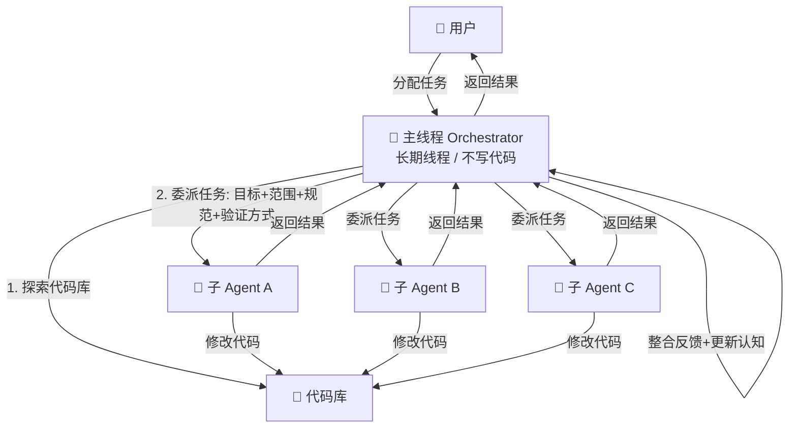
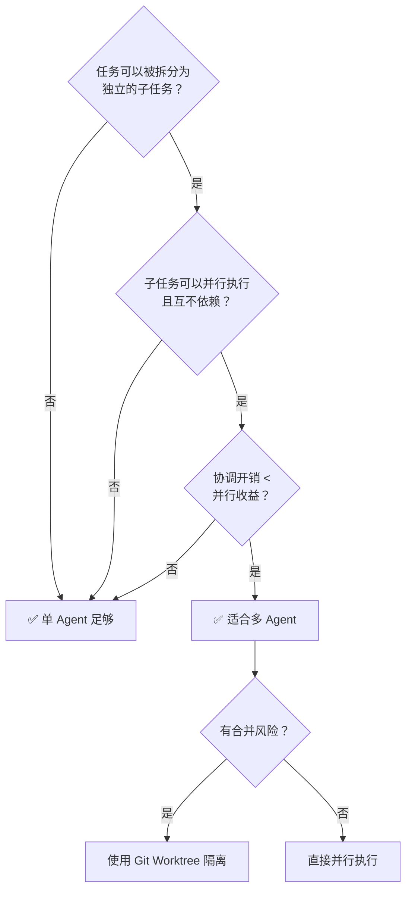

---
> 📚 **Part IV · 进阶专题** | [← 返回专题目录](../../README.md#part-iv-topics)
---

# 多 Agent 协作

> 目标：理解多 Agent 协作的架构模式、适用场景和实践经验——什么时候该用、怎么用、以及为什么不是越多越好。

---

## 一、核心问题：为什么需要多 Agent？

单 Agent 的天花板来自两个物理限制：

1. **上下文窗口有限**：一个 Agent 在单次会话中能"看到"的代码量是有上限的
2. **顺序执行**：单 Agent 按照一个线程顺序执行，无法并行处理独立任务

多 Agent 解决的就是这两个问题：**上下文隔离 + 并行执行**。

但代价是引入了**协调开销**——Agent 之间的通信、上下文同步、结果整合都需要成本。这就是为什么多 Agent 不是越多越好。

---

## 二、四种架构模式

### 2.1 Planner-Worker — 强弱分工

```
强模型（Planner）：分析问题、规划方案、分配任务
       ↓
快速模型（Worker × N）：执行具体代码修改
```

**适合**：任务结构清晰，执行步骤可以预先拆分的场景。

- Planner 使用 Opus/强模型，负责理解意图、设计方案
- Worker 使用 Sonnet/Haiku，负责按指令执行
- 优点：降低整体成本，强模型集中在高价值决策
- 缺点：规划质量决定一切，Planner 出错代价大

### 2.2 Writer-Reviewer — 互审纠错

```
Writer Agent：生成初稿
       ↓
Reviewer Agent：审查、发现问题、反馈
       ↓
Writer Agent：修改
```

**适合**：代码质量要求高、需要双重确认的场景（如关键 API、安全敏感代码）。

- 两个 Agent 使用不同的上下文，Reviewer 不受 Writer 的路径依赖影响
- 可以发现 Writer 在自我审查时看不到的盲点
- 缺点：成本翻倍，迭代轮次多

### 2.3 Fan-out 并行 — 多路竞争

```
同一任务 → Agent A、Agent B、Agent C 独立执行
       ↓
选择最优方案或合并结果
```

**适合**：需要多个方案对比，或高可靠性要求下的冗余执行。

- 典型用法：让多个 Agent 各自实现同一个功能，人工或自动选最好的
- 成本是单 Agent 的 N 倍，通常只用于关键功能

### 2.4 Orchestrator — 中央协调模式（推荐深度了解）

这是目前实战效果最好的多 Agent 模式，见下一节详解。

---

## 三、Orchestrator 模式详解

> 来源：Matt Shumer（@mattshumer_）实战总结，获得大量工程师验证。

### 3.1 核心设计思想

**一个代码库只维护一个长期主线程，这个主线程不写代码，只做三件事：**

1. **学习代码库** — 深入理解项目结构、模块边界、约定和脆弱点
2. **保持上下文** — 维护对代码库的持续认知，随时间积累加深
3. **调配和委托** — 将具体任务分配给子 Agent，提供明确的目标、范围、约束和验证方式



### 3.2 与传统方式的对比

| 维度 | 传统方式（多个独立会话） | Orchestrator 模式 |
|------|----------|-------------------|
| **记忆** | 每次重新探索代码库 | 持续积累，加深理解 |
| **效率** | 重复解释代码库结构 | 一次理解，持续复用 |
| **配合** | 每次生硬从零开始 | 越来越顺畅 |
| **质量** | 不稳定 | 持续改进 |
| **角色定位** | 执行者 | **管理者** |

> 关键洞察：主线程不会随着上下文变长而变笨，反而会越来越聪明——因为对代码库的理解在不断加深。

### 3.3 启动 Prompt 模板

**第一步：初始化阶段**

```
You are the orchestrator for this repo. Start by exploring the entire codebase.
Map the architecture, module boundaries, conventions, entry points, dependencies,
test patterns, and anything fragile or non-obvious. Do not make any changes.
Write a summary I can confirm.

From this point on, this thread is a living memory of the repo.
```

**第二步：任务处理**

```
When I give you a task, don't implement it yourself — spawn a subagent with a clear prompt:
the goal, the files it owns, the files it must not touch, the conventions to follow,
and how to verify the work. If I give you multiple tasks, spawn multiple subagents.

When subagents complete, review their output, incorporate what you learned,
and update your understanding of the repo.
```

**第三步：压缩保护（关键！）**

```
When context is compacted, preserve: the repo architecture summary,
all conventions and patterns, decisions we've made, known fragile areas,
and anything a future subagent would need to do good work.
Do not let compaction erase what we've built.

If the repo is complex enough, create and maintain ORCHESTRATOR.md in the repo —
a living summary of architecture, conventions, decisions, known risks, and current state.
```

### 3.4 给子 Agent 的任务委派模板

好的委派要包含四个要素：

```
目标：[具体要实现什么]
你负责的文件：[精确列出文件路径]
你不能碰的文件：[明确禁止修改的范围]
约定遵守：[代码风格、测试要求、命名规范等]
验证方式：[如何确认任务完成，比如运行什么测试]
```

---

## 四、上下文隔离策略

多 Agent 之间如何共享信息，直接影响质量和成本。

### 4.1 两种协作模式

| 维度 | 通信模式（推荐） | 共享上下文模式 |
|------|----------|----------------|
| **核心思想** | 上下文不共享，只传递结果 | 子 Agent 继承父 Agent 完整历史 |
| **子 Agent 视野** | 只看到自己的任务 | 拥有完整的历史 |
| **成本** | 低 | 极高（无法复用 KV 缓存） |
| **适用场景** | 指令清晰、只关心最终输出 | 需要大量中间过程和历史背景 |
| **典型例子** | 代码库中搜索特定模式 | 深度研究并撰写最终报告 |

> 💡 **选择建议**：默认优先通信模式——轻量、隔离、成本低。只有当子任务确实需要完整历史背景时，才谨慎使用共享上下文模式。

### 4.2 通信模式的最佳实践

主 Agent 委派时，给子 Agent 的 prompt 要足够自包含：

- 不依赖主 Agent 的对话历史
- 包含足够上下文让子 Agent 独立执行
- 明确指定输出格式，便于主 Agent 解析

### 4.3 上下文隔离的好处

子 Agent 在独立的上下文窗口中工作，具有三个关键优势：

1. **不受主线程"上下文腐烂"影响** — 子 Agent 总是从干净状态开始
2. **并行执行** — 多个子 Agent 同时工作，互不干扰
3. **失败隔离** — 一个子 Agent 出错不影响其他子 Agent

---

## 五、Claude Code 的多 Agent 功能

### 5.1 子 Agent 派遣（Subagent Spawn）

Claude Code 支持主 Agent 通过 Task 工具派遣子 Agent：

```
# 在与主 Agent 的对话中
请并行完成以下三个独立任务：
1. 给 UserService 添加单元测试
2. 重构 OrderController 中的错误处理
3. 更新 API 文档中的认证说明
```

Claude Code 会自动启动三个子 Agent 并行执行，并等待所有结果。

### 5.2 子 Agent 的工具限制

给子 Agent 限制工具访问是重要的安全实践：

- 只读任务的子 Agent：只给 Read、Grep、Glob 权限
- 写代码的子 Agent：给 Read、Write、Edit 权限，但禁止 Bash（避免意外执行命令）
- 高风险操作：保留在主线程，需要人工确认

### 5.3 Worktree 隔离

对于可能产生冲突的并行任务，使用 Git Worktree 为每个子 Agent 提供独立的工作目录：

```bash
# 为并行任务创建独立工作树
git worktree add ../feature-auth feature/auth
git worktree add ../feature-payment feature/payment
```

每个子 Agent 在自己的工作树中工作，完成后合并回主分支。

---

## 六、何时使用多 Agent

### 决策框架



### 场景对应推荐

| 场景 | 推荐方案 | 原因 |
|------|---------|------|
| 单个 Bug | 单 Agent | 上下文需要连贯，多 Agent 没有优势 |
| 中等功能实现 | 单 Agent + 分阶段 | 通常不到单 Agent 上下文极限 |
| 大型重构 | 多 Agent 并行 + Worktree | 不同模块可独立重构，合并风险可控 |
| 代码审查 + 修复 | Writer-Reviewer | 双重上下文视角发现盲点 |
| 高风险变更 | 多 Agent 互审 + 人工确认 | 安全性要求高于效率 |
| 跨仓库任务 | 多 Agent 各管一个仓库 | 天然隔离，无合并冲突 |

---

## 七、多 Agent 的常见坑

### 7.1 合并冲突

多个子 Agent 并行修改同一文件是最常见的失败模式。研究数据显示，对同一文件并行修改的成功合并率约为 21%。

**避免方式**：
- 在委派任务前明确划分文件所有权，每个子 Agent 只负责各自的文件
- 使用 Git Worktree 为每个 Agent 创建独立工作空间
- 复杂任务在主线程串行协调，子 Agent 并行执行

### 7.2 上下文泄漏

子 Agent 意外修改了不该修改的文件，或暴露了敏感信息。

**避免方式**：
- 明确在委派 prompt 中列出禁止修改的文件
- 使用 settings.json 的 allow/deny 规则限制子 Agent 的工具权限

### 7.3 成本失控

多 Agent 的成本是单 Agent 的 N 倍，容易超出预期。

**避免方式**：
- 只有真正需要并行的任务才用多 Agent
- 子 Agent 使用 Low Effort 或便宜模型，主 Agent 用强模型
- 设置任务前估算 token 消耗

### 7.4 调试困难

子 Agent 出错时，定位问题比单 Agent 难。

**避免方式**：
- 主 Agent 要求子 Agent 在完成时提供执行摘要（做了什么、发现了什么、有没有异常）
- 子 Agent 的输出要结构化，便于主 Agent 解析和整合

---

## 八、实用建议

1. **从单 Agent 开始** — 除非任务明确需要并行，单 Agent 更简单、更可预测
2. **主线程保持稳定** — Orchestrator 主线程要长期存在，不要频繁 /clear
3. **子 Agent 一次性使用** — 完成任务后丢弃，不要复用同一个子 Agent 做不同任务
4. **建立 ORCHESTRATOR.md** — 复杂项目用文件持久化代码库认知，抵抗上下文压缩的信息丢失
5. **测试驱动委派** — 给子 Agent 的任务要带验证标准，不然无法判断是否成功

---

> 📖 相关内容：
> - 多 Agent 的设计模式细节 → [设计模式详解](./topic-design-patterns-detail.md)
> - 多 Agent 的上下文管理 → [上下文工程](./topic-context-engineering.md)
> - Swarm vs Team 架构对比 → [Swarm vs Team](./topic-swarm-vs-team.md)

---

返回总览：[返回仓库 README](../../README.md)

返回目录：[README · 章节目录](../../README.md#tutorial-contents)
