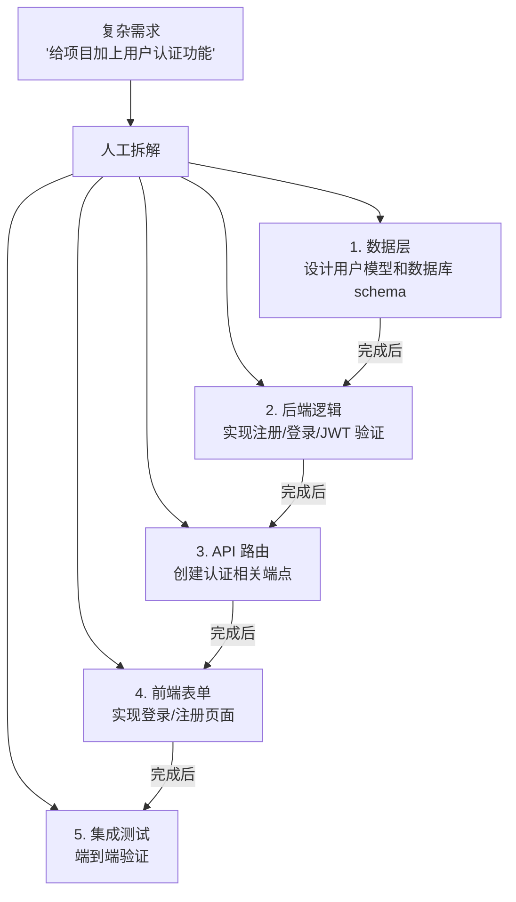

---
> 📚 **Part IV · 进阶专题** | [← 返回专题目录](../../README.md#part-iv-topics)
---

# 💬 Prompt 模板库

> 🎯 收集和整理在 Agent 编程中经过验证的高效 Prompt 模板，可直接复制使用。

## 目录
- [1. 概述](#1-概述)
- [2. 核心内容](#2-核心内容)
- [3. 实战建议](#3-实战建议)

---

## 1. 概述

好的 Prompt 是 Agent 高效工作的起点。这篇专题收集了在真实项目中反复验证过的 Prompt 模板，覆盖需求分析、代码生成、重构、调试、测试、代码审查等常见场景。每个模板都附带使用说明和效果预期。

---

## 2. 任务拆解方法论

复杂需求直接丢给 Agent 往往效果不好。人工预先拆解可以大幅提升成功率：



### 拆解的原则

| 原则 | 说明 |
|------|------|
| **单一关注点** | 每个子任务只涉及一个模块或关注点 |
| **可验证** | 每个子任务有明确的完成条件 |
| **30 分钟规则** | 每个子任务应在 ~30 分钟内完成 |
| **依赖清晰** | 明确哪些子任务有先后依赖 |
| **变更范围小** | 每个子任务修改的文件数尽量少（<5 个） |

---

## 3. 沟通模板

### 探索性任务

```
先阅读这个仓库的 README 和目录结构。
然后告诉我：
1. 项目的技术栈是什么
2. 核心模块有哪些
3. 要实现 [我的需求]，你建议从哪里入手
不要修改任何代码，先给出你的分析。
```

### 实现性任务

```
## 目标
[清晰的一句话目标]

## 约束
- 只修改 src/auth/ 目录下的文件
- 使用项目已有的 [xxx] 库
- 遵循项目现有的代码风格

## 步骤
1. 先给出实现方案，等我确认
2. 实现后运行 `npm test`
3. 如果测试失败，修复后再次运行
4. 全部通过后输出变更摘要
```

### 调试性任务

```
这个测试 `[test name]` 失败了，错误信息如下：
[粘贴关键错误信息，不要全部日志]

请先分析可能的原因（列出 2-3 个），
然后从最可能的原因开始排查。
每次修改后运行测试验证。
```

### 长任务分阶段模板

```
## 总目标
[一句话描述最终目标]

## 当前阶段
[只描述这个阶段要完成的事]

## 完成条件
- [ ] 条件 1
- [ ] 条件 2
- [ ] 运行 `xxx` 验证通过

## 约束
- 不要修改 [xxx] 目录
- 如果遇到 [xxx] 情况，先停下来告诉我

## 上阶段摘要
[如果是接续任务，附上上阶段的简要总结]
```

---

## 4. 实战建议

- **默认带上的三句话**：先分析再执行 / 修改后必须验证 / 如果不确定就停下来说明
- **高风险任务**：先让 Agent 做"顾问"（分析、方案），确认后再做"执行者"
- **长任务**：分阶段执行，每阶段用上方模板明确目标和约束

---

> 📖 **相关章节**：[🧩 上下文工程深入](./topic-context-engineering.md) · [🤝 人机协同详解](./topic-human-agent-collab.md)
