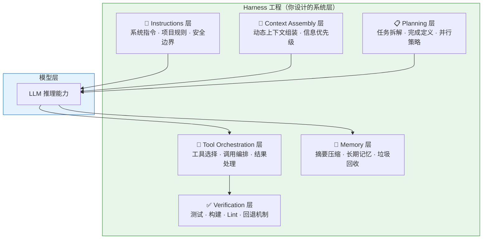

---
> 📚 **Part IV · 进阶专题** | [← 返回专题目录](../../README.md#part-iv-topics)
---

# 🔄 Prompt → Harness 演进案例

> 🎯 展示从"临时 Prompt"演进到"可复用 Harness"的真实案例和方法论。

## 目录
- [1. 概述](#1-概述)
- [2. 核心内容](#2-核心内容)
- [3. 实战建议](#3-实战建议)

---

## 1. 概述

很多人用 Agent 停留在"每次手敲 Prompt"的阶段。真正的效率飞跃发生在你把反复使用的 Prompt 沉淀为 Harness（规则、Skill、工作流模板）的那一刻。这篇专题通过真实案例，展示这个演进过程：从一句临时 Prompt，到一套可复用的 Agent 工作流。

---

## 2. Harness 工程：围绕模型的系统层设计

### 什么是 Harness 工程

Harness（马具）工程是 2025-2026 年兴起的新概念：**不是优化模型本身，而是设计围绕模型的系统层**——包括提示设计、工具编排、验证循环、状态追踪、故障检测和恢复。

### 真实案例：Harness 比换模型更有效

LangChain 团队的编码 Agent 优化实验：

| 变量 | 改动 | 效果 |
|------|------|------|
| 换更强模型 | 从 Sonnet 升级到 Opus | 排名提升 ~5 位 |
| 改 Harness | 自验证 + 上下文注入 + 故障检测 | 排名从 Top 30 → Top 5 |

**结论**：模型能力是基线，但 Harness 是放大器。在模型能力已经足够强的前提下（2026 年的旗舰模型都够强），Harness 的质量决定了 Agent 效果的上限。

### Harness 工程师的职责

这是一个正在形成的新角色——不是优化模型，而是：

- 设计上下文组装策略
- 编排工具调用流程
- 建立验证和恢复机制
- 引入人类在环（Human-in-the-Loop）检查点
- 追踪和分析 Agent 行为
- 控制成本和延迟

> 未来，软件工程师将越来越多地承担"Agent Workflow Designer + Harness Engineer"的角色。

---

## 3. 实战建议

### 从 Prompt 到 Harness 的演进路径

| 阶段 | 做法 | 效果 |
|------|------|------|
| **临时 Prompt** | 每次手敲指令 | 不稳定，依赖经验 |
| **固定规则** | 写进 CLAUDE.md | 一致性提升 |
| **Skill 封装** | 提炼为 SKILL.md | 可复用、按需加载 |
| **Harness 工程** | 系统化设计验证循环、工具编排、故障检测 | 接近生产级可靠性 |

### 关键原则

1. **Harness 比模型更重要**：选对模型是及格线，设计好 Harness 是优秀线
2. **渐进迭代**：不要试图一步到位，从 CLAUDE.md 开始，逐步演化
3. **验证驱动**：每一层设计都要有对应的验证机制

---

> 📖 **相关章节**：[📝 Skill 系统专题](./topic-skills.md) · [🧩 上下文工程深入](./topic-context-engineering.md) · [🤝 人机协同详解](./topic-human-agent-collab.md)
