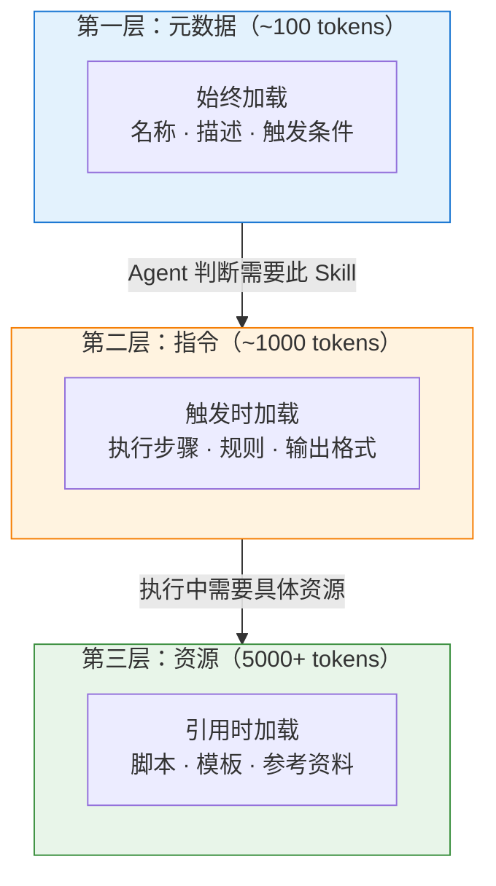
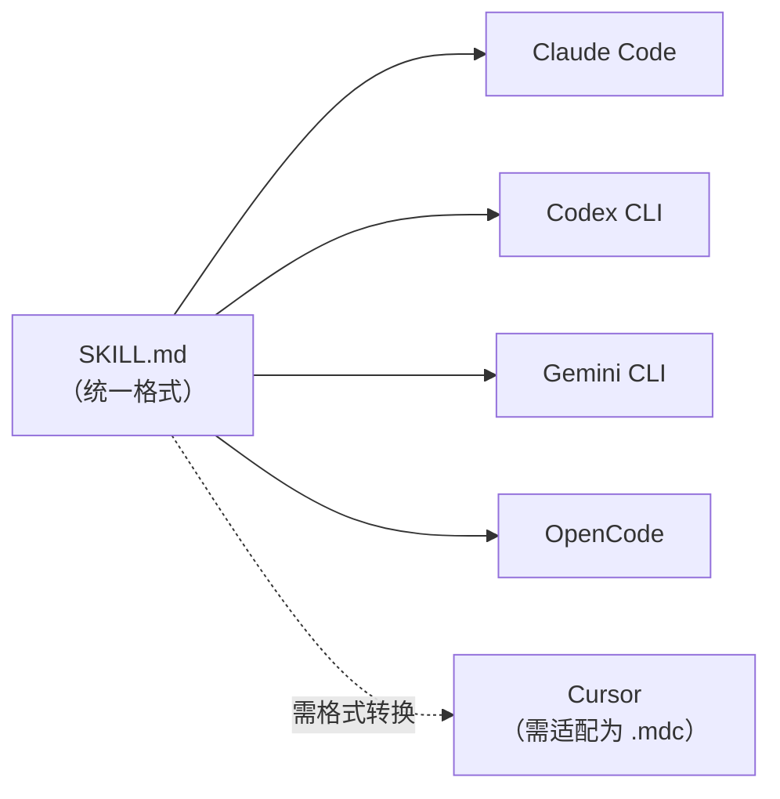
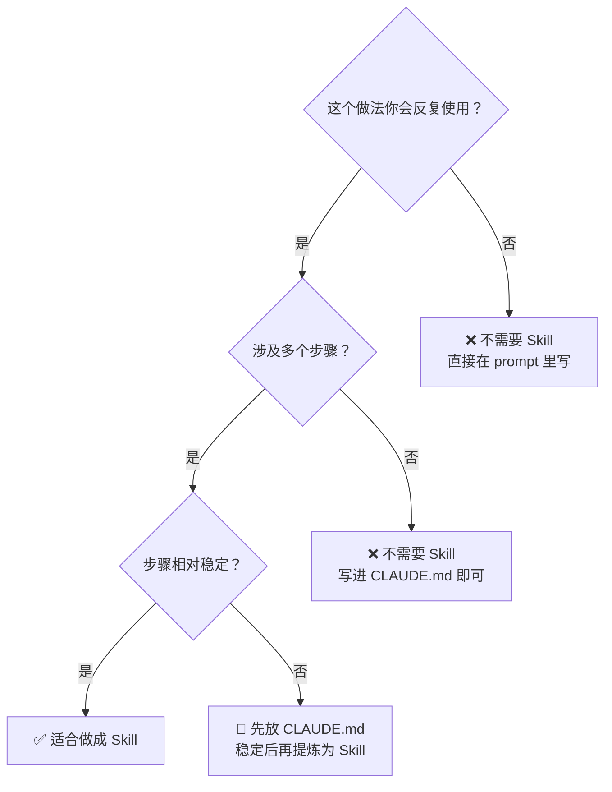

---
> 📚 **Part IV · 进阶专题** | [← 返回专题目录](../../README.md#part-iv-topics)
---

# 📝 Skill 系统

> 目标：从安装使用现成 Skill，到从零编写、调试和发布属于你自己的 Skill。掌握 Claude Code / Cursor / Codex 三大工具的 Skill 与规则系统。

---

## 为什么 Skill 是 Agent 时代的核心资产

在前几章中，我们已经了解了 Agent 的运作原理和实战技巧。但你可能已经注意到一个问题：**每次新对话都要重复解释「怎么做」。**

Skill 就是解决这个问题的：把你沉淀下来的做事方法，打包成 Agent 可以反复使用的模块。

回顾一下 [Chapter 2 附录](../ch02-concepts/reference-mcp-and-skills.md) 中的对比：

| 形态 | 核心价值 | 类比 |
|------|---------|------|
| **Skill** | 复用经验和流程 | 方法论手册 |
| **MCP** | 标准化外部连接 | USB-C 接口 |
| **插件** | 产品集成和体验 | 应用商店扩展 |
| **脚本** | 确定性自动化 | 命令行工具 |

> 💡 Skill 不给 Agent 新的「能力」，而是教它更好地使用已有能力。一个装了代码审查 Skill 的 Agent，不是多了一个 API，而是学会了按固定清单逐项检查。

---

## 4.1 Claude Code 的 Skill 系统（重点）

Claude Code 拥有目前最成熟的 Skill 生态。截至 2026 年 3 月，Skill 已成为 Claude Code 的核心扩展机制。

### 4.1.1 什么是 Claude Code Skill

一个 Skill 就是一个包含 `SKILL.md` 文件的目录。`SKILL.md` 使用 YAML frontmatter 定义元数据，正文是 Markdown 格式的指令。

```
my-skill/
├── SKILL.md          # 核心：触发条件、工作流程、规则
├── scripts/          # 确定性脚本（可选）
├── templates/        # 可复用模板（可选）
└── references/       # 补充资料（可选）
```

一个最简 `SKILL.md` 示例：

```markdown
---
name: code-review
description: 使用标准清单进行代码审查
---

## 当用户要求代码审查时

1. 先阅读变更的所有文件
2. 按以下清单逐项检查：
   - [ ] 是否有未处理的错误
   - [ ] 是否有安全漏洞（注入、XSS 等）
   - [ ] 是否有性能问题
   - [ ] 命名是否清晰
   - [ ] 是否有足够的测试覆盖
3. 输出审查报告，按严重性分级
```

### 4.1.2 Skill 的三层加载机制

Skill 相比传统 System Prompt 最大的优势是**渐进式披露**——不是一次性加载所有内容，而是按需逐层展开：



**对比传统做法**：把所有规则写进 System Prompt（可能 40,000 tokens），每次对话全量加载。Skill 通过渐进加载，可以将 token 消耗降低 50-80%。

### 4.1.3 Skill 的触发方式

Skill 有两种触发方式：

| 触发方式 | 说明 | 示例 |
|---------|------|------|
| **显式调用** | 用户通过斜杠命令调用 | `/code-review`、`/frontend-design` |
| **隐式触发** | Agent 根据任务自动匹配 | 当你说"帮我审查这段代码"，Agent 自动加载审查 Skill |

你可以通过 frontmatter 控制调用行为：

```yaml
---
name: my-skill
description: 做某事的标准流程
user-invocable: true           # 用户可以用 /my-skill 调用（默认 true）
disable-model-invocation: false # 是否禁止 Agent 自动触发（默认 false）
---
```

- `user-invocable: false`：只有 Agent 能调用，适合背景知识类 Skill
- `disable-model-invocation: true`：只有用户能调用，适合高风险操作

### 4.1.4 安装 Skill 的三种方式

### 4.1.4.1 常用 Skills 资源

| 资源 | 说明 |
|------|------|
| **[zht043/AgentSkills](https://github.com/zht043/AgentSkills)** | 笔者维护的 Skills 集合，偏实战工作流和中文使用场景 |
| **[obra/superpowers](https://github.com/obra/superpowers)** | 社区知名 Skills 框架，适合体验完整 brainstorm → execution → review 闭环 |
| **[anthropics/skills](https://github.com/anthropics/skills)** | Anthropic 官方 Skills 仓库，适合看标准结构和参考实现 |
| **[VoltAgent/awesome-agent-skills](https://github.com/VoltAgent/awesome-agent-skills)** | 持续维护的 Skills 资源导航，适合做生态摸底 |

> 💡 如果你是第一次接触 Skill，不要一上来装很多。先选 1-2 个高频 Skill，用顺手之后再扩展。

### 4.1.4.2 安装方式概览

#### 方式一：Plugin Marketplace（推荐）

```bash
# 注册一个 Marketplace 源
/plugin marketplace add obra/superpowers

# 安装 Skill
/plugin install superpowers

# 查看已安装的 Skills
/skills
```

#### 方式二：OpenSkills CLI（跨平台通用安装器）

[OpenSkills](https://github.com/numman-ali/openskills) 是一个通用的 Skill 安装工具，支持 Claude Code、Cursor、Codex 等多种 Agent。

```bash
# 安装 OpenSkills
npm i -g openskills

# 安装 Anthropic 官方 Skills
npx openskills install anthropics/skills

# 同步到本地
npx openskills sync

# 全局安装（安装到 ~/.claude/skills）
npx openskills install anthropics/skills --global
```

#### 方式三：手动安装

```bash
# 克隆到项目级 Skills 目录
git clone https://github.com/obra/superpowers .claude/skills/superpowers

# 或克隆到全局 Skills 目录
git clone https://github.com/obra/superpowers ~/.claude/skills/superpowers
```

> ⚠️ **安全提醒**：只从受信任的源安装 Skill。安装前请审查 `SKILL.md` 内容和脚本文件，特别注意代码依赖和捆绑资源。

### 4.1.5 Skill 的存放位置

```
~/.claude/skills/           # 全局 Skills（所有项目共享）
  └── superpowers/
      └── SKILL.md

your-project/
  └── .claude/
      ├── skills/           # 项目级 Skills
      │   └── my-skill/
      │       └── SKILL.md
      └── commands/         # 旧版命令（仍然兼容）
          └── deploy.md
```

项目级 Skill 和旧版 `.claude/commands/` 目录完全兼容。一个放在 `.claude/commands/deploy.md` 的文件和 `.claude/skills/deploy/SKILL.md` 效果相同，都会创建 `/deploy` 命令。

### 4.1.6 内置 Skill

Claude Code 自带了一些开箱即用的 bundled skills：

| Skill | 功能 | 调用方式 |
|-------|------|---------|
| `/simplify` | 审查最近修改的文件，检查代码复用性、质量和效率，然后修复问题。会并行启动三个审查子 Agent | `/simplify` |
| `/batch` | 编排大规模跨代码库的并行修改 | `/batch <instruction>` |

Bundled skills 与普通命令不同——它们是**基于 prompt 的**：给 Claude 一个详细的 playbook，让它用自己的工具来编排工作。这意味着 bundled skills 可以启动并行子 Agent、读取文件、适应你的代码库。

### 4.1.7 Skills 2.0：从指令到可编程 Agent

2026 年初，Claude Code 的 Skill 系统经历了重大升级：

| 能力 | 1.0 | 2.0 |
|------|-----|-----|
| 基础指令 | ✅ | ✅ |
| 子 Agent 执行 | ❌ | ✅ 可启动隔离的子 Agent |
| 动态上下文注入 | ❌ | ✅ Shell 命令注入实时数据 |
| 生命周期钩子 | ❌ | ✅ Hook 进 Agent 事件 |
| 工具限制 | ❌ | ✅ 限制 Skill 可用的工具 |
| 模型覆盖 | ❌ | ✅ 为特定 Skill 指定不同模型 |

### 4.1.8 CLAUDE.md 与 Skill 的关系

很多新手会混淆 `CLAUDE.md` 和 Skill，它们的定位完全不同：

| | CLAUDE.md | Skill |
|---|-----------|-------|
| **作用** | 项目级长期约束和偏好 | 可复用的工作流模板 |
| **加载方式** | 每次会话自动全量加载 | 按需触发，渐进加载 |
| **内容** | 项目结构、常用命令、禁改区域、风格偏好 | 具体任务的执行步骤和模板 |
| **类比** | 公司员工手册 | 某个岗位的 SOP |

**最佳实践**：`CLAUDE.md` 放「关于这个项目你需要永远知道的事」，Skill 放「遇到这类任务你应该怎么做」。

---

## 4.2 Cursor 的规则系统

Cursor 没有使用 Skill 这个概念，但它的 **Rules 系统** 本质上解决类似问题——把开发规范和工作流沉淀为 Agent 可复用的指令。

### 4.2.1 新旧两套系统

| 系统 | 文件格式 | 状态 |
|------|---------|------|
| 旧版 | `.cursorrules`（项目根目录单文件） | 仍兼容，但将被废弃 |
| 新版 | `.cursor/rules/*.mdc` | **推荐**，支持精细化控制 |

> 建议新项目直接使用 `.cursor/rules/` 目录结构。

### 4.2.2 `.cursor/rules/` 目录结构

```
.cursor/rules/
├── base.mdc           # 始终应用的基础规则
├── frontend.mdc       # 仅编辑前端文件时应用
├── api.mdc            # 仅编辑 API 文件时应用
├── testing.mdc        # 仅编辑测试文件时应用
└── personal.mdc       # 个人偏好（建议 gitignore）
```

### 4.2.3 MDC 文件格式

每个 `.mdc` 文件包含 YAML frontmatter 和 Markdown 正文：

```markdown
---
description: React 组件开发规范
globs: src/components/**/*.tsx
alwaysApply: false
---

## 组件开发规则

- 使用函数式组件，不使用 class 组件
- Props 必须定义 TypeScript 接口
- 组件文件名使用 PascalCase
- 每个组件必须有对应的测试文件
```

关键 frontmatter 字段：

| 字段 | 说明 |
|------|------|
| `globs` | 文件匹配模式，只在编辑匹配文件时应用规则 |
| `alwaysApply` | 是否始终加载（不受 globs 限制） |
| `description` | 规则描述 |

### 4.2.4 规则优先级

```
Team Rules（最高，Team/Enterprise 计划）
  ↓
Project Rules（.cursor/rules/*.mdc）
  ↓
User Rules（Cursor Settings > Rules）
  ↓
Legacy Rules（.cursorrules 文件，最低）
```

### 4.2.5 Cursor Rules vs Claude Code Skills

| 维度 | Cursor Rules | Claude Code Skills |
|------|-------------|-------------------|
| **粒度** | 按文件模式匹配 | 按任务类型触发 |
| **加载** | 始终或按 glob 自动加载 | 渐进式按需加载 |
| **附带资源** | 仅 Markdown 规则 | 可含脚本、模板、参考资料 |
| **跨项目复用** | 手动复制 | Marketplace / CLI 安装 |
| **生态** | [cursor.directory](https://cursor.directory) 社区规则 | Anthropic Marketplace + 社区 |

**实际建议**：如果你同时使用 Cursor 和 Claude Code——

- 把**通用代码规范**写成 Cursor Rules（它更适合按文件类型精细控制）
- 把**工作流方法论**写成 Claude Code Skills（它更适合任务级复用）

### 4.2.6 快速上手

```bash
# 创建规则目录
mkdir -p .cursor/rules

# 创建一条基础规则
cat > .cursor/rules/base.mdc << 'EOF'
---
description: 项目基础规范
alwaysApply: true
---

## 项目信息
- 技术栈：React + TypeScript + Tailwind
- 包管理器：pnpm
- 测试框架：Vitest

## 编码规范
- 使用函数式编程风格
- 优先使用 const 声明
- 错误处理使用 Result 类型而非 try-catch
EOF
```

也可以在 Cursor 中使用快捷键 `Cmd + Shift + P` → 搜索 "New Cursor Rule" 来创建。

---

## 4.3 Codex CLI 的 Skill 与 AGENTS.md 系统

OpenAI 的 Codex CLI 在 2025 年底采用了与 Claude Code 相同的 Skill 标准，同时有自己的 `AGENTS.md` 指令系统。

### 4.3.1 AGENTS.md：Codex 的项目级指令

`AGENTS.md` 是 Codex 的核心指令文件，类似 Claude Code 的 `CLAUDE.md`。

```
~/.codex/
├── AGENTS.override.md    # 全局覆盖（最高优先级）
└── AGENTS.md             # 全局默认

your-project/
├── AGENTS.override.md    # 项目级覆盖
├── AGENTS.md             # 项目级默认
└── src/
    └── api/
        └── AGENTS.md     # 目录级默认
```

**发现顺序**：Codex 从全局到当前目录，逐级加载 `AGENTS.override.md` 和 `AGENTS.md`，越深层的文件优先级越高。

### 4.3.2 Codex 的 Skill 系统

Codex 的 Skill 结构与 Claude Code 高度一致：

```
my-skill/
├── SKILL.md        # 核心文件
├── scripts/        # 可选脚本
├── references/     # 可选参考
└── assets/         # 可选资源
```

触发方式也类似：

- **显式调用**：在 CLI/IDE 中运行 `/skills` 或用 `$` 前缀提及 Skill
- **隐式触发**：Codex 根据任务描述自动匹配

> 💡 由于 Codex 和 Claude Code 都采用了 Agent Skills 开放标准，你编写的 `SKILL.md` 可以**跨工具复用**——同一个 Skill 目录在两个工具中都能工作。

### 4.3.3 Codex 的三级审批控制

Codex 的一个独特设计是三级审批模式：

| 模式 | 权限 | 适用场景 |
|------|------|---------|
| **Suggest** | 只建议，不执行 | 学习、审查 |
| **Auto Edit** | 可编辑文件，命令需审批 | 日常开发 |
| **Full Auto** | 完全自主执行 | 信任度高的重复任务 |

这与 Skill 结合使用时特别有用：你可以为低风险 Skill 开放 Auto Edit，为高风险 Skill 保持 Suggest 模式。

---

## 4.4 从零编写一个 Skill

理解了各工具的 Skill 系统后，让我们动手写一个。

### 4.4.1 一个好 Skill 要回答四个问题

| 问题 | 说明 | 示例 |
|------|------|------|
| **什么时候触发？** | 触发条件 | "当用户要求做代码审查时" |
| **帮 Agent 做什么？** | 核心价值 | "按照标准清单逐项检查代码质量" |
| **需要什么输入？** | 前置条件 | "需要知道要审查的文件范围" |
| **交付什么？** | 输出定义 | "输出审查报告，包含问题列表和建议" |

### 4.4.2 实战：写一个「PR 描述生成器」Skill

这是一个非常实用的日常 Skill，帮助你自动生成规范的 PR 描述。

**第一步：创建目录结构**

```bash
mkdir -p .claude/skills/pr-description
```

**第二步：编写 SKILL.md**

```markdown
---
name: pr-description
description: 基于 Git diff 生成规范的 PR 描述
---

## 触发条件

当用户要求生成 PR 描述，或提到"写 PR"、"提 PR"时使用此 Skill。

## 执行步骤

1. 运行 `git diff main...HEAD --stat` 了解变更范围
2. 运行 `git log main..HEAD --oneline` 了解提交历史
3. 阅读变更的关键文件，理解改动目的
4. 按照下方模板生成 PR 描述

## 输出模板

```markdown
## Summary
<!-- 1-3 句话说明这个 PR 做了什么以及为什么 -->

## Changes
<!-- 按模块列出主要改动 -->

## Test Plan
<!-- 如何验证这些改动 -->

## Screenshots
<!-- 如果有 UI 变更，附截图 -->
```

## 注意事项

- 不要列出每个文件的改动，而是按功能模块组织
- Summary 要写「为什么」而不只是「改了什么」
- 如果有破坏性变更，必须在最前面标注 ⚠️ Breaking Change
```

**第三步：验证**

在 Claude Code 中输入 `/pr-description` 或说"帮我生成 PR 描述"，观察 Skill 是否被正确触发。

### 4.4.3 编写 Skill 的原则

| 原则 | 说明 | ❌ 反例 |
|------|------|---------|
| **聚焦单一场景** | 一个 Skill 只解决一类问题 | 一个 Skill 试图覆盖"代码审查 + 测试 + 部署" |
| **步骤明确** | 给 Agent 清晰的执行步骤 | "请认真审查代码" |
| **控制上下文** | Skill 本身不应引入大量噪音 | SKILL.md 写了 2000 行 |
| **可测试** | 能明确判断 Skill 是否被正确执行 | 没有明确的输出格式要求 |
| **迭代优化** | 根据实际使用效果持续调整 | 写完就再也不改 |

### 4.4.4 减少上下文噪音的技巧

Skill 的核心价值之一就是节省上下文。如果一个 Skill 自己就带来大量噪音，那它适得其反：

- 只写对该类任务**稳定成立**的规则
- 把长篇资料放进 `references/`，由 Agent 按需引用
- 把可执行逻辑交给 `scripts/`
- 把格式要求交给 `templates/`
- 用简短的触发描述（description），不要把整个工作流塞进描述字段

---

### 4.4.5 Google 总结的 5 种 Skill 设计模式

> 来源：Google Cloud ADK 团队于 2026 年 3 月发布的《5 Agent Skill design patterns every ADK developer should know》，研究了 Anthropic、Vercel、Google 内部数百个 Skill 后提炼而成。

格式早已标准化，真正拉开差距的是里面的**逻辑结构**。五种模式覆盖了绝大多数 Skill 场景，可以单独使用，也可以组合。

| 模式 | 英文名 | 一句话定义 |
|------|--------|----------|
| **工具包装器** | Tool Wrapper | 按需为 Agent 加载特定库的专家知识 |
| **生成器** | Generator | 模板 + 风格指南驱动结构化输出 |
| **审查器** | Reviewer | 基于清单的自动化审计与分级反馈 |
| **反向提问** | Inversion | 强制门控——先采访用户，再行动 |
| **流水线** | Pipeline | 有硬性检查点的严格顺序工作流 |

#### 模式一：工具包装器（Tool Wrapper）

**核心理念**：知识按需加载，不浪费 token。

把框架规范放进 `references/conventions.md`，`SKILL.md` 只写"遇到 FastAPI 时加载并遵守"。Agent 只在检测到相关关键词时才加载，上下文保持精简。

```
skills/api-expert/
├── SKILL.md         ← description 写清触发词，如 "FastAPI"、"REST"
└── references/
    └── conventions.md  ← 完整的框架规范
```

**适合**：内部编码规范、私有库使用指南、特定框架最佳实践。

#### 模式二：生成器（Generator）

**核心理念**：模板决定结构，风格指南决定质量。

`assets/` 放输出模板，`references/` 放风格指南，Skill 充当填空式协调者。强制写明"模板每个章节都必须出现"。

```
skills/report-generator/
├── SKILL.md
├── assets/
│   └── report-template.md  ← 结构骨架
└── references/
    └── style-guide.md       ← 修辞规范
```

**适合**：API 文档生成、周报、代码脚手架、标准化报告。

#### 模式三：审查器（Reviewer）

**核心理念**：把"查什么"和"怎么查"分开——换一份 checklist 就变成完全不同的审查工具。

Skill 定义流程（读代码 → 对照 checklist → 按 error/warning/info 分级 → 给分），规则放 checklist 文件里。

```
skills/code-reviewer/
├── SKILL.md
└── references/
    └── review-checklist.md  ← 可热替换的审查规则
```

**适合**：代码审查、安全合规扫描、数据质量验证。

#### 模式四：反向提问（Inversion）

**核心理念**：**最被低估的模式**。AI 先当面试官问清需求，再行动。

关键指令：**"所有阶段完成前，禁止开始构建。"**

分两轮询问：
- Phase 1（业务）：问题是什么？目标用户？预期规模？
- Phase 2（约束）：部署环境？技术栈？不可妥协的要求？
- Phase 3（综合）：基于答案填充模板，并与用户确认。

**适合**：项目规划、需求分析、复杂配置、系统架构设计。

#### 模式五：流水线（Pipeline）

**核心理念**：强制分步 + 检查点，像工厂质检——每个工位都查，不是成品出来才查。

写死"用户确认前禁止进入下一步"：

```
Step 1 解析 → Gate 1 用户确认 → Step 2 生成 → Gate 2 用户确认 → Step 3 组装 → Step 4 质检
```

**适合**：文档生成、部署流程、多阶段数据处理、需人工介入的构建任务。

#### 如何选择模式

```
需要封装知识？      → Tool Wrapper
需要统一输出格式？  → Generator
需要质量把关？      → Reviewer
需求模糊，先澄清？  → Inversion
流程复杂，多步骤？  → Pipeline
```

五种模式可以组合：例如 Inversion（收集需求）→ Generator（生成初稿）→ Reviewer（质量审查）→ Pipeline（串联全流程）。

#### 关键工程原则

> **别把所有东西塞进一个 prompt，把 Skill 当系统来设计。**

- **渐进式披露**：只在运行时动态加载必需的 `references/` 和 `assets/`
- **结构化优于长 Prompt**：通过文件系统结构（`SKILL.md` + 子目录）承载逻辑
- **描述是灵魂**：Skill 最重要的部分是 `description`——它决定 Agent 何时调用你的 Skill

---

## 4.5 跨工具的 Skill 策略

### 4.5.1 Agent Skills 开放标准

2025 年底，Anthropic 发布了 Agent Skills 开放标准，OpenAI 随后为 Codex CLI 采用了相同格式。这意味着：



对于同时使用多个工具的团队，建议：

1. **核心 Skill 用 SKILL.md 标准编写**——覆盖 Claude Code、Codex、Gemini CLI
2. **Cursor 规则单独维护**——利用其 glob 匹配的优势做文件级规范
3. **共享一个 `rules/` 或 `skills/` 目录**——在团队 Git 仓库中统一管理

### 4.5.2 什么时候用 Skill，什么时候不需要



### 4.5.3 Skill vs MCP vs 脚本：怎么选

这是新手最容易混淆的问题。简单判断：

| 你要复用的是… | 用 |
|---|---|
| **做事方式**（流程、检查清单、模板） | Skill |
| **外部能力**（GitHub、数据库、浏览器） | MCP |
| **确定性动作**（格式化、测试、构建） | 脚本 |

三者经常组合使用。一个完整的工作流可能是：

1. **Skill** 定义「代码审查应该怎么做」
2. **脚本** 运行 `eslint + vitest`
3. **MCP** 连接 GitHub 创建 Review Comment

---

## 4.6 团队 Skill 沉淀

### 4.6.1 从个人经验到团队资产

一个健康的 Skill 演化路径：


### 4.6.2 团队 Skills 仓库的组织方式

推荐的目录结构：

```
team-skills/
├── README.md
├── code-review/
│   ├── SKILL.md
│   └── templates/
│       └── review-checklist.md
├── pr-description/
│   └── SKILL.md
├── incident-response/
│   ├── SKILL.md
│   └── scripts/
│       └── collect-logs.sh
└── onboarding/
    ├── SKILL.md
    └── references/
        └── architecture-overview.md
```

### 4.6.3 Skill 的维护与清理

Skill 和代码一样需要维护：

- **定期审查**：过时的 Skill 比没有 Skill 更糟——它会误导 Agent
- **版本控制**：Skill 应该和代码一起在 Git 中管理
- **使用统计**：关注哪些 Skill 经常被触发，哪些从来没用过
- **错误经验过滤**：不要把偶然性结论固化成 Skill 规则

> 📌 **核心原则：Skill 的数量不是越多越好。** 过多的 Skill 会让 Agent 在选择时产生困惑，让上下文变得臃肿。保持 Skill 集精简、聚焦、高质量。

---

## 本章小结

| 工具 | 指令系统 | Skill 标准 | 规则文件 | 安装方式 |
|------|---------|-----------|---------|---------|
| **Claude Code** | `CLAUDE.md` | `SKILL.md`（原生） | — | Marketplace / CLI / 手动 |
| **Cursor** | User Rules | — | `.cursor/rules/*.mdc` | 手动 / cursor.directory |
| **Codex CLI** | `AGENTS.md` | `SKILL.md`（兼容） | — | CLI / 手动 |

关键 takeaway：

1. **Skill 是「教方法」，不是「给能力」** — 它教 Agent 按固定流程做事
2. **渐进加载是核心优势** — 相比全量 System Prompt，Skill 按需加载大幅节省 token
3. **跨工具标准正在形成** — `SKILL.md` 正成为行业通用格式
4. **从个人沉淀到团队资产** — Skill 的最大价值在长期复用和持续迭代

---

返回总览：[返回仓库 README](../../README.md)
