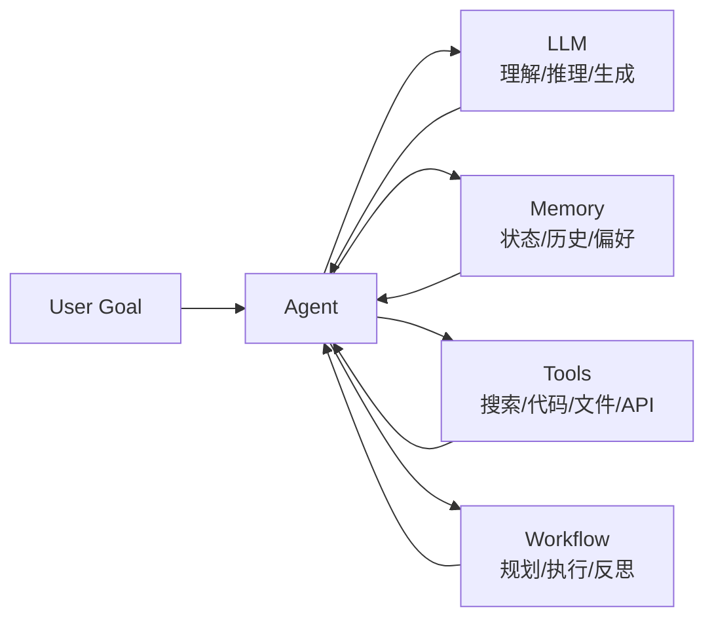
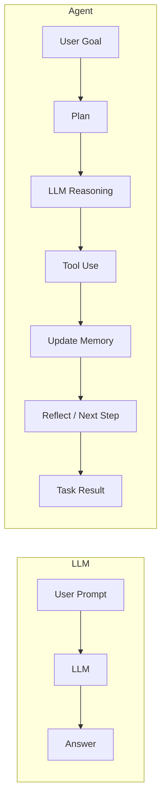
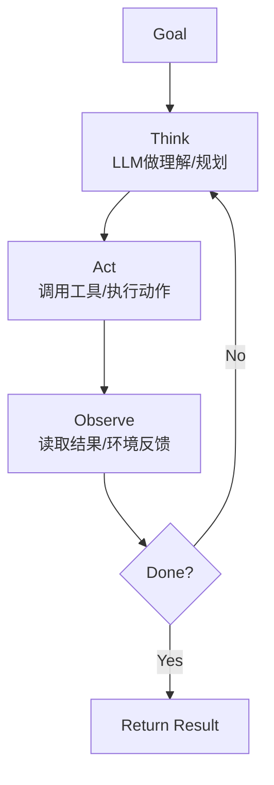
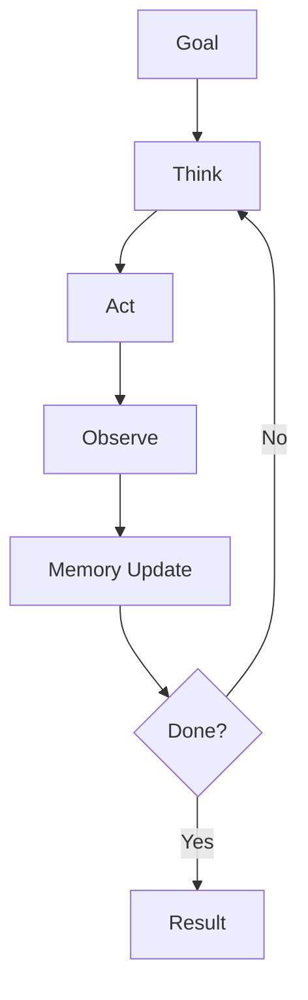
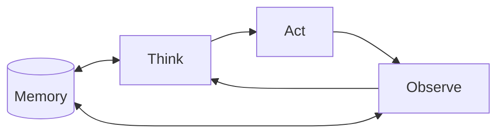
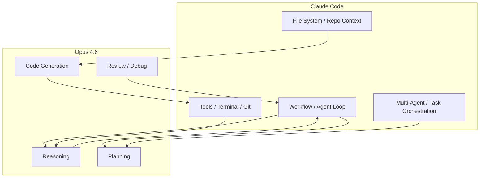
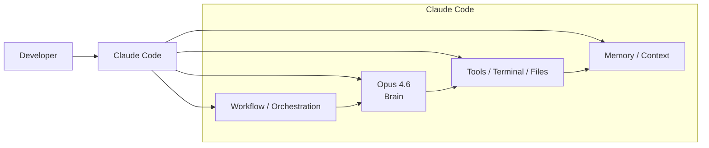
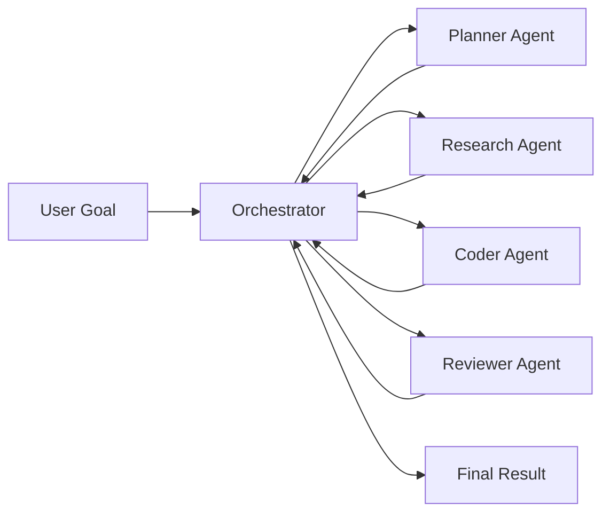
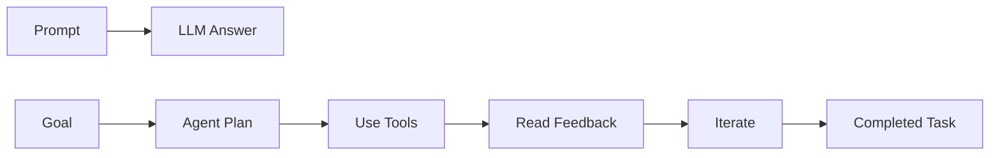
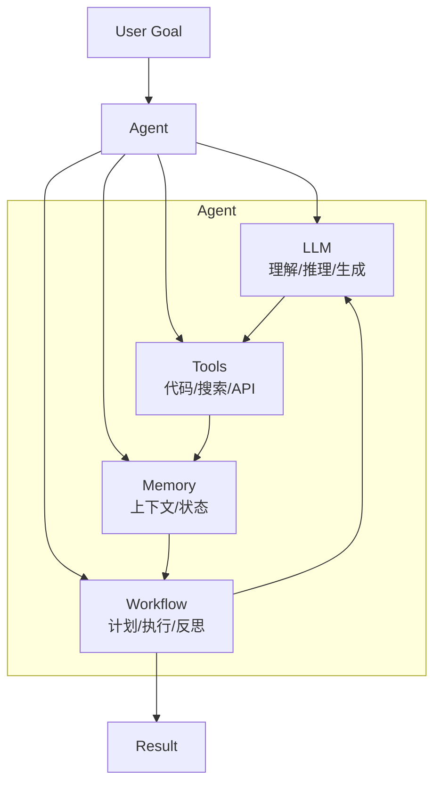

# LLM与Agent协作关系

## 🧑‍💻 User

Agent与LLM有什么区别，它们是如何协作的，Claude Code和Opus4.6是如何耦合的

---
## 🤖 Assistant

可以把它们理解成三层关系：

- **LLM**：大脑/语言与推理引擎  
- **Agent**：带有目标、流程、记忆和工具调用能力的执行系统  
- **Claude Code + Opus 4.6**：一个具体产品形态（Claude Code）+ 其背后的核心模型能力（Opus 4.6）

---

## 1. Agent 与 LLM 有什么区别？

### LLM 是什么
LLM（Large Language Model，大语言模型）本质上是一个**基于海量文本训练出来的概率模型**，擅长：

- 理解自然语言
- 生成文本、代码、总结、翻译
- 做推理、问答、分析

但它通常是**“你问一句，我答一句”**的范式。它本身并不天然等于“会自主完成任务的系统”。

### Agent 是什么
Agent（智能体）通常是一个**围绕 LLM 构建出来的任务执行系统**。它不仅会“说”，还会：

- 接收一个目标
- 拆解任务步骤
- 调用外部工具/API
- 读取环境反馈
- 根据结果继续调整策略
- 持续循环直到完成目标

所以，**LLM 更像能力核心，Agent 更像把能力组织起来的工作流/系统**。[2][3]

### 一句话区别
- **LLM 解决“怎么想、怎么说”**
- **Agent 解决“怎么做、怎么完成任务”**[2][3]

---

## 2. 它们的核心差异可以怎么理解？

| 维度 | LLM | Agent |
|---|---|---|
| 主要角色 | 语言理解与生成引擎 | 任务执行者/协调者 |
| 工作方式 | 单轮或多轮对话生成 | Think-Act-Observe 循环 |
| 是否会主动行动 | 通常不会 | 会，根据目标采取行动 |
| 是否调用工具 | 不一定 | 通常会 |
| 是否有状态/记忆 | 上下文内有限记忆 | 往往带短期/长期记忆 |
| 是否能完成复杂流程 | 有限 | 更适合多步骤任务 |

很多论文和工程系统都把 Agent 描述为一个 **Think–Act–Observe** 的闭环：先思考，再调用工具或执行动作，再观察结果，再继续思考。[3]

---

## 3. Agent 和 LLM 是如何协作的？

最常见的方式是：

### 模式 A：LLM 作为 Agent 的“大脑”
Agent 的核心推理通常由 LLM 完成，例如：

1. 用户提出目标  
2. LLM 负责理解意图并制定计划  
3. Agent 框架根据计划调用搜索、代码执行、数据库、文件系统等工具  
4. 工具返回结果  
5. LLM 再根据结果继续判断下一步  
6. 循环直到任务完成

也就是说：

- **LLM 负责认知、推理、表达**
- **Agent 负责流程、状态、执行、编排**

这也是为什么很多人会说：**“大多数 Agent，本质上是 LLM + memory + tools + workflow”**。[2][3]

### 模式 B：多 Agent 协作，LLM 做各个子 Agent 的智能核心
复杂系统里，往往不是一个 Agent，而是多个 Agent：

- Planner：负责拆任务
- Researcher：负责检索资料
- Coder：负责写代码
- Reviewer：负责审查与纠错

每个 Agent 背后仍然可能是同一个或不同的 LLM 模型。[1][3]

---

## 4. 为什么说“不是所有 LLM 应用都是 Agent”？

因为很多应用只是：

- prompt + model + output

例如：

- 总结一篇文章
- 翻译一段文本
- 回答一个问题

这更像是 **LLM 应用**，而不是严格意义上的 Agent。

只有当系统具备下列特征时，才更像 Agent：

- 面向目标而非单次问答
- 能拆解步骤
- 能调用工具
- 能持续迭代
- 能根据反馈修正行为
- 有状态与记忆

---

## 5. Claude Code 和 Opus 4.6 是如何耦合的？

### 先说结论
**Claude Code 是产品/Agent 化编程环境，Opus 4.6 是其背后的核心模型之一。**  
两者的关系不是“两个平级软件拼接”，而更像：

- **Claude Code = 外壳 + 工作流 + 工具系统 + 交互环境**
- **Opus 4.6 = 提供推理、规划、代码理解、代码生成、调试能力的底层模型**

Anthropic 官方明确提到，Opus 4.6 在编码、代码审查、调试、长时 agentic 任务方面显著增强，并且这些能力会在 Claude Code 中得到发挥。[1]

### 官方信息显示的“耦合点”
Anthropic 在 Opus 4.6 发布说明里明确说：

- Opus 4.6 更擅长 **agentic coding**
- 更能做 **planning、tool calling**
- 能在更大的代码库里更稳定工作
- 在 Claude Code 中新增了 **agent teams**，可以并行启动多个 agent 协作完成任务。[1]

这意味着两者的耦合不是简单“换个模型”而已，而是产品能力与模型能力互相适配：

#### 1) 模型能力支撑 Claude Code 的 Agent 化编程
Opus 4.6 擅长：

- 更长时程任务
- 更强规划
- 更稳定调用工具
- 更大上下文代码库理解
- 更强 code review/debug

这些正是 Claude Code 作为编码 Agent 所需要的底层能力。[1]

#### 2) Claude Code 把模型能力“产品化”
Claude Code 提供的不是裸模型，而是：

- 文件/代码库上下文
- 终端/工具接口
- 工作流控制
- 多 agent 编排（agent teams）
- 面向开发任务的交互界面

也就是说，**Claude Code 把 Opus 4.6 的推理能力，包装成可执行的软件工程流程**。[1]

#### 3) 长任务能力通过平台特性进一步增强
Anthropic 还为 Opus 4.6 配套了：

- **context compaction**：上下文接近极限时自动摘要压缩，支持更长任务  
- **adaptive thinking**：根据任务难度自动决定思考深度  
- **effort controls**：开发者可调智能/速度/成本  
- **1M token context window（beta）**：超长上下文处理能力[1]

这些能力让 Claude Code 里的长流程编码 Agent 更可行，因为真实软件工程常见问题就是：

- 代码库太大
- 任务太长
- 上下文会爆
- 简单任务不该过度推理，复杂任务又需要深推理

Opus 4.6 + 这些平台机制，正是在解决这些问题。[1]

---

## 6. Claude Code 与 Opus 4.6 的耦合，技术上可怎么理解？

可以抽象成下面这一层次：

### 第 1 层：模型层
Opus 4.6 提供：

- 代码理解
- 推理规划
- 生成与修改代码
- 发现 bug
- 审查代码
- 工具调用决策

### 第 2 层：Agent 编排层
Claude Code 提供：

- 任务拆解
- 会话状态管理
- 文件系统/终端/代码库访问
- 子任务并发
- 结果整合
- 人机接管机制

### 第 3 层：产品交互层
开发者看到的是：

- 命令行/IDE 体验
- 多 agent 协作
- 长时间运行任务
- 面向真实工程场景的工作流

所以它们的“耦合”不是硬编码绑定，而是**产品层围绕模型层做深度适配**。  
Claude Code 的上限，很大程度取决于底层模型是否足够：

- 会规划
- 会坚持长任务
- 会调用工具
- 会在大上下文里少漂移

而 Anthropic 对 Opus 4.6 的官方描述正好强调了这些能力。[1]

---

## 7. 一个直观比喻

可以这样记：

- **LLM** 像一个知识丰富、推理很强的专家大脑
- **Agent** 像一个带手脚、带记事本、会用工具的助理
- **Claude Code** 像为软件开发定制的“智能工程工作台”
- **Opus 4.6** 则是这个工作台里最强的“核心大脑”之一[1][2]

---

## 8. 最后做个简短总结

### Agent vs LLM
- **LLM** 是语言与推理模型，强在“理解和生成”
- **Agent** 是围绕目标执行任务的系统，强在“规划、行动、调用工具、持续完成任务”[2][3]

### 它们如何协作
- 最常见方式是：**LLM 做大脑，Agent 做执行框架**
- Agent 用 LLM 来理解、规划、反思；用工具和工作流来落地执行。[2][3]

### Claude Code vs Opus 4.6
- **Claude Code 是产品/Agent 化编码环境**
- **Opus 4.6 是其关键底层模型能力来源**
- 二者的耦合点在于：Opus 4.6 提供强规划、强编码、强调试、长时任务和工具调用能力，而 Claude Code 把这些能力组织成真实的软件开发工作流。[1]

如果你愿意，我可以下一步继续给你画一张：
**“LLM → Agent → Claude Code/Opus 4.6”的结构图**，或者结合实际编码场景举一个完整例子。
[1] [From single-agent to multi-agent: a comprehensive review of LLM-based legal agents](https://www.oaepublish.com/articles/aiagent.2025.06)

[2] [AI Agents vs. LLMs: Why we need both in today’s world | Tars Blog](https://hellotars.com/blog/ai-agents-vs-llms)

[3] [Towards Efficient Agents: A Co-Design of Inference Architecture and System](https://arxiv.org/html/2512.18337v1)

[4] [If what most call AI Agents are just advanced LLM workflows?](https://www.linkedin.com/posts/rakeshgohel01_if-what-most-call-ai-agents-are-just-advanced-activity-7361376468133711872-g_-D)

[1] [Claude Opus 4.6](https://www.anthropic.com/news/claude-opus-4-6)

[2] [Claude 4.6の新機能](https://platform.claude.com/docs/ja/about-claude/models/whats-new-claude-4-6)

[3] [https://x.com/claudeai/status/1996310793017594124](https://x.com/claudeai/status/1996310793017594124)

[4] [Reddit - 全网主阵地](https://www.reddit.com/r/ClaudeCode/comments/1qxe2tt/three_features_in_opus_46_that_change_how_claude/)

[5] [Claude Opus 4.6完全ガイド【2026年最新】｜Agent Team・100万トークン・Adaptive Thinkingを徹底解説](https://www.aquallc.jp/claude-opus-4-6-complete-guide/)
---
## 🧑‍💻 User

Agent = LLM + memory + tools + workflow 结合上文的内容，设计一些diagram来illustrate这些概念，diagram突出重点即可，不需要太多细节

---
## 🤖 Assistant

下面给你几张**突出重点、少细节**的 diagram。  
我用 **Mermaid** 画，适合直接放到 Markdown、Notion、文档里。

---

# 1. 最核心定义图：Agent = LLM + Memory + Tools + Workflow

**想表达的重点：**
- Agent 不是单一模型
- LLM 只是核心之一
- 真正能“完成任务”的关键在于：**记忆、工具、工作流**

---

# 2. LLM vs Agent 对比图

**重点：**
- LLM 更像 **输入 → 输出**
- Agent 更像 **目标 → 计划 → 行动 → 反馈 → 完成**

---

# 3. Agent 的闭环：Think → Act → Observe

**重点：**
- Agent 的本质是循环
- 不是“一次生成”，而是“持续迭代直到完成”

---

# 4. 把 Memory 放进循环里

你也可以用这个版本，更强调 memory 是“贯穿整个任务”的：

**重点：**
- Memory 不只是聊天记录
- 它帮助 Agent 记住：
  - 当前任务进度
  - 已经试过的方法
  - 用户偏好
  - 外部结果摘要

---

# 5. Claude Code 与 Opus 4.6 的耦合图

**重点：**
- Claude Code 是“产品壳 + 工具环境 + workflow”
- Opus 4.6 是“推理与编码核心”
- 二者不是平级关系，而是 **平台使用模型能力来完成 agentic coding**

---

# 6. 更抽象一点：Claude Code = Agent System，Opus 4.6 = Brain

**重点：**
- 如果要一句话概括这张图：  
  **Claude Code 是 Agent 容器，Opus 4.6 是其中的大脑。**

---

# 7. 多 Agent 协作图

**重点：**
- 复杂任务不是一个 Agent 干到底
- 往往是多个角色化 Agent 协作
- 每个 Agent 背后都可能是同一个 LLM（如 Opus 4.6）

---

# 8. 从“问答”到“执行”的升级图

**重点：**
- 这张图适合拿来讲“为什么 Agent 不等于普通聊天模型”

---

# 9. 一张总览图

**重点：**
- 这张可以当封面图
- 一眼看到四大组件以及它们如何互相作用

---

# 如果你想让图更“适合汇报”，我建议只留 3 张

如果是做分享/PPT，我建议只用这三张：

### 图 1：定义
`Agent = LLM + Memory + Tools + Workflow`

### 图 2：闭环
`Think → Act → Observe → Repeat`

### 图 3：产品实例
`Claude Code（Agent System） + Opus 4.6（Model Brain）`

这样最清楚，不会太杂。

---

如果你愿意，我还可以继续帮你做两版：

1. **更适合 PPT 的极简版 diagram**  
2. **更适合技术文档的架构版 diagram**

我也可以直接帮你整理成一页完整的 Markdown。
