# A Visual Guide to LLM Agents — 辅助材料

> 原文：[A Visual Guide to LLM Agents](https://newsletter.maartengrootendorst.com/p/a-visual-guide-to-llm-agents)
> 作者：Maarten Grootendorst · 2025-03-17
> 本文为阅读辅助材料，以 Mermaid 图表还原原文核心架构图

---

## 1. 什么是 LLM Agent？

传统 LLM 只做 next-token prediction，缺乏记忆、工具调用和实时信息获取能力。
**Agent = LLM + 记忆 + 工具 + 规划**

### 1.1 经典 Agent 框架（Russell & Norvig）

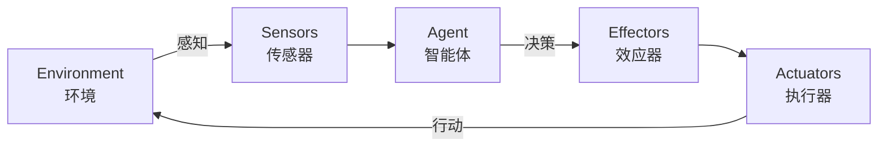

### 1.2 增强型 LLM Agent

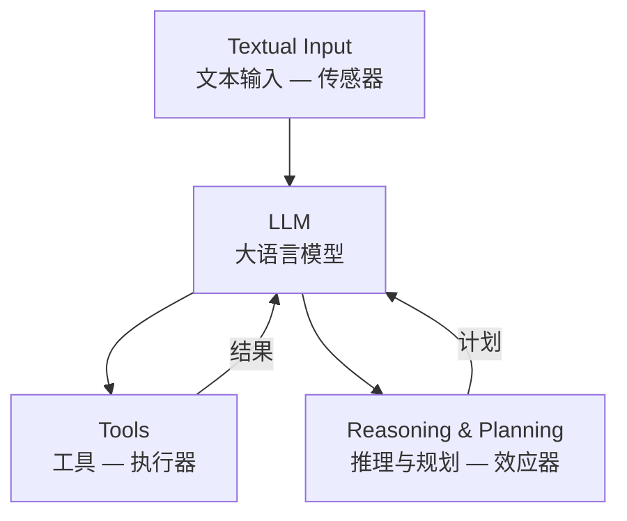

### 1.3 自主性光谱

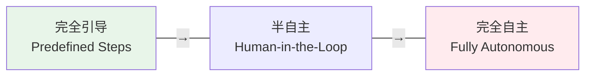

---

## 2. 记忆（Memory）

### 2.1 短期记忆 — 上下文窗口

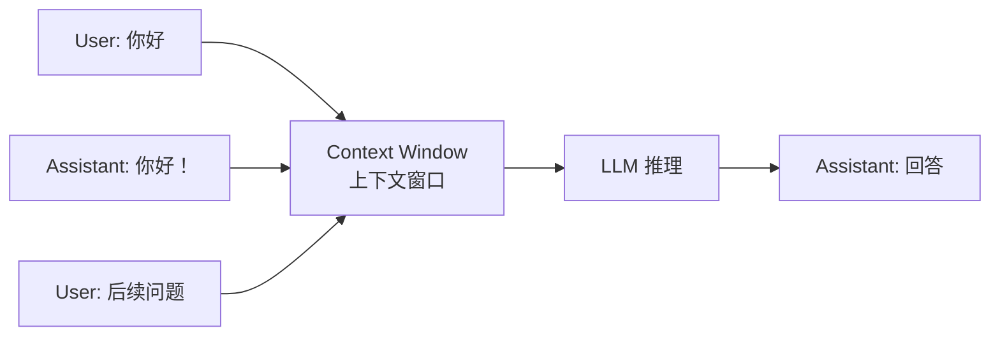

### 2.2 短期记忆 — 对话摘要

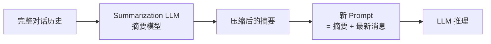

### 2.3 长期记忆 — 向量数据库 / RAG

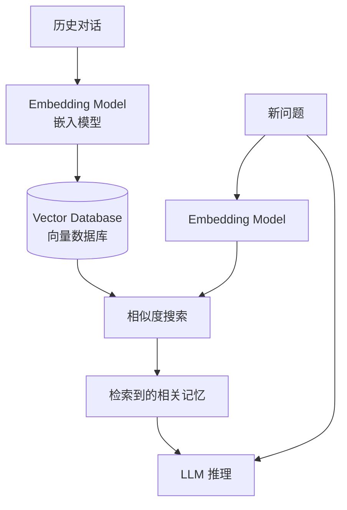

### 2.4 认知记忆架构

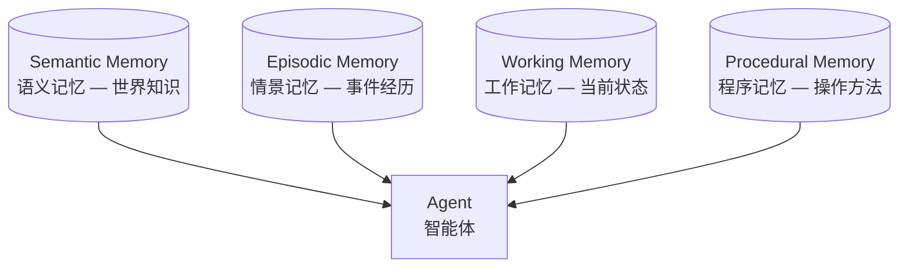

---

## 3. 工具（Tools）

### 3.1 工具调用流程

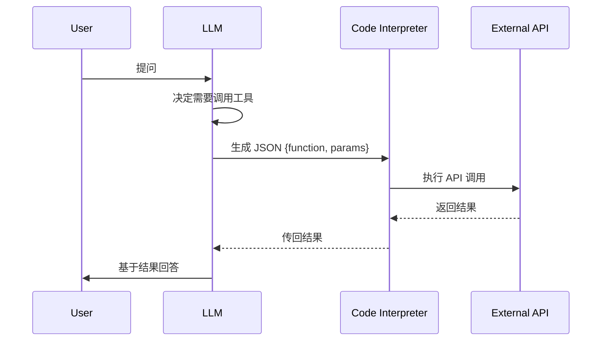

### 3.2 固定工具序列 vs 自主工具选择

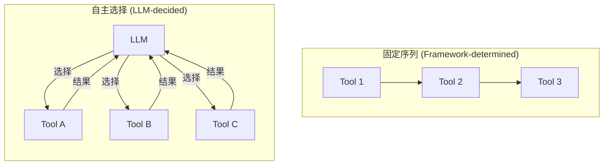

### 3.3 Model Context Protocol (MCP)

Anthropic 提出的标准化工具集成协议。

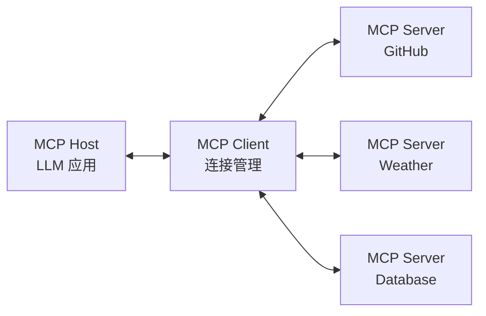

#### MCP 工作流

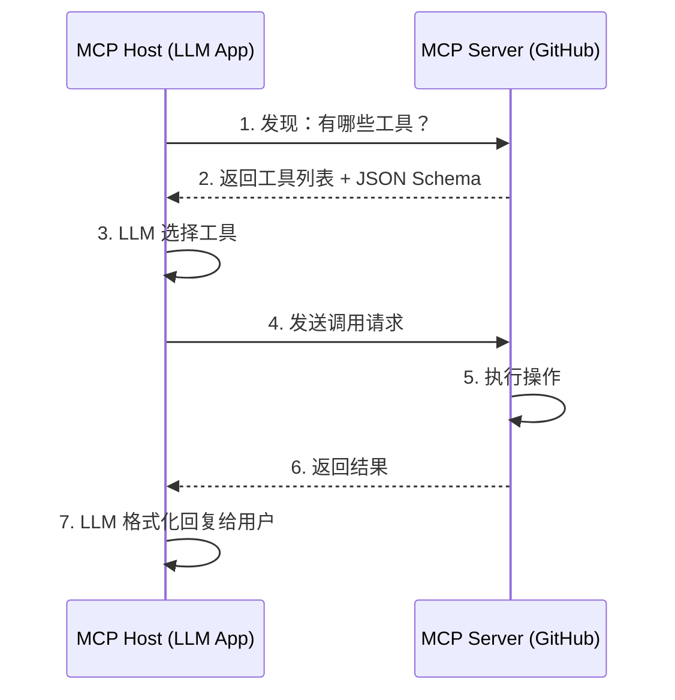

---

## 4. 规划（Planning）

### 4.1 规划循环

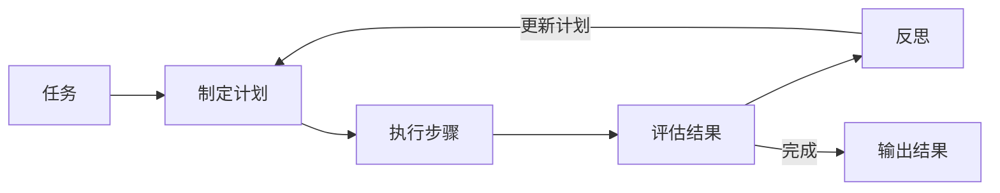

### 4.2 推理方法

#### Chain-of-Thought (CoT)

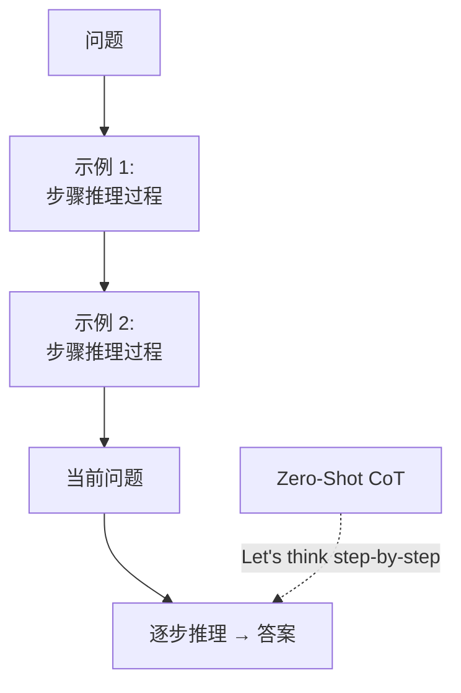

### 4.3 ReAct（Reasoning + Acting）

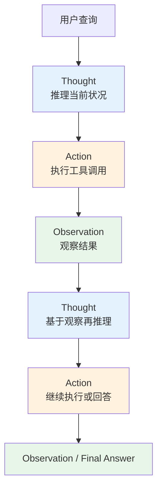

### 4.4 Reflexion（反思学习）

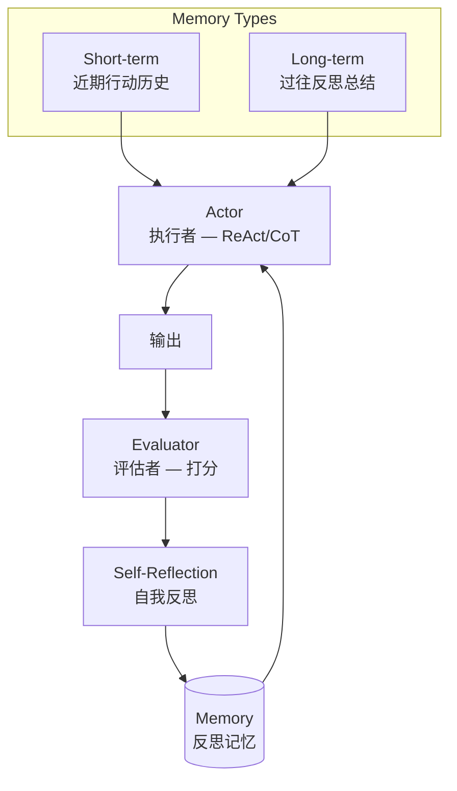

### 4.5 Self-Refine（自我优化）

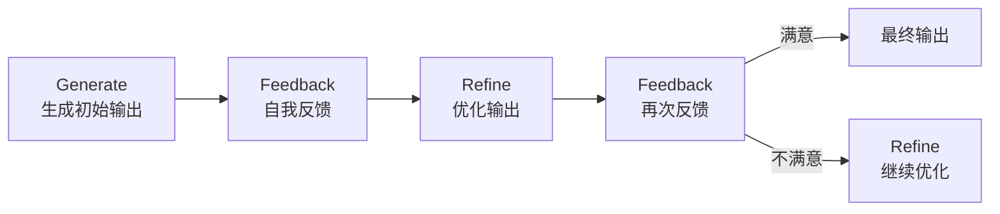

---

## 5. 多智能体协作（Multi-Agent）

### 5.1 多智能体系统架构

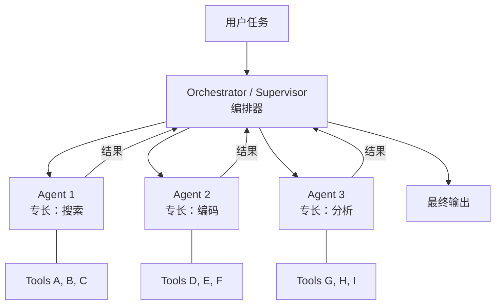

### 5.2 Generative Agents（生成式智能体）

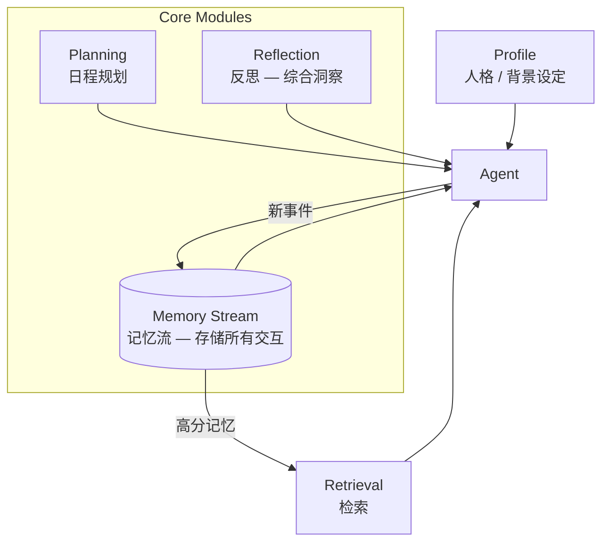

#### 记忆检索评分

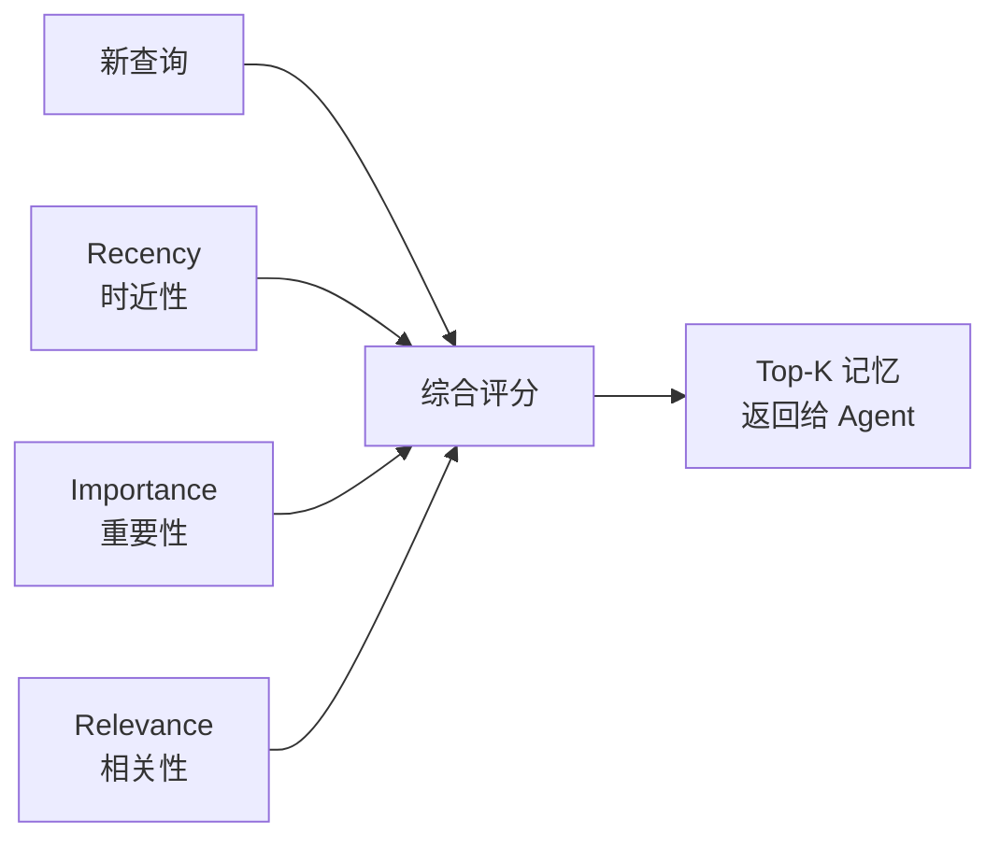

### 5.3 CAMEL 框架（角色扮演协作）

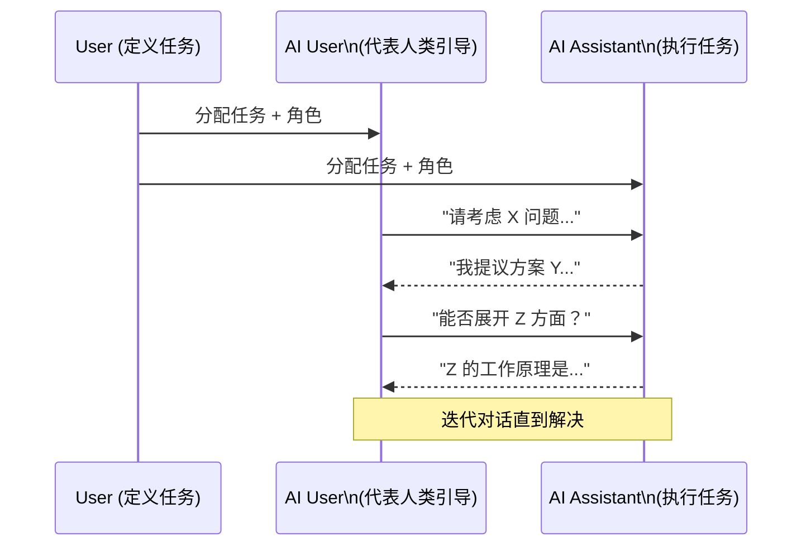

---

## 核心概念总结

| 模块 | 核心问题 | 关键技术 |
|------|----------|----------|
| **记忆** | 如何记住？ | Context Window / 摘要 / 向量数据库 / RAG |
| **工具** | 如何行动？ | Function Calling / JSON / MCP |
| **规划** | 如何思考？ | CoT / ReAct / Reflexion / Self-Refine |
| **多智能体** | 如何协作？ | Orchestrator / 角色扮演 / 生成式智能体 |

```mermaid
flowchart TB
    LLM[LLM Core\n大语言模型] --> Mem[Memory\n记忆]
    LLM --> Tools[Tools\n工具]
    LLM --> Plan[Planning\n规划]
    LLM --> Multi[Multi-Agent\n多智能体]

    Mem --> STM[短期记忆]
    Mem --> LTM[长期记忆]
    Tools --> FC[Function Calling]
    Tools --> MCP2[MCP]
    Plan --> CoT2[CoT]
    Plan --> ReAct2[ReAct]
    Plan --> Ref[Reflexion]
    Multi --> Orch2[Orchestrator]
    Multi --> GA[Generative Agents]

    style LLM fill:#1a237e,color:#fff
    style Mem fill:#0d47a1,color:#fff
    style Tools fill:#01579b,color:#fff
    style Plan fill:#006064,color:#fff
    style Multi fill:#004d40,color:#fff
```

---

> **参考文献**
> - Russell & Norvig (2016) — Agent 定义
> - Cognitive Architectures for Language Agents (2023) — 认知记忆架构
> - Toolformer — 工具学习
> - Generative Agents (Park et al.) — 生成式智能体模拟
> - AutoGen / MetaGPT / CAMEL — 多智能体框架
> - Anthropic MCP — 模型上下文协议
