# 小红书笔记汇总：大模型与 Agent 设计笔记（文字 + 图片 + Mermaid）

本文档汇总了系统 `Downloads` 目录中的 6 组小红书笔记（含图片与文字）：

- 大模型零基础入门
- Agent Tracer · 工具调用演进
- Agent Tracer · Agentic RAG Benchmark 发展
- Agent Tracer · Agent Memory 发展路线
- 蜡笔进化论 · Skill / MCP / Prompt 对比与决策
- 老夏聊编程 · 大模型学习路线与资料

所有图片中的文字内容都已融合进下面的要点中；涉及流程图、架构图和决策树的部分，用 Mermaid 进行了结构化复原。

---

## 一、大模型零基础入门：Agent 设计模式概览

### 1. Agent 设计模式分层

图片围绕「Agent 的设计模式是一种结构化工作流」展开，将复杂智能体行为拆成 5 个阶段：

1. 清晰阶段：有特定职责和明确阶段目标。
2. 状态管理：追踪进度和中间结果。
3. 条件逻辑：用于路由和迭代的决策点。
4. 工具集成：把外部交互封装为结构化方法。
5. 质量控制：用内置验证与优化机制闭环。

常见 Agent 流程模式包括：

- ReAct（推理 + 行动）
- LLM Compiler
- REWO / REWO0（Reasoning Without Observation）
- Reflection / Reflexion（反思 + 加强版反思）
- LATS（Language Agent Tree Search）
- Plan & Solve（计划并解决）
- Self-Discovery（自我发现）
- STORM 等

### 2. ReAct：推理 + 行动 + 观察循环

ReAct 被介绍为 LLM Agent 论文中的起点（2022 年），核心是：

- Thought（推理）→ Action（调用工具执行）→ Observation（观测结果）循环。
- 每一步执行后产生一个 Observation，成为下一轮推理的上下文。

图片文字示例（厨房找胡椒粉的故事）说明：

- Action1：先查看台面是否有调料。
- Observation1：台面上没有胡椒粉，继续下一步。
- Action2：拉开台底抽屉搜索。
- Observation2：抽屉里找到胡椒粉。
- Action3：把胡椒粉拿出并完成任务。

ReAct 的关键点：Actions 始终伴随可语言化的 Observation，形成可追踪、可解释的决策轨迹。

下面是根据配图抽象出的 ReAct 流程 Mermaid：

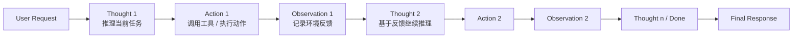

### 3. Intent Recognition：意图识别 Agent

意图识别被定义为自然语言处理中的核心任务之一：

- 目标：理解用户输入背后的真实意图，并映射到预定义意图类别。
- 输出：意图类别 + 槽位（Slots），天然可映射到工具调用或数据库查询。

优势：

1. 快速、轻量：单轮、单意图任务中准确率很高，模型只需决定类别，不需要生成复杂长文本。
2. 结构化输出明确：意图类目和槽位清晰，适合系统对接 API / 动作系统。
3. 易于集成：规则引擎、传统 ML 或深度模型都能实现。
4. 可解释性好：「属于哪个意图」容易审查与调试。

局限：

- 单意图假设：对多意图、多任务或冗长对话支持较弱。
- 边界模糊的意图：例如「查看订单详情」与「查看物流编号」容易混淆。
- 多轮对话支持较弱：上下文衔接困难。
- 流程固定线性，对开放式任务不够灵活。

配图中的意图识别流程可抽象为：

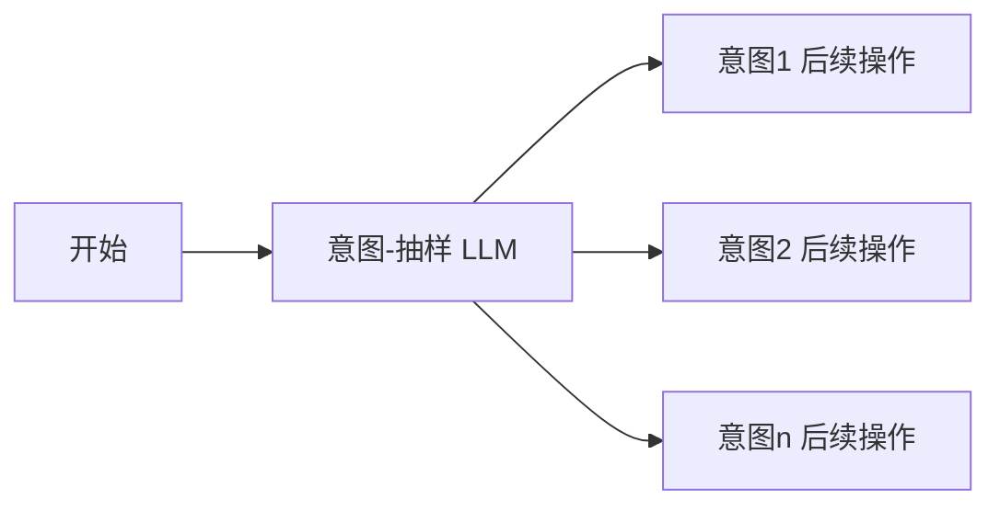

### 4. LLM Compiler：Planner / Executor / Joiner

LLM Compiler 模式通过 Function Calling 提升效率：

- 用户问题拆成多个子任务，由 Planner 负责分解。
- Executor 并行调用工具执行子任务。
- Joiner 汇总子任务结果并生成自然语言答案。

示例：用户问「今天上海和杭州的平均气温差多少？」：

- Planner：
  - 子任务 1：获取上海平均气温。
  - 子任务 2：获取杭州平均气温。
- Executor：并行调用 `get_avg_temp(city)`。
- Joiner：根据两个温度计算差值，返回给用户。

对应 Mermaid 设计思路：

```mermaid
flowchart LR
    U[User Query<br/>例如: 上/杭气温差] --> P[Planner<br/>拆分子任务]
    P --> T1[Task 1<br/>get_avg_temp(Shanghai)]
    P --> T2[Task 2<br/>get_avg_temp(Hangzhou)]
    T1 --> E1[Executor 调用工具1]
    T2 --> E2[Executor 调用工具2]
    E1 --> R1[Result: 上海温度]
    E2 --> R2[Result: 杭州温度]
    R1 --> J[Joiner<br/>聚合&计算差值]
    R2 --> J
    J --> A[Answer to User]
```

### 5. REWO：Reasoning Without Observation

REWO 模式将推理与执行拆开：

- Worker LLM 先在“脑内”规划完整工具调用计划（包含预期工具结果占位）。
- 然后一次性执行所有工具调用，最后汇总为答案。
- 相比 ReAct：Observation 不再每步反馈，而是集中在规划阶段。

典型流程图（根据配图抽象）：

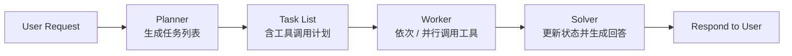

### 6. Reflection：生成-批判-优化循环

Reflection 模式引入显式自我批判和多轮改写：

1. Generator 先生成初版响应（文本/计划等）。
2. Critic/Reflection 组件对结果进行点评和错误分析。
3. 基于反思重新生成、改写，循环若干次，直到质量足够。

抽象成流程图：

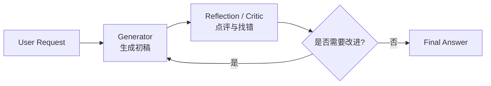

### 7. 9 种 AI Agent 设计模式金字塔

图片给出了一个「智能体金字塔」——从底层到高层：

- L1：Reasoners → Chatbots（语言推理/对话）
- L2：带工具的执行 Agent
- L3：DeepSeek-R1 定位层（具备更强的推理/规划）
- L4：Innovators（创新型 Agent，具备长程规划等）
- L5：Organizations（多 Agent 协作组织）

可用 Mermaid 近似表示层级关系：

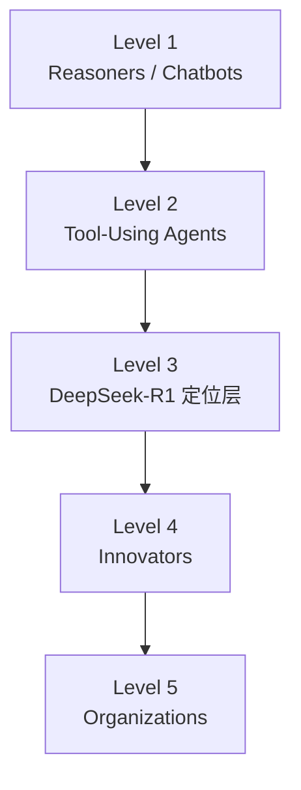

---

## 二、Agent Tracer：工具调用演进与系统瓶颈

### 1. 工具调用演进四阶段

图片《AI Agent 工具调用演进》按时间线梳理：

1. 阶段 0：Prompt & Paste（2023 初）
   - 纯文本提示，人工复制粘贴结果。
2. 阶段 1：RAG（只读增强）
   - 可以查外部知识，但本质上仍是回答问题，不会“改造世界”。
3. 阶段 2：Function Calling + ReAct（拐点）
   - LLM 输出结构化 JSON，包括「选择工具、填参数、调用」等。
   - 结果再回流上下文，由模型继续推理。
   - 系统一步从“回答”升级为“执行”。
4. 阶段 3：多智能体 + 编排（当下）
   - 引入 Orchestrator 拆分任务，不同 Sub-Agent 负责代码检索、数据库查询、风控等。
   - LLM 系统开始像一个“组织”在运转。

### 2. 工具调用的本质与“四大魔咒”

作者给出一个标准工具调用循环：

1. 系统把工具列表（schema / OpenAPI）塞进 prompt。
2. 模型决定：要不要调用？调用哪个？
3. 模型生成 JSON payload。
4. 外部执行器调用 API / 数据库。
5. 工具结果回流模型，再推理或生成最终回答。

真正困难的是步骤 2–3：在有限上下文里稳定、准确地选对工具并填对参数。

一旦进入生产，会遇到四大问题（“四大魔咒”）：

1. 执行幻觉（Execution Hallucination）
   - 选错 API、编造参数、甚至认为已经执行成功。
   - 最糟糕的是静默失败。
2. 上下文衰退（Context Rot）
   - 结果、日志、历史对话不断堆积，token 越长越难“记住”。
3. 延迟与成本爆炸
   - 每个小请求都要多轮“意图判断→选工具→填参→执行”，延迟和费用迅速上升。
4. 安全边界崩塌（Prompt Injection）
   - 用户输入与系统指令共用一条文本流，攻击者可以通过提示词劫持工具调用。

### 3. 工业界的三大护栏

工业界强调“在模型外加确定性护栏”：

1. 路由层：Resource Router vs Semantic Router
   - Resource Router：小模型先判断复杂度，简单请求走便宜模型，复杂的才交给大模型。
   - Semantic Router：将意图决策映射到 embedding，相似度匹配到工具/工作流，具备可扩展性和安全性。
2. 缓存体系：Prompt/KV/Semantic Cache
   - 静态工具 schema 放前面，KV 复用，重复问题走语义缓存，大幅节省成本。
3. MCP 标准化连接
   - 把 N×M 工具集成简化为标准接口（类似 USB-C），让“模型 ↔ 工具/数据源”的连接可组合、可治理。

### 4. 学术界提升能力的方向

图片列出了多个代表工作：

- ToolBench / ToolLLM：工具调用微调。
- Reflexion：让 Agent 学会“复盘”，通过自然语言反思提升策略。
- 集中式多智能体编排（类似 Puppeteer）：由 Orchestrator 调度多个子 Agent 协作。

### 5. 混合架构愿景

最终趋势：

- 不能只靠更强模型（贵、慢、不安全），也不能只靠工程护栏（能跑但泛化弱）。
- 需要把学术界的“认知能力提升”和工业界的“路由/协同/缓存基础设施”结合，构建“可控的数字劳动力系统”。

---

## 三、Agent Tracer：Agentic RAG Benchmark 发展路线

这一组图片系统梳理了 2023–2026 年 RAG 评估与 Agentic RAG 的演化。

### 1. RAG 能力拆解阶段

代表性 benchmark：

- RGB（2023）
  - 四个维度：Noise Robustness、Negative Rejection、Information Integration、Counterfactual Robustness。
- CRUD-RAG（2024）
  - 引入 Create / Read / Update / Delete 四类任务，让 RAG 从 QA 走向知识库维护与创作。

### 2. Agentic RAG 三大里程碑

三套关键工作：

1. Self-RAG：让模型给自己“打分”
   - 通过 reflection tokens 判断是否需要检索、文档是否相关、答案是否可靠。
2. CRAG：引入 Evaluator Agent
   - 流程变为“检索 → 评估 → 决策”，质量差时触发 Web Search fallback。
3. Adaptive-RAG：首次显式引入“路由”
   - 系统先判断问题复杂度，选择不同 RAG 策略（直接回答 / 普通检索 / 多步 Agent 推理）。

### 3. 多跳推理与 AgenticRAGTracer

多跳场景下传统 RAG 表现骤降，催生了：

- MultiHop-RAG：专门针对多跳查询的评估。
- AgenticRAGTracer：不仅看结果，还回溯推理轨迹，发现两类失败模式：
  - Premature Collapse：过早停止检索。
  - Over-Extension：无限制调用工具。

结论：好的 Agent 不在于“推理更长”，而在于“推理更合理”。

### 4. Deep Research 与 RAG Routing

进一步演化到：

- DeepResearch Bench：针对长时间自动研究任务，从真实用户查询中抽取博士级问题，评估答案完整性与深度。
- RAGRouter-Bench：围绕“何时用哪种 RAG？”建立 Router 评测框架，评估各种路由策略。

最终趋势总结：  
未来的 RAG 系统不会是一个巨大的单体 Agent，而是：

> Routing + Pipeline + Agents 的混合系统  
> 简单问题 → 高效检索  
> 复杂问题 → Agent 推理  
> 深度研究 → 多工具自治系统

---

## 四、Agent Tracer：Agent Memory 发展路线（Paper 向）

这组图片聚焦 2024–2026 年 Memory 系统的三阶段进化：

### 1. 第一阶段：工程化与结构化

- 核心目标：让记忆“真正落地”。
- 代表：Mem0（生产级 Memory 基建）。
  - 不再只是向量库，而是维护 Memory Graph：
    - 抽取实体
    - 建立关系
    - 合并相似信息
    - 更新人物状态
  - 适用场景：个性化 Agent、长对话客服、企业知识管理等。

### 2. 第二阶段：强化学习驱动记忆管理

- Memory-R1 等工作提出：让记忆成为“可学习策略”。
- 采用 Dual-Agent 框架：
  - Agent 1（Memory Manager）：负责显式记忆操作（ADD / UPDATE / DELETE / NOOP），决定“是否值得记”、“是否要更新”、“哪些应该删除”。
  - Agent 2（Answer Agent）：负责“用记忆”，在检索结果很多时进行 Memory Distillation（记忆蒸馏），过滤噪声、提炼关键证据、压缩有效信息。
- 特点：在极小数据规模（如 152 个 QA）上通过 PPO/GRPO 就能学到比复杂 heuristic 更强的记忆管理策略。

### 3. 第三阶段：内生状态与自治管理（2025–2026）

- MEM1：恒定内存状态机
  - 不再堆叠上下文，而是维护高度压缩的内部状态变量。
  - 适合资源受限与超长交互场景。
- ReMemR1：回溯机制
  - 引入回溯和多级奖励，以缓解压缩带来的信息不可逆丢失。
- Mem-α：完全自治记忆系统
  - 拆分为 Core / Semantic / Episodic 三层记忆。
  - 每一步都主动执行插入、更新、删除和检索，并通过强化学习优化整体策略。

整体趋势总结：

- 2024：工程外挂。
- 2025：强化学习驱动记忆管理。
- 2026：内生化与完全自治。  
Memory 正在从“RAG 工具层”升级为“Agent 的核心决策能力”。

---

## 五、蜡笔进化论：Skill / MCP / Prompt 对比与决策树

这一组图片包含清晰的架构图和决策图，是本次 Mermaid 复原的重点。

### 1. Skill 三层加载机制

图中把 Skill 的上下文拆为三层：

1. 元数据层 Metadata（YAML）
   - 技能名、描述、触发条件。
   - 始终加载（约 100 tokens）。
2. 指令层 Instructions（SKILL.md）
   - 执行步骤、规则逻辑、输出格式。
   - 按需加载（约 1000 tokens）。
3. 资源层 Resources（scripts / references / assets）
   - 脚本、参考资料、模板。
   - 引用时加载（可能 5000+ tokens）。

对比 Prompt 一次性塞 40000 tokens，Skill 通过渐进式加载控制 Token 消耗。

可用 Mermaid 阶段图表达：

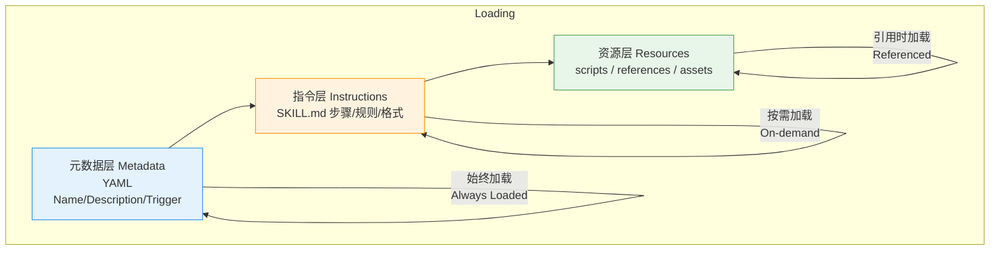

### 2. Skill / MCP / Prompt 适用场景对比

图片给出的对比要点：

- Skill 适合：
  - 重复性工作流程（审核/流程配置/格式转化）。
  - 团队协作共享 SOP。
  - 本地流程与专业方法。
  - 关键词：重复 + 本地 + 低 Token。
- MCP 适合：
  - 需要实时外部数据（查询数据库、调用 API）。
  - 读写外部服务（Notion/GitHub/Jira 等）。
  - 远程 API 连接。
  - 关键词：外部 + 实时 + 远程。
- Prompt 适合：
  - 一次性任务 / 简单指令。
  - 基础规则配置。
  - 关键词：一次性 + 简单 + 静态。

### 3. 核心定义与本质

图中给出三者的“核心定义 + 本质”：

- Skill：
  - Definition：模块化能力包。
  - Nature：封装知识与流程的使用手册，支持渐进式披露和按需加载。
  - 类比：应用程序（Application）。
- MCP：
  - Definition：Model Context Protocol，连接 AI 与外部系统。
  - Nature：给 AI 发工具的 USB 协议，访问外部数据/服务。
  - 类比：接口（Interface）。
- Prompt：
  - Definition：文本指令 / 规则。
  - Nature：一次性说明书，每次对话都要加载。
  - 类比：口头交代任务（Verbal Task）。

### 4. 三者关系总结（关系图）

图片画了一个三圆交集，并给出总结：  
PROMPT = 现在做什么；SKILL = 怎么做（重复的事）；MCP = 能访问什么。

可用 Mermaid 简化为关系图：

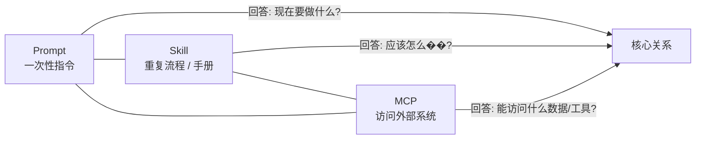

### 5. 如何选择？决策树

图中给出的 Skill / MCP / Prompt 决策树：

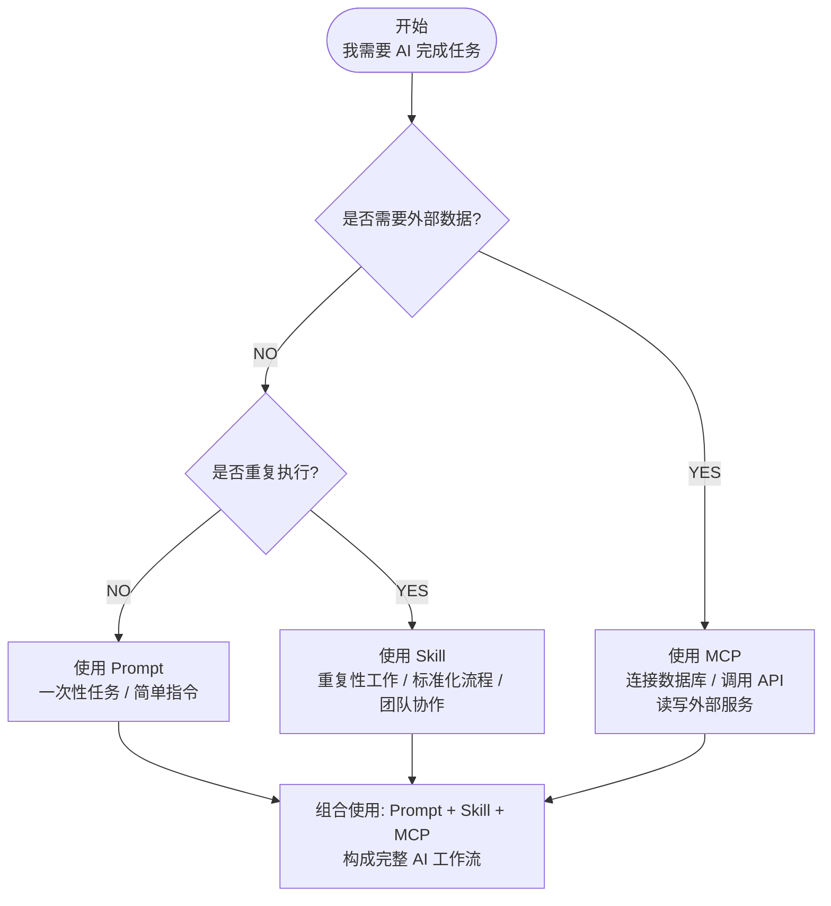

### 6. 技术特性与门槛对比

表格形式比较三者：

- 技术门槛：
  - Skill：低（Markdown + YAML，AI 可辅助）。
  - MCP：高（需要写代码 + 部署服务）。
  - Prompt：低（直接写文本）。
- 跨平台性：
  - Skill：强（可在多家模型/工具上复用）。
  - MCP：弱（通常绑定特定运行环境）。
  - Prompt：中等，依赖模型。
- 网络访问：
  - Skill：仅本地执行，通过 Agent 工具。
  - MCP：支撑远程访问 API/SaaS。
  - Prompt：本身不具备网络访问。

---

## 六、老夏聊编程：Agent 全流程架构与学习路线

老夏的这组笔记相当于是「大模型 Agent 0–1 教程」的结构草图，内容比简单的“组件列表”丰富很多，主要包含三块：

1. Agent 是什么：从 ChatGPT 到 AI Agent 的演进。
2. Agent 的核心定义与分层架构。
3. 四大组件、记忆模块与 ReAct/Plan-and-Execute 等工作流细节。

下面按图来还原。

### 1. Agent 核心定义与整体闭环

在「什么是 Agent」那张图里，老夏先用一张对比图说明：

- 传统 ChatGPT：单轮问答，一次生成就结束，主要是“内容智能”。
- AI Agent：把“输入 → 推理 → 工具/行动/环境 → 反馈 → 输出”放到一个可循环的闭环里。

白板图《Agent 搭建特点 & 全流程架构简图》则把这个闭环拆成 5 个互相连接的模块：

- 感知输入（Perception / Input）：接收用户请求、外部信号。
- 核心大脑（LLM / 认知核）：负责理解、推理、做决策。
- 规划与推理（Planning & Reasoning，如 CoT / ReAct）：把目标拆成步骤并产出下一步行动。
- 记忆模块（Memory：短期 + 长期 + RAG）：保存对话上下文、长期事实与外部知识。
- 工具与行动（Tools & Actions）：API 调用、代码执行、浏览器、机器人等。
- 输出与反馈（Output & Feedback Loop）：对外给出结果，同时将结果写回记忆，形成闭环迭代。

尽量按白板上的环形布局复原，可以用下面的 Mermaid：

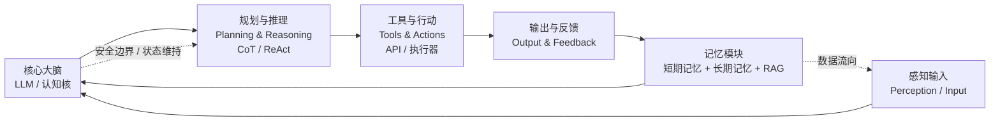

这张图的重点不在某一个组件，而是在「数据与状态围绕 LLM 大脑不断流动」：

- 用户输入和外部信号通过感知层进入系统。
- 大脑在规划层生成“下一步要做什么”。
- 工具执行结果和环境反馈被输出，并写回记忆。
- 记忆再反馈给大脑，影响下一轮决策。

### 2. 四大组件树：LLM / Planning / Memory / Tools

另一个更“工程向”的图，是把 AI Agent 从中心节点展开成一棵树：

- 大脑：LLM
  - 负责理解任务、生成回答。
  - 下挂：理解任务、生成草稿回答、任务分解等能力。
- 规划：Planning
  - 把复杂目标拆成可执行子任务。
  - 下挂：流程编排、任务分配、路由策略。
- 记忆：Memory
  - 维护上下文与知识库。
  - 分为短期记忆（对话局部上下文）和长期记忆（全局知识/RAG）。
- 工具：Tools
  - 对接 Web Search、代码执行、API 调用等外部能力。

原图的布局是从中心向右侧分叉的「思维导图」，我们用 Mermaid 近似复刻成一棵向右展开的树：

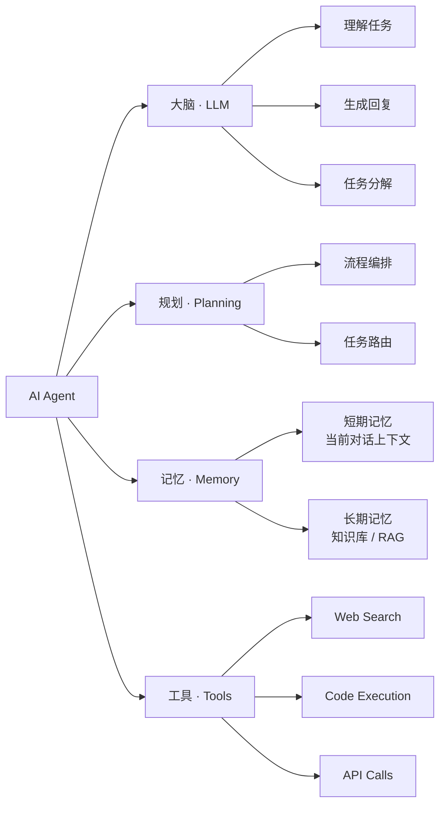

### 3. 深度架构：从输入到 ReAct 框架

在「2. Agent 核心架构深度剖析」那张图中，老夏给出了一个从用户输入一路流到 ReAct 工作流的竖向图：

1. 用户输入。
2. 规划模块：把用户目标拆解为候选计划。
3. 记忆模块：
   - Long-term：长期记忆（历史任务、知识）。
   - Short-term：短期记忆（当前对话上下文）。
4. LLM Brain：在规划和记忆的支持下，给出 Thought / 决策。
5. ReAct 框架：
   - Thought：分析当前状态、思考下一步。
   - Action：调用工具/执行操作。
   - Observation：接收工具反馈。
   - 判断任务是否完成，否则继续循环。

这个竖向流程可以用 Mermaid 更贴近原图的“自上而下”布局：

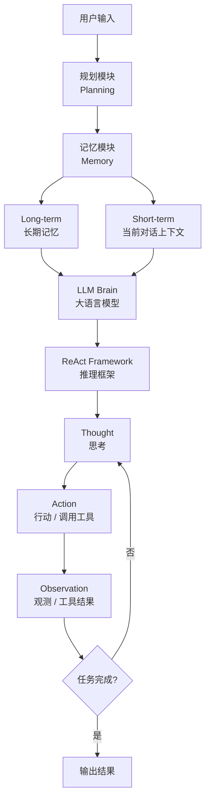

### 4. 记忆模块内部结构与数据流

记忆章节的图把「对话历史 → 短期缓冲 → LLM → 长期向量库」画成一个环：

- 用户输入首先进入短期记忆（Conversation Buffer）。
- LLM 在推理时读取短期记忆和任务描述。
- 如果当前信息被判定为“值得长期记忆”，就写入长期记忆（向量库 Vector DB）。
- 之后每轮交互，LLM 都可以从向量库中检索相关记忆补全上下文。

可以用下面的 Mermaid 还原：

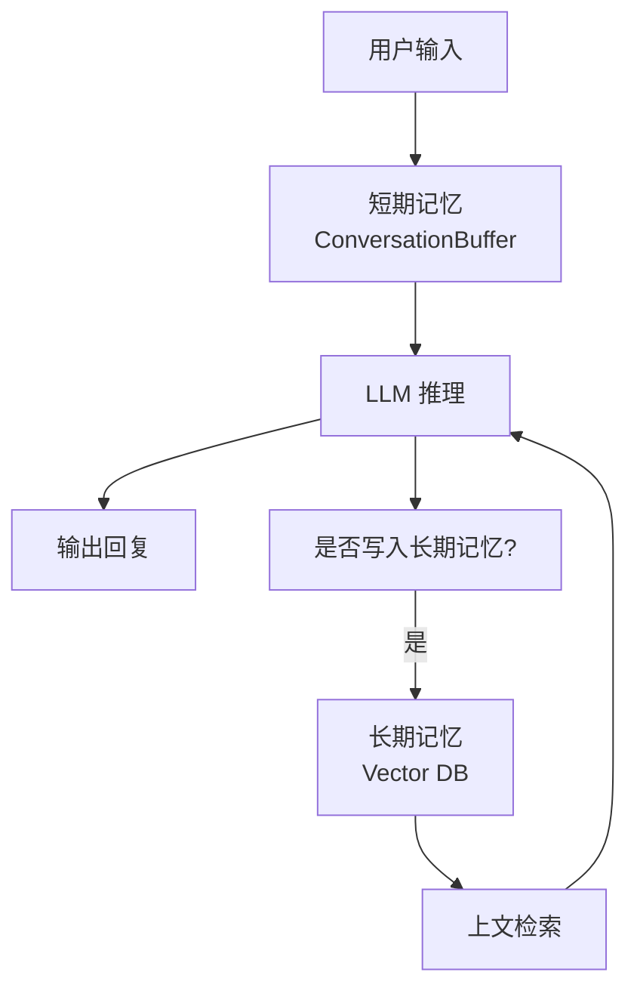

在文本部分，老夏还强调了几个设计要点：

- 短期记忆：
  - 保存最近若干轮上下文。
  - 成本主要来自“把历史对话反复送回 LLM”。
- 长期记忆：
  - 需要设计「是否写入」的策略（例如用 LLM 预测重要性）。
  - 还需要过期机制（expiry）管理记忆老化。

### 5. 规划模块与其它工作模式

在规划章节和「其它 Agent 工作模式」部分，还有两类结构图：

- ReAct 以外的 CoT（Chain-of-Thought）模式：
  - 只有推理轨迹，没有实际执行。
  - 适合只需要“想清楚、写出来”的任务。
- Plan-and-Execute：
  - 先用一次 LLM 调用生成完整任务列表，再并行执行子任务，最后聚合结果。

Plan-and-Execute 的结构与前文 LLM Compiler 很像，这里就不再重复画图，只在文字里与你前面的章节对齐即可。

---

## 七、评论区信息摘要

最后，对各笔记的评论区内容做一个简要汇总（只保留有助于理解需求/痛点的部分）：

- 工具调用与幻觉：
  - 有读者关注“针对幻觉：工具/参数，有什么主流思路和研究？”。
  - 有人希望每个阶段配论文清单。
- Agentic RAG：
  - 多条评论认可“检索不是瓶颈，记忆管理才是关键”的观点，并询问必读论文。
- Skill / MCP / Prompt：
  - 有人询问手绘草图用什么工具画。
  - 也有人问 Skill 在重复任务时是否仍需要 MCP 取外部数据。
  - 部分读者从“系统直接操作→App→小程序”类比三者差异。
- 课程与资料：
  - 对《大模型零基础入门》与老夏笔记，评论普遍认为“资料齐全、对小白友好，图文 + 源码性价比高”。

---

## 八、如何使用这份汇总

这份文档可以作为你后续写作或内容再创作的素材库：

- 如果要写系统性的教程章节，可以：
  - 用本文件第 1–3 部分构造「Agent 设计模式 + Agentic RAG + Memory」三章。
  - 直接复用 Mermaid 图作为电子书或博客中的结构图。
- 如果要制作分享或课程：
  - Skill/MCP/Prompt 模块可以直接做一节「工具栈选型与决策树」。
  - 老夏的 Agent 组件图可以作为总览第一页，引出整个系列。

如需，我可以在此基础上再拆分为多篇专题文章草稿（例如单独写「Memory 演进线路」、「Agentic RAG Benchmark 导读」等）。
