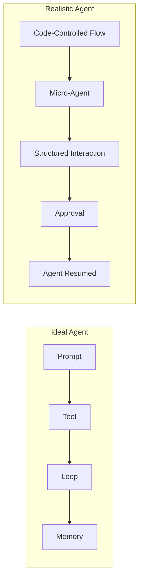
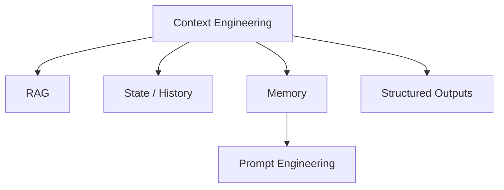
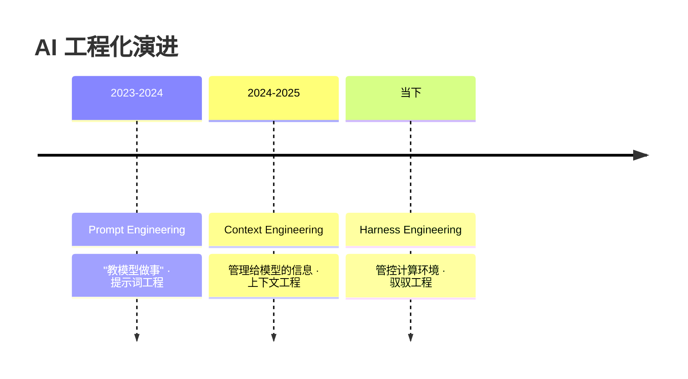
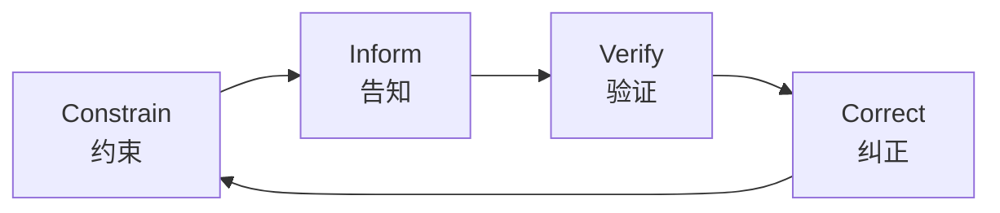

# 小红书笔记原文 OCR：小宇 tca & 膝盖中箭的师兄 King

> 说明：本文件尽量忠实地把两篇小红书笔记（含图片）转写为 Markdown。  
> - 文本部分基本按原文逐段抄录。  
> - 有结构/流程的图片用 Mermaid 画出等价图。  
> - 不再做额外总结或改写。

---

## 一、「近期做 AI Agent 的经验分享」（小宇 tca）

### 1. 元信息

- 标签：`#大模型 #Agent #Agent搭建 #Agent开发 #大模型应用 #大模型学习 #大模型入门 #AI大模型 #大语言模型 #LLM`
- 评论（原文 JSON）：

```json
[{"author":"小宇tca\n作者","comment":"整套 Agent 、 RAG 、大模型全套学习籽料，需要可以关 祝，无偿给"},
 {"author":"oiflippy","comment":"已关，求"},
 {"author":"南山南","comment":"已关求一份"}]
```

---

### 2. 图片逐张转写（8 张）

#### 图 1：封面与基本判断

> 近期做 AI Agent 的经验分享
>
> 首先我觉得大部分人对 Agent 落地效果不佳的理解一开始就跑偏了。  
> 根源不在于模型不够聪明，而在于构建 Agent 的方式与模型能力不够匹配/契合。
>
> 我们都被一个提示 + 一堆工具 + 一个循环搞定一切的理想范式给带沟里了。  
> 几乎所有刚开始做 Agent 的团队，第一站都是 LangChain 或 CrewAI 等框架，快速搭个原型，看起来很美。  
> 但很快就会掉进一个“80% 陷阱”：Demo 效果能到 80 分，可想从 80 分优化到能跑生产的 99 分，会发现比推倒重来还难。
>
> 因为你被框架高度抽象的 Prompt、内容管理、工具调用给绑死了。  
> 想精细控到细节都不知道从哪下手。
>
> 那么，真正能打的 Agent 是怎么做的？  
> 我最近研究了 GitHub 上一个很火的开源项目 12-factor-agents

---

#### 图 2：12-Factor Agents 开源仓库 & Ideal vs Realistic Agent

> 12-Factor Agents 开源仓库
>
> 简单说，就是从“让 Agent 自己跑”，退回到“让代码带着 Agent 跑”。
>
> 【图：理想的 Agent（自驱动循环）vs 现实的 Agent（微智能体 + 确定性流程）】

配图文字（概念）：

- Ideal Agent
  - Prompt → Tool → Loop → Memory
  - High uncertainty, prone to losing control
- Realistic Agent
  - Code-Controlled Flow
  - Micro-Agent
  - Structured Interaction
  - Approval
  - Agent Resumed

用 Mermaid 粗略还原这张对比图：



---

#### 图 3：Own Your Control Flow（夺回控制流）

> 具体落地，我根据原作者的 12 个原则，挑出两点最重要的工程实践：
>
> 一、夺回控制流（Own Your Control Flow）
>
> 不要让 Agent 在一个 while True 循环里“自由飞翔”。  
> 你的主程序应该是一个明确的流程控制器，在每个节点决定是调用普通函数，还是启动一个 Agent 来处理不确定性。
>
> 比如在 12-factor-agents 里提到的一个真实案例：一个部署机器人（DeployBot）。整个流程是确定性的：
>
> 1）代码合并到 main 分支（确定性代码）  
> 2）自动部署到预发布环境（确定性代码）  
> 3）运行自动化测试（确定性代码）  
> 4）启动部署 Agent，上下注释：“请把 SHA 4af9e0c 部署到生产环境。”  
> 5）Agent 返回工具调用：deploy_frontend_to_prod.  
> 6）流程中断，等待人工审批。  
> 7）人类同意：“先部署后端 …”

（后续在下一张图补完）

---

#### 图 4：控制流示例续 + 二、Context Engineering

> 8）恢复 Agent，把“先部署后端”作为新上下文输入。  
> 9）Agent 返回新的工具调用：deploy_backend_to_prod.  
> 10）…后续流程类似。
>
> 在这个流程里，Agent 只负责把人类的自然语言反应，翻译成下一步的工具调用。  
> 什么时候暂停，什么时候恢复，什么时候执行高风险操作，都由明确的确定性代码说了算。这就保证了整个系统的稳定可控。
>
> 二、精细化上下文工程（Context Engineering）
>
> 这是核心中的核心。Agent 的表现上限，几乎完全取决于你在每次调用 LLM 时，喂给它的上下文质量。这远不止是写个好 Prompt。
>
> 以现在最成熟的 Agent 之一 Cursor（最近大火的 claude code+）为例，它为什么能在多窗口写代码时更靠谱？  
> 因为它做了极致的上下文工程。

---

#### 图 5：Cursor 中的上下文工程 & Context Engineering 圈图

> 当你在 Cursor 里修复一个 Bug，它会把这些信息动态打包，一起塞给模型：
>
> 1. 光标附近的几百行代码。  
> 2. 你最近打开和编辑过的几个文件。  
> 3. 整个项目的依赖关系图谱（AST 索引）。  
> 4. 终端里最近的报错信息。  
> 5. 你在对话框里跟它聊过的修复思路。
>
> 3. 梳理你的上下文项目
>
> 在很多一般的应用里，我们往往只是把简单的 LLM 需求直给模型，下一步直接拿结果。  
> 但在更复杂的场景里，LLM 要发挥作用，需要系统性的上下文工程，为了把模型的能力最大化利用。
>
> 你能考虑进去的包括：
> - 编程上下文（代码 / AST / 报错）  
> - 内容上下文（历史对话、长期记忆）  
> - 外部知识上下文（向量库 / RAG）  
> - 工具状态与历史调用上下文  
> - 结构化输出的约束与解析（Structured Outputs）
>
> Everything is Context Engineering!

配图是一个多层交叠圆：

- 最外圈：Context Engineering
- 中间圈：RAG、State / History
- 内圈：Prompt Engineering
- 另一块：Memory、Structured Outputs

用 Mermaid 近似复刻这个概念图（用嵌套关系表达）：



---

#### 图 6：Context Engineering 进一步解释

> Context Engineering
>
> 模型拿到了如此丰富的、与当前任务强相关的上下文，自然能给出更靠谱的回答。相反之下，很多普通的 Agent 只把聊天记录一般脑袋塞进去，效果天差地别。
>
> 精细化上下文还体现在“格式”上。比如在 12-factor-agents 的 workshop 里就演示了，把原本记录复杂 JSON 格式、优化成更紧凑、更符合模型阅读习惯的 XML 格式，用更少的 Token 承载了相同的信息，还能降低模型推理成本。
>
> 这些工程细节，才是拉开 Agent 效果差距的关键。
>
> 如果你对这个感兴趣，强烈推荐去看看 GitHub 上的 12-factor-agents 项目。  
> 它系统地总结了构建可靠 AI 应用的 12 条原则，比如“工具调用结构松耦合”、“用工具调用写入文档”、“保持 Agent 小而专注”等等。  
> 这些原则背后，都是从无数次失败中总结出的血泪教训。
>
> 总而言之，当前 AI Agent 落地效果不佳，不是方向错误，而是工程上还远没有做到与模型能力相匹配。  
> 我们应该从“通用智能”的幻想中抽身，多关注控制流、上下文工程、工具栈这些扎实的基础，并把 LLM 这个强大的“语言引擎”作为零件，而不是一切。  
> 这样，才可能在现实的软件系统里，把这个东西真正用好。

---

### 3. 小结（保持原意的极简整理）

> 这篇笔记的主要内容已经在上面的逐图转写中完整呈现，这里不再额外总结或改写。

---

## 二、「我对 Agent Harness Engineering 的一些理解」（膝盖中箭的师兄 King）

### 1. 元信息

- 标签：`#大语言模型agent #智能体 #大模型 #上下文工程 #harness工程`
- 评论（原文 JSON）：

```json
[{"author":"Rabe","comment":"从这样的角度看 openclaw 其实就是符合 harness engineering 的，不固定流程和规矩，只画范围，让模型去探索能力边界"},
 {"author":"BrickBoySteve｜乐高MOC","comment":"没那么复杂 简单的说啥是harness，婴儿车上的肩带  现在跟以前区别就是大模型可以读context。这个跟以前很不一样。除此以外，就是原来工程里的反馈机制由给人反馈变成了给ai"},
 {"author":"mo","comment":"控制论的新工程范式"},
 {"author":"Singularity数字生命","comment":"Agent Harness的核心是让模型任务流可观测可干预，不只是prompt工程。"},
 {"author":"血常赤，海恒蓝","comment":"从软件工程角度来看 其实就是非功能性需求"}]
```

---

### 2. 图片逐张转写（9 张）

#### 图 1：标题

> 我对 Agent Harness Engineering 的一些理解
>
> 最近 Harness Engineering（可以翻译为 Agent 驭驭工程）这个词突然在 AI 工程圈子里火了起来。  
> Mitchell Hashimoto 在博客里提了这个说法，OpenAI 紧接着发了百万行代码的实验报告，Martin Fowler 也跟进写了深度分析。  
> 一周之内，这个术语就成了讨论 AI Agent 开发绕不开的话题。
>
> 我认为其核心思想是在大模型外侧设计一套包裹在大模型外侧的完整基础设施与闭环机制，让“裸奔”的 AI Agent 能在护栏内、可管、持续、自动主完成复杂长周期任务，核心思想是用柵栏代替人类牵住 Agent 执行。

---

#### 图 2：AI 工程化演进三阶段（Prompt / Context / Harness）

图片标题：

> AI 工程化演进：从“教模型做事”到“管运行环境”  
> 大模型工程的核心正从单纯的指令编写，演变为对复杂计算环境的全面管控。

三阶段：

1. Prompt Engineering（2023–2024）
   - 核心是“教模型做事”，将专家经验压缩进提示词以规范输出。
2. Context Engineering（2024–2025）
   - 核心是“管理给模型的信息”，通过划定信息边界解决工具泛滥。
3. Harness Engineering（当下）
   - 核心是“管控计算环境”，在沙箱与权限级别中释放模型的无限潜能。

用 Mermaid 还原这张时间轴：



（如渲染环境不支持 `timeline`，可以改为普通流程图。）

---

#### 图 3：什么是 Harness Engineering

> 一、什么是 Harness Engineering
>
> Agent Harness Engineering 是一套包裹在大模型外侧的全链路闭环工程体系。
>
> 术语中的 Harness 原意为“马具”，有个形象的类比：
>
> * 烈马 = 大语言模型：能力极强、速度极快，但不可控；  
> * Harness（马具）= 整套工程体系：约束、护栏、反馈回路、上下文基础设施，控制烈马正确的赛道；  
> * 骑手 = 人类工程师：提供目标与方向，而非亲自奔跑执行。
>
> Harness Engineering 是设计和实施一套完整系统的工程过程，核心围绕四大闭环动作展开，也是整套体系的骨架：
>
> Constrain（约束）
>
> 核心目标：划定 Agent 的安全边界与能力范围

---

#### 图 4：Inform / Verify / Correct

> Inform（告知）
>
> 核心目标：给 Agent 注入完成任务必需的正确知识  
> 典型落地形态：结构化知识库、API 合约、架构文档、任务规范、上下文管理体系
>
> Verify（验证）
>
> 核心目标：自动化校验 Agent 的输出与行为是否合规  
> 典型落地形态：CI 自动化测试、自定义 Linter、结构校验、可观测性埋点、结果审计
>
> Correct（纠正）
>
> 核心目标：把错误信号自动反馈给 Agent，驱动自修复  
> 典型落地形态：Lint 报错嵌入修复指引、自审 + 交叉 Agent 评审、错误闭环反馈、自动迭代优化

可以把 Constrain / Inform / Verify / Correct 四要素画成简单框图：



---

#### 图 5：核心观点（一）范式迭代

> 二、核心观点
>
> （一）范式迭代，本质是「模型能力」与「人类管控模式」的匹配升级
>
> 1️⃣ Prompt Engineering：对应 GPT-3.5 初期的弱模型阶段及 23 年到 24 年。  
> 那时候大模型通用推理与指令遵循能力不足。这一阶段的工程核心，是把人类专家经验压缩进有限的 prompt，用点状约束单次生成输出，本质是“教模型做事”。
>
> 2️⃣ Context Engineering：早期 Agent 时代，24 年到 25 年。  
> 大模型推理能力与工具调用能力大幅提升，权限从对话窗口扩展到全栈 API。  
> RAG 知识库与向量检索系统广泛普及，自由度提升的同时，信息洪流、工具泛滥都让任务难以推进和落地。记忆混乱、工具调用无约束等问题，催生出一整套管控模型接收信息输入、管理信息边界、划定适当“信息护栏”与工具调用范围，本质是“管理给模型的信息”。
>
> 3️⃣ Harness Engineering：源于当前大模型能力的质变，现在的顶级大模型，已具备百万级上下文窗口、远超普通开发者的代码生成能力，权限直接触达完整文件系统、终端执行、甚至全流程与云环境部署，操作空间从“固定工具列表”扩展到了完整的底层计算环境，自由度趋近于无限。

---

#### 图 6：核心观点（二）Harness 的核心

> 本质是大模型能力不断升级，从单纯的文本、到调用工具、到自主创造工具，为了让大模型发挥全部潜力，同时又不失控，我们对其管控从单纯的上下文，到本地文件，再到沙箱、系统权限。
>
> （二）Harness 的核心：给模型释放最大的合理自由度
>
> 一开始我理解 Harness 就是给模型加栅栏，限制 AI 的能力。但这还不够，我们也给了大模型更大的自由度，我们只给了围栏，其余的随便大模型跑。
>
> 就像只有全套马具与专用赛道，才能让顶级赛马毫无顾忌地跑出极限速度；只有完整的 Harness 体系，才能让 Agent 的超强自主能力，真正转化为工业化的生产力，而非失控的风险。

---

#### 图 7：核心观点（三）人机协作模式

> （三）Harness 所代表的人机协作模式变革，也代表人机协作的关系改变。
>
> Prompt Engineering 时代：「师徒制」协作关系
>
> * 人类角色：事无巨细的老师/教练，核心工作是把自己的专家经验，拆解成一步一步的指令，教 AI 怎么做事；  
> * AI 角色：只能听懂指令的学徒，核心价值是按照人类的指令，完成单次、确定性的生成任务；  
> * 协作边界：人类定义每一步的执行逻辑，AI 只负责执行单一步骤，任何错误、偏差都需要人类手动纠正；  
> * 生产力本质：「提效工具」，只是缩短了人类执行单一步骤的时间，核心的逻辑、决策、纠错，全部由人类主导。
>
> Context Engineering 时代：「产品经理与执行者」协作关系
>
> * 人类角色：拆解任务的产品经理/项目经理，核心工作是把复杂任务拆成执行步骤，准备好所有信息素材，划定工具调用的固定范围；

---

#### 图 8：Context / Harness 协作关系详情

> * AI 角色：按流程执行的初级执行者，核心价值是在人类划定的路径里，完成多步串行执行；  
> * 协作边界：人类定义任务的拆解路径和执行边界，AI 只能在固定框架内执行，一旦跑偏、工具调用错误、任务失败，必须由人类介入调整；  
> * 生产力本质：「减负工具」，替代了人类部分重复性的信息整理、步骤执行工作，但核心的任务拆解、决策、风控管控，依然由人类主导。
>
> Harness Engineering 时代：「架构师与自动驾驶系统」协作关系
>
> * 人类角色：规则的制定者、方向的掌舵人，核心工作是定义最终业务目标、划定核心安全与合规红线，设计一套能让 Agent 自主运行、自我校验、自我修复的 Harness 体系；  
> * AI 角色：全链路自主演化执行者，核心价值是自主择路径执行、自主调���工具、自主完成全链路执行、自主校验结果、自主修复错误；

---

#### 图 9：Harness 协作关系补充

> * 协作边界：人类只负责掌舵方向和划定红线，所有执行环节——从任务拆解到最终落地，全部由 AI 自主完成，仅当触及核心红线时，人类才需要介入；  
> * 生产力本质：「生产力跃迁」，人类彻底从执行层工作中解放出来，核心价值从「把业务转化为可执行步骤」升级到「定义规则、把握方向、架构设计」的决策层工作，实现了人与 AI 的能力最优解。

---

### 3. 备注

> 同样地，这部分内容已经按原图逐段转写，不再进行额外的概括或评论。

