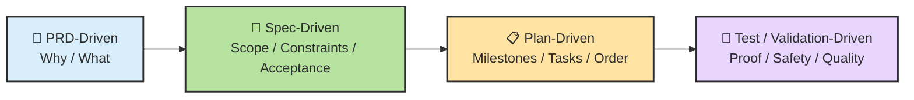
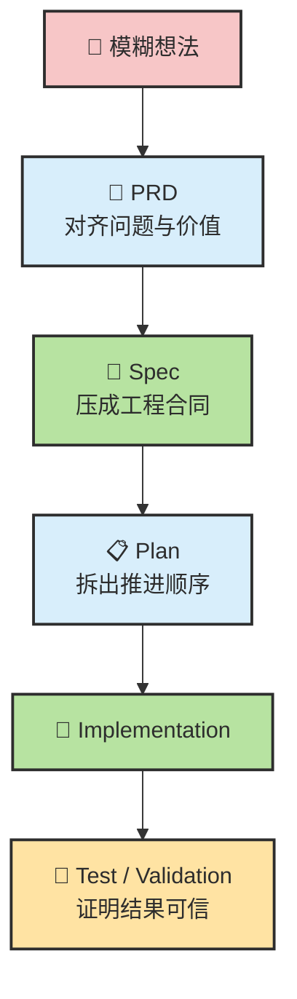
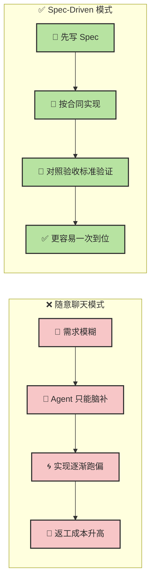
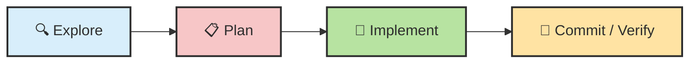

# 🧭 从 PRD 到 Spec 到 Plan 到 Test：Agent 时代的 XDD 开发方法链

> **别把 Agent 当读心术。**  
> 真正稳定的 AI 开发流程，不是“想到什么就聊什么”，而是把需求一路压缩成：  
> **PRD → Spec → Plan → Test / Validation**  
> 然后再让 Agent 执行。

> 📌 **一句话先讲清楚：**  
> 严格说，`PRD-Driven / Spec-Driven / Plan-Driven / Test-Driven` **不是同义词**。  
> 它们更像一条从**产品意图**到**工程合同**再到**执行顺序**与**质量证明**的连续链路。  
> 但在更宽泛的教学语境里，你也可以把它们统称为一组 **spec-first / structure-first 的开发方法**。

---

## 目录

- [🧭 0. 先校准几个直觉](#sec-0)
- [🗺️ 1. 一张总图：四种 XDD 到底是什么关系](#sec-1)
- [📌 2. PRD-Driven：先讲“为什么做、做什么”](#sec-2)
- [📝 3. Spec-Driven：把需求压成 Agent 能执行的工程合同](#sec-3)
- [📋 4. Plan-Driven：把 Spec 变成可推进的里程碑](#sec-4)
- [🧪 5. Test / Validation-Driven：证明它真的做对了](#sec-5)
- [🧩 6. 四种 XDD 的边界：像不像包含关系？](#sec-6)
- [🤖 7. 在 Claude Code / Codex 里怎么落地](#sec-7)
- [🧰 8. 可直接复用的 Prompt / Skill 思路](#sec-8)
- [⚖️ 9. 什么任务值得上全套 XDD，什么不值得](#sec-9)
- [📝 本章总结](#sec-summary)
- [📚 参考资料](#references)

---

<a id="sec-0"></a>
## 🧭 0. 先校准几个直觉

在开始之前，先把几件最容易想错的事摆正。很多人不是不会用 Agent，而是一开始就把它用在了**最容易失控**的模式里。

| #️⃣ | 🪤 常见直觉 | ✅ 更接近现实的说法 |
| --- | --- | --- |
| 1 | “模型够强，直接一句话它就会懂” | **不准确。** 模型会补全，但不会读心；需求一模糊，它就开始脑补 |
| 2 | “Spec 就是写文档，太重了” | **不对。** 对 Agent 来说，Spec 更像持续引用的**执行合同**，不是摆设 |
| 3 | “Plan 和 Spec 差不多” | **只说对一半。** Spec 更偏**边界与目标**，Plan 更偏**顺序与里程碑** |
| 4 | “只要有 Spec，就不用测试了” | **错。** Spec 解决“别跑偏”，Test/Validation 解决“别自欺” |
| 5 | “PRD / Spec / Plan / Test 都是一个东西” | **错。** 它们处在不同层级，分别回答不同问题 |
| 6 | “文档越长越好” | **通常是错的。** 关键信息清晰、可执行、可验证，比堆字数重要 |

先记住这一句，后面很多内容就不会学歪：

> 🎯 **Agent 时代最有价值的，不是“让 AI 直接开写”，而是“把任务逐层结构化，直到它能被稳定执行和验证”。**

---

<a id="sec-1"></a>
## 🗺️ 1. 一张总图：四种 XDD 到底是什么关系

如果你把这几种 “XDD” 当成互斥流派，很容易讲乱。  
更准确的理解是：

> **PRD-Driven → Spec-Driven → Plan-Driven → Test / Validation-Driven**  
> 它们更像一条从**产品定义**到**工程执行**再到**质量闭环**的方法链。



### 1.1 这四层分别回答什么问题？

| 层 | 核心问题 | 主要产物 |
| --- | --- | --- |
| **PRD-Driven** | 为什么做？做什么？给谁用？ | PRD / Problem Statement / User Story |
| **Spec-Driven** | 范围是什么？做到什么算完成？ | spec.md / acceptance criteria / constraints |
| **Plan-Driven** | 先做哪部分？按什么顺序推进？ | plan.md / milestones / tasks |
| **Test / Validation-Driven** | 怎么证明它真的做对了？ | tests / checks / review / eval / CI |

### 1.2 所以它们不是“互相替代”，而是“互相接力”



GitHub 把这件事直接产品化成了 Spec Kit 的 `/specify → /plan → /tasks`；Anthropic 在 Claude Code 官方最佳实践里则明确推荐复杂任务遵循 **Explore → Plan → Implement → Commit**；OpenAI 在 Codex 的长任务实践里强调 `plan.md + acceptance criteria + validation commands`。业界主流推荐其实正在收敛到同一个方向：**先结构化，再执行。**[^1][^2][^3]

---

<a id="sec-2"></a>
## 📌 2. PRD-Driven：先讲“为什么做、做什么”

### 2.1 PRD 到底在解决什么问题？

PRD（Product Requirements Document）更偏**产品层**。  
它的核心不是告诉工程师“具体怎么实现”，而是帮助团队先达成：

- 我们到底在解决什么问题
- 这个功能/产品对谁有价值
- 什么叫成功
- 当前版本做什么、不做什么

Atlassian 对 PRD 的定义很清楚：PRD 用来定义产品的**purpose、features、behavior**，帮助利益相关者对齐，并指导开发；而 agile PRD 的重点是**共享理解、客户需求和灵活性**，而不是过度细节化。[^4]

### 2.2 PRD-Driven 的核心价值

> 📌 **先定义“问题”，再定义“方案”。**

很多 AI 生成代码失败，不是技术方案错，而是**做错了问题**。  
这也是为什么 PRD-Driven 对 Agent 特别重要：它先把 “要解决什么” 固化下来，避免后面所有 spec / plan 都建立在错误前提上。

### 2.3 PRD 更像“产品北极星”，不是实现说明书

| PRD 应该强调 | PRD 不该过度强调 |
| --- | --- |
| 用户是谁 | 过早绑定具体类名/函数名 |
| 当前痛点是什么 | 每个函数怎么写 |
| 目标指标是什么 | 过早决定底层实现细节 |
| 核心用户流程 | 机械式技术清单 |

### 2.4 一个够用的 PRD 模板

```markdown
# PRD: OAuth Login

## Problem
- 用户当前只能使用邮箱注册登录，首次使用流程繁琐，流失较高

## Users
- Web 端首次访问的新用户
- 希望快速登录的回访用户

## Goal
- 降低首次登录阻力
- 提升注册完成率

## Success Metrics
- OAuth 登录转化率
- 首次登录耗时
- 登录失败率

## Scope
- ✅ 支持 Google OAuth 登录
- ✅ Web 端接入
- ❌ 暂不支持 Apple / GitHub
- ❌ 暂不支持移动端

## User Flow
- 进入登录页 → 点击 Google 登录 → OAuth 回调 → 建立 session → 进入首页

## Risks
- 回调失败
- 账号绑定冲突
- token 处理不当
```

### 2.5 PRD-Driven 什么时候特别有用？

- 新功能立项
- 团队对需求理解分歧较大
- 有明显产品目标，但技术实现还没定
- 需要先判断“值不值得做”

### 2.6 它的局限是什么？

PRD 解决的是 **Why / What**，但它通常还不够细，不能直接拿来让 Agent 稳定实现。  
因为对 Agent 来说，只有 “支持 Google 登录” 还远远不够，它还会继续猜：

- 旧 session 怎么办？
- 错误态要不要提示？
- 现有用户如何绑定？
- 哪些文件允许改？
- 做到什么算完成？

所以：

> 📌 **PRD 是起点，但不是落地终点。**  
> 它要继续下沉成 Spec。

---

<a id="sec-3"></a>
## 📝 3. Spec-Driven：把需求压成 Agent 能执行的工程合同

### 3.1 SDD 的核心，不是“写文档”，而是“去歧义”

Addy Osmani 在 2026 年初持续强调的一个观点是：  
**不要直接让 Agent 写代码，先和它一起把 spec 写清楚。**  
他建议先让 AI 通过提问补齐需求和边界，再形成清晰的 specification，再去规划和实现。[^5][^6]

这背后真正的逻辑是：

> 🎯 **Spec-Driven Development = 把模糊任务，压缩成可执行、可验证、可追责的工程合同。**

### 3.2 为什么 SDD 对 Agent 特别有效？

核心原因有四个：

1. **减少歧义**：减少 Agent 的猜测空间  
2. **提供锚点**：让“做完了没”有客观标准  
3. **限制过度设计**：避免 Agent 顺手扩 Scope  
4. **方便拆分**：天然适合继续下游生成 plan / tasks

### 3.3 SDD 与“随意聊天”的对比



### 3.4 一份好的 Spec 至少包含什么？

GitHub 在分析 2500+ 个 `agents.md` 后发现，真正有效的 repo-level instruction / spec 往往覆盖这些块：命令、测试、项目结构、代码风格例子、Git 工作流、边界约束。[^7]

压缩到单功能 spec，最少也应包含：

```markdown
# Feature Spec: OAuth Login

## Objective
- 解决什么问题
- 为什么做

## Scope
- ✅ In Scope
- ❌ Out of Scope

## Constraints
- 技术栈
- 安全约束
- 性能边界
- 兼容性要求

## Design Notes
- 涉及模块
- 关键接口
- 数据流 / 状态流

## Acceptance Criteria
- [ ] 用户可以通过 Google 登录
- [ ] 回调失败有明确错误处理
- [ ] 旧 session 流程不受影响
- [ ] 测试通过

## Validation Commands
- npm test
- npm run build
- npm run lint

## Boundaries
- ✅ Always
- ⚠️ Ask First
- 🚫 Never
```

### 3.5 三层边界，比“注意安全”有用得多

一个很实用的技巧是把边界写成三层：

| 边界层 | 含义 | 示例 |
| --- | --- | --- |
| ✅ **Always** | 默认就该做 | 改完必须跑测试 |
| ⚠️ **Ask First** | 高影响改动先确认 | 改数据库 schema、加依赖 |
| 🚫 **Never** | 明确禁区 | 改 secrets、删生产配置 |

这是很多 Agent 教程里最容易漏掉、但最影响稳定性的部分。  
因为如果你只说“注意别改错”，Agent 不知道什么叫“错”；  
但如果你给它三层边界，它就更接近在一个有制度的工程环境里工作。

### 3.6 SDD 的局限

Spec 不是万能的。  
Spec 过长、过碎、互相冲突时，反而会引入新的上下文噪音。Addy 也特别提醒过：大上下文不等于大可靠，instruction 太多反而会消耗模型的注意力预算。[^6]

所以最重要的不是“把所有东西写进去”，而是：

> 🧠 **只把会提升稳定性的内容写进 Spec，不要把瞬时噪音也塞进去。**

---

<a id="sec-4"></a>
## 📋 4. Plan-Driven：把 Spec 变成可推进的里程碑

### 4.1 Plan 为什么不是 Spec 的同义词？

Spec 回答的是：

- 做什么
- 不做什么
- 做到什么算完成

Plan 回答的是：

- 先做哪一部分
- 各步骤的依赖关系是什么
- 哪些任务适合并行，哪些必须串行
- 每个阶段的验证点是什么

所以：

> 📋 **Spec 更像合同，Plan 更像施工图。**

### 4.2 业界为什么越来越强调“先 Plan 再写”？

Anthropic 的 Claude Code 官方文档非常明确：复杂任务要把**探索/规划**和**实现**分开，推荐流程是 **Explore → Plan → Implement → Commit**；Plan Mode 会先只读分析代码库，并主动向用户追问，以形成计划。[^2][^8]

OpenAI 在 Codex 的长任务实践中则把 `plan.md` 明确定位成：  
**把 open-ended work 变成一串可完成、可验证的 checkpoint。**[^3]

GitHub 的 Spec Kit 也把 `/plan` 独立成一个正式步骤，而不是让 Spec 直接跳 Implementation。[^1]

### 4.3 Plan-Driven 的核心价值

1. **控制执行顺序**：防止 Agent 东一榔头西一棒  
2. **减少振荡**：避免做着做着又推翻自己  
3. **利于 review**：计划错误往往比代码错误更便宜修  
4. **天然适合 milestone 验收**：每完成一段就验证一次

### 4.4 一个够用的 plan.md 应该长什么样？

```markdown
# Plan: OAuth Login

## Milestone 1: Understand current auth flow
- 阅读现有登录相关模块
- 确认 session / user model / callback handling
- 输出影响分析

Validation
- 无代码改动，仅输出分析结果

## Milestone 2: Backend OAuth callback support
- 接入 provider
- 处理 token / callback / user linking
- 补充错误处理

Acceptance Criteria
- 正常回调可建立 session
- 异常回调可返回错误

Validation
- pytest tests/auth/test_oauth.py
- npm run lint

## Milestone 3: Frontend login entry
- 增加 Google 登录按钮
- 处理 loading / error state

Validation
- npm test
- npm run build

## Stop-and-Fix Rule
- 任一 milestone 验证失败，先修复，再继续
```

### 4.5 Plan-Driven 最关键的不是“列清单”，而是“列停点”

OpenAI 在 Codex 的长任务实践里强调过几个关键点：

- milestone 要足够小，能在一个 loop 完成
- 每个 milestone 都要有 acceptance criteria
- 每个 milestone 都要有 validation commands
- 如果验证失败，先修复，再继续
- 要记 decision notes，避免振荡[^3]

也就是说，Plan 最重要的不是“列出很多 TODO”，而是：

> 🛑 **告诉 Agent 什么时候该停下来检查、什么时候必须先修完再继续。**

### 4.6 Plan-Driven 的局限

Plan 不是越细越好。  
计划过细，会让 Agent 失去适应现实代码库的空间；  
计划过粗，又起不到减少振荡的作用。

一个常见误区是把 plan 写成“巨型甘特图式文案”，结果 review 成本很高。  
最理想的 plan 介于两者之间：**足够指导顺序，但不替代思考。**

---

<a id="sec-5"></a>
## 🧪 5. Test / Validation-Driven：证明它真的做对了

### 5.1 为什么这一层不能省？

没有验证时，Agent 最常见的失败姿势不是“完全没做”，而是：

- 看起来像做了
- 局部能跑
- 但边界条件没覆盖
- 回归没测
- 风格不一致
- 或者根本不符合你要的交付标准

所以：

> 🧪 **Spec 解决“目标正确”，Test / Validation 解决“结果可信”。**

### 5.2 TDD 是什么？它和前面三层不是一回事

Martin Fowler 对 TDD 的经典定义是：

> **先写失败的测试（Red），再写最简单能通过的实现（Green），然后重构（Refactor）。**[^9]

这是一种**代码级微循环**，不是产品定义层，也不是任务规划层。  
它最擅长的是通过测试推动设计，让行为边界先被定义清楚。

### 5.3 为什么这里我更愿意写成 “Test / Validation-Driven”？

因为在 Agent 时代，真正有用的验证层往往不只包括传统单元测试，还包括：

- 构建通过
- Lint / type check
- 截图验证
- 集成测试
- PR review checklist
- Eval / rubric-based scoring
- 对 skill / workflow 的系统化评估

OpenAI 在 2026 年初关于 skills + evals 的文章里就明确提出：  
对 agent skill 的评估不应只靠感觉，而应是：

> **prompt → captured run（trace + artifacts）→ checks → score**[^10]

也就是说，Agent 时代的 “Test-Driven” 如果讲得更完整，其实更接近：

> **Validation-Driven Development**

### 5.4 验证层可以分成四档

| 档位 | 典型手段 | 主要解决什么问题 |
| --- | --- | --- |
| **Unit / Component** | 单测、组件测试 | 局部逻辑行为 |
| **Integration / Build** | 集成测试、构建、lint | 系统能否协同运行 |
| **Acceptance** | 验收标准、手工检查 | 是否符合 spec / PRD |
| **Eval / Workflow** | rubric、trace 检查、score | Agent 是否按预期流程工作 |

### 5.5 一个现代的“验证清单”应该包含什么？

```markdown
## Validation Checklist

### Unit / Component
- [ ] 新增逻辑有单元测试
- [ ] 关键边界条件覆盖

### Integration
- [ ] build 通过
- [ ] lint / type check 通过
- [ ] 关键集成流程无回归

### Acceptance
- [ ] 对照 spec 的 acceptance criteria 逐条检查
- [ ] 用户路径走通
- [ ] 明确 error state

### Agent Workflow
- [ ] 是否按 plan 执行
- [ ] 是否运行了要求的验证命令
- [ ] 是否越界改动
```

### 5.6 TDD / Validation-Driven 的局限

测试不是银弹。  
你可以把错误的需求写成非常正确的测试。  
也可以把非常糟糕的用户体验做成一套全部通过的自动化脚本。

所以：

> 🧠 **测试能证明“实现符合某组规则”，但不能替代对“问题是否值得解决”的判断。**

这也是为什么它必须位于 PRD / Spec / Plan 的后面，而不是单独成为全部方法论。

---

<a id="sec-6"></a>
## 🧩 6. 四种 XDD 的边界：像不像包含关系？

### 6.1 严格说：不是“包含”，而是“分层”

从严谨角度说，不应简单讲成：

- “Spec-Driven = PRD-Driven = Plan-Driven = TDD”

更准确的说法是：

| 方法 | 更偏哪一层 | 回答什么问题 |
| --- | --- | --- |
| **PRD-Driven** | 产品层 | 值不值得做？做什么？ |
| **Spec-Driven** | 工程定义层 | 边界是什么？做到什么算完成？ |
| **Plan-Driven** | 工程执行层 | 先做哪部分？怎么拆顺序？ |
| **Test / Validation-Driven** | 质量证明层 | 怎么证明做对了？ |

### 6.2 但在教学上，可以把它们讲成一个“大框架”

如果你写教程，完全可以这样表述：

> **广义的 Spec-Driven / spec-first 方法，可以看作一条从 PRD → Spec → Plan → Test/Validation 的连续链路。**

这个说法的好处是：

- 用户容易形成完整心智模型
- 不会把 spec 误解成“只是一份文档”
- 能自然引出 Claude Code / Codex / Copilot 等 agent 的结构化工作流

### 6.3 最推荐你在教程里写成的一句定义

> **PRD 决定值不值得做，Spec 决定到底做什么，Plan 决定先怎么做，Test 决定它是不是真的做对了。**

这句非常适合作为小节总结，也能把四种 XDD 的边界一下切开。

---

<a id="sec-7"></a>
## 🤖 7. 在 Claude Code / Codex 里怎么落地

### 7.1 Claude Code：更自然的落地方式

Claude Code 官方推荐复杂任务遵循：



- **Explore**：只读理解仓库与现状  
- **Plan**：追问需求，形成计划  
- **Implement**：按计划实现  
- **Verify / Commit**：验证后再收尾[^2][^8]

这套流程与本文讲的四层几乎天然对齐：

| 本文方法链 | Claude Code 里更像什么 |
| --- | --- |
| PRD-Driven | 你与 Claude 的需求澄清阶段 |
| Spec-Driven | 你固化成 `spec.md` 的功能合同 |
| Plan-Driven | Plan Mode 产出的实施计划 |
| Test / Validation-Driven | 测试、构建、hooks、review |

### 7.2 Codex：更强调长任务分段与验证

OpenAI 在 Codex 的长任务实践里，特别强调：

- 用 `plan.md` 把开放任务切成 checkpoints
- milestone 要足够小
- 每个 milestone 写 acceptance criteria
- 每个 milestone 写 validation commands
- 验证失败先修复再继续[^3]

所以 Codex 风格会更接近：

> **Spec / Plan / Validation 作为长任务中的显式外部工件**

### 7.3 repo-level instruction 也要进入控制面

GitHub 对 `agents.md` 的经验总结非常值得吸收：  
很多高频规则不应只留在聊天里，而应固化成 repo 常驻规则，比如：

- 运行哪些命令
- 哪些目录不能动
- 代码风格示例
- Git 工作流
- Review / testing expectations[^7]

同理，在 Claude Code / Codex / Copilot 等 agent 里，这些内容也都更适合写进：

- `AGENTS.md`
- `.claude/skills/.../SKILL.md`
- hooks
- CI / eval rules

而不是指望每次对话重新说一遍。

---

<a id="sec-8"></a>
## 🧰 8. 可直接复用的 Prompt / Skill 思路

### 8.1 先让 Agent 当“需求采访者”

```text
我想做一个 [功能名]。

先不要写代码。
请扮演资深产品经理 + 架构师，通过多轮提问帮我补齐：
1. 目标
2. 用户
3. 范围
4. 边界条件
5. 风险与约束
6. 验收标准

要求：
- 每轮最多问 5 个问题
- 如果发现需求冲突，要明确指出
- 信息足够后，输出 PRD.md + spec.md
```

### 8.2 让 Agent 从 Spec 生成 Plan

```text
请基于 spec.md 生成 plan.md。

要求：
1. 按 milestone 拆分
2. 每个 milestone 都要有 acceptance criteria
3. 每个 milestone 都要写 validation commands
4. 任一 milestone 验证失败时，必须先修复再继续
5. 标注高风险改动和需要我确认的决策
```

### 8.3 按计划实现，但禁止跳步

```text
请严格按 spec.md 和 plan.md 实现。

要求：
1. 一次只做一个 milestone
2. 完成后立即运行验证命令
3. 不要擅自扩展 Out of Scope
4. 如果发现 spec 与仓库现实冲突，暂停并先提出修正建议
5. 完成后逐条对照 acceptance criteria 自检
```

### 8.4 为 Claude Code 做一个 “spec-review” skill 的思路

一个好用的 Skill 不一定复杂，但应该把高频流程模板化，例如：

```markdown
# Skill: spec-review

## When to use
- 需求模糊
- 将开始新功能
- 发现 agent 多次跑偏
- 需要明确边界、风险、验收标准

## Workflow
1. 阅读用户目标
2. 先问澄清问题
3. 补齐 scope / constraints / risks / acceptance
4. 生成 spec.md
5. 输出 missing assumptions
6. 提醒用户确认高风险决策

## Output
- spec.md
- 风险列表
- 待确认问题
```

### 8.5 Hook 更适合做什么？

Hook 不适合负责“思考”，更适合做确定性动作，例如：

- 编辑后自动 format
- 执行危险命令前拦截
- 结束时自动跑测试
- 改动特定路径时强制提醒确认

---

<a id="sec-9"></a>
## ⚖️ 9. 什么任务值得上全套 XDD，什么不值得

### 9.1 很适合上全套链路的任务

- 新功能开发
- 多文件改动
- 跨前后端改动
- 鉴权、支付、数据库迁移
- 需要严格边界和验收的需求
- 多 agent / subagent / CI 协同任务
- 团队协作、需要可审计与可 review 的任务

### 9.2 不值得重型化的任务

- 改一行文案
- 修 typo
- 已知文件中的小型 rename
- 明确范围内的简单 lint fix
- 一次性 throwaway 脚本

Anthropic 官方也明确建议：小任务可以直接做，复杂任务再进入规划模式；规划本身是有成本的。[^2]

### 9.3 一个实用判断法

如果一个任务同时满足下面三条中的两条以上，通常就值得上结构化方法：

- **范围大**：多文件、多模块、多角色
- **风险高**：安全、数据、兼容性、回归代价大
- **歧义高**：目标、边界、成功标准不够清晰

---

<a id="sec-summary"></a>
## 📝 本章总结

### 三条最值得带走的判断

1. **四种 XDD 不是同义词，而是一条方法链。**  
   `PRD` 负责定义问题，`Spec` 负责定义边界，`Plan` 负责定义顺序，`Test/Validation` 负责证明结果。

2. **Spec-Driven 不等于“写更多文档”，而是“把模糊任务压成可执行合同”。**  
   这是 Agent 从聊天玩具变成工程协作者的关键一步。

3. **最成熟的做法不是只停在 Spec。**  
   它会继续长成：`PRD.md → spec.md → plan.md → tests / evals / hooks / repo rules`

### 一句压缩版定义

> **PRD 决定值不值得做，Spec 决定到底做什么，Plan 决定先怎么做，Test 决定它是不是真的做对了。**

### 如果你要在教程里进一步拆章节

后续最顺的结构通常是：

1. **PRD-Driven Development：从产品意图开始**
2. **Spec-Driven Development：把需求压成工程合同**
3. **Plan-Driven Development：如何给 Agent 规划实施路径**
4. **Test / Validation-Driven Development：如何避免“看起来做对了”**
5. **如何在 Claude Code / Codex 中把这些方法落成 Skill / Hook / AGENTS.md**

---

<a id="references"></a>
## 📚 参考资料

[^1]: GitHub Blog, **Spec-driven development with AI: Get started with a new open source toolkit** (2025-09-02). 强调用 `/specify → /plan → /tasks` 将规格书驱动引入 coding agent workflow。  
[^2]: Claude Code Docs, **Best Practices** / **Common workflows**. 官方建议复杂任务遵循 `Explore → Plan → Implement → Commit`，并通过 Plan Mode 先只读分析与澄清需求。  
[^3]: OpenAI Developers, **Run long horizon tasks with Codex** (2026-02-23). 强调 `plan.md`、小型 milestones、acceptance criteria、validation commands、以及 “验证失败先修复再继续”。  
[^4]: Atlassian, **What is a Product Requirements Document (PRD)?**. PRD 定义产品的 purpose、features、behavior，并用于对齐利益相关者。  
[^5]: Addy Osmani, **My LLM coding workflow going into 2026** (2026-01-04). 提倡先与 AI 脑暴出 detailed specification，再 outline step-by-step plan，然后再写代码。  
[^6]: Addy Osmani, **How to write a good spec for AI agents** (2026-01-13). 强调 spec 应关注 what / why、acceptance criteria、task breakdown、避免上下文与指令过载。  
[^7]: GitHub Blog, **How to write a great agents.md: Lessons from over 2,500 repositories** (2025-11-19). 总结有效 repo-level instructions 的常见结构：commands、testing、project structure、examples、git workflow、boundaries。  
[^8]: Claude Code Docs, **Plan Mode** in common workflows. 说明 Plan Mode 通过只读分析代码库并主动提问来形成计划。  
[^9]: Martin Fowler, **Test Driven Development**. 经典的 `Red → Green → Refactor` 定义。  
[^10]: OpenAI Developers, **Testing Agent Skills Systematically with Evals** (2026-01-22). 提出对 agent skill 的评估应是 `prompt → captured run → checks → score` 的系统化流程。
